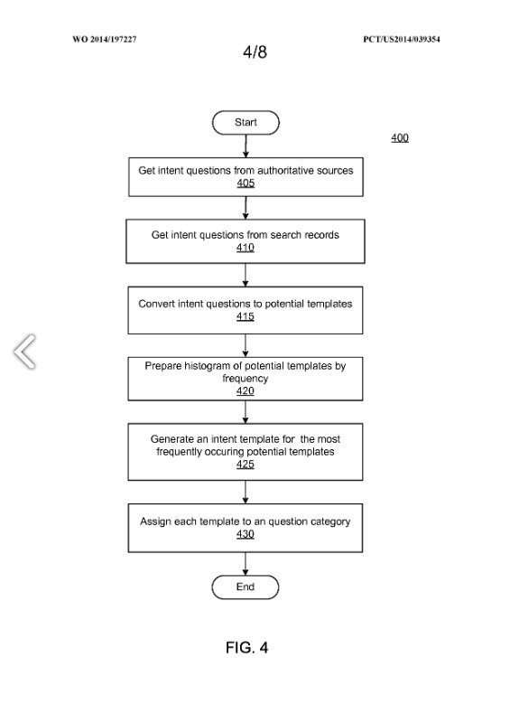

## Natural Language Search Results

In November, Google published an international patent that describes providing natural language search results answers to queries.

Those answers focus less on providing web pages on those queries and showing natural language search results.

Here’s an example, from the patent filing of a set of natural language search results to a query about “symptoms of mono.”

The patent has many interesting and complex issues, and rather than trying to cover it all in one day, I’m planning on breaking it down into five parts to start the year off.

SEO by the Sea will be [relocating to the west coast](https://www.seobythesea.com/2014/12/sea-seo-sea/) next week, and posting might be a little light at the start of the week, so this series is intended to kick the year off with a look at how Google has been combining both web page indexing and ranking with data indexing, like in the search result example above.

The patent is:

[Natural Language Search Results for Intent Queries](https://patentscope.wipo.int/search/en/detail.jsf?docId=WO2014197227)
International Application No WO/2014/197227
Published:11.12.2014
International Filing Date: 23.05.2014
Applicant: Google
Inventors: Tomer Shmiel, Dvir Keysar, and Yonatan Erez

The natural language search results patent kicks things off, mentioning how we usually see traditional results from a search engine. This is the kind of result that we typically expect to see when talking about SEO. The passage tells us:

> Search engines are a popular method of discovering information. Traditionally, search engines crawl documents in a corpus, generate an inverted index for the documents, and use the index to determine which documents are responsive to a search query.

It describes what such SEO results tend to look like, which is a little different than the image from the patent application above that includes 3 different sets of symptoms about mono:

> Search results commonly include a title from a responsive document and a snippet of text from the document that includes one or more search terms in the query. Such snippets are not natural language results and typically fail to provide a complete, easily understood answer to non-factual questions where there is no one correct answer.

The justification for showing these natural language search results is described in terms of benefiting the experience of searchers by providing them with an adequate answer to their query, and including links that they can click upon if they want to find out more, from sources Google considers to be authoritative:

> While a user can select the link associated with the snippet to view the context of the snippet in the original document to determine whether the identified information is adequate, this slows the user experience and involves additional effort on the part of the user to receive an answer to a non-factual question.

## Advantages of Natural Language Search Results

The patent filings tell us that by providing natural language search results answers to a query, we are shown answers “in a paragraph and/or list format that provide diverse or complex answers or more than one fact per answer.”

In the second part of this series on Featured Snippets, we will explore the “high quality” of these answers because, as Google tells us, they are “derived from authoritative sources.” The word “authority” about a website under SEO is often not very well defined. Still, there’s definitely a reasonable explanation from where Google determines a site is an authority in this natural language search results patent.

We are also told that a searcher can quickly and easily compare answers from multiple “authoritative” websites, even if only the beginning of an answer is shown in the results. This part of that patent doesn’t seem to mesh well with actual practice at Google. For example, when we look at the “symptoms of mono” example above, we see results from Webmd, Mayoclinic, and Medicinenet.com. However, when we perform an actual search such as “symptoms of Mono, we only see one natural answer results.

Since Google isn’t bound to return natural language search results that need to match all the keywords within the original query, it has the freedom to “identify the intent of a natural language query and, thus, provide high-quality answers that a conventional search engine may miss or may not rank highly in response to the natural language query.”

## Additional Aspects of Google’s Approach to Finding Natural Language Search Results

***Using Headers & Text to Generate Answers*** – The parts that follow this one will include a look at how headers and text from a page that might provide an answer might be formatted and assigned to a question that it could answer, as part of a Question and Answer Data Store where multiple related answers could come from.

***Search Results*** – In addition to using multiple pages about the same topic, information about that topic could include query log files and search results, and this focus may help to identify a range of answers to questions that searchers may have.

***Intent Templates*** – Another aspect of these natural language answers is that they might cover a range of intents, and the patent application describes how query templates might be created in anticipation of a range of queries that could be answered.

***Extracting Answers from Semi-Structured Text*** – In the last part of this series, we will look at one of the inspirations for this patent – a paper on how Google might identify natural language answers to questions by looking at the structure of content on pages.

The processes described in this 5 part series may not cover all aspects of how Google attempts to identify natural language answers to searchers’ queries. Still, hopefully, it will be a good start to the topic that we will explore more fully during the year.

The posts that make up this series on Featured Snippets:

[Featured Snippets – Natural Language Search Results for Intent Queries, Part 1](https://www.seobythesea.com/2014/12/direct-answers-natural-language-search-results-intent-queries/)
[Featured Snippets – Taken from Authority Websites, Part 2](https://www.seobythesea.com/2014/12/direct-answers-taken-authority-websites/)
[Featured Snippets – Using Query Intent Templates to Identify Answers, Part 3](https://www.seobythesea.com/2014/12/direct-answers-using-query-intent-templates-identify-answers/)
[Featured Snippets: How Answers are Extracted from Web Pages, Part 4](https://www.seobythesea.com/2015/01/direct-answers-answers-extracted-web-pages/)
[Featured Snippets: Extracting Text from Pages Citations, Part 5](https://www.seobythesea.com/2015/01/direct-answers-extracting-text-from-pages/)

Last Updated June 5, 2019.
