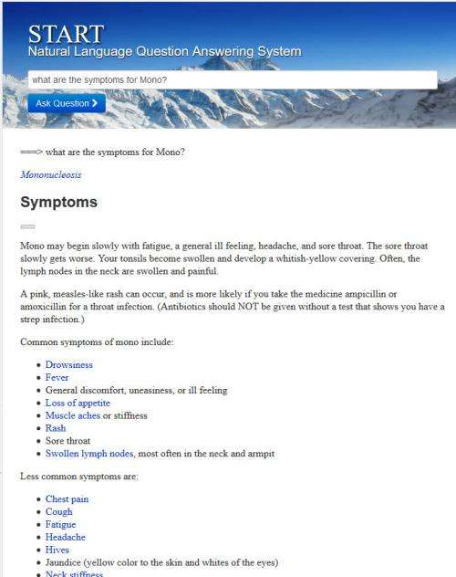
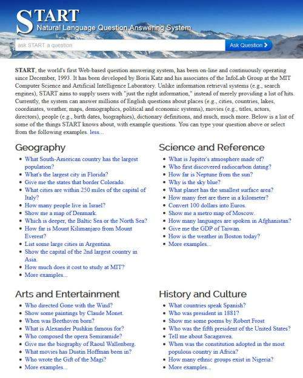
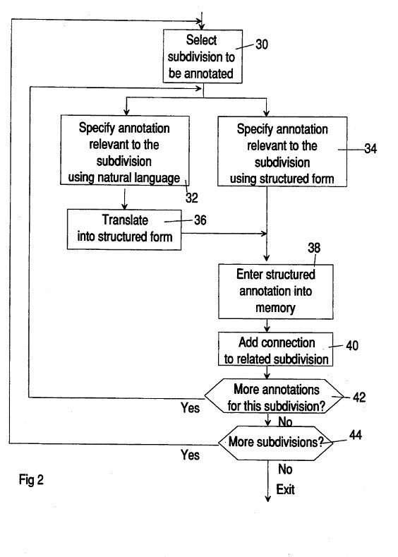
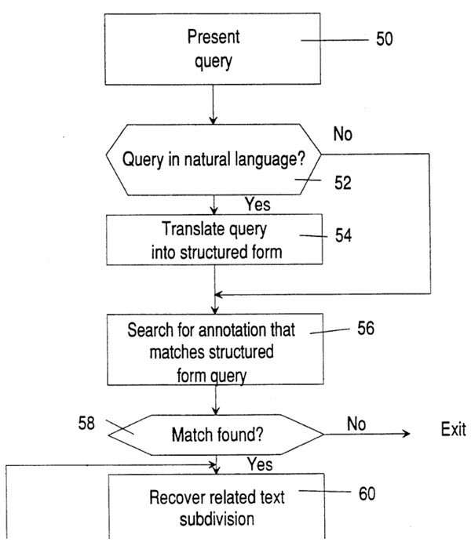
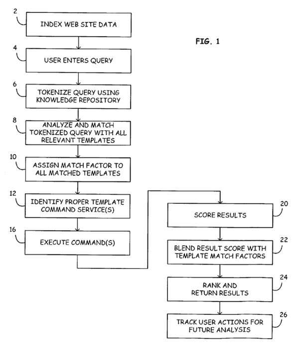
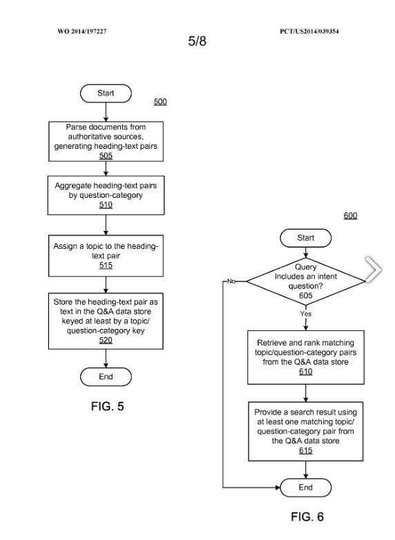

## Answers from Authority Websites

Part One of this series – [Featured Snippets “Natural Language Search Results For Intent Queries”](https://www.seobythesea.com/2014/12/direct-answers-natural-language-search-results-intent-queries/)

One of the most important parts of the “Natural Language Search Results for Intent Queries” patent application is how it describes both queries and search results as being in “natural language.”

By natural language, it means ordinary conversational words and sentences, rather than some formalized and highly structured request for results like you might see in a programming language.

As the patent tells us:

> A natural language query is a query using terms a person would use to ask a question, such as “how do I make hummus?”

You may remember the search engine, Ask Jeeves, which tried to answer natural language queries. I remember it well.

Back in my early days of working for an agency, they insisted that we send ranking reports to clients each month, showing how well the pages of their sites were doing in many search engines, including Google, AOL, Hotbot, Lycos, Excite, and others for a total of eleven in all. Ask Jeeves was one of those as well.

***So why is Google trying to recapture the style and format of a former rival, like Ask Jeeves? Maybe it wasn’t thinking of Ask Jeeves.***

Google may not have had Ask Jeeves in mind when deciding to show answers to natural language questions.

Google may have had a site like MIT’s [START Natural Language Question Answering System](http://start.csail.mit.edu/index.php) in mind instead. Try a few queries – but watch out – it’s contagious.

At one point, the professors involved with START and with the artificial Intelligence program at MIT [sued Ask Jeeves](http://tech.mit.edu/V119/N66/66winston.66n.html) over their use of the technology involved. They held two patents that aimed at answering natural language questions. We will see a similar process in Google’s patent in tomorrow’s post, but for now, here’s what the news article summarizes those patents as saying:

> The two patents that Katz and Winston hold include natural language searching to retrieve text and database material. A patent filed in 1994 describes “converting natural language queries to structured form, matching the structured form query against stored annotations and retrieving database subdivisions connected to matched annotations.”

Here’s **Start** answering the question, “what are the symptoms for Mono?” like the question asked in the images for the Natural Language Search Results query.

Here is the Start question-answering search engine:

Let’s look at the patents from Professors [Boris Katz](https://en.wikipedia.org/wiki/Boris_Katz) and [Patrick H Winston](https://en.wikipedia.org/wiki/Patrick_Winston), and the patent that Ask Jeeves didn’t have at the time of this lawsuit but ended up getting. One of the interesting things that we haven’t talked about yet from the Google patent is intent templates. These patents involve natural language queries and use a structured format like an intent template. We’ll delve deeper into the Google patent’s use of such a template tomorrow, but for now, notice how these patents all use a process like that.

The two MIT patents are:

[Method and apparatus for utilizing annotations to facilitate computer retrieval of database material](http://patft.uspto.gov/netacgi/nph-Parser?Sect1=PTO2&Sect2=HITOFF&p=1&u=%2Fnetahtml%2FPTO%2Fsearch-adv.htm&r=1&f=G&l=50&d=PALL&S1=05404295&OS=PN/05404295&RS=PN/05404295)
Invented by Boris Katz and Patrick H Winston
US Patent 5,404,295
Granted April 4, 1995
Filed: January 4, 1994

Abstract

> A method and apparatus for computer retrieval of database material which may be text, computer programs, graphics, audio, object classes, action specifications, or other material which may be machine stored. Annotations are provided for at least selected database subdivisions, preferably with natural language questions, assertions or noun phrases, or some combination/collection.
>
> However, the annotations may also initially be generated in a structured form. Annotations are, if required, converted to a structured form and are stored in that form along with connections to corresponding subdivisions. Searching for relevant subdivisions involves entering a query in natural language or structured form, converting natural language queries to structured form, matching the structured form query against stored annotations, and retrieving database subdivisions connected to matched annotations. The annotation process may be aided by utilizing various techniques for automatically or semiautomatically generating the annotations.

[Method and apparatus for generating and utilizing annotations to facilitate computer text retrieval](http://patft.uspto.gov/netacgi/nph-Parser?Sect1=PTO2&Sect2=HITOFF&p=1&u=%2Fnetahtml%2FPTO%2Fsearch-adv.htm&r=1&f=G&l=50&d=PALL&S1=05309359&OS=PN/05309359&RS=PN/05309359)
Invented by Boris Katz and Patrick H Winston
US Patent 5,309,359
Granted May 3, 1994
Filed: August 16, 1990

Abstract

> A method and apparatus for computer text retrieval involve annotating at least selected text subdivisions, preferably with natural language questions, assertions, or noun phrases. However, the annotations may also initially be generated in a structured form. Annotations are, if required, converted to a structured form and are stored in that form.
>
> Searching for relevant text subdivisions involves entering a query in natural language or structured form, converting natural language queries to structured form, matching the structured form query against stored annotations, and retrieving text subdivisions connected to matched annotations.
>
> The annotation process may be aided by utilizing various techniques for automatically or semiautomatically generating the annotations.

Here is a patent from Ask Jeeves that looks like it attempts to answer Natural Language Queries. Note that it also includes the use of Query Templates:

[Natural language query processing](http://patft.uspto.gov/netacgi/nph-Parser?Sect1=PTO2&Sect2=HITOFF&p=1&u=%2Fnetahtml%2FPTO%2Fsearch-adv.htm&r=1&f=G&l=50&d=PALL&S1=07403938&OS=PN/07403938&RS=PN/07403938)
Inventors: Tom Harrison, Michael E. Barrett, Swarup Reddi, John Lowe, and Gary Chevsky
Assigned to IAC Search & Media, Inc.
US Patent 7,403,938
Granted July 22, 2008
Filed September 20, 2002

Abstract

> An enhanced natural language information retrieval technique tokenizes an incoming query, comparing the tokenized representation against a collection of query templates. Query templates include a first portion having one or more query patterns representative of a query and in a form suitable for matching the tokenized representation of an incoming query.
>
> Query templates also include one or more information retrieval commands designed to return information relevant to those query patterns in their first portion.
>
> The enhanced natural language information retrieval technique selects those query templates that are determined to be most relevant to the incoming query (via its tokenized representation) and initiates one or more information retrieval commands associated with the selected query templates.

## Authority Websites

In SEO, when people talk about authority websites, they often are referring to pages to get links from. Discussions in SEO forums often asked whether or not links from pages with .edu domains or .gov domains were from authority websites because it was usually difficult to get links from such sources.

Though someone who’s been in the SEO world around the same time that Brin and Page brought PageRank into the picture might remember Jon Kleinberg’s [Hubs and Authorities](http://cs.brown.edu/memex/ACM_HypertextTestbed/papers/10.html). His more technical look at these topics is in the paper [Authoritative Sources in a Hyperlinked Environment](http://www.cs.cornell.edu/home/kleinber/auth.pdf) (pdf).

From the first Kleinberg paper:

> Some pages, the most prominent sources of primary content, are the authorities on the topic; other pages, equally intrinsic to the structure, assemble high-quality guides and resource lists that act as focused hubs, directing users to recommended authorities.
>
> The nature of the linkage in this framework is highly asymmetric. Hubs link heavily to authorities, but hubs may themselves have very few incoming links, and authorities may well not link to other authorities.

Those are not the same kind of authority websites that the [Natural Language Search Results for Intent Queries](https://patentscope.wipo.int/search/en/detail.jsf?docId=WO2014197227) patent application is referring to when it talks about extracting natural language answers from authority websites on the Web. Instead, Kleinberg’s pages get their “authority status from being pages linked to as examples or illustrations of a topic.

The “intent queries” patent filing instead refers to pages identified by the search engine based upon how people treat those pages.

The Question and Answer, or Q&A engine behind these natural language search results, populate a Q&A Data Store by extracting “heading-text pairs found in documents from the authoritative sources.”

I’m going to expand on that part of the process, with some illustrations, over the next couple of days, but I wanted to focus upon how a search engine might determine what an authority website might be.

The search engine may process authoritative sources offline to find answers to “common clear-intent non-factual questions.”

Since these are “natural language questions,” they are just like questions that one person might ask another person, instead of the keyword approach you often see on search engines. Therefore, the keyword approach that search engines, with the possible exception of ask.com, seemed to prefer isn’t preferred in this patent.

Instead, it wants to “identify clear-intent queries and match the queries to the stored answers.” It also wants to show enhanced search results with complete answers from one of the more authority websites.

So, the question remains:

## Just What is are Authority websites according to Google’s patent?

- A source that is popular and trusted, as determined by the frequent selection of the source in search results, or
- A source that consistently ranks high in search results for queries dealing in the subject matter of the Q&A data store.

We are told in the patent filing that the authoritative sources may be manually identified or may be automatically selected. They may also be general sources and focused sources.

If you look at Featured Snippets, such as information about symptoms of illnesses, or food recipes, you will often see a link to the source of information. We are told about these authority websites:

> The domains webmd.com, mayoclinic.com, and medicinenet.com may be general authoritative sources for the medical subject matter, and the domains cancer.org and heart.org may be focused authoritative sources for the medical subject matter.
>
> Similarly, allrecipes.com and foodnetwork.com may be general authoritative sources for cooking subject matter, and vegetariantimes.com may be a focused authoritative source for cooking subject matter.

So, the pages that Featured Snippets come from are considered authoritative based upon the quality and focus of their content. That is supposedly one of the values in Google providing such answers.

They aren’t answers focused upon specific keywords but rather based upon query templates and questions that seem to be related to them. That Google provides answers to natural language queries and provides search results for queries means that you get the benefit of both as a searcher.

We’ll discuss intent templates and Q&A Data Stores and mix in search results in tomorrow’s post.

[Featured Snippets – Natural Language Search Results for Intent Queries, Part 1](https://www.seobythesea.com/2014/12/direct-answers-natural-language-search-results-intent-queries/)
[Featured Snippets – Taken from Authority Websites, Part 2](https://www.seobythesea.com/2014/12/direct-answers-taken-authority-websites/)
[Featured Snippets – Using Query Intent Templates to Identify Answers, Part 3](https://www.seobythesea.com/2014/12/direct-answers-using-query-intent-templates-identify-answers/)
[Featured Snippets: How Answers are Extracted from Web Pages, Part 4](https://www.seobythesea.com/2015/01/direct-answers-answers-extracted-web-pages/)
[Featured Snippets: Extracting Text from Pages Citations, Part 5](https://www.seobythesea.com/2015/01/direct-answers-extracting-text-from-pages/)

Some posts I’ve written about patents involving question answering:

- 7/19/2007 – [Search Engines Crawling FAQs to Learn How to Answer Questions?](https://www.seobythesea.com/2007/07/search-engines-crawling-faqs-to-learn-how-to-answer-questions/)
- 9/21/2014 – [Google May Use Question Answering to Populate the Knowledge Graph](https://www.seobythesea.com/2014/09/missing-incorrect-data-knowledge-graph/)
- 10/12/2014 – [How Google May Use Entity References to Answer Questions](https://www.seobythesea.com/2014/10/google-fact-questions-entity-references-unstructured-data/)
- 7/12/2015 – [How Google May Answer Questions in Queries with Rich Content Results](https://www.seobythesea.com/2015/07/how-google-may-answer-questions-in-queries-with-rich-content-results/)
- 9/9/2015 – [When Google Started Showing Featured Snippets](https://www.seobythesea.com/2015/09/when-google-started-answering-factual-queries/)
- 11/30/2016 – [Answering Featured Snippets Timely, Using Sentence Compression on News](https://www.seobythesea.com/2016/11/featured-snippets-sentence-compression/)
- 6/19/2017 – [Google Extracts Facts from the Web to Provide Fact Answers](https://www.seobythesea.com/2017/06/fact-answers/)
- 7/10/2019 – [How Google May Handle Question Answering when Facts are Missing](https://www.seobythesea.com/2019/07/how-google-may-handle-question-answering-when-facts-are-missing/)

Last Updated June 26, 2019.
