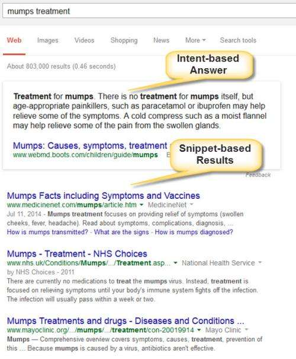
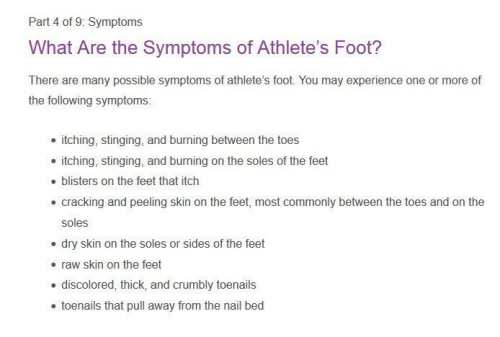
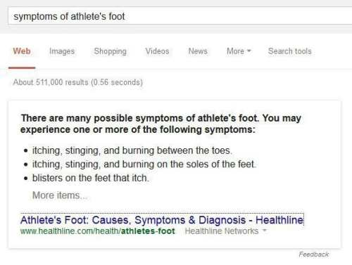
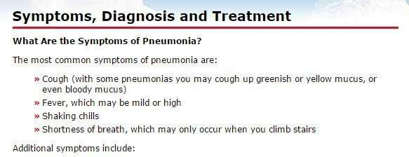
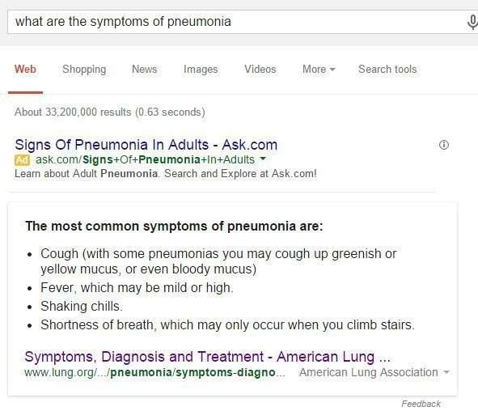
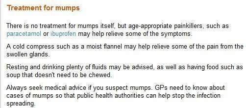
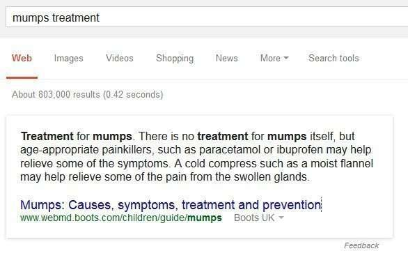

Almost a year ago, Search Engine Land published an article titled [Google Search OneBox Answers Are Getting More Detailed](https://searchengineland.com/google-search-onebox-answers-getting-detailed-182747).

Search Engine Land refers to question-answering type results as Featured Snippets since they don’t seem to follow the normal rules of search results that return documents matching keywords in a query. Instead, they were using an approach to try to take advantage of both question answering and keyword matching, as shown in the image below:

_Intent-based Answer plus Keyword-based Snippet Results_

This post is the third of a five-part series that takes a look at natural language answers showing up in search results, possibly under Google’s patent application, [Natural Language Search Results for Intent Queries](https://patentscope.wipo.int/search/en/detail.jsf?docId=WO2014197227).

Part 1 looked at [the patent itself](https://www.seobythesea.com/2014/12/direct-answers-natural-language-search-results-intent-queries/), and natural language search results. Part 2 described how Google was choosing “[authority](https://www.seobythesea.com/2014/12/direct-answers-taken-authority-websites/)” sites to provide answers to queries from, which supposedly turned these results into high quality results.

This part looks at how this system may use intent templates to identify queries with clear intent questions and identify natural language answers from the content of authoritative sources.

If the user performs a natural language query (“How do I make Hummus?”, “What are the symptoms for chickenpox?”, other normal language type queries), it may show both snippet-based results selected from web pages based on a keyword level search, and it may also show natural language answers based on “intent” of the natural language query.

The natural language part of this process may use intent templates to translate the natural language query into a keyword query. Then, that keyword query may be used to determine the snippet-based results.

## A Question and Answer (Q&A) Engine

The Q&A engine may use the Q&A data store, the search records, and the crawled documents to generate intent templates, populate and maintain the Q&A data store, and determine if a query includes a clear-intent question that the Q&A data store can answer.

The Q&A Data Store is filled with pieces of text and headers from authoritative documents that could help answer questions, like in the following examples.

_A snippet of heading and text from an authoritative web site._

_An answered question using the text extracted from the authoritative page._

_A mix of heading and text from an authoritative website._

_A question answering result using the heading and txt from the authoritative web site._

_A n authoritative page (heading and associated text) on the topic of “treatment for mumps”._

_A Google question answering result based upon the authoritative page._

**Using Search Records to find Intent Questions**

As shown in the three examples above, the search engine may send a query to the Q&A engine. The Q&A engine may provide natural language answers from the Q&A data store (which has collected heading and text that answer questions) to the search engine. Those natural language answers may be ranked by the Q&A engine or by the search engine using data provided by the Q&A engine.

In addition, the search system may also obtain potential intent questions from search records such as search query and click logs, aggregated data gathered from queries, or other data regarding the search terms and search results of previously processed queries.

The search system may identify queries that relate to the subject matter of the Q&A data store.

If the subject matter is medical information, the search system may look for query results with pages from sources such as mayoclinic.com or webmd.com in the top-ranking search results. It could then assume that the query associated with such identified search results includes a clear-intent question.

By looking for clear-intent questions from queries and authoritative sources, the search system could account for various ways that an intent question can be posed. Examples of such variation could include “heart disease treatment” and “how do I treat heart disease?” Both of these represent the same intent question, but an authoritative source is more likely to include the former, while a query may be more likely to include the latter.

## Intent Templates

Intent templates may be taken from content available from both authoritative sources and from search records that include previously processed queries and their returned results.

These templates might include both a non-variable portion and a variable portion. That non-variable portion may be text, and the variable portion may be a placeholder for one or more words. This approach makes it more likely that these are actually used as templates.

For example:

A template of “$X causes” has a non-variable portion of “causes” preceded by a variable portion that could include words such as “sleepiness,” or “sluggishness,” or “weakness,” or so on.

## Topics of Intent Templates

A query or heading corresponding to or matching the template may include many words followed by the word “causes,” such as diabetes causes” or “heart attack causes.”

The variable portion, for example, “diabetes” or “heart attack” for a template of “$X causes” or “filet and scallop stir fry with asparagus” for a template of “recipe for $X” may be considered a topic of the query or heading.

**Templates Assigned to Question Categories**

Each of these templates could be assigned to a question category that represents various questions used to request the same specific information. This can help make the search engine respond to such queries a lot more quickly.

The following templates may all be classified as belonging to a treatment question category:

- How do I treat $X
- $X treatment
- How is $X treated
- How to cure $X

Likewise, these templates could be classified as templates for a recipe question category:

- How to make $X
- $X recipe
- Directions for making $X

The patent application tells us that these questions could be assigned to the question category manually or done automatically by looking at similar search results returned for queries conforming to the template.

For example, if search results for the queries “how is diabetes treated” and “what cures diabetes” are similar, the Q&A engine may **cluster** those two templates together under the treatment question category.

## Conclusions

The purpose behind this patent application is to try to provide both natural language results to a query, and to use those natural language results from authoritative sources, related search results, and those clusters of intent templates to come up with better keyword-based search results in addition to the natural language answer or answers.

We’ve looked at some of the important aspects of how this patent filing was intended to operate. Then, over the next two days (the first days of 2015), we will look at some ways to try to make it more likely that content from your pages might be used as answers from authoritative pages in response to natural language queries.

[Featured Snippets – Natural Language Search Results for Intent Queries, Part 1](https://www.seobythesea.com/2014/12/direct-answers-natural-language-search-results-intent-queries/)
[Featured Snippets – Taken from Authority Websites, Part 2](https://www.seobythesea.com/2014/12/direct-answers-taken-authority-websites/)
[Featured Snippets – Using Query Intent Templates to Identify Answers, Part 3](https://www.seobythesea.com/2014/12/direct-answers-using-query-intent-templates-identify-answers/)
[Featured Snippets: How Answers are Extracted from Web Pages, Part 4](https://www.seobythesea.com/2015/01/direct-answers-answers-extracted-web-pages/)
[Featured Snippets: Extracting Text from Pages Citations, Part 5](https://www.seobythesea.com/2015/01/direct-answers-extracting-text-from-pages/)

Some posts I’ve written about patents involving question answering:

- 7/19/2007 – [Search Engines Crawling FAQs to Learn How to Answer Questions?](https://www.seobythesea.com/2007/07/search-engines-crawling-faqs-to-learn-how-to-answer-questions/)
- 9/21/2014 – [Google May Use Question Answering to Populate the Knowledge Graph](https://www.seobythesea.com/2014/09/missing-incorrect-data-knowledge-graph/)
- 10/12/2014 – [How Google May Use Entity References to Answer Questions](https://www.seobythesea.com/2014/10/google-fact-questions-entity-references-unstructured-data/)
- 7/12/2015 – [How Google May Answer Questions in Queries with Rich Content Results](https://www.seobythesea.com/2015/07/how-google-may-answer-questions-in-queries-with-rich-content-results/)
- 9/9/2015 – [When Google Started Showing Featured Snippets](https://www.seobythesea.com/2015/09/when-google-started-answering-factual-queries/)
- 11/30/2016 – [Answering Featured Snippets Timely, Using Sentence Compression on News](https://www.seobythesea.com/2016/11/featured-snippets-sentence-compression/)
- 6/19/2017 – [Google Extracts Facts from the Web to Provide Fact Answers](https://www.seobythesea.com/2017/06/fact-answers/)
- 7/10/2019 – [How Google May Handle Question Answering when Facts are Missing](https://www.seobythesea.com/2019/07/how-google-may-handle-question-answering-when-facts-are-missing/)

Last Updated July 11, 2019
