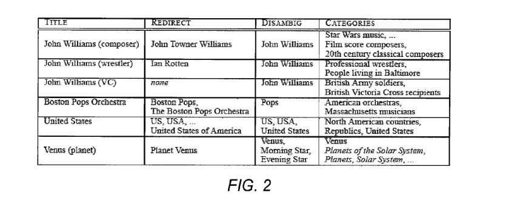
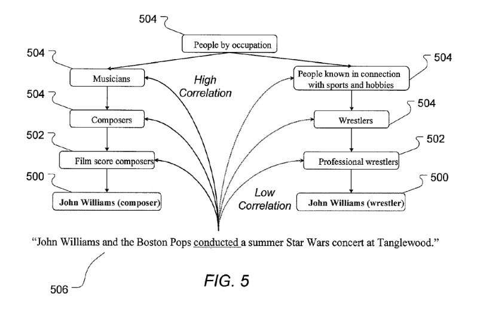

## Named Entity Disambiguation is important in a Knowledge Graph Search System

Last year I wrote a post titled [Google on Finding Entities: A Tale of Two Michael Jacksons](https://www.seobythesea.com/2014/08/google-finding-entities-tale-two-michael-jacksons/). The post was about a Google patent that described how Google might perform named entity disambiguation when different entities share the same name. The patent in it was filed in 2012 and granted in 2014. Google was also granted a new patent on how it might do named entity disambiguation this week, originally filed in 2006. It is worth looking at this second one, given how important understanding entities is to Google. For example, a search for things instead of strings makes named entity disambiguation essential.

_[Webb Telescope Mirrors Arrive at NASA Goddard](https://www.flickr.com/photos/gsfc/5617344444/), [NASA Goddard Space Flight Center](https://www.flickr.com/photos/gsfc/), [Some Rights Reserved.](https://creativecommons.org/licenses/by/2.0/)_

It contains a pretty thoughtful approach to named entity disambiguation.

The patent on named entity disambiguation was filed in 2006, and the inventors also authored an article in 2006 about named entities that show where their minds were at during the time:

[Using Encyclopedic Knowledge for Named Entity Disambiguation](http://www.cs.utexas.edu/~ml/papers/encyc-eacl-06.pdf), by Marius Pasca and Razvan Bunescu.

The paper echoes the named entity disambiguation patent in many places, and it appears that the two documents were worked upon at the same time.

## Named Entities are Common in Searches

The patent begins by telling us that searches for named entities are prevalent among the most popular Web sites. They include searches for persons, places, businesses, and other organizations for different types of products, such as books and movies. A named entity is a thing that has a proper noun or proper name associated with it. Some [Microsoft research](http://wwwconference.org/proceedings/www2010/www/p1001.pdf) gave us impressive numbers about entities in queries:

> According to an internal study of Microsoft, at least 20-30% of queries submitted to Bing search are named entities, and it is reported 71% of queries contain name entities.

Because of this, Search Engines find it useful to perform named entity disambiguation on entities when they see them. There can often be more than one entity with the same name. Having a way of understanding when a query contains a named entity and knowing which named entity is being referred to can mean smarter, better answers than just matching keywords in a query to keywords found in documents that match. This is why named entity disambiguation is essential.

## How A Search Engine Performs Named Entity Disambiguation for Entities With the Same Names

When someone searches for a named entity, the search results returned in response usually contain relevant information about any entities with the same name, or even a portion of that name, as the query. A focus of this patent is upon telling such searches apart, and it provides some examples of these searches for similarly named entities:

> Thus, a query for “Long Beach” is likely to return documents about the coastal city in Long Island, N.Y. as well as documents about the coastal city in Southern California, as well as documents that are relevant to the terms “long” and “beach.” Similarly, a query for “John Williams” will return documents about the composer as well as documents about the wrestler, and the venture capitalist, all of whom share this name; a query for “Python” will return documents about the programming language, as well as to the snake, and the movie. The underlying problem then is that queries for named entities are typically ambiguous and may refer to different instances of the same class (e.g., different people with the same name) or things in different classes (e.g., a type of snake, a programming language, or a movie).

The patent tells us that the order of search results for named entities has been typically presented based upon the frequency of the query terms, their PageRank, or other factors, regardless of which specific named entity is being referred to by a shared name. This is one of the problems that the patent attempts to solve.

How does the patent attempt to address named entities that may share the same name and enable us to distinguish between them?

## A Knowledge Base of Named Entities

Part of the solution involves using a knowledge base that contains articles about named entities to use to disambiguate entities. As we learn from the paper, the knowledge base being referred to is Wikipedia.

This knowledge base is built from a database of documents that are about named entities; entities that have proper names, such as “John Williams” (a person), “Long Beach” (a place), and “Python” (a movie, a programming language, and a deadly snake).

## How Wikipedia does Named Entity Disambiguation

Wikipedia has features that help do name entity disambiguation when entities would otherwise be ambiguous:

1. Each of these articles present a context that is associated with a particular meaning or particular sense of the name.
2. These articles also contain links between instances of entity names and the article linked to the name.
3. These articles also include redirected articles that associate an alternative or alias of a name to a particular named entity article, like Mark Twain (a pen name) for Samuel Langhorne Clemens.
4. They include articles that disambiguate different senses of an ambiguous name, like adding a word to Danny Sullivan (technologist), to distinguish the Search Engine Land Editor from the race car driver of the same name.

In short, relationship information about a specific sense of a name for a named entity depends upon its context – how it is linked to and which article it might be linked to as well. The relationship between the name of an entity and the particular named entity may be determined based upon a scoring model.

A search query that includes an entity name and additional keywords can then be disambiguated by identifying the entity name within a query and using the scoring model to identify the article(s) most closely associated with the entity name. The disambiguated name and identified article(s) can then be used to augment the search results to be grouped or organized according to the entities identified.

Articles found in the knowledge base (and named entities) can be associated with specific categories. The strength of the relationship between a named entity and a category is learned and made part of the scoring model. That can also be used to disambiguate named entities in queries. Note that articles in Wikipedia are often assigned a category, too.

The patent is:

[Disambiguation of named entities](http://patft.uspto.gov/netacgi/nph-Parser?Sect1=PTO1&Sect2=HITOFF&d=PALL&p=1&u=%2Fnetahtml%2FPTO%2Fsrchnum.htm&r=1&f=G&l=50&s1=9,135,238.PN.&OS=PN/9,135,238&RS=PN/9,135,238)
Invented by: Razvan Constantin Bunescu, and Alexandru Marius Pasca
Assigned to: Google
US Patent 9,135,238
Granted September 15, 2015
Filed: June 29, 2006

Abstract

> Named entities are disambiguated in search queries and other contexts using a disambiguation scoring model. The scoring model is developed using a knowledge base of articles, including articles about named entities.
>
> Various aspects of the knowledge base, including article titles, redirect pages, disambiguation pages, hyperlinks, and categories, are used to develop the scoring model.

## A Dictionary of Named Entities

Part of the process involved in telling apart named entities that share the same names uses information about named entities from the knowledge base to create a named entity dictionary. The articles from Wikipedia associated with the named entities are extracted from the knowledge base to do so.

The named entity dictionary and information about the hyperlink structure between articles in the named entity knowledge base and the context (features) of the named entity articles are used to create a named entity disambiguation dataset.

This named entity disambiguation dataset will likely also include category information identifying the categories associated with each named entity. This disambiguation module uses the disambiguation dataset to learn about the strength of the relationships between words from the query context and categories from category taxonomy.

## Augmenting Search Results by Named Entity Disambiguation

The patent tells us that it might augment the search results it shows based upon an identified named entity. Augmenting the search results can mean grouping search results by the different senses of the disambiguated names and adding annotations, snippets, or other content that further identify or describe the search results (individually or in groups) on the disambiguated names.

On a search for “John Williams,” the results shown may be for:

(1) one set of documents on the composer John Williams,
(2) the second set of documents about the wrestler,
(3) the third set of documents on the venture capitalist,
(4) and on, for any number of the different senses of the name.

Keep in mind that this patent was originally filed before Google had created their Knowledge Graph. Therefore, when they refer to a knowledge base in this patent, they are most likely referring to Wikipedia, which they call an “exemplary knowledge base.”

The patent takes a deep dive into how Wikipedia is organized to describe how that structure can help it identify different entities that may share the same name, such as a John Williams that composed a score for Star Wars, another John Williams that was a professional Wrestler, another John Williams that was a Venture Capitalist.

The named entity disambiguation patent tells us about features of Wikipedia that help it distinguish between entities. That section of the patent is worth reading in its covers, articles about specific entities, what it calls redirect articles and disambiguation articles, and how categories are created for each entry in Wikipedia. The links pointed to and from articles about different named entities also help provide details about those that can distinguish one from another.

Information found in queries that include named entities may have some correlations between them and the Wikipedia articles that can help identify entity disambiguation.

_The named entity disambigutation patent discusses correlations between queries and Entities to discover the right ones._

I’ve written a few posts about named entities. These are some that I wanted to share:

- [Do You Have a Named Entity Strategy for Marketing Your Web Site?](https://www.seobythesea.com/2013/12/named-entity-strategy/)
- [How I Came to Love Entities and Start Doing Entity Optimization](https://www.seobythesea.com/2014/10/came-love-entities/)
- [How Google Uses Named Entity Disambiguation for Entities with the Same Names](https://www.seobythesea.com/2015/09/disambiguate-entities-in-queries-and-pages/)
- [How Named Entities Connected to Trending Topics can be used to Address Real Time Search Results](https://www.seobythesea.com/2015/03/how-named-entities-connected-to-trending-topics-can-be-used-to-address-real-time-search-results/)
- [Not Brands but Entities: The Influence of Named Entities on Google and Yahoo Search Results](https://www.seobythesea.com/2010/08/not-brands-but-entities-the-influence-of-named-entities-on-google-and-yahoo-search-results/)
- [How Knowledge Base Entities can be Used in Searches](https://www.seobythesea.com/2014/07/knowledge-base-entities-used-in-searches/)
- [Finding Entity Names in Google’s Knowledge Graph](https://www.seobythesea.com/2014/06/entity-names-in-google/)
- [Google Gets Smarter with Named Entities: Acquires MetaWeb](https://www.seobythesea.com/2010/07/google-gets-smarter-with-named-entities-acquires-metaweb/)
- [Entity Associations with Websites and Related Entities](https://www.seobythesea.com/2014/01/entity-associations-websites-related-entities/)
- [How Google Might Identify Entity Synonyms Using Anchor Text](https://www.seobythesea.com/2014/06/synonyms-for-entities/)
- [Extracting Facts for Entities from Sources such as Wikipedia Titles and Infoboxes](https://www.seobythesea.com/2014/08/extracting-facts-for-entities-from-sources/)
- [Extracting Semantic Classes and Corresponding Instances from Web Pages and Query Logs](https://www.seobythesea.com/2014/09/extracting-semantic-classes-instances-from-web-pages-query-logs/)
- [How Google May Identify Main Entities](https://www.seobythesea.com/2015/04/how-google-may-identify-central-entities-from-resources/)
- [How Google’s Knowledge Graph Updates Itself by Answering Questions](https://www.seobythesea.com/2018/10/how-googles-knowledge-graph-updates-itself-by-answering-questions/)

Last Updated June 26, 2019
