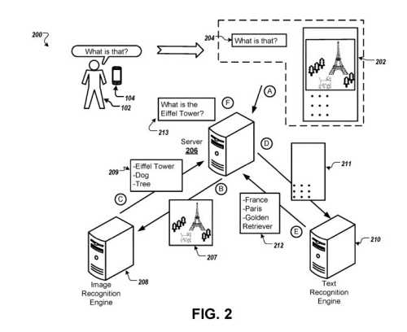

## Better Understanding Image Queries

Years ago, I wouldn’t have expected a search engine to tell a searcher about objects in a photograph or video. However, search engines have been evolving and getting better at what they do.

In February, Google was granted a patent, returning image results identifying objects in photographs and videos. However, a search engine may have trouble understanding a natural language query. This patent focuses on disambiguating image queries.

The patent provides the following example:

> For example, a user may ask a question about a photograph that the user views on the computing device, such as “What is this?”

The patent tells us that it may work for image queries, text or video queries, or any combination of those.

In response to a searcher asking to identify image queries, a computing device may:

- Capture a respective image that the user is viewing
- Transcribe the question
- Transmit that transcription and the image to a server

## What the Server May Do with Image Queries

Therefore the server may receive the transcription and the image from the computing device, and:

- Identify visual and textual content in the image
- Generate labels for images in the image, such as locations, entities, names, types of animals, etc.
- Recognize a particular sub-image in the image, which may be a photograph or drawing

First, the Server may:

- Note part of a sub-image of primary interest to a searcher, such as a historical landmark in the image
- Perform image recognition on the sub-image to generate labels for that sub-image
- Generate labels for text in the image, likes comments about the sub-image, using text recognition on a part of the image other than the sub-image
- Create a search query based on the transcription and the generated labels
- Provide that query to a search engine

## The Process Behind Disambiguating a Visual Query

Next, the process described includes:

- Receiving an image presented on, or corresponding to, at least a part of a display of a computing device
- Understanding a transcription of an utterance spoken by a searcher, when presenting the image
- Recognizing a sub-image included in the image, and based on performing image recognition on the sub-image
- Deciding on first labels that show a context of the particular sub-image
- Running text recognition on a part of the image other than the particular sub-image
- Making second labels showing the context of the sub-image, based on the transcription, the first labels, and the second labels
- Compiling a search query
- Responding, for output, with the search query

## Other Aspects of Performing Such Image Queries Searches May Involve:

- Weight the first label differently than a second label: the search query may substitute the first labels or the second labels based upon terms in the transcription
- Make, for each of the first labels and the second labels, a label confidence score indicating a likelihood that the label corresponds to a part of the sub-image that is of primary interest to the user
- Select the first labels and second labels based on the respective label confidence scores, wherein the search query is based on selected first labels and second labels
- Access historical query data including the previous search queries provided by other users
- Generate, based on the transcription, the first labels, and the second labels, candidate search queries
- Compare the historical query data to the candidate search queries
- Choose a search query from among the candidate search queries, based on comparing the historical query data to the one or more candidate search queries

That is to say, we May Also see this method work to:

- Create, based on the transcription, the first labels, and the second labels, candidate search queries
- Note, for each of the candidate search queries, a query confidence score that indicates a likelihood that the candidate search query is an accurate rewrite of the transcription
- Pick, based on the query confidence scores, a candidate search query as the search query
- Choose images included in the image
- Build for each of the images included in the image, an image confidence score that indicates a likelihood that an image is an image of primary interest to the user
- Make the sub-image, based on the image confidence scores for the images
- Receive data indicates a control event selection at the computing device, wherein the control event identifies the sub-image. (The computing device may capture the image and capture audio data corresponding to the utterance in response to detecting a predefined hotword.)

## Contextually Disambiguating Queries Also Then Requires

- Receive an additional image of the computing device and an additional transcription of an additional utterance spoken by a user of the computing device
- Identify an additional sub-image included in the additional image, based on performing image recognition on the additional sub-image
- Determine additional first labels that indicate a context of the additional sub-image, based on performing text recognition on a portion of the additional image other than the additional sub-image. Determining additional second labels that indicate the context of the additional sub-image, based on the additional transcription, the additional first labels, and the additional second labels
- Generate a command and performing the command

Finally, performing the command can mean:

- Store the additional image in memory
- Place the sub-image in the memory
- Upload the additional image to a server
- Send the sub-image to the server
- Bring the additional image to an application of the computing device
- Get the sub-image to the application of the computing device
- Make metadata associated with the sub-image, where determining first labels that indicate the context of the sub-image based further on the metadata associated with the sub-image

## Advantages of Following The Image Queries Process Can Include

- Determine the context of an image corresponding to a portion of a display of a computing device to aid in the processing of natural language queries
- Decide on image and/or text recognition
- Rewrite a transcription of an utterance of a user

This patent is at:

[Contextually disambiguating queries](http://patft.uspto.gov/netacgi/nph-Parser?Sect1=PTO1&Sect2=HITOFF&d=PALL&p=1&u=%2Fnetahtml%2FPTO%2Fsrchnum.htm&r=1&f=G&l=50&s1=10,565,256.PN.&OS=PN/10,565,256&RS=PN/10,565,256)
Inventors: Ibrahim Badr, Nils Grimsmo, Gokhan H. Bakir, Kamil Anikiej, Aayush Kumar, and Viacheslav Kuznetsov
Assignee: Google LLC
US Patent: 10,565,256
Granted: February 18, 2020
Filed: March 20, 2017

Abstract

> Methods, systems, and apparatus, including computer programs encoded on a computer storage medium, for contextually disambiguating queries are disclosed. In an aspect, a method includes receiving an image being presented on a display of a computing device and a transcription of an utterance spoken by a user of the computing device, identifying a particular sub-image that is included in the image, and based on performing image recognition on the particular sub-image, determining one or more first labels that indicate a context of the particular sub-image. The method also includes, based on performing text recognition on a portion of the image other than the particular sub-image, determining one or more second labels that indicate the context of the particular sub-image, based on the transcription, the first labels, and the second labels, generating a search query, and providing, for output, the search query.
