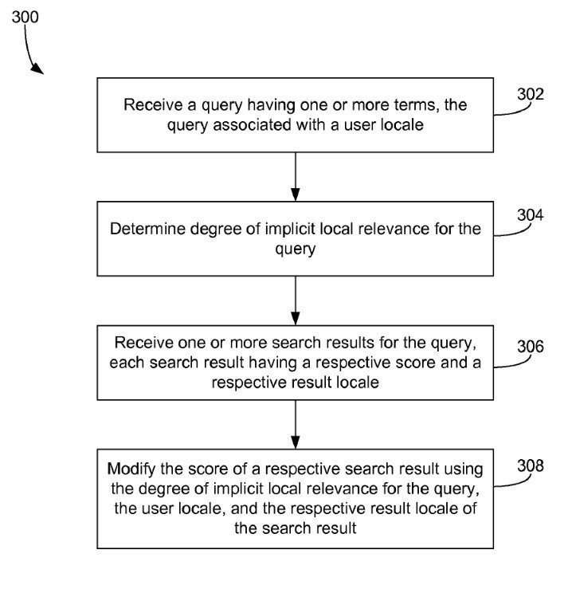
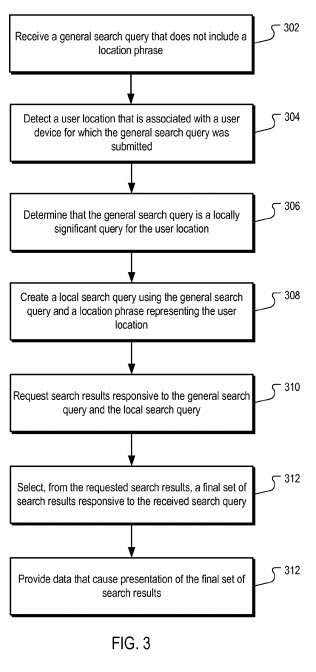
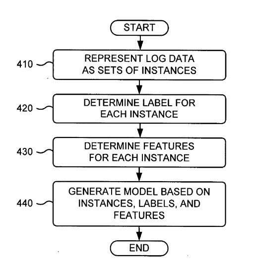

## Do Search Click-throughs help rank pages at Google?

In a recent article at Search Engine Land, we were told that [Google Posts That Local Results Are Influenced By Clicks, Then Deletes That](https://searchengineland.com/google-posts-that-local-results-are-influenced-by-clicks-then-deletes-that-237579). It caught my attention and had me investigating further.

## Patents Involving Search Click-Throughs Influencing Search Results

It made me recall three patents that described when search click-throughs might influence whether or not pages appeared for certain queries.

The first patent I wrote about in a post titled [Google Patents Click-Through Feedback on Search Results to Improve Rankings](https://www.seobythesea.com/2015/07/google-click-through-feedback-search-results/). The patent that post was about was [Modifying search result ranking based on a temporal element of user feedback](https://patentscope.wipo.int/search/en/detail.jsf?docId=US146703304)

The second patent was one I wrote about in the post [How Google May Identify Implicitly Local Queries](https://www.seobythesea.com/2012/06/how-google-may-identify-implicitly-local-queries/), which told us that Google might start showing additional web search results in response to queries when they had some kind of local significance. I noticed Google doing this for a client in Florida, and on searches in the two counties where the client operated, a link to the site was showing up at number 4 in the search results for a very relevant and broad query. The patent that this post was about was [Identification of implicitly local queries](http://patft.uspto.gov/netacgi/nph-Parser?Sect1=PTO2&Sect2=HITOFF&p=1&u=%2Fnetahtml%2FPTO%2Fsearch-adv.htm&r=1&f=G&l=50&d=PALL&S1=08200694&OS=PN/08200694&RS=PN/08200694).

In February of 2012, Google reported upon an upgrade of this nature in the post [Search quality highlights: 40 changes for February](https://search.googleblog.com/2012/02/search-quality-highlights-40-changes.html), where they told us about this:

> Improved local results. We launched a new system to find results from a user’s city more reliably. Now we’re better able to detect when both queries and documents are local to the user.

But that first version of the patent had nothing to do with search click-throughs. Those appear to have possibly been an added feature. I noticed that this patent had been updated a couple of years later in a continuation patent, where an author had been added to the patent (Navneet Panda – the search quality engineer that the Google Panda update was named after), and the claims section was rewritten to include both web search results and [local search](https://www.seobythesea.com/services-from-seo-by-the-sea/local-search-seo/)results, and a kind of a search click-throughs requirement appeared to be added so that the elevation of results that were showing that might have been added to results because of some local significance seemed to depend upon whether or not they were getting clicked upon sufficient numbers of times. As the claims section of the newer version of the patent tells us:

> 9. The method of claim 1, wherein selecting a final set of search results responsive to the search query comprises selecting, for inclusion in the final search results, local search results that have at least a minimum threshold click-through-rate when presented in response to the local search query.

The newer version of the patent is:

[Locally Significant Search Queries](http://appft.uspto.gov/netacgi/nph-Parser?Sect1=PTO1&Sect2=HITOFF&d=PG01&p=1&u=%2Fnetahtml%2FPTO%2Fsrchnum.html&r=1&f=G&l=50&s1=%2220140172843%22.PGNR.&OS=DN/20140172843&RS=DN/20140172843)

## Check to See if Your Pages are Considered Locally Significant

It can help you to perform searches that may appear to be local to a place to see if it is showing up in search results as a locally significant page. One of my co-workers, Dan Hinckley, wrote a post today on the Go Fish Digital blog about how you can use the Emulator built into Google Chrome to do so, in the post [How to Change Your Location for Local Search Results – The Always Up-To-Date Guide](https://gofishdigital.com/google-results-change-location/). Try it out, but be careful. I was being blocked by a Chrome Extension from using the Emulator built into Chrome.

In 2007, I wrote about another Google patent in the post. [Google’s OneBox Patent](https://searchengineland.com/googles-onebox-patent-application-10325), where I wrote about the Google patent [Determination of a desired repository](http://appft1.uspto.gov/netacgi/nph-Parser?Sect1=PTO1&Sect2=HITOFF&d=PG01&p=1&u=%2Fnetahtml%2FPTO%2Fsrchnum.html&r=1&f=G&l=50&s1=%2220070005568%22.PGNR.&OS=DN/20070005568&RS=DN/20070005568). This patent told us about when Google would choose to show off an Answer box result in response to a query, which often would be a local search Maps result at the top of search results (and sometimes it would be an image result, or a news result, and possibly now Question Answer results). The patent seemed to tell us that it would decide upon what to show as a One Box result based upon people clicking that result and showing an interest in it, and the decision of what to show us might be based upon a history of searches associated with a query:

> 21. The system of claim 18, further comprising: a model generation system to generate a model that determines a score associated with a likelihood that a particular user desires information from a repository when the user provides a particular search query.
>
> 22. The system of claim 21, wherein the model is a lookup table and the score corresponds to a click-through rate associated with a repository when the user provides the particular search query.
>
> 23. The system of claim 21, wherein when determining a score for each of a plurality of repositories, the search engine system is configured to determine a score for each of the repositories based on the model.
>
> 24. The system of claim 21, wherein when generating a model, the model generation system is configured to store log data associated with a plurality of prior searches, and use the log data to train the model.

## Search Click-Throughs Take-Aways

Google does have some patents that illustrate how they might use search click-throughs upon specific searches to determine what results they might display in search results, and where those might be ranked.

Whether or not Google uses information about search click-throughs seems to be something that Google spokespeople have been denying, and it is something that we can’t be certain about. Google has told us that just because they have a patent on something doesn’t necessarily mean they are using what is described in that patent. But, a patent is filed to protect a process that may be in use and to prevent other search engines from also using a process. So, for some reason, Google is protecting processes using search click-throughs that may be influencing search results.

I wrote about a more recent Google patent in the post [User Click-Through Rates and Search Result Rankings at Google](https://gofishdigital.com/user-click-through-rates-and-search-result-rankings-at-google/)

Do click-throughs determine whether certain pages appear in search results? We can’t be certain, but it appears like a possibility.
