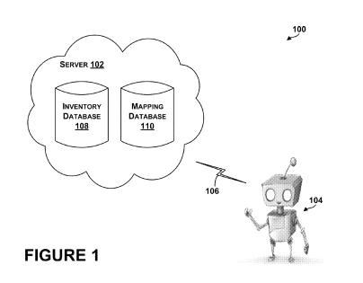

Yesterday, Google’s [CEO Larry Page announced](https://googleblog.blogspot.com/2013/03/update-from-ceo.html) that Andy Rubin would no longer be in charge of the mobile platform Android at Google,, but would be moving on to new challenges at the company. In the announcement, Page urged the entrepreneur and inventor to take “more moonshots please.” Andy Rubin brought Android to Google in 2004, but I’ve been wondering since yesterday’s announcement if we would see a different kind of Android delivered by his hands.

Rubin does have a history of enjoying [tinkering with robots](https://www.cnet.com/news/what-could-be-andy-rubins-next-moonshot-at-google/), and that seems to be an area that Google is quietly focusing upon. Regardless of whether or not the former Android chief is involved, do we need to add robots to the list of science fiction type endeavors Google is working upon?

I mentioned robots in the post, [Inside the Google House of Ideas: 2 Lens Glass, Google Robots, and Smartwatches](https://www.seobythesea.com/2013/02/2-lens-glass-google-robots-smartwatches/), a few weeks back after Google was granted 2 patents that involved providing instructions for robots, and enabling robots to make their own decisions (as if the patent covered Asimov’s [three rules of robotics](https://en.wikipedia.org/wiki/Three_Laws_of_Robotics)). Last October I also wrote about a paper to be presented this May that describes how [robots might use an object recognition search](https://www.seobythesea.com/2012/10/robots-search-google-goggles-to-pick-new-things-up/) from databases located in the Cloud to learn how to handle objects while doing their daily chores.

Yesterday Google was granted another patent that can help identify the location of a robot. Before I go into that, lets look a little more about robotics at Google.

Did you know that there was a Cloud Robotics team at Google? They gave the following presentation at Google at I/O 11 in San Francisco in 2011:

In it we learn about the Android Open Accessory API, which could be used to create an Android App that can “physically interact with the world.” The importance of cloud-based object recognition for robots is also stressed, telling us that not only is the ability to come across new things and recognize them is important, but so are instructions that come back from databases in the cloud that tell robots how they can interact with those objects.

Other cloud based services that not only benefit people, but could also benefit robots are mapping and navigation, voice recognition, optical character recognition, translation, and other things that can lead to smarter robots. A robot doesn’t need to be smart by itself – it just needs to connect to the cloud to figure out problems. A favorite moment for me in the video is a comparison of robots built a year apart folding towels, and how much better they’ve gotten at it. I also enjoyed a section on how a home-based robot could be used like a streetview car to index the contents of your house for a home-based search engine. A turtlebot finding a cupcake is priceless.

Google is also home to the [HomeBrew Robotics Club](http://www.hbrobotics.org/). While Andy Rubins isn’t officially a member of the club, he has made sure that [they have had Android devices](https://groups.google.com/forum/?fromgroups=#!topic/hackerdojo/V_IEVGIQv6E) in the past to work with.

## Why Would Robots Use the Cloud?

The newest Google patent on robots was granted a couple of days ago, and describes how the location of a robot can be identified not by the use of sensors from the robot itself, but rather from images seen by the robot, and location recognition of the objects seen within those images:

[Methods and systems for estimating a location of a robot](http://patft.uspto.gov/netacgi/nph-Parser?Sect1=PTO2&Sect2=HITOFF&p=1&u=%2Fnetahtml%2FPTO%2Fsearch-adv.htm&r=1&f=G&l=50&d=PALL&S1=08396254&OS=PN/08396254&RS=PN/08396254)
Invented by Ryan Hickman
Assigned to Google
US Patent 8,396,254
Granted March 12, 2013
Filed: August 17, 2012

Abstract

> Methods and systems for estimating a location of a robot are disclosed. In one embodiment, the method comprises a robot capturing range images indicating distances from the robot to a plurality of objects in an environment. The method further comprises transmitting to a server a query based on the range images, receiving from the server a mapping of the environment and, based on the distances and the mapping, estimating a location of the robot.
>
> In another embodiment, the method comprises receiving from a robot range images of an environment and, based on the range images, determining an inventory of objects in the environment. The method further comprises, based on the inventory, identifying the environment and transmitting to the robot a mapping of the environment.

So why use object recognition to locate a robot instead of sensors? According to the video, tasks performed in the cloud are relatively inexpensive, while installing things like servers and sensors in a robot can be costly. To make home based robots affordable, their costs need to be minimalized.

Another use for robots is to allow for a mobile video conferencing experience in the form of telepresense devices. Imagine being able to sit down in an office in New York, and use a robot to visit a building in San Francisco, and move within the building? In [Telepresence Robots Roam the Halls of My Office Building](http://130.243.105.49/~ali/hri2011ws/camera/HRI_Workshop_Tsui_final.pdf) (pdf), we see a Google researcher involved in studying this use of robots.

Again, Andy Rubin may or may not be aiming at the moon with robots, but Google is.
