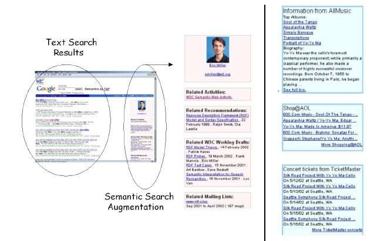

In 2003, a paper titled [Semantic Search](http://www2003.org/cdrom/papers/refereed/p779/ess.html) was published by Ramanathan Guha of IBM, Rob McCool of Knowledge Systems Lab at Stanford University, and Eric Miller of W3C and MIT. Their stated goal in the paper was to take technologies such as web services and the Semantic Web and use them to “improve traditional web searching.”

This was written before Ramanathan Guha joined Google, started Google Custom Search Engines, created Google’s version of [Trust Rank](https://www.seobythesea.com/2009/10/google-trust-rank-patent-granted/), and [introduced Schema](https://googleblog.blogspot.com/2011/06/introducing-schemaorg-search-engines.html).

_A statue on top of a building in Culpeper, Virginia. At least, I hope it was a statue._

I’m working on putting together a history of the Semantic Web at Google. This early look at Semantic Web provides insights from at least one person who played a major role in how the Semantic Web is becoming part of Google search.

A section of the Semantic Search paper introduces four important concepts about Semantic Search that are still around today and are worth thinking about if you do SEO. Before those, though…

## Navigational Searches vs. Research Searches

Before the paper even gets to those concepts, though, it introduces two different types of searches:

***Navigational Searches:*** In these searches, a searcher submits a phrase or combination of words that are expected to find in documents on the Web. A straightforward, reasonable interpretation of these words is not asked for in terms of denoting a concept. The searcher uses a search engine as a navigational tool to find a particular intended document. This is the goal of most SEO, and the authors of this paper tell us, “We are not interested in this class of searches.”

***Research Searches:*** a searcher provides the search engine with a phrase intended to denote an object about which the user is trying to gather/research information. The searcher doesn’t have a particular document in mind and doesn’t even guess at the existence. The searcher hopes that some documents that provide such answers may exist and will give him/her the information s/he is trying to find. These are the class of searches the authors tell us they are interested in when they use the phrase “Semantic Search.”

Google seems to be evolving towards becoming a search engine that can be useful in helping people with both types of queries.

Here are other elements that the paper tells us that can help us distinguish between the Semantic Web and the HTML Web.

***Documents vs. Real-World Objects:*** – When we think about the HTML web, we think of a web filled with web pages, with pictures, videos, and other documents that a web crawler such as Googlebot might crawl, and use things such as links between them, and the relevance of words that appear upon them or with them or pointing to them (in the anchor text) to rank in search results, and to help us find them.

Unlike the HTML Web, The Semantic Web isn’t a Web of documents, but instead a “Web of relations between resources denoting real-world objects, i.e., objects such as people, places and events.” When something happens to one of these real-world entities, the information about them on the Semantic Web should change. The paper contains a picture of what looks like an early knowledge panel, which was interesting to see:

***Human vs Machine Readable Information:*** – The important point about the Semantic Web is that it contains rich machine-readable information about resources. While most HTML on a web page tells visitors how the page should be displayed on a browser, most of the data on that page is almost all machine-understandable.

***Relation between the HTML & Semantic Web:*** – The document tells us that the Semantic Web is an extension of the current Web, and that “there is a rich set of links from the nodes in the Semantic Web to HTML documents.” The HTML Web and the Semantic Web are supposed to be connected, and they help one another by connecting the two.

This paper was written before markup like Schema was created, and it tells us that while some pages may contain some semantic markup. As I noted at the start of this paper, author R. Guha was the person who officially introduced Schema to the world at Google in the Official Google Blog in 2009 – six years after this paper was published.

The last point raised in the paper is an important one:

***Distributed Extensibility:*** – Different sites may contribute data about a particular resource. Amazon.com may have data about Yo-Yo Ma’s albums. eBay might contain data about auctions related to Yo-Yo Ma. TicketMaster may carry data about his concert schedule. AllMusic has data about where he was born (Paris); none of these sites needs permission from some centralized authority to include information about Yo-Yo Ma. As the paper says, “they can all extend the cumulative knowledge on the Semantic Web about any resource in a distributed fashion.”
