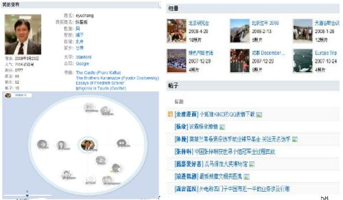
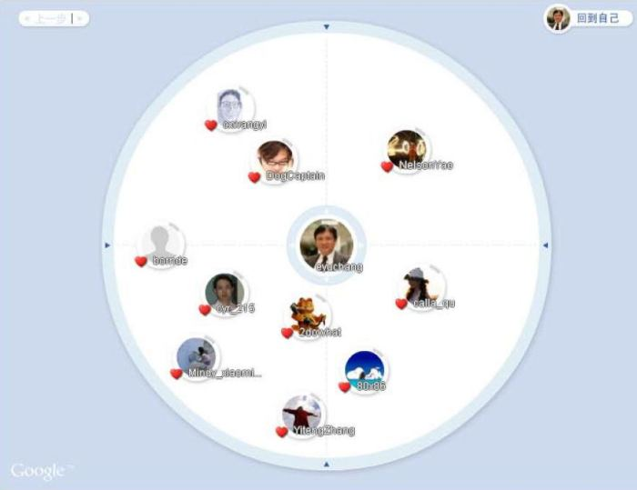
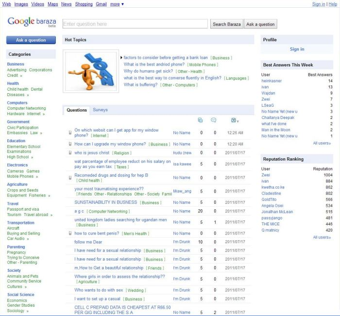
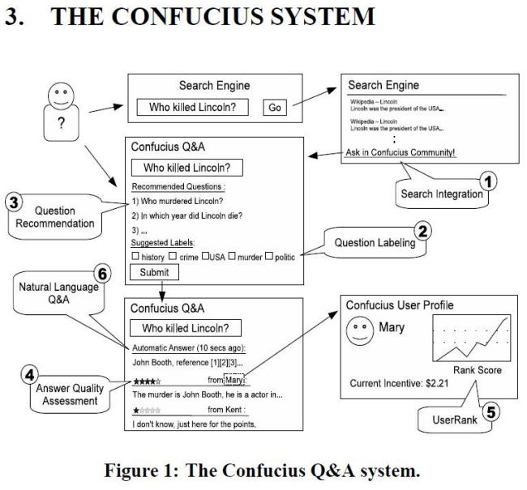

I’ve been researching Google’s social Q&A sites codenamed Confucius, which are in more than 68 countries and multiple languages, but little known in the US. What I’ve seen includes some tantalizing hints about Google Plus, a description of how content submitted to Google Plus might be ranked in Google Web search, and a possible advertising model for Google Plus that was detailed in a Best Paper nominee at the World Wide Web Conference in North Carolina last year.

I started looking at Confucius a week ago, when I published the post, [How Google Might Rank User Generated Web Content in Google & and Other Social Networks](https://www.seobythesea.com/2011/07/how-google-might-rank-user-generated-web-content-in-google-and-other-social-networks/). My post describes a ranking signal for user-generated content in Web search results, derived from a social network user’s perceived authority on different subjects and the quality of their contributions in interactions on the network; These combined scores might be used as a ranking signal in web search results for the content that user creates. The patent filing was published at the World Intellectual Property Organization website rather than the US patent office website, and the authors of the patent were from Google China, including Edward Y. Chang, the head of Research at Google China, seen in the profile page below:

The image above is taken from keynote presentation slides by Edward Y. Chang presented at the 18th ACM Conference on Information and Knowledge Management (ACM CIKM) titled [Confucius and its Intelligent Disciples](https://research.google/pubs/pub36900/). That circle and the one below might look a little familiar to anyone who has tried out Google Plus.

There’s also a paper that describes how some of the mechanisms behind Google Confucius works, and how people asking questions in Google Web search might be prompted to ask the questions at Google Confucius. The paper is [Confucius and Its Intelligent Disciples: Integrating Social with Search](https://research.google/pubs/pub36900/) (pdf), by Xiance Si, Edward Y. Chang, and Zoltan Gyongyi of Google Research and Maosong Sun from Tsinghua University.

As I mentioned above, Google Confucius is available in at least 68 countries at this point, including 40 countries in Africa, (Available in English and French), [China](http://wenda.tianya.cn/), Russia, Thailand, Indonesia, and many countries with Arabic speakers.

Here’s a screenshot of the African version of the site in English:

The site provides several different ways to earn points to go up levels, win badges for different activities, and more. While the site doesn’t look too different from many of the Question and Answer (Q&A) sites you’ve probably seen on the web, some of the magic behind the site is what happens behind the scenes, and in the way that it interacts with Google. How many other Q&A sites in the world will receive visitors from Google with a prompt from the search engine to ask a question on the site?

The image below, from the *Confucius and Its Intelligent Disciples* paper provides a quick snapshot of some of the unique aspects of the Confucius system:

The paper provides some insights into the assumptions behind Google Confucius, as well as the major technical challenges of putting the system together:

1. People seldom provide answers without incentives.
2. When incentives exist, people who might abuse or spam a system may emerge, degrade the quality of the service and discourage knowledgeable users from participating.
3. When a question is asked, it should be routed quickly to a domain expert to reduce answering delay.
4. If an answer to a question is already available, it should be easy to find to avoid redundant work and unnecessary delay.

Here are some of the mechanisms developed for the system that makes it somewhat unique:

1. Integration into Search Results:

When someone enters a query at Google, and the search is a wh-query (when, where, why, etc.), or the search engine may not be able to return sufficiently relevant results (in instances where there might be [inadequate search content](https://www.seobythesea.com/2010/06/how-google-might-suggest-topics-for-you-to-write-about/) with an overlap between the query terms and the potential top result pages being low), a Confucius Q&A session is recommended in the Google search results that encourage the searcher to ask their question on the Q&A site.

2.Labeling Questions:

When someone types in their questions, category labels are suggested for the questioner. Those labels can help organize questions, enable people to subscribe to the labels’ topics, and route the questions to people who might have some expertise in those topics. The authors of the paper tell us that they “employ a parallel implementation of Latent Dirichlet Allocation ([PLDA](https://code.google.com/archive/p/plda/)) [12] to make label suggestions.”

3. Recommending Questions:

To provide faster responses and avoid people from answering the same questions repeatedly, the question recommendation part of this system looks for similar earlier questions and provides the answer to those. We’re told that PLDA is also useful in finding those previously asked questions in this recommendation task.

4. Evaluating the Quality of Answers:

The patent application I wrote about last week on [ranking user-generated content](https://www.seobythesea.com/2011/07/how-google-might-rank-user-generated-web-content-in-google-and-other-social-networks/) provides some details on how a question or original post might be evaluated in terms of quality, as well as answers and responses. The quality of answers can rely upon how relevant they are to the question, how original they might be in comparison to other answers to that question and similar questions, how wide the coverage of the response might be (does it use a wide mix of related terms), and so on. This evaluation not only helps uncover who the top contributors might be in the system and the members who might be submitting spam. And in curbing spam.

5. User ranking:

Uses of the system are ranked based upon their contributions and their interactions with others. Those rankings are based upon different areas of expertise. They can be used to identify the top contributors in those areas, and to help in providing incentives to people answering questions, and to route questions on specific subjects to people with expertise in those subjects—route questions to domain experts.

6. NLP-based answer generation:

In addition to having people provide answers for questions, Google Confucius may also answer some questions independently, much as Google does in Q&A results on Google.com, such as, “when is the birthdate of Derek Jeter?”

**Conclusion**

While Google Confucius is much more of a straightforward Q&A site than Google Plus, many ideas being developed at Google Confucius may become part of Google Plus. The circles I showed above look like they may have been part of Confucius for a while, though I did a little looking around and didn’t see them on some of the different versions of Confucius now. I signed up for the English language version of the African Q&A site to see the profile pages for the site. I didn’t see any circles, but I also didn’t add any contacts.

Those ideas that might carry over to Google Plus might include the authority/contribution rankings for individuals to determine whether or not relevant Google Plus content might appear in search results.

The paper [AdHeat: An Influence-based Diffusion Model for Propagating Hints to Match Ads](http://static.googleusercontent.com/media/research.google.com/en/us/pubs/archive/36258.pdf) pdf (Presentation: [AdHeat, An Influence-based Social Ads Model& its Tera-scale Algorithms](http://docplayer.net/44802610-Adheat-an-influence-based-social-ads-model-its-tera-scale-algorithms.html)) was nominated as a [best paper](http://www2010.org/www/2010/04/best-paper-awards/index.html) at the WWW2010 conference in North Carolina, and it’s worth spending some time with. As the paper tells us, AdHeat is a social ad model that considers user influence in addition to relevance for matching ads with content:

> We performed three experiments on Google Confucius, an online Q&A service available in China, Russia, Thailand, and 17 Arab-speaking countries. The results show that Ad-Heat to be more effective over content-relevance and user targeting ad models, outperforming them in CTR by significant margins.

Wil AdHeat appear on Google Plus? Maybe.
