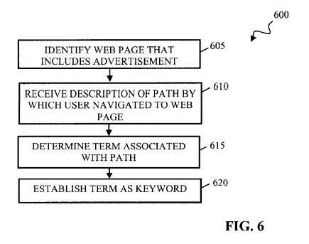

## Patents Focusing Upon Low Quality Content at Google

Might Google lower the rankings of a page in search results if it detects unusual patterns related to clicks on advertisements on that page, or might Google use a ranking algorithm that can be tested against such unusual click patterns to lower the rankings of pages in search results? Such Pages may be perceived as low-quality content. A Google patent granted today is the first that I can recall seeing that suggests that information about clicks on ads might cause pages to be lowered in web search rankings or removed from search results altogether:

> Once the document engine 146 determines the likelihood that an article is a manipulated article, the method 400 ends. The likelihood that an article is a manipulated article can be used in a variety of ways. For example, the information that an article is likely a manipulated article can be used to lower a ranking associated with that article such that the article will be displayed lower in a listing of search results or not displayed at all.
>
> Alternatively, the information that an article is likely a manipulated article can be used to test ranking algorithms.
>
> For example, it may be desirable to use ranking algorithms that function independently of the click-through data associated with an article, but that nevertheless attempt to lower manipulated articles within a listing of search results. The information obtained from the method 400 that an article is likely to be a manipulated article based on the click-through data can be used to test the effectiveness of a ranking algorithm that functions independently of the click-through rate.
>
> For example, if the method 400 determines that articles A, B and C are associated with high click-through rates and therefore are likely to be manipulated articles, this information can be compared to the ranking determined by an algorithm independent of the click-through data associated with the articles for the articles A, B and C. If the articles A, B and C are similarly ranked lowly by an algorithm independent of the click-through rate, this can be an indication that the independent algorithm effectively identifies manipulated articles.

The claims from the patent don’t include specific language about manipulated articles but describe methods that could be used to identify situations where site owners might publish low-quality content that might rank well in search engines alongside advertisements, that may appear to lead to higher quality content, or where those site owners might practice search arbitrage where they pay for lower-cost advertising to send people to pages with low-quality content anticipating that a number of visitors might click upon advertising on those pages with higher payouts. The patent description elaborates on methods that might be used to identify manipulative pages.

For instance, Google may look at the paths that people follow to arrive at an advertisement that they click upon, such as clicking upon an ad in search results and then quickly clicking upon a more expensive ad on the landing page that the first ad sent them to. The patent defines manipulated articles as including articles designed to rank artificially high in search results, often for popular query terms. The publishers of these manipulated articles may also automatically create links to those articles from other articles to have them rank more highly, or sometimes show different content to a web crawler than they show to other visitors.

These manipulated articles may contain content designed to help those pages rank well for web search and to have them generate content ads associated with those key terms, without really providing substantive information. Because of the low-quality content on those pages. visitors to those pages will frequently choose an advertisement on the page to find more useful pages.

The patent is:

[Methods and systems for establishing a keyword utilizing path navigation information](http://patft.uspto.gov/netacgi/nph-Parser?Sect1=PTO2&Sect2=HITOFF&u=%2Fnetahtml%2FPTO%2Fsearch-adv.htm&r=1&p=1&f=G&l=50&d=PTXT&S1=8,005,716.PN.&OS=pn/8,005,716&RS=PN/8,005,716)
Invented by Pavan Desikan
Assigned to Google Inc.
US Patent 8,005,716
Granted August 23, 2011
Filed June 30, 2004

Abstract

> Systems and methods for determining and utilizing path navigation information. In one aspect, a method includes determining an article containing at least one item, determining a path associated with the article, and identifying at least one term associated with the at least one item based at least in part on the path.

While this patent describes a way to identify low-quality content pages such as content farms through higher than expected clickthroughs or through navigational paths that might start with a click on a lower cost ad to a page with low-quality content and higher-earning advertisements, it doesn’t mention the kind of “quality scores” that we’ve learned to associate with Google’s Panda. In my quote from the patent above, it does say that the clickthrough data might be used to test algorithms that might identify manipulated articles.

If we look at a Google patent filed around a year later which shares an author with the above patent, Pavan Desikan, we do see the concept of quality scores being assigned to pages where advertisements might be published. That patent is:

[Reviewing the suitability of Websites for participation in an advertising network](http://patft.uspto.gov/netacgi/nph-Parser?Sect1=PTO2&Sect2=HITOFF&p=1&u=%2Fnetahtml%2FPTO%2Fsearch-adv.htm&r=1&f=G&l=50&d=PALL&S1=07788132&OS=PN/07788132&RS=PN/07788132)
Invented by Pavan Kumar Desikan, Lawrence Ip, Timothy James, Sanjeev Kulkarni, Prasenjit Phukan, Dmitriy Portnov, and Gokul Rajaram
Assigned to Google, Inc.
US Patent 7,788,132
Granted August 31, 2010
Filed June 29, 2005

Abstract

> The way in which Websites are reviewed for use in an advertising network may be improved by
>
> (a) accepting a collection including one or more documents,
>  (b) determining whether or not the collection complies with policies of an advertising network, and
>  (c) approving the collection if it was determined that the collection complies with the policies.
>
> The collection may be added to the advertising network if the collection is approved such that (e.g., content-targeted) advertisements may be served in association with renderings of documents included in the collection. The collection may be a Website including one or more Webpages. The policy may concern
>
> (A) content of the one or more documents of the collection,
>  (B) usability of a Website wherein the collection of one or more documents is a Website including one or more Webpages, and/or
>  (C) a possible fraud or deception on the advertising network or participants of the advertising network by the collection.

Policy compliance violations or low-quality content scores might be used to flag a page for manual review or remove it from the advertising network.

The patent provides a number of general classifications of policy violations, such as violations related to:

- Content of the Website (is the content too general to provide specific targeting, is there not enough content, is the content bad or controversial, etc.),
- The publisher or source of the Website,
- Usability of the Website (is it under construction, or does it contain broken links, or slow loading pages, or improper use of frames, etc.) and
- Fraud (e.g., attempting to defraud advertisers and/or the ad network).

The patent includes several examples of the kinds of content that might not be acceptable under the policies of the advertising network, and many of those are very similar to those included in the section on “Content Guidelines” on the [Google AdSense Program Policies](https://support.google.com/adsense/answer/48182?hl=en&gsessionid=yOLu5xVfs1b5bWM1Zgmrkg) page.

More interestingly, we are told that a manual list of websites with “a given type or class of policy violation may be used to train an expert system (e.g., neural networks, Bayesian networks, support vector machines, etc.) to classify other Websites as having the policy violation or not.” That classification system could look for certain words or phrases and images that might indicate policy violations

Usability and other website violations that might be detected upon pages could include:

- Websites with domain name server (DNS) errors (such as, for example, URL does not exist, URL down, etc.)
- Websites with broken links,
- “Offline” Websites,
- “Under construction” Websites,
- Websites with excessive pop-ups/pop-unders (e.g., more than N (e.g., one) pop-up or pop-under ad on any given webpage load),
- Chat Websites,
- Non-HTML Websites (e.g., directory indexes, flash, WAP),
- Spy ware Websites,
- Homepage takeover Websites,
- Websites that try to install malicious software on the user’s computer,
- Websites that affect usability by disabling the back button,
- Excessive popups/pop-unders

We’re told that “pay-to-click” Websites (e.g., those whose main purpose it to get people to select pay-per-click ads), may also be policed under the advertising policy guidelines, and that those might also be identified by a machine learning process trained upon well known “pay to click” websites. For example, we are told that “click-spam Websites typically have content generated using a template and/or high ads to text ratio.”

The patent also provides some other things they might use as quality criteria when looking at a site, such as:

- Usage data from the advertising network or other sources such as impressions, selections, user geolocation, and conversions
- Whether the site is in the advertising network, or not
- Popularity, possibly as measured by Google toolbar for example
- Website spam (“link farms”, hidden text, etc.)

**Low Quality Content Conclusion**

If the aim of Google’s Panda upgrades was to reduce the search rankings of pages that are created to rank highly in search results to show off low-quality content and high earning advertisements, then the use of quality scores to identify those manipulative articles fits very well into the processes behind these patents.

The questions that Google Fellow Amit Singhal poses in the Official Google Blog article [More guidance on building high-quality sites](https://webmasters.googleblog.com/2011/05/more-guidance-on-building-high-quality.html) are probably the best place to go to when trying to identify the kinds of things that might negatively impact a page or site under Panda, and how to improve the rankings of those pages. The aim behind them is to convince publishers to provide high-quality content on their pages.

I suspect that Google doesn’t use clickthrough data directly to determine which pages might be manipulative, but may be using that information to test a machine learning-based Panda algorithm, as the *path navigation information* patent suggests as a possibility.
