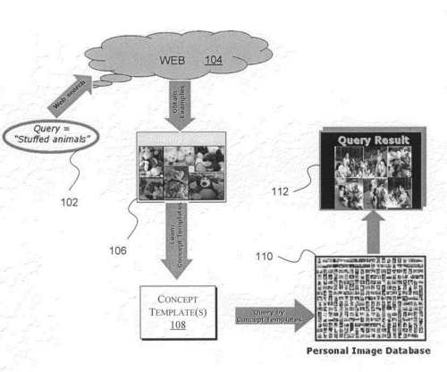

In the blog post, [Searching Google for Big Panda and Finding Decision Trees](https://www.seobythesea.com/2011/03/searching-google-for-big-panda-and-finding-decision-trees/) I tried to guess the identity of the Mysterious “Panda” that a recent (at that time) update was named after, as we had been told in a Wired Magazine Article.

_Giant Timber Bamboo_

I guessed Biswanath Panda. I guessed wrong.

I had changed my opinion of which Panda that Update was from when I wrote a couple of follow up posts:

- [Is This Really the Panda Patent?](https://www.seobythesea.com/2014/04/the-panda-patent/)
- [New Panda Update; New Panda Patent Application](https://www.seobythesea.com/2014/09/new-panda-update-new-panda-patent/)

Navneet Panda published another Patent application this week, which I wrote about this week in the post [How Google May Calculate Site Quality Scores (from Navneet Panda)](https://www.seobythesea.com/2015/05/google-site-quality-scores/)

I just found out, via my friend Barbara Starr, who was searching through Google patents that he had been granted another US Granted Patent, which I’m writing about today.

Why I’m interested is that it describes some work Panda did at Google that reminds me of the Panda Update. This patent isn’t about site quality, though we’ve learned from Navneet Panda’s LinkedIn profile and previous patents that he focuses on Site Quality. This patent is about “techniques for learning concept templates from web images to query personal image databases.”

We learned some details about the Panda Update in the Wired article [TED 2011: The “Panda” That Hates Farms: A Q&A With Google’s Top Search Engineers](https://www.wired.com/2011/03/the-panda-that-hates-farms/) In the interview, the following questions are answers about the update:

> **Cutts:** I think you look for signals that recreate that same intuition, that same experience that you have as an engineer and that users have. Whenever we look at the most blocked sites, it did match our intuition and experience, but the key is, you also have your experience of the sorts of sites that are going to be adding value for users versus not adding value for users. And we came up with a classifier to say, okay, IRS or Wikipedia or New York Times is over on this side, and the low-quality sites are over on this side. And you can see mathematical reasons …
>
> **Singhal:** You can imagine in a hyperspace a bunch of points, some points are red, some points are green, and in others there’s some mixture. Your job is to find a plane which says that most things on this side of the place are red, and most of the things on that side of the plane are the opposite of red.

In those responses from two of Google’s leading search engineers, I’m reminded very much of this patent, which is about learning about features of images from a set of test images and using those to identify and organize images from a set of someone’s images. The patent starts with this description of what it does:

> A computer may be used to store images that have been converted into digital format. Unlike other types of computer files that may include textual data, image files may include no text or very little text associated with the images such as the image creation date or a file name, for example. Hence, searching for specific image files may not be as easy as searching for text files stored on a computer. Information to annotate image files may be entered manually, but this process may be too time-consuming and burdensome for users.

The patent is:

[Learning concept templates from web images to query personal image databases](https://patents.google.com/patent/US20080240575)
Publication number: US8958661 B2
Publication date: Feb 17, 2015
Filing date: Mar 30, 2007
Inventors: Navneet Panda, Yi Wu, Jean-Yves Bouguet, Ara Nefian

Abstract

> Methods and apparatus to generate templates from web images for searching an image database are described. In one embodiment, one or more retrieved images (e.g., from the Web) may be used to generate one or more templates. The templates may be used to search an image database based on features commonly shared between sub-images of the retrieved images. Other embodiments are also described.

The patent tells us that concept templates were created based upon images obtained through the Web to use to “search an image database such as a personal image database stored on a personal computer or a server.” Those images from the Web are referred to as a “target image Database” An example provided in the patent is a picture of Stuffed Animals used to “identify features that are commonly shared by images that include stuffed animals.”

Images like that of the Stuff Animal picture would be images that show up in response to a query for “stuffed animals”. They would be training images that could show off features related to that query. They would be used as part of a concept template, to search a “personal image database”. Images with similar features could be useful to “identify features that are commonly shared by images that include stuffed animals.”

_How a concept template is used to search a database of personal images._

This patent tells us that it might take the target images, and break them up into “16×16 blocks of pixels.”

These smaller images might then be compared with the images in the personal database, and certain characteristics might be viewed, such as a “color histogram, concentration of a pattern, a shape, combinations thereof, etc.”

The patent goes on further, but the basic idea seems to be using these concept images as query templates to identify and categorize similar images.

This image classification method reminded me of Amit Singhal’s and Matt Cutt’s description of how the Panda Update worked in the wired interview by comparing features from a good set of web pages and features from a bad set of web pages, and sorting pages out into higher quality and lower quality pages. It sounded like the roots of that approach.
