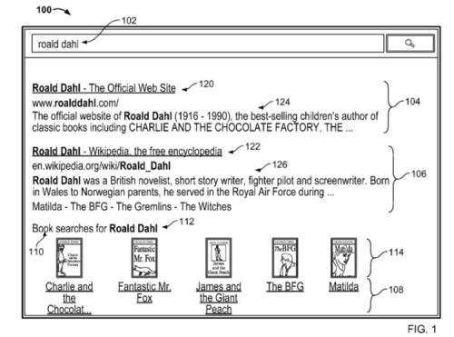
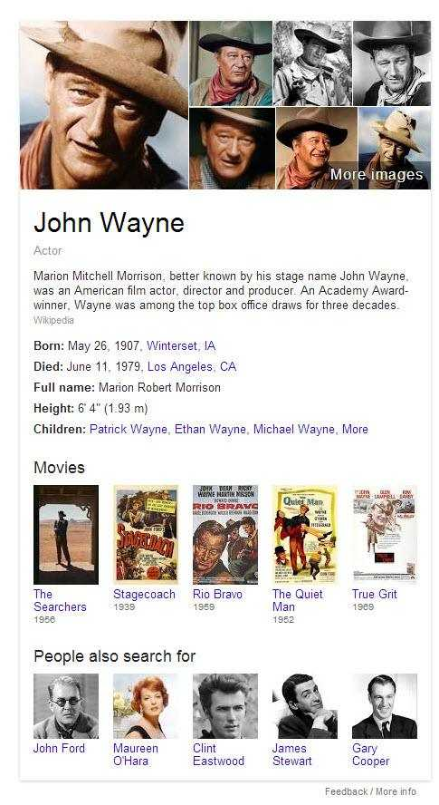
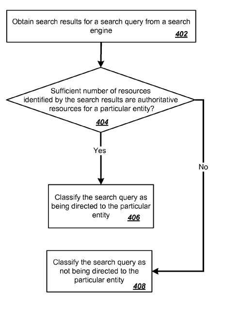
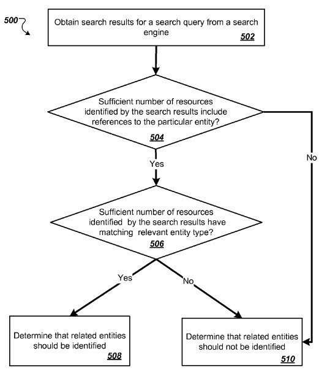
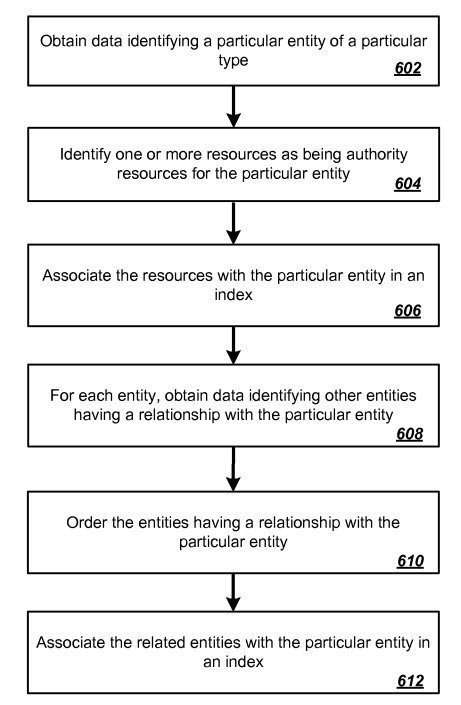

## Understanding Relationships such as Entity Assocations

When we talk about the relationships between websites, it’s not unusual for us to talk about links between sites and pages. Google pays a lot of attention to such links. They are at the heart of one of its most well-known ranking signals – PageRank. PageRank is more than 15 years old, predating the origin of Google itself in the BackRub search engine.

Google is exploring other signals used to rank pages in search results. These include social signals for [reputation scores for authors](https://www.seobythesea.com/2011/07/how-google-might-rank-user-generated-web-content-in-google-and-other-social-networks/). They may also look at [relationships between words](https://www.seobythesea.com/2012/11/ranking-webpages-relationships-co-occurrence-patent/) that appear together on pages ranking for the same queries. Also relationships between pages in [the same search results and in the same search sessions](https://www.seobythesea.com/2013/08/relationships-search-entities/). A Google paper presented at an October 2013 natural language processing conference, [Open-Domain Fine-Grained Class Extraction from Web Search Queries](https://www.aclweb.org/anthology/D13-1039/) (pdf), provides some interesting hints at a possible Google of the future.

## Entity Associations are Part of the Future of SEO

Google wants to build a [knowledge base of concepts](https://www.seobythesea.com/2013/11/concept-based-web-search/) to better understand things like what [different businesses or entities are ‘Known for’](https://www.seobythesea.com/2013/11/google-finds-known-terms-entities/). The search engine is also interested in [defining entities better in ‘is a’ relationships](http://seocopywriting.com/google-attempts-understand-query-page-based-upon-word-relationships/). Pages for specific entities may show up at the top of search results because they seem to be pages people are looking for when that entity is in a query. For example the first two results on a search for [Roald Dahl], as seen in the image below:

## Drawing Connections Between Different Named Entities with Entity Associations

A Google patent application on related entities published earlier this year also explores drawing connections between different named entities. These could be specific people, places, or things. It does this by looking at entity associations with specific websites and understanding “related entities” for those original entities. An entity association is when a specific entity connects with a particular website. This may be because a site is authoritative for that entity. Or because a page from the site is a navigational result for a query that includes that entity.

On a search for “John Wayne,” the official [John Wayne](https://www.johnwayne.com/) website is the top result in Google and the second result is the [John Wayne Wikipedia page](https://en.wikipedia.org/wiki/John_Wayne). Those may rank well not because of traditional ranking signals such as PageRank and information retrieval scores based upon relevance. Instead, because they are pages that are authoritative on the entity “John Wayne,” and great responses to those queries as [navigational results](https://www.seobythesea.com/2012/12/navigational-queries-resources/).

## What is In A Knowledge Panel for An Entity?

While the Roald Dahl search result from the patent application shows books authored by Roald Dahl, the Knowledge Panel result for John Wayne shows movies that he has starred in and shows other people whom searchers also look for when they search for John Wayne, as related entities.

How similar are the processes for including related entities within a set of search results and including related entities within a [knowledge panel](https://www.seobythesea.com/2013/05/google-knowledge-graph-results/) in Google Results? This patent application tells us that it looks at search results to try to identify related entities. At the same time, the knowledge panel results also appear to look at query log files to find things that people also search for when they search for an entity that triggers a knowledge panel result. The patent filing is:

[Related Entities](http://appft.uspto.gov/netacgi/nph-Parser?Sect1=PTO1&Sect2=HITOFF&d=PG01&p=1&u=%2Fnetahtml%2FPTO%2Fsrchnum.html&r=1&f=G&l=50&s1=%2220130238594%22.PGNR.&OS=DN/20130238594&RS=DN/20130238594)
Invented by Peter Jin Hong, Pravir K. Gupta, Nathaniel J. Gaylinn, Ramakrishnan Kazhiyur-Mannar, Kavi J. Goel, Omer Bar-or, Jack W. Menzel, Christina R. Dhanaraj, Jared L. Levy, Shashidhar A. Thakur, Grace Chung, and Benson Tsai
US Patent Application 20130238594
Published September 12, 2013
Filed: February 22, 2013

Abstract

> Methods, systems, and apparatus, including computer programs encoded on computer storage media, identify entities related to an entity to which a search query goes. One of the methods includes:
>
> - A search query, wherein the search query relates to the first entity of a first entity type, and where entities of a second entity type have a relationship with the first entity;
> - Search results for the search query;
> - A count of search results identifying a resource containing a reference to the first entity satisfies a first threshold value;
> - Search results identifying a resource having the second entity type as a relevant entity type satisfies a second threshold value
> - Transmitting information identifying one or more entities of the second entity type as part of the response to the search query.

## A Look at the Entity Association Process

Here’s an abbreviated look at the entity associations process described in the patent filing. It uses images from the related entities patent application:

## Are There Authoritative Resources for an Entity on the Web?

Search results from a query see whether there are authoritative resources for an entity within them. If so, then those results show for that entity.

If the search result titles and snippets contain related entities, they may be within a related entity database.

The patent does tell us that these related entities might be in ranked order, and it provides some of the signals used to order the related entities. (Note that there’s not a link involved at all.)

## Ranking Scores for Related Entities

These scores can be in part on:

- Someone searching for related entities after submitting a query for the first entity.

- whether a recognized reference to related entities **co-occur** in a same prior submitted query is a recognized reference to the original entity.

- If there is data indicating that two or more of the related entities of the second entity type are members of a set of entities that has a specified order, and matching that order (For example, if the entity is a person with children and the children are usually listed in birth order.)

- when data indicates that two or more of the related entities are better known as part of a broader entity and replacing them with the broader entity in ordering the related entities.

## Entity Associations Take-Aways

When Google decides to associate an entity with a particular query, it may also identify whether related entities show up in those search results in places like titles and snippets. It may include those entities within the search results. Again, this wouldn’t need matching keywords with the original query or a PageRank analysis.

The patent application shows how this would work within search results, but it seems to apply to knowledge panel results.

As Google’s knowledge base grows, things like Entity Associations and related entities will continue to be a part of it.

I’ve written a few posts about named entities. These are some that I wanted to share:

- [Do You Have a Named Entity Strategy for Marketing Your Web Site?](https://www.seobythesea.com/2013/12/named-entity-strategy/)
- [How I Came to Love Entities and Start Doing Entity Optimization](https://www.seobythesea.com/2014/10/came-love-entities/)
- [How Google Uses Named Entity Disambiguation for Entities with the Same Names](https://www.seobythesea.com/2015/09/disambiguate-entities-in-queries-and-pages/)
- [How Named Entities Connected to Trending Topics can address real time search results](https://www.seobythesea.com/2015/03/how-named-entities-connected-to-trending-topics-can-be-used-to-address-real-time-search-results/)
- [Not Brands but Entities: The Influence of Named Entities on Google and Yahoo Search Results](https://www.seobythesea.com/2010/08/not-brands-but-entities-the-influence-of-named-entities-on-google-and-yahoo-search-results/)
- [How Knowledge Base Entities Rank in Searches](https://www.seobythesea.com/2014/07/knowledge-base-entities-used-in-searches/)
- [Finding Entity Names in Google’s Knowledge Graph](https://www.seobythesea.com/2014/06/entity-names-in-google/)
- [Google Gets Smarter with Named Entities: Acquires MetaWeb](https://www.seobythesea.com/2010/07/google-gets-smarter-with-named-entities-acquires-metaweb/)
- [Entity Associations with Websites and Related Entities](https://www.seobythesea.com/2014/01/entity-associations-websites-related-entities/)
- [How Google Might Identify Entity Synonyms Using Anchor Text](https://www.seobythesea.com/2014/06/synonyms-for-entities/)
- [Extracting Facts for Entities from Sources such as Wikipedia Titles and Infoboxes](https://www.seobythesea.com/2014/08/extracting-facts-for-entities-from-sources/)
- [Extracting Semantic Classes and Corresponding Instances from Web Pages and Query Logs](https://www.seobythesea.com/2014/09/extracting-semantic-classes-instances-from-web-pages-query-logs/)
- [How Google May Identify Main Entities](https://www.seobythesea.com/2015/04/how-google-may-identify-central-entities-from-resources/)
- [How Google’s Knowledge Graph Updates Itself by Answering Questions](https://www.seobythesea.com/2018/10/how-googles-knowledge-graph-updates-itself-by-answering-questions/)

Last Updated June 26, 2019
