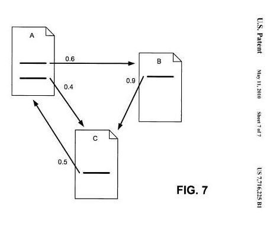

Most of us searchers and site owners and search engine optimizers are familiar with Google’s Link Graph, and how Google uses the connections between websites to help in ranking pages on the Web. In part, Google looks at the relevance of the content of a page compared to a query that a searcher enters in the search engine.

In addition to “relevance”, Google also uses the patented method of PageRank, in which the quality and quantity of links pointed to a page are used as a proxy for the quality of the page being linked to. The higher the quality of a page (and the higher PageRank it possesses), the more PageRank it likely passes along.

The **link graph** is one example of how Google ranks and measures and possibly sorts web pages. Another that Google might look at is the **attention graph** – how Google might use topics and concepts that may be searched upon frequently to change rankings of pages based upon freshness and hot topics.

Another graph that Google has been looking at is the **social graph**, and who the people are who might be connected to you in Google Plus to show you annotations when you search for something that these connections of yours may have +1’ed or shared themselves and that result is relevant for the query terms you used.

These pages or results might not be the most relevant result for your query on the Web, but the idea is that if it was found meaningful by someone whom you’re connected to, it may also be meaningful to you as well.

When I wrote about the newly granted Google patent [Learning synonymous object names from anchor texts](http://patft.uspto.gov/netacgi/nph-Parser?Sect1=PTO2&Sect2=HITOFF&p=1&u=%2Fnetahtml%2FPTO%2Fsearch-adv.htm&r=1&f=G&l=50&d=PALL&S1=08738643&OS=PN/08738643&RS=PN/08738643), The focus of my post was upon Google’s use of their **Knowledge Graph**, and how they are using data Janitors to extract facts from the Web about named entities – specific people, places, or things whether real or fictional, to come up with additional entity names.

Many entities are known by more than one name, including businesses, brands, product lines, and even people.

The patent itself provides a lot of details on how it might attempt to identify additional entity names in anchor text pointing to a page that is about that entity. On its surface, this might sound a little like how Google’s web crawling and indexing program might identify and use anchor text pointed to a page as if it were metadata about that page.

The role that Google has given to Anchor Text over the years should not be understated. In the early Stanford University whitepaper about the search engine, [The Anatomy of a Large-Scale Hypertextual Web Search Engine](http://infolab.stanford.edu/~backrub/google.html). It’s probably worth taking a look at what that paper had to say about Anchor Text, to compare to its use as a way of adding new names to entities pointed at with links. The paper tells us:

> The text of links is treated specially in our search engine. Most search engines associate the text of a link with the page that the link is on. Also, we associate it with the page the link points to. This has several advantages.
>
> - First, anchors often provide more accurate descriptions of web pages than the pages themselves.
> - Second, anchors may exist for documents which cannot be indexed by a text-based search engine, such as images, programs, and databases.
>
> This makes it possible to return web pages that have not been crawled. Note that pages that have not been crawled can cause problems since they are never checked for validity before being returned to the user. In this case, the search engine can even return a page that never actually existed, but had hyperlinks pointing to it. However, it is possible to sort the results, so that this particular problem rarely happens.

This passage from the paper points to the use of anchor text to learn more about the page being pointed to with a link. As I mentioned in the last post, that’s the web crawling version of Google that’s used to index pages on the Web, rather than the Data Janitors and extractors that perform multiple functions to try to index objects and entities on the Web and collect facts about them.

The patent isn’t about the use of anchor text to describe a page that a link points to, but rather it’s about using links from linking resources to find alternative names for an entity that a page might be about.

## Data Janitors and Unique IDs

If you followed the links in my last post to posts I’ve written about data janitors, you probably have a good idea of what those are.

A quick summary for everyone else.

Google extracts information from pages on the web and puts that in front of data janitors. These janitors exist to process facts that have been extracted. Some janitors get rid of duplicate facts, some merge very similar facts (like a birthdate for someone on one page being “December” and for the same person on another page is “Dec.” Some facts might be removed completely, such as facts related to pornographic content. Janitors may also be involved in translation, in compression, or spelling or grammar correction.

These janitors clean up facts about specific entities. They aren’t indexing web pages, though they may use URLs where facts are found as the original address for that fact. What they are indexing is a collection of facts associated with a single entity. The patent tells us that one approach that could be used in this process is to create a specific unique ID for each of these entities.

Remember Eric Schmidt stating that Google Plus wasn’t a social network but instead was an [identification service](https://www.forbes.com/sites/kashmirhill/2011/08/29/googles-eric-schmidt-says-plus-is-an-identity-service-not-a-social-network/#5c83543f5ce8)? The numbers in the URLs on Google accounts are unique IDs.

A few weeks ago, when tech blogs like TechCrunch were [spreading rumors](https://techcrunch.com/2014/04/24/vic-gundotra-the-father-of-google-is-leaving-google-after-8-years/) that Google+ was going to be discontinued because Vic Gundotra was leaving Google, they must not have been aware of how Google+ tied in so well to this idea of **unique IDs for named entities**, and how Google+ allowed those to be created for authors, who are also named entities in Google’s indexing of knowledge within its knowledge graph.

Google+ ties into Google on a much deeper level than whether or not a single individual managed the development of Google+ for a while. The knowledge graph relies upon unique IDS for entities, Google’s Agent Rank (the roots of Google’s social graph in logged-in search, and a potential author rank in the future) also relies upon unique IDs for authors.

## Information Collected about Facts and Objects

Google’s object repository stores factual information about entities, extracted from a wide range of documents on the Web. Each fact in this repository is associated with exactly one object, and in one implementation for that association, each object has a unique ID. So objects are defined by a collection of facts that all have the same associated object ID.

Keep in mind that when this knowledge graph system collects facts about an entity, they collect at least two different parts – an attribute and a value. So, when a fact about George Washington is collected, it might be with the attribute of “date of birth” and the value of “February 22, 1732.” So a fact might include a (1) fact ID, (2) an attribute, (3) a value, and (4) an object ID. An Object might have hundreds of facts associated with it, and a “value” might be very long, such as the full text of a web page (or even a book).

Some other information might be collected for facts about specific objects as well, such as

- The language used to state the fact (English, etc.)
- How important the fact is (its value to undertanding the entity)
- The source of the fact (A URL, for instance)
- A confidence value for the fact (how likely it is correct), and
- Others

## Name Facts are Not HyperText Relevance

The primary focus of the patent is on how “Name” facts might be identified from anchor text pointing to a page. We know that Googlebot focuses on collecting content and information on pages to index the content of those on a page-by-page basis rather than on an object-by-object basis. Google does look at anchor text pointing to a page to tell what the page being pointed to is about. These **name-fact data janitors** are looking to learn more information in the form of facts about entities. A name fact includes an attribute of “name” and a value, which is the name of the associated entity.

Example

A name fact for “Spain” might be its official name, the “Kingdom of Spain.”

The U.S. Patent and Trademark Office may have associated entity name facts conveying the agency’s acronyms “PTO” and “USPTO” as well as the official name “United States Patent and Trademark Office.”

If an entity or object has more than one associated name fact, one of the name facts may be designated as a primary name and other name facts may be designated as secondary names, either implicitly or explicitly. These name facts associated with an object are also called synonymous names of the object.

## Finding Synonymous Entity Names

Here are steps involved in finding Synonymous Entity Names using data janitors:

1). An object representing (or describing) an entity is identified from the repository. It can be identified by a unique object ID and defined by the collection of facts associated with that object ID.

2) The repository might contain several source documents associated with an object. These are documents from which one or more facts about the object was extracted.

3) After retrieving the facts associated with the object, the system can identify the list of source documents associated with the object based on the source fields of the retrieved facts. A fact can have multiple source documents.

4) The source documents might be reviewed and some might be omitted from the list, especially if they might cover a lot of objects that could be associated with multiple entities, such as a blog might.

5) For each of those source documents, documents that link to them might be identified.

6) Only the links to the source documents are reviewed to see if they contain name facts worth adding to the repository.

## Anchor Synsets

The anchor texts pointing to the source documents within the linking documents are used to generate a collection of synonym candidates (also known as the “anchor synset”) for the object name.

At this stage, anchor texts are removed that are not related to the subject of the associated source document, such as “Click here!” or to clean up the remaining anchor texts by removing portions of an anchor text that are unrelated to the subject of the associated source document. For example, anchor text for a link might say “Find out more about Big Blue” and link it to the IBM website. The “Find out more about” section might be removed, and the nouns that make up the name might be kept as a name fact.

Some text might be removed from anchor text during this process because that text appears upon a blacklist, such as “here,” or “click here,” or “download.”

Other steps might be taken as well, to standardize the format of anchor text before processing:

- Removal of punctuation, such as removing commas in a string
- Conversion of uppercase characters in a string to corresponding lowercase characters, such as from “America” to “america,” and
- Stop word removal, such as removing stop words such as “the,” “a,” and “of” from a string

A white list might also be used, and could involve a person approving some names, or extracted names from something like a telephone directory.

The frequency of occurrence of candidate synonymous names might also be reviewed. Rarely occurring names might be considered to be things like misspelled words if they happen so infrequently.

Very frequently occurring words might also be disqualified as entity names, such as:

- “the company,”
- “home page,” and
- “click here.”

PageRank might also play a role, with the quality of the associated linking documents considered when the anchor text in links to the source documents is considered. The higher the PageRank the more likely the anchor text on a page (or part of it at least) might be considered to be a candidate synonymous entity name.

Capitalization of each of the words in the candidate synonymous entity name is another signal that might be looked at.

## Assigning Entity Names Facts

These are the steps that can lead up to the use of anchor text to identify alternative names or synonymous names for an entity.

The patent tells us that it’s important to note that this process is language neutral and can be used in any language.

## Entity Names Take Aways

I wrote about this patent because it describes how data janitors might use anchor text pointing to a page about an entity to help find other names for that entity. I wrote about it because it does a great job of showing how this knowledge graph kind of fact extraction differs from the web crawling and indexing that we often talk about when we talk about the indexing of things found on the web.

Web crawling is about crawling, indexing, and ranking web pages. Data extraction with data janitors is about indexing objects on the Web, including named entities. That extraction does collect information such as the URLs that are the source of facts, but it’s more about building a knowledge graph and identifying facts associated with entities.

Both types of indexing are important. If you have a client with a business brand or product line or professional career that would benefit from better coverage in Google’s knowledge graph, knowing how data janitors might work can be helpful to you.

I’ve written a few posts about named entities. These are some that I wanted to share:

- [Do You Have a Named Entity Strategy for Marketing Your Web Site?](https://www.seobythesea.com/2013/12/named-entity-strategy/)
- [How I Came to Love Entities and Start Doing Entity Optimization](https://www.seobythesea.com/2014/10/came-love-entities/)
- [How Google Uses Named Entity Disambiguation for Entities with the Same Names](https://www.seobythesea.com/2015/09/disambiguate-entities-in-queries-and-pages/)
- [How Named Entities Connected to Trending Topics can be used to Address Real Time Search Results](https://www.seobythesea.com/2015/03/how-named-entities-connected-to-trending-topics-can-be-used-to-address-real-time-search-results/)
- [Not Brands but Entities: The Influence of Named Entities on Google and Yahoo Search Results](https://www.seobythesea.com/2010/08/not-brands-but-entities-the-influence-of-named-entities-on-google-and-yahoo-search-results/)
- [How Knowledge Base Entities can be Used in Searches](https://www.seobythesea.com/2014/07/knowledge-base-entities-used-in-searches/)
- [Finding Entity Names in Google’s Knowledge Graph](https://www.seobythesea.com/2014/06/entity-names-in-google/)
- [Google Gets Smarter with Named Entities: Acquires MetaWeb](https://www.seobythesea.com/2010/07/google-gets-smarter-with-named-entities-acquires-metaweb/)
- [Entity Associations with Websites and Related Entities](https://www.seobythesea.com/2014/01/entity-associations-websites-related-entities/)
- [How Google Might Identify Entity Synonyms Using Anchor Text](https://www.seobythesea.com/2014/06/synonyms-for-entities/)
- [Extracting Facts for Entities from Sources such as Wikipedia Titles and Infoboxes](https://www.seobythesea.com/2014/08/extracting-facts-for-entities-from-sources/)
- [Extracting Semantic Classes and Corresponding Instances from Web Pages and Query Logs](https://www.seobythesea.com/2014/09/extracting-semantic-classes-instances-from-web-pages-query-logs/)
- [How Google May Identify Main Entities](https://www.seobythesea.com/2015/04/how-google-may-identify-central-entities-from-resources/)
- [How Google’s Knowledge Graph Updates Itself by Answering Questions](https://www.seobythesea.com/2018/10/how-googles-knowledge-graph-updates-itself-by-answering-questions/)

Last Updated June 26, 2019.
