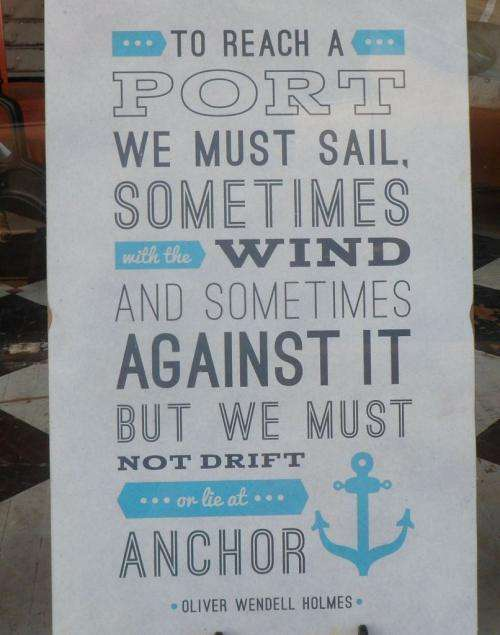
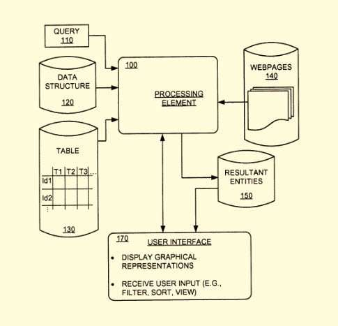
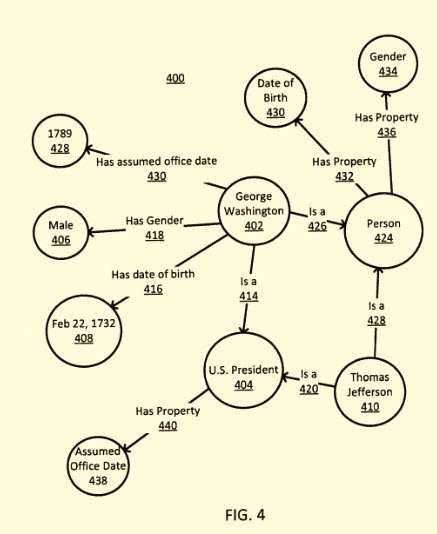
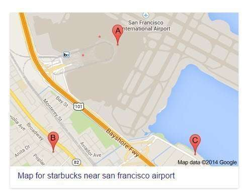

A ***compositional query*** may be aimed at providing a data point to identify another related data point as an answer or solution to that query.

For example, the following two queries are compositional and focus upon an answer at a fixed location or a fixed point of time:

- [Starbucks near San Francisco Airport]

- [Films shot during World War II]

_Oliver Wendell Holmes_

The approach in this Google patent can involve determining a first entity type (the San Francisco Airport or World War II from our examples), a second entity type(Starbucks or Films), and a relationship responding to a compositional query (Starbucks near the airport, and Movies filmed during WWII).

It starts with identifying nodes of a knowledge graph for references to a first entity and references to a second entity.

This means finding from the knowledge graph attribute values that help point out a relationship between the two entities.

Looking at the relationships between the first entity type and many entity references of the second type can help define a criterion.

This starts with identifying from a knowledge graph entity references of the first entity type and the second entity type that meet the criterion and finding answers that meet that criterion.

The patent is:

[Providing Search Results Based on a Compositional Query](https://patents.google.com/patent/WO2014089769A1)
Publication number: WO2014089769 A1
Publication date: Jun 19, 2014
Filing date: Dec 12, 2012
Inventors: Jinyu Lou, Ying Chai, Chen Ding, Lijie Chen, Liang Hu, Kejia Liu, Weibin Pan, Yanlai Huang, David Francois Huynh
Applicant: Google

Abstract

> A technique for providing search results may include determining a first entity type, a second entity type, and a relationship type based on a compositional query. The technique may also include:
>
> - Identifying nodes of a knowledge graph corresponding to entity references of the first entity type and entity references of the second entity type.
> - Determining from the knowledge graph an attribute value corresponding to the relationship type for each entity reference of the first entity type and each entity reference of the second entity type.
> - Comparing the attribute value of each entity reference of the first entity type with the attribute value of each entity reference of the second entity type.
> - Determining one or more resultant entity references from the entity references of the first entity type based on the comparing.

_Entity Nodes, with edges showing relationships between them._

An entity may be the actual physical embodiment of George Washington, but an entity reference is an abstract concept itself that refers to George Washington.

Usually, where the patent refers to an entity, we are told that the term “entity” means a reference to an entity.

While the search system may identify an entity type associated with an entity reference, the entity type may be a categorization or classification used to identify entity references in the data structure.

So, entity references such as “George Washington” may be associated with the entity types (categories or classifications) such as “U. S. President,” Person,” and “Military Officer.”

## Examples of other compositional queries

- [American Banks close to Japanese restaurants]

- [Companies that went bankrupt during an economic crisis]

Answers to these queries could fill a tabular display, such as a list of the Starbucks near the San Francisco Airport, the movies filmed during WWII, the American Banks near Japanese Restaurants, and Companies that when bankrupt near an economic crisis.

Most of these queries don’t return answers from Google yet, but this one does:

The patent discusses pre-generated answers for questions and displays such as maps or timelines, annotated with entity references. It also mentioned the possibility of compositional queries with more than two entity types, such as:

- [American Banks close to Japanese restaurants close to ice cream shops]

The patent contains a lot of information about the knowledge graph and entities within them, such as issues involving disambiguation and differentiation of entities, which is worth checking out in the patent itself.

## Take Aways

We don’t yet see the kind of compositional query answers that this patent tells us about, except maybe simple maps results. I could see (or am waiting for) queries like

[an antique bicycle shop near an ice cream store near Chinese takeout].

It may be a while until we can query something such as “movies filmed during WWII in the US.” That would be much more interesting than finding out what day George Washington was born on or what City is Virginia’s capital. However, these kinds of compositional query direct answers may be in our future soon.

I think searchers would be happy with results like those.
