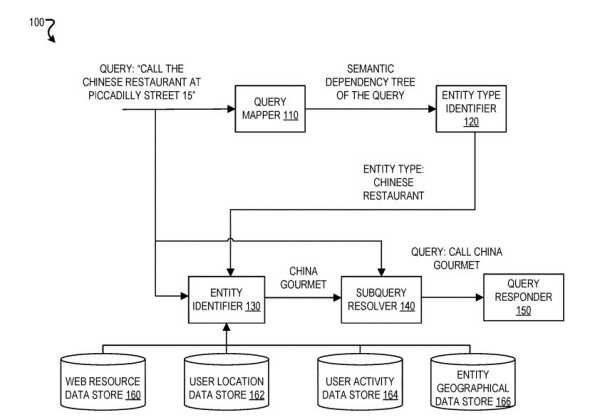
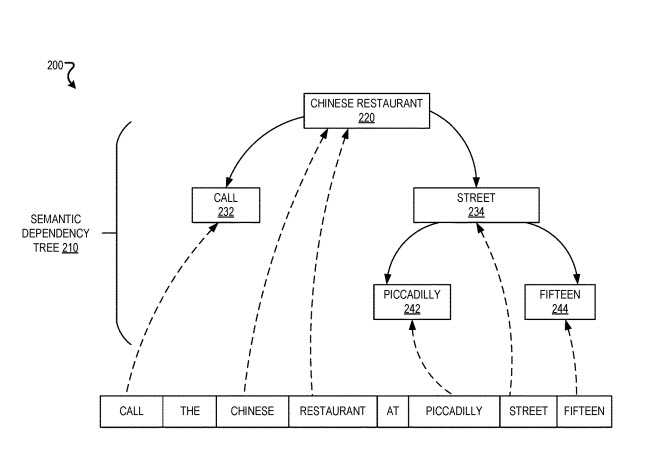

## Entity Seeking Queries and Semantic Dependency Trees

Queries for some searches may be entity-seeking queries.

Someone may ask, “What is the hotel that looks like a sail.” That query may look for an entity such as the building, the Burj Al Arab Jumeirah.

That entity may look at Semantic Dependency Trees. Those would answer a question in the query (example below).

Other queries are not entity-seeking queries and do not look for answers about specific entities. An example is “What is the weather today?” An answer to a query like that could be, “The weather will be between 60-70 degrees Fahrenheit and sunny today.”

## Actions May Go with Queries that Seek Entities

Google got granted a patent on answering entity seeking queries.

The process in the patent may perform particular actions for queries seeking one or more entities.

Those actions may include:

- Identifying one or more entities a query is seeking
- Determining whether the query seeks one specific entity or more than one

For example, the patent may decide a query “What is the hotel that looks like a sail” is looking for a single entity that is a hotel.

In another example, a query “What restaurants nearby serve omelets” may look for restaurants. It many try to find many entities.

Or, the system may find the most relevant entity or entities and present one to a searcher if it is sufficiently relevant to the query. For example, it may identify that the Burj Al Arab Jumeirah is a hotel and is relevant to the term “looks like a sail.” In response, it might return output synthesized speech of “Burj Al Arab Jumeirah audibly.”

## More Dialog about a Query to Concatenate an Entity Seeking Query

Yet another addition or alternative action may include initiating a dialog with the user for more details about the sought entities.

For example, the system may determine that a query is seeking a restaurant. There may be two entities that are very relevant to the terms in the query. In response, ask the searcher, “Can you give me more details” and concatenate additional input from the user to the original query and re-execute the concatenated query.

## Identifying SubQueries of Entity Seeking Queries

Another alternative action may include identifying subqueries of a query that are entity-seeking. The search engine would use the above actions to answer the subquery. It would then replace the subqueries with their answers in the original query to get a partially resolved query resolved.

For example, the system may receive a query of “Call the hotel that looks like a sail.” It may then determine that “the hotel that looks like a sail” is a subquery that seeks an entity. It could determine an answer to the subquery is “Burj Al Arab Jumeirah.” It may, in response, replace “the hotel that looks like a sail” in the query with “The Burj Al Arab Jumeirah” to obtain a partially resolved query of “Call the Burj Al Arab Jumeirah.” It could then execute the partially resolved query.

## Looking at Previous Queries

Another alternative action may include identifying that a user is seeking entities and adapting how the system resolve queries accordingly.

For example, the system may determine that sixty percent of the previous five queries that a user searched for in the past two minutes sought entities. In response, it may determine that the next query that a user provides is more likely an entity-seeking query and process the query accordingly.

## An Advantage From Following this Process

An advantage may be more quickly resolving queries in a manner that satisfies a searcher.

For example, the system may be able to immediately provide an actual answer of “The Burj Al Arab Jumeirah” for the query “What hotel looks like a sail.” Another system may instead respond to “no results found” or provide a response that is a search result listing for the query.

Another advantage may be that the process may more efficiently identify an entity sought by a query. For example, it may determine an entity seeking query is looking for an entity of the type “hotel” and, in response, limit a search to only entities that are hotels instead of searching across many entities, including entities that are not hotels.

## Entities in Semantic Dependency Trees

This is an interesting approach to an entity seeking queries. Determining an entity type that may correspond to an entity sought by a query based on a term represented by a root of a dependency tree includes:

Determining the term represented by the root of the dependency tree represents a type of entity.

Determining an entity type that corresponds to an entity sought by the query based on a term represented by a root of the dependency tree includes:

Identifying a node in the tree that represents a term that represents a type of entity
Includes a direct child that represents a term that indicates an action to perform.
In response to determining that the root represents a term representing and type of entity and includes a direct child representing a term that indicates an action, identifying the root.

## Identify An Entity Based on Both the Entity Type and Relevance of the Entity to the Terms in the Query

In some implementations, identifying a particular entity based on both the entity type and relevance of the entity to the terms in the query includes:

- Determining a relevance threshold based on the entity type
- Determining a relevance score of the particular entity based on if the query satisfies the relevance threshold
- In response to determining the relevance score of the particular entity based on the query satisfies the relevance threshold, identifying the particular entity

This patent on Entity Seeking Queries is at:

[Answering Entity-Seeking Queries](http://appft.uspto.gov/netacgi/nph-Parser?Sect1=PTO1&Sect2=HITOFF&d=PG01&p=1&u=%2Fnetahtml%2FPTO%2Fsrchnum.html&r=1&f=G&l=50&s1=%2220190370326%22.PGNR.&OS=DN/20190370326&RS=DN/20190370326)
Inventors: Mugurel Ionut Andreica, Tatsiana Sakhar, Behshad Behzadi, Marcin M. Nowak-Przygodzki, and Adrian-Marius Dumitran
US Patent Application: 20190370326
Published: December 5, 2019
Filed: May 29, 2018

Abstract

> In some implementations, a query that includes a sequence of terms is obtained, the query is mapped, based on the sequence of the terms, to a dependency tree that represents dependencies among the terms in the query, an entity type that corresponds to an entity sought by the query is determined based on a term represented by a root of the dependency tree, a particular entity is identified based on both the entity type and relevance of the entity to the terms in the query, and a response to the query is provided based on the particular entity that is identified.

## Mapping a Query to a Semantic Dependency Tree

A process that handles entity seeking queries

This process includes:

- A query mapper that maps a query including a sequence of terms to a semantic dependency tree
- An entity type identifier that may determine an entity type based on the semantic dependency tree
- An entity identifier that may receive the query
- The determination of an entity type
- Data from various data stores and identify an entity
- Subquery resolver that may partially resolve the query based on the identified entity
- Query responder that may provide a response to the query

## An Example Semantic Dependency Tree

This is how a semantic dependency tree gets created:

1. A semantic dependency tree for a query may be a graph that includes nodes
2. Each node represents one or more terms in a query
3. Directed edges originating from a first node and ending at a second node may state that the one or more terms represented by the first node change by the one or more terms represented by the second node
4. A node at which an edge ends may be a child of a node from which the edge originates
5. A root of a semantic dependency tree may be a node representing one or more terms that do not change other terms in a query but could modify other terms in the query
6. A semantic dependency tree may only include a single root

## An Entity Type Identifier

An entity type identifier may determine an entity type that corresponds to an entity sought by the query based on a term represented by a root of the semantic dependency tree.

For example, the entity type identifier may determine an entity type of “Chinese restaurant” that corresponds to an sought by the query “Call the Chinese restaurant on Piccadilly Street 15.” This could be based on the term “Chinese restaurant” represented by the root of the semantic dependency tree.

The entity type identifier may determine an entity type of “song” for the query “play the theme song from the Titanic” based on the term “play” represented by the root of the semantic dependency tree for the query not representing an entity type and determining that the root has a child that represents the terms “the theme song” which does represent an entity type of “song.”

## Entities from a Location History of a Searcher

The entity identifier may extract all the entities from a [mobile location history](https://www.seobythesea.com/2018/01/googles-mobile-location-history/) of a searcher. Those have a type identified by the entity type identifier. They would include hotels, restaurants, universities, etc. You will also extract features associated with each such entity. These could include the time intervals when the searcher visited the entity or was near the entity. Also, how often each entity got displayed, or the user was near the entity.

## Entities from a Past Interaction History of a Searcher

Besides that location history, the entity identifier may extract all the entities that the searcher knew from in their past interactions that have a type identified by the entity type identifier. These could include:

- Movies that the user watched
- Songs that the user listened to
- Restaurants that the user looked up and showed interest in or booked
- Hotels that the user booked
- Etc.

## Confidence in Relevance for Entity Seeing Queries

The patent also tells us that the entity identify may obtain a relevance score for each entity that reflects a confidence that the entity is sought to be the query.

The relevance score may be determined based on one or more of the features extracted from the data stores that led to the set of entities being identified. It can also look at the additional features extracted for each entity in the set of entities and the features extracted from the query.
