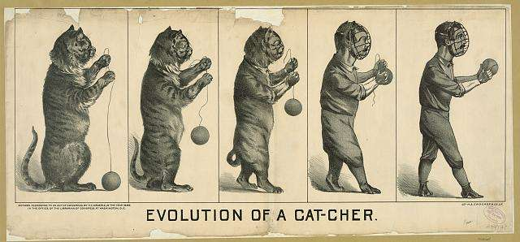

When I’m looking for something at a search engine, I will often start with a particular query, and then depending upon the kinds of results I see, I often change the query terms I use. It appears that Google has been paying attention to this kind of search behavior from people who search like me. A patent granted to Google earlier this month watches queries performed by a searcher during a search session, and may give more weight to the words and phrases used earlier in a session like that, and might give less weight to terms that might be added on as a session continues.

This patent seems like part of an evolution of algorithms from Google that has brought us to their Hummingbird update.

Some other patents from Google that look at information from search query sessions and make changes to search results based upon those. I’ve written about a couple of them, and when I went to check them out, I noticed that they share the same inventors, Ashutosh Garg and Kedar Dhamdhere. Both have left Google, and Ashutosh Garg now works for a company called [Bloomreach](https://www.bloomreach.com/en), and Kedar Dhamdhere is listed at LinkedIn as working for Facebook.

In [How Google May Demote Some Search Results for Subsequent Related Searches](https://www.seobythesea.com/2011/11/google-demote-search-results-for-related-searches/) I wrote about a Google patent titled [Demotion of repetitive search results](http://patft.uspto.gov/netacgi/nph-Parser?Sect1=PTO2&Sect2=HITOFF&u=%2Fnetahtml%2FPTO%2Fsearch-adv.htm&r=1&p=1&f=G&l=50&d=PTXT&S1=8,051,076.PN.&OS=pn/8,051,076&RS=PN/8,051,076). It tells us that if we perform a search for a query such as “black coats” and then follow up with a query such a “black jackets,” any results that are shared between the two might be pushed down in the results during a search for the second term since it’s possible that we’ve seen those and didn’t find them interesting the first time we saw them.

In the post [Why Google May Change Search Result Snippets](https://www.seobythesea.com/2013/03/google-change-search-result-snippets/), I looked at the patent [Session-based dynamic search snippets](http://patft.uspto.gov/netacgi/nph-Parser?Sect1=PTO2&Sect2=HITOFF&p=1&u=%2Fnetahtml%2FPTO%2Fsearch-adv.htm&r=1&f=G&l=50&d=PALL&S1=08380707&OS=PN/08380707&RS=PN/08380707), where a somewhat different approach is indicated.

When you perform two similar searches using some of the same search terms, and the same result shows up, instead of Google pushing results down when the same page is shown, Google might instead re-write the snippet for the page, focusing upon the words used in the new search. This gives that page a second chance at being selected by a searcher since it reflects both queries that a searcher performed and is relevant for both of them. This sounds like a better solution than demoting those results.

The first patent was filed in 2007. This newly granted patent was filed in 2008. The last one, where Google may change the snippet for the same result after a new query during a session surfaces it, was originally filed in 2007, and then it appears to have been refiled in 2011. It sounds like an evolution over time may have taken place in how Google might treat these search results.

The newly granted patent is:

[Contextual search term evaluation](http://patft.uspto.gov/netacgi/nph-Parser?Sect1=PTO2&Sect2=HITOFF&p=1&u=%2Fnetahtml%2FPTO%2Fsearch-adv.htm&r=1&f=G&l=50&d=PALL&S1=08645409&OS=PN/08645409&RS=PN/08645409)
Invented by Ashutosh Garg and Kedar Dhamdhere
Assigned to Google
US Patent 8,645,409
Granted February 4, 2014
Filed: April 2, 2008

Abstract

> Apparatus, systems, and methods for contextual search term evaluation are disclosed. A current search query is received during a search session. A predicate subsequence in the search query is identified. A subsequent search term in the query is identified. The search term attributes of the subsequent search term are adjusted.

## Search Sessions

A search engine can track search sessions in several ways, but usually involve a period where someone appears to be searching for a specific topic and performs many queries related to that topic. They may multi-task and search for something unrelated during that time, but if they then take up the search for queries involving the original topic again, it could be said to be in the same query session.

This notion of seeing what people search for during query sessions also springs up in patents related to synonyms and semantic search. It may be very related to Google’s Hummingbird update. See: [How Google May Reform Queries Based on Co-Occurrence in Query Sessions](https://www.seobythesea.com/2013/09/google-reform-queries-based-co-occurrence-query-sessions/).

## Predicate Queries

Someone searches for “Atlanta Weather,” While the search results are relevant, they don’t provide exactly what the searcher was looking for. They return to Google and type in “Atlanta Weather forecast” to narrow in upon what they were looking for. Under this patent, the first terms used are referred to as a “predicate query,” The added term is referred to as a “subsequent” query term.

The patent tells us that it might give more weight to the terms in the predicate query and less to the subsequent query term added, and may even treat the subsequent query as if it were optional.

Reading through the patent a few times, I’m not convinced that this approach helps matters. If a searcher had started their search with the phrase “Atlanta weather forecast,” they would get different results than if they started with “Atlanta weather” and then followed up with “Atlanta weather forecast.” They do tell us one reason for doing this:

> However, adding new search terms to the search query may not enhance the user experience if the search engine gives equal or additional weight to the added search term.

The patent does go into a lot of detail on how they might give the subsequent query less weight in a search, but this stated reason isn’t expanded upon.

## Take Aways

I prefer the approach described in the patent on changing snippets for a page when the same page shows up in the same search session for two different queries that might use some of the same words.

It’s impossible to tell which of these approaches might be in use now by Google, if any. According to LinkedIn, Ashutosh Garg left Google in 2008. I’m not sure when Kedar Dhamdhere left, but the snippet-changing patent wasn’t officially filed at the USPTO until 2011, so The updated version of the patent may have been worked on by only one of them or by someone else completely.

Either way, search session information is probably being used in a few different places at Google. One is in the kind of re-writing of long and complex, and often spoken queries that we see with the Hummingbird update. Another is when a knowledge panel result shows additional information about an entity described, such as Abraham Lincoln’s height being included in a knowledge panel about him. Still, none of the other presidents have their height listed.

The chances are good that many people ask about Lincoln’s height in queries and search sessions involving Lincoln.

What I found most interesting about this new patent is that it shows us how algorithms to address certain issues might evolve and change. Here it seems clear that Google was trying out different approaches with search results for similar queries during search sessions based upon earlier queries in those sessions.

I say that because the same pair of inventors are listed on the patents I’ve pointed out, and they seem to be trying out different solutions to what might be deemed the same problem.

Google’s Hummingbird is part of that evolution in that it doesn’t rely upon the previous queries of the same searcher in a search session, but instead looks at information such as historical search query sessions and what people looked at in those to help re-write someone’s first query, which may mean getting people the results they may most likely want to see for their first search.
