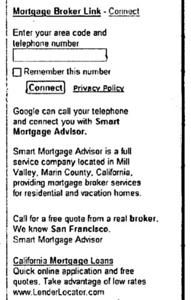

What role does Google envision for telephone calls in Web based ads?

A recent Google patent application explores some of the topics involved. It doesn’t discuss Google’s search by phone system, but it does explain how Google may attempt to avoid some of the issues and limitations of Pay-Per-Call (PPC) and Click-to-Call (CTC) ads.

**Why phone numbers instead of landing pages?**

Some advertisers may prefer to have users contact them by telephone:

1. They may not have a Website
2. They might not have a sophisticated ad landing page
3. They may feel that a phone call could generate more sales, or higher margin sales than a visit to their website
4. Some users may just be more comfortable on the phone, or are using a device making it hard to see Web pages, or to input information necessary to make an order.

The patent application discusses click-to-call and pay-per-call, and some of the limitations to those approaches.

**Pay-Per-Call (PPC)**

1) These show special toll-free numbers in advertisements or on Web pages, which can be tracked so that advertisers can be billed on a per call basis when users place calls to those numbers.

2) Limitation – requires a user dial the advertiser. If the device that they are using doesn’t have call functionality, they might have to memorize or write down the toll free number, and then access a telephone.

**Click to Call (CTC)**

1) A user enters a number which an advertiser can use to reach the user.

2) When a user selects (e.g., clicks) an advertisement or a special icon in an advertisement, they are presented with a screen or form that requests the user to enter a telephone number at which the advertiser can call the user back. A call server attempts to connect the advertiser and the user. If the user picks up the telephone at the number provided, the advertiser is able to speak with the user.

3) While CTC avoids making the user memorize or write down a special toll free number, CTC has been offered in ways that don’t fully exploit its potential. The multi-window (or multi-page) approach may be confusing and cumbersome to some users.

**Avoiding the Limitations – Click and Pay to Call (CPTC)**

Here’s a picture of a CPTC advertisement from the patent document:

These CPTC ads enable the advertiser to contact you at the number that you provide, and don’t launch a new window or page for you to fill out a form. They work by:

(a) Serving one or more ads with a document, with at least one of them being a click and pay to call ad,

(b) Having the user enter their phone number and clicking on the connect button

(c) Having the Advertiser call the entered telephone number, and,

(d) Assessing a charge to an account of an advertiser associated with the click and pay to call ad.

Here’s a link and some information about the patent filing if you would like to find more details:

[Advertisements for initiating and/or establishing user-advertiser telephone calls](http://appft1.uspto.gov/netacgi/nph-Parser?Sect1=PTO2&Sect2=HITOFF&u=%2Fnetahtml%2FPTO%2Fsearch-adv.html&r=1&p=1&f=G&l=50&d=PG01&S1=20070094073.PGNR.&OS=dn/20070094073&RS=DN/20070094073)
Invented by Rohit Dhawan, Kosar Jaff, Scott Ludwig, Ervin Perertz, Narayanan Shivakumar
US Patent Application 20070094073
Published April 26, 2007
Filed: December 30, 2005

Abstract

> Advertisements that facilitate telephonic communications between users and advertisers, and which avoid perceived problems or limitations of PPC and CTC offerings, are described. These advertisements may include offer information used to score the ad and/or to assess a charge to the advertiser in the event of a call conversion.
