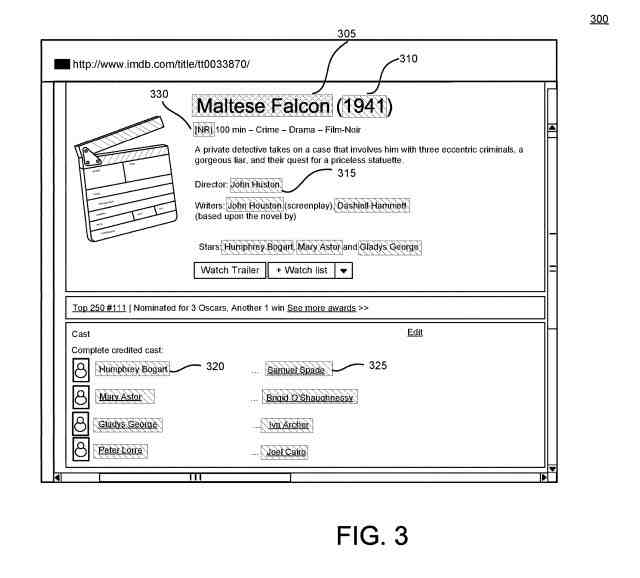
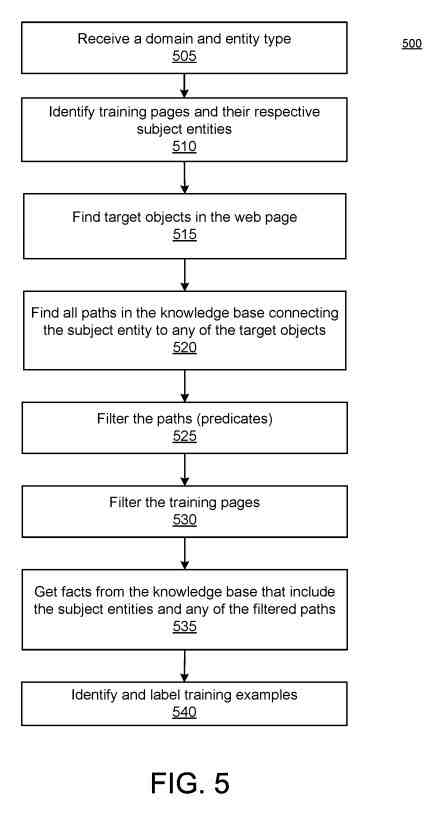
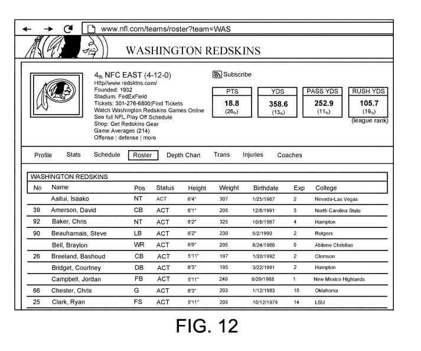
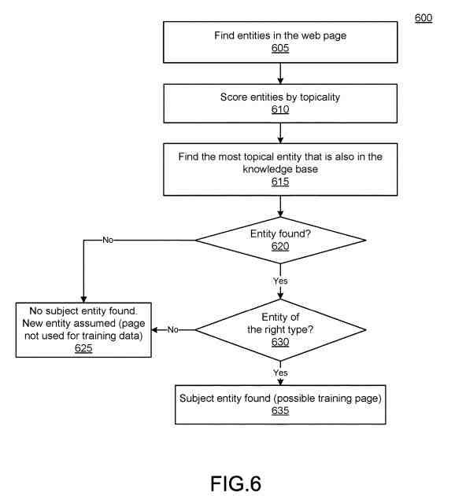
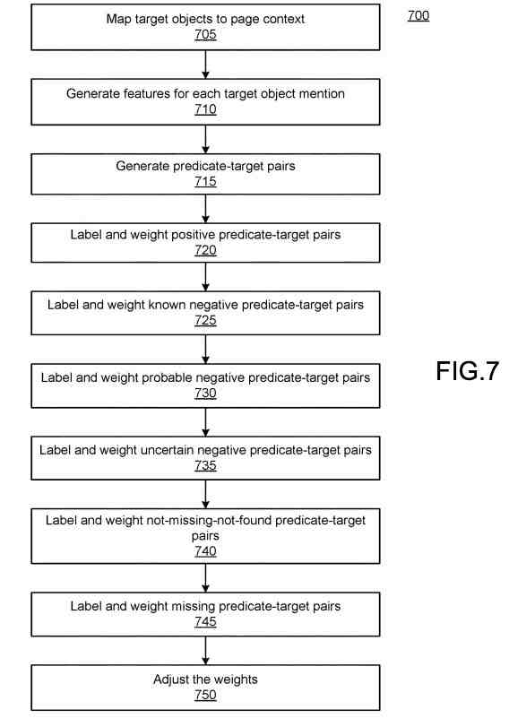
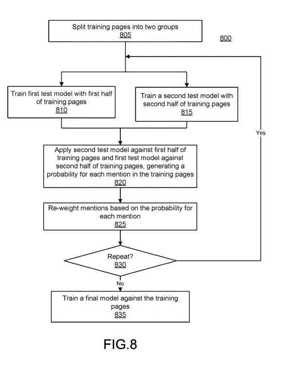
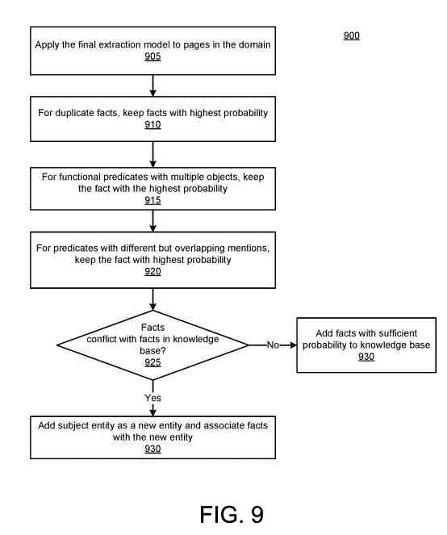

## Extracting Entity Information From Web Pages with Data Wrappers

One area of SEO worth exploring involves Semantic SEO, which I wrote about in [What is Semantic SEO?](https://gofishdigital.com/what-is-semantic-seo/).

One of the important patents I wrote about involved [Entity Extraction for knowledge graphs](https://gofishdigital.com/entity-extractions-knowledge-graphs/) and which I covered in more detail in the post [Answering Questions Using Knowledge Graphs](https://gofishdigital.com/answering-questions-using-knowledge-graphs/). It covers association scores telling us how to measure confidence about the relationship between entities and their attributes, entities, types, entities, and classes.

A new patent from Google filed in April 2016 and granted in April 2021 adds to how knowledge found on the web is further understood:

The description of this automated data wrappers patent starts by telling us:

“Large-scale knowledge bases, such as the FREEBASE knowledge base and YAGO knowledge base store data and rules that describe knowledge about the data in a form that provides for deductive reasoning.”

It’s worth paying attention to the information in this patent which focuses more on knowledge bases:

> For example, in a knowledge base, entities, such as people, places, things, concepts, etc., may be stored as nodes, and the edges between nodes may indicate the relationship between the nodes.

This is important for Google since launching the knowledge graph, which focuses on collecting facts and information about entities. We see information about these such as this:

> In such a knowledge base, the nodes “Maryland” and “United States” may be linked by the edges of in-country and/or has stated.
>
> The basic unit of such a knowledge base is a tuple that includes two entities and a relationship between the entities.
>
> Some tuples are also referred to as tuples.
>
> A tuple may represent a real-world fact, such as “Maryland is a state in the United States.”

## Entity Extraction Leads to Building Knowledge Graphs

A post I wrote about knowledge graphs is probably worth a look. The post is about [Google Knowledge Graph Reconciliation](https://www.seobythesea.com/2019/08/google-knowledge-graph-reconciliation/). In saying that, it is interesting to have this automated data wrappers patent tells us more about some of the information collected in a knowledge graph about the tuples it contains:

> The tuple may also include other information, such as context information and other metadata. Adding entities and relationships to a knowledge base has typically been a manual process, making large knowledge bases difficult and slow.

This automated data wrappers patent identifies a problem the patent solves. The problem that this patent identifies is how it can be incomplete as a knowledge base:

> Thus, while the knowledge base may include information about millions of entities, the knowledge base may still be incomplete.
>
> Such missing entities and relationships reduce the usefulness of querying the knowledge base.

The entity extraction post is about one patent to make it possible for Google to find information about entities on pages that aren’t knowledge bases and extract that information. Also, extracting facts associated with the entities into a form to become part of Google’s knowledge graph. The patent about using association scores to weigh confidence between entities and attributes associated with them is a way to work on making knowledge graphs stronger and more complete.

The entity extraction approach in that previous patent isn’t the only way Google can learn about an entity on the Web and its associated facts. When a new patent covers extracting entities from content on the web, it is worth taking a good look at.

## Automated Data Wrappers at Google – Happening For A Long Time Already

This automated data wrappers patent is in the patent as:

> Implementations provide robust systems and methods for distantly supervised wrapper induction for semi-structured documents.

Data Wrappers are not new to Google. In local search pages about a local business entity often contained an address for that business in a postal code format that would go like this:

> Business Name
>  Street Address 1
>  Street Address 2
>  City, State. Zip Code

This patent describes data wrappers in this way:

> A wrapper is an extraction engine that can map data in a document to a set of data items.
>
> Wrapper induction is a way of learning (generating) a wrapper from a set of labeled examples.
>
> The wrapper, once generated, is an extraction engine that can extract information from a web page.
>  But labeling examples by humans (supervised learning) is time-consuming. These automatically generate and annotate training documents in a distantly supervised manner and use the training documents to induce the wrapper.
>
> This is training the machine-learning extraction model.
>
> The trained extraction model can then identify new entities and new facts for a knowledge base from other similarly semi-structured documents.
>
> Implementations may take as input a document source and an entity type or a group of related entity types (e.g., a collection).

Supervised data wrappers induction collect data from a page to learn more about attributes associated with an entity. Site-owners can also [provide information about entities](https://developers.google.com/search/docs/data-types/local-business) using fact information in a script using schema vocabulary using markup such as JSON-LD.

Postal code data wrappers for addresses of businesses have been being used at Google for a while, as can local business schema.

## Automated Data Wrappers Add Something New!

This automated data wrappers patent approach provides something new as well. This one goes beyond the address wrapper induction approach and tells us that wrappers can include more information:

> In some implementations, the input may also include a vertical.
>
> The vertical represents a general area (e.g., movies, baseball, cricket, national parks).
>
> In some implementations, the document source may be a regular expression of a uniform resource locator (URL).
>
> The document source represents a set of documents that share a similar, but not necessarily identical, structure (e.g., are semi-structured).
>
> The document source may identify a location with documents of a similar structure.
>
> In some implementations, the repository identifier may be a domain, a URL pattern, a directory name, etc.

I have written about patents with Google presenting [metadata about TV episodes and songs](https://gofishdigital.com/google-creates-episode-songs-results-extracting-structured-metadata/) from specific songwriters, which I am reminded of in this Automated data wrappers patent. And using a data wrappers induction approach to collect such information makes sense. This patent provides more information about sources of information that can provide specialized search results about a specific entity.

Sources that provide information like this probably do so in a semistructured format that makes it possible to collect such data. They are likely in the form of databases where data can use data wrappers induction. The patent goes on to tell us:

> Implementations may use one or more knowledge bases to identify and annotate training documents from the repository.
>
> The annotations include positive as well as negative examples.
>
> The negative examples may include various levels of certainty, represented by a weight.
>
> Various levels of certainty may use a bootstrapping training process.
>
> Once the model is trained, the model against pages in the document source was not used as training pages, extracting new entities and new facts for insertion into the knowledge base.

This sounds like the association score ranking for relationships and knowledge was in a previous Google patent. We weren’t given a lot of information about that association scoring method for knowledge, and this patent talks about machine learning and training sets:

## Training for Data Wrappers

> In one aspect, a method includes identifying, from a set of semi-structured web pages, a training set of the semi-structured web pages, a semi-structured web page in the training set being a training page, and having a subject entity that exists in a knowledge base.
>
> For each training page in the training set, the method also includes identifying target objects in the training page, identifying predicates in the knowledge base that connects the subject entity of the training page to one of the target objects identified in, and annotating the training page.
>
> Annotating the training pages includes, for at least some target objects identified in the training page:
>
> - Generating a feature set for a mention of the target object
> - Generating predicate-target object pairs for the mention
> - Labeling each predicate-target object pair with a corresponding example type and weight
>
> The method also includes training, using the annotated training pages, a machine-learning model to extract new subject entities and new facts from the set of semi-structured web pages.

This training approach is for data wrappers induction.

It would likely involve a system that includes at least one processor and memory that stores a training set generation engine.

The training set generation engine will likely identify, from a set of semi-structured web pages for a domain, a training set of the semi-structured web pages, and a semi-structured web page in the training set being a training page with a subject entity in a knowledge base.

This training set generation engine may work for each training page in the training set:

- Identify target objects in the training page
- Identify predicates in the knowledge base that connect the subject entity of the training page to one of the target objects identified in the training page
- Annotate the training page by generating predicate-target object pairs for at least some target object mentions, wherein each predicate-target object pair is one of a positive example type, a probable negative example type, or a weak negative example type

It appears to be even more detailed than that and includes the following steps as well:

> The memory may also store a wrapper induction engine configured to train, using the annotated training pages, an extractor model, and a missing fact generation engine configured to use the trained extractor model on non-training pages in the domain to extract new subject entities and new facts from the set of semi-structured web pages.
>
> In one aspect, a method includes dividing a set of training pages into a first set and a second set, training a first model using the first set, training a second model using the second set, running the first set through the second model to get probabilities for features in the first set, and running the second set through the first model to get probabilities for features in the second set.
>
> The method also includes adjusting weights of the features according to the probabilities and training a final model using the training pages with adjusted weights

## Advantages Of Using a Data Wrappers Induction System

As many patents do, this one provides a list of what it refers to as “advantages” from using the algorithm involved to solve the problem identified in the patent.

The advantages cited in this description include:

- Enabling automatic identification of new entities and facts about the new entities
- Identifying facts about existing entities to add to existing knowledge bases
- Providing highly robust learning with a high recall due to robustness to label noise
- Differentiating between different kinds of negative examples in the training pages allows for handling missing labels and incomplete knowledge base predicates
- Bootstrapped training of the model with iterative reweighting of the different categories of negative examples also enables the model to more accurately identify informative entity mentions and ignore less useful, possibly incorrect, mentions
- Annotation of training pages is automatic, these methods and systems are easily scalable, and wrappers are up-to-date
- Leveraging document source knowledge from the knowledge base can improve extraction effectiveness by fixing incorrect entity links and enforcing document source consistency constraints

The Data Wrappers Induction patent is at:

[Distantly supervised wrapper induction for semi-structured documents](http://patft.uspto.gov/netacgi/nph-Parser?Sect1=PTO1&Sect2=HITOFF&d=PALL&p=1&u=%2Fnetahtml%2FPTO%2Fsrchnum.htm&r=1&f=G&l=50&s1=10,977,573.PN.&OS=PN/10,977,573&RS=PN/10,977,573)
Inventors: Jeffrey Dalton, Karthik Raman, Evgeniy Gabrilovich, Kevin Patrick Murphy, and Wei Zhang
Assignee: Google LLC
US Patent: 10,977,573
Granted: April 13, 2021
Filed: April 15, 2016

Abstract

> Systems and methods provide distantly supervised wrapper induction for semi-structured documents, including automatically generating and annotating training documents for the wrapper.
>
> Training of the wrapper may occur in two phases using the training documents.
>
> An example method includes identifying a training set of semi-structured web pages having a subject entity that exists in a knowledge base and, for each training page, identifying target objects, identifying predicates in the knowledge base that connect the subject entity to a target objects identified in the training page and annotating the training page.
>
> Annotating a training page includes generating a feature set for the target object, generating predicate-target object pairs for the mention, and labeling each predicate-target object pair with a corresponding example type and weight.
>
> The annotated training pages train the wrapper to extract new subject entities and new facts from the set of semi-structured web pages.

## A Data Induction Wrapper System

This patent is about an automatic wrapper induction system with examples.

The Wikipedia page on [Wrapper (data mining)](https://en.wikipedia.org/wiki/Wrapper_(data_mining)) tells us that a wrapper is “…a function from a page to the set of tuples it contains.”

That Wikipedia page also points out the value behind using wrappers in this way:

> Extraction of such data enables one to integrate data/information from many Websites to provide value-added services, e.g., comparative shopping, object search, and information integration.

To be able to use an automated data wrappers can result in information integration and the generation of knowledge graphs that can answer questions.

This patent tells us of this value with these words:

> The system may be used to automatically generate high-quality annotated documents used to train an extraction engine for semi-structured web pages in a distantly supervised manner.
>
> The extraction engine may identify new entities and new facts about entities to expand a knowledge base.
>
> Because the systems and methods described result in a trained extraction model with almost no input from a human user, the systems and methods are scalable. They can train many extraction models, which can significantly enhance the knowledge represented in the knowledge base.

We are also told that the patent shows this off as a system for annotating entity-centric semi-structured web-based documents. Other configurations and applications may apply.

It then provides the example that the source documents need not be web-based.

Also, it may not cover Web-type implementations, and the term document or page may refer to a well-defined section of information that occurs in a single physical file.

Instead of a document focusing on many attributes of one entity, the semi-structured documents may include a few attributes for many entities, with each section within the document as an independent page.

## Formats for An Automated Data Wrappers Induction System

The automatic wrapper induction system may include a graph-structured knowledge base.

This knowledge base may store information (facts) about entities.

Those Entities likely represent a:

- Person
- Place
- Item
- Idea
- Topic
- Abstract concept
- Concrete element
- Other suitable thing
- Any combination of these
- Are represented by a node in the knowledge base

## An Automated Data Wrappers Induction System that is a Knowledge Graph

The patent provides an example of how a knowledge graph can contain a data wrapper induction system.

Entities in the knowledge base connected by edges.

The edges may represent relationships between entities, i.e., facts about entities. (Relationships are knowledge in many Google Patents.)

For example, the data graph may have an entity that corresponds to the actor Humphrey Bogart. The data graph may have acted in the relationship between the Humphrey Bogart entity and entities representing movies that Humphrey Bogart has acted in.

The facts may be in a tuple, such as <Humphrey Bogart, acted in, Maltese Falcon>

A tuple may have a subject, predicate, object format, with the first entity representing the subject, the relationship between the predicate, and the object’s last entity.

A knowledge base with many entities and even a limited number of relationships may have billions of connections.

This knowledge base may be extern and be accessible from the system through a network connection.

## How This Training Set for the Data Wrappers Induction System Might Work

The modules may include a training set generation engine, a wrapper induction engine, and a missing fact generation engine.

The training set generation engine may receive as input a semi-structured document source and an entity type or collection of related entity types. Using this input, generate training pages for the document source annotated with positive and negative examples.

Annotated training pages with positive and negative examples may be in memory, for example, in positive and negative examples.

The document source may represent a set of semi-structured documents such as semi-structured web pages of a particular domain.

The web pages of a domain may have a URL that matches a regular expression for the domain.

The document source may be a sub-set of web pages.

Web pages may represent any documents accessible via the Internet.

The document source may be in a URL, or uniform resource locator, for example, www.foo.net or www.foo.net/*people/.

The training set generation engine may take a set of document sources for a topic or vertical.

A vertical (i.e., topic) may represent a category that relates to various document sources.

The first set of document sources may represent a video game vertical. A baseball player vertical or entertainment vertical may use the second set of document sources.

While these sources may not have the same structure, the types of facts about the verticals are similar. Information obtained from a first document source (e.g., a first domain) can help annotate other sources in the vertical.

Thus, a vertical is unnecessary but can improve the wrapper induction process and quality of facts extracted by the wrapper.

Of course, the document source may be a non-Internet source of semi-structured documents.

For example, the document source may be accessible only via an intranet or other private network, and the documents need not be web pages.

But, each document in the document source should have a similar structure.

Documents in the document source (e.g., web pages in the domain) include several profile pages.

At least some of the web pages include information (e.g., facts) about a single entity or information about many entities in well-defined segments with one main entity per segment.

A profile page can refer to an entire document or a segment within an entire document.

The profile pages may include many entities having a particular fact.

Those profile pages may be semi-structured because they are often generated using a template and can include similar information in a similar format for the subject entity.

The training set generation engine may use the document source (e.g., domain) and entity type(s) to identify training pages from among the documents in the document source.

## One Training Page Per Main Entity Page

A training page is a document that:

- Has at least one main entity that matches the entity type(s) from the parameters and
- Where the entity exists in the knowledge base

In other words, the training page may have one main entity per page or one main entity per segment on a single page.

Entities and entity attribute in a document may use conventional entity identification techniques (entity linking).

Entity identification may use natural language processing tools, such as part-of-speech tagging, dependency parsing, noun-phrase extraction, and coreference resolution.

The training set generation engine may estimate the topicality of each entity.

The main entity may be the most topical.

The topicality score may be from the entity’s location in the title, URL of the page, or segment.

The training set generation engine may then determine whether the main entity exists in the knowledge base.

If it does not, the page is not a training page but maybe for extraction later or used in a test set.

If the entity is in the knowledge base and the correct entity type (or types), the training set generation engine may consider the page a training page.

Not all pages with the main entity of the correct entity type in the knowledge base may become annotated with training examples.

The training set generation engine may filter out some of these pages.

## Generating Seed Facts for Main Entities

The training set generation engine may then identify seed facts for the main entities.

Given a semi-structured web page for a first main entity, the training set generation engine may identify target objects in the semi-structured web page.

These target objects can be any entity type, including dates, measures, names, etc.

The target objects may use the natural language processing tools that support entity linking.

A training set generation engine may explore the neighborhood of the main entity in the knowledge base to determine facts known about the main entity, for example, by determining the paths in the knowledge base that connect the main entity to the target objects identified in the document for the main entity.

The training set generation engine may do this for each training document.

The training set generation engine may start from each main entity in the knowledge base and traverse the edges in the knowledge base. It does that to determine which edges end at a target object found in the document.

The training set generation engine may use a maximum path length of two to explore the neighborhood.

Some main entity-target object pairs have more than one path in the knowledge base.

Such as a person playing for and coaching the same team.

The training set generation engine may look for all paths between the subject and a target object, not stop once there is one path. This way, it may try to build as complete a knowledge graph as it can.

## Natural Language Processining to Build a Knowledge Graph

The training set generation engine may use paths in the neighborhood of the main entity to identify target objects in the training document.

The natural language processing techniques used in entity linking may not identify or resolve some target objects in the document.

To create a more robust extraction system, the training set generation engine may use string matching on the names of known relationships in the knowledge base to identify target objects on the training document.

Thus, the training set generation engine may use the paths to find target objects.

The training set generation engine may total the paths across the training documents.

After the training set generation engine finds the paths in the knowledge base that link a first subject entity (i.e., main entity) with target objects in a first semi-structured training document, the training set engine may determine the number of times the same path links other main entities with other target objects.

This can occur across all target pages in a document source (e.g., a domain) or across all target pages in a vertical.

The training set generation engine may filter out (or discard) paths that do not occur with sufficient frequency.

When a path fails to meet or exceed a frequency threshold, the path may be dropped.

The threshold may be a percentage of the training pages.

If a path appears in 10% of the training pages in the domain, the path may fail to meet the threshold.

The path must appear a minimum number of times across the training pages, or the training set generation engine may consider the path too infrequent.

The minimum number of times may depend on the web page’s structural complexity and the machine learning algorithm.

The aggregation may occur across the vertical, not just the domain. Thus, a path that does not occur with enough frequency in the domain may occur with enough frequency in the vertical.

The paths that occur with sufficient frequency may be as seed paths or seed facts.

The training set generation engine may filter the target pages based on the seed facts.

If a particular target page does not include a sufficient number of seed facts for the main entity, the training set generation engine may remove the page from the training pages.

This is because the page may be noisy that does not help train the extraction engine.

## Negative and Positive Training Examples

The training set generation engine may then annotate the training documents (or the training pages left after filtering) to generate positive and negative training examples.

Automatically labeling examples is difficult because there are no obvious negative training examples.

While a fact (e.g., a tuple) exists both on the training page and in the knowledge base is a positive example, a fact on the training page that does not match the knowledge base may reflect incompleteness in the knowledge base, not an incorrect fact.

Also, the target object mentions may be ambiguous.

For example, as illustrated in the patent, India may represent the player’s citizenship and the player’s team.

The relationship between each target object with the main entity is different for the different objects mentions.

For example, the plays for a relationship should only apply to the team, not the country, while the relationship should only apply to the country, not the team.

Similarly, a target object mention in a training page does not always relate to the main entity.

When a training page includes free text, the target object may be in a context unrelated to any of the seed facts.

If the semi-structured page about Indian Players included free text that mentioned a particular game played in Delhi, India, the mention of India in the free text is not related to the subject entity by any of the seed facts.

All these examples represent noise that the training set generation engine needs to address.

The training set generation engine may map target objects to the page context to annotate the training pages.

In other words, each target object may be mapped to the mention of the object on the training page.

Of course, one mention may work with two target objects (if the ambiguity cannot be resolved sufficiently).

Besides, two entities may be mapped to overlapping mentions.

The text “South Africa” may be the entity representing the country of South Africa, and the “Africa” portion of “South Africa” maybe from an entity for the continent of Africa.

The training set generation engine may also generate features for each mention.

Features are from the web page itself and describe the context of the entity mention, wherein the page the mention occurs, any identifiers associated with the mention, etc.

For example, the string itself may be a feature; the string context may be a feature; the document object model (DOM) node for the object may be a feature; the DOM siblings may be features, etc.

The training set generation engine may determine how often each feature occurs over the set of training pages and drop features that do not occur with enough frequency.

Sometimes the features may have positive examples only.

The training set generation engine also generates predicate-target object pairs for the entity mentions.

The predicate-target object pairs represent the cross-product of every seed fact that expects an entity type corresponding to the target object.

In other words, a “born on” predicate expects a date entity for the target object, and it makes no sense to pair this predicate with a target object that is a person entity type.

However, the predicate may work with each date target object on the training page.

Thus, if the seed facts include born on, died on, and released, each date target object found on a training page may be paired with each of these three seed facts.

Similarly, a predicate directed by predicate may expect a person entity type, as does a predicate played by predicate and a married to a predicate.

Each target object representing a person may work with, be directed by, married to, and played by predicates, generating three predicate-target object pairs.

The predicate-target object pairs have a target mention and, thus, a set of features.

The target set generation engine may then label each predicate-target object pair.

The label indicates whether the predicate-target object pair is a negative or positive training example.

To address the noise discussed above, the training set generation engine may classify the training examples and assign a confidence score or weight to each training example.

The weight may have the class of the training example, with probable negative examples having a high weight and less certain or weak negative examples having a low weight.

Positive examples may have the highest weight.

## Different Classifications or Labels

The training set generation engine may use five different classifications or labels.

The first classification may be for positive examples.

Positive examples may represent a predicate-target object pair for the main entity that exists in the knowledge base.

In other words, the main entity.fwdarw.predicate.fwdarw.target object represents a tuple that exists in the knowledge base.

A predicate may link the main entity to another entity or an entity attribute, for example, a single-value attribute like a date.

Such positive examples may be positive and assigned the highest weight, for example, 1.0.

Next, the training set generation engine may determine and label known negative examples.

A known negative example occurs when a predicate-target object pair contradicts a fact in the knowledge base.

This occurs when the seed fact (i.e., the predicate) is functional, or in other words, can have only a single value object.

Such examples that contradict the knowledge base may be negative and given a high weight.

For example, as explained above, every date in a training page may use the “born on” predicate.

But only one of the dates matches what is in the knowledge base.

The matching “born on” target object is a positive example and any other “born on” target object pairs are negative examples.

Known negative examples may have a high weight (e.g., at or close to 1.0).

The training set generation engine may then look for and label probable negative predicate-target object pairs.

A probable negative occurs when a training page contains a positive example for two different predicate-target object pairs.

The training set generation engine can assume that a tuple with the predicates switched is a negative example.

For example, if the tuples and are both on the same training page and are positive examples (e.g., the tuples exist in the knowledge base), the training set generation engine may guess that Sue was not born in Ireland.

In other words, born in Ireland is a probable negative.

The training set generation engine may assume that Sue did not die in England.

This may not always be correct, but it represents a reasonable assumption. Thus, the weight for probable negatives may be high.

The training set generation engine may also look for uncertain negative predicate-target object pairs.

An uncertain negative is a weak negative label (or classification) used for one-to-many predicates.

For example, an actor entity may have many acted in relationships, for example, one for each role the actor played.

Thus, the discrepancy of an acted in-target object pair with a tuple in the knowledge base does not necessarily mean the pair is incorrect.

The training set generation engine may label a predicate-target object pair as an uncertain negative when the instance (i.e., the target object mention) is not positive for any other predicate, and other instances (i.e., other target object mentions) on the training page are positive examples for the predicate.

For example, if a sports profile page includes five team names and three of the team name mentions match facts (tuples) in the knowledge base, the remaining two team name mentions may be uncertain negatives.

The weight for an uncertain negative may depend on the number of facts the knowledge base includes for the subject-predicate.

For example, if the knowledge base includes eight teams for a player and the training page includes two more teams, the weight of the two more teams may be larger than if the knowledge base only includes two teams, and the training page mentions two more teams.

In some implementations, the weighting function may be 1-e.sup.-in, where c is low (e.g., 0.2) and n is the number of entries in the knowledge base for the subject-predicate.

Another label the training set generation engine may use is not-missing-not-found.

For example, as indicated above, the training set generation engine may get all seed facts from the knowledge base for the subject entity.

If a seed fact exists in the knowledge base but is not found on the page (e.g., has no matching mention), the training set generation engine may consider this a weak negative.

The predicate-target object pair is weak because there may have been an entity resolution error or alias problem that prevented the correct identification of the fact on the training page.

The weight for a not-missing-not-found label may also be low, for example 0.1.

In some implementations, the training set generation engine may use all training pages for the same entity in a vertical to determine when a particular predicate-target object pair is incorrect.

If a vertical includes three training pages with Sue as the subject entity, the training set generation engine may use a voting scheme to determine which single value facts on the training pages are correct.

In some implementations, when Sue is a subject entity on three training pages, the training set generation engine may decrease the weight of a fact that appears in all three training pages but does not appear in the knowledge base, or change the label on such a fact from negative to positive.

For example, if the three pages each state Sue acted in a particular role or movie, the system may label these as positive examples rather than uncertain negative.

As another example, the training set generation engine may extract several compatible positive examples across a vertical for a given subject entity and weigh more specific facts more highly.

Thus, if the predicate-target object pairs for a particular entity include and the training set generation engine may lower the weight of the more general () for a positive example.

As another example, the training set generation engine may use repository compatibility to adjust the weights.

In a basketball domain, birthdates for players do not reach much before the 20th century, at the start of the game.

Because of this, a birth date before the 20th century would be doubtful, given the distribution of birthdates for players.

Thus, a fact that appears to make a birth date outside the distribution can reflect the likelihood that the fact is false.

Also, other external knowledge systems can estimate the likelihood of a fact.

If a predicate-target object pair cannot use one of the labels above, it may decide to be missing.

A missing label is another uncertain negative and may have a low weight (e.g., 0.0.1).

In some implementations, the training set generation engine may adjust the weight assigned to a predicate-target object pair by a confidence factor.

This may occur when the same predicate-entity pair often appears (i.e., with different mentions) on the training page.

Each instance may represent the same fact (same subject-predicate-object), and the system may adjust the weight to favor the most confident instance.

The confidence factor may represent confidence that the entity linking is correct.

The system may use an entity linking the engine to identify the target objects on the training page.

The entity linking may include a confidence score for each possible target object.

The text India may refer to the country or a team.

The entity linking may give a first confidence score with the country entity and a second confidence score with the team entity, based on the context.

The training set generation engine may adjust a weight based on the confidence score.

The confidence score may have a value between one and zero inclusive.

As one example, the predicate-target object pair of “born in”–India maybe with two different entities mentions on a training page.

The first mention may have the confidence of c.sub.1, and the second mention may have the confidence of c.sub.2.

In some implementations, the training set generation engine may adjust the weight of the born-in-India pair for the first mention according to .times. ##EQU00001## where w.sub.1 is the weight assigned to the pair based on the label for the mention (e.g., positive, uncertain negative, missing, etc.).

The training set generation engine may adjust the weight of the born in-India pair for the second mention according to

.times. ##EQU00002##

The training set generation engine may thus automatically generate various training examples for each page.

These training examples may be stored in the positive and negative examples. The positive and negative examples may train a set of binary classifiers (one per predicate).

The automatic wrapper induction system may also include a wrapper induction engine.

The wrapper induction engine may use the positive and negative training examples to train the extractor model, generating the wrapper.

In some implementations, the wrapper induction engine may use conventional training techniques.

In some implementations, the wrapper induction engine may use a bootstrapping training method that includes iteratively re-weighting the negative examples.

For example, the wrapper induction engine may divide the training pages into a first group and a second group and use the first group to train a first model and the second group to train a second model.

The wrapper induction engine may then run the second model on the training pages in the first group and run the first model on the training pages in the second group.

The result of running the models is a probability for each labeled training example. The wrapper induction engine may adjust the weights assigned to some predicate-target object pairs based on the probabilities.

For example, if the born-in-India pair occurs three times on the page, each instance receives a probability.

If the probability for a first mention is less than or equal to 50% but the probability for another mention is greater than 50%, the wrapper induction engine may set the weight of the first mention to zero.

This is because another mention on the page is more relevant.

If the probability of the first mention is greater than 50%, the system may normalize the weights of all positive (greater than 50%) examples.

Any non-positive (less than 50% are set to zero. If no mention is positive, the system may normalize the weight overall mentions. In some implementations, the reweighting may be:

.times..times..store..times..times..times..times..E-backward.>>.ti- mes..times..times.>.times..times..times..times..E-backward.>.times. ##EQU00003## where w.sub.i is the weight for the instance i, and p.sub.i is the probability for the instance i of the predicate-target object pair and p.sub.j is the probability of another instance j of the predicate-target object pair. The reweighting allows less relevant mentions to fall out.

The wrapper induction engine may repeat the training, running, and reweighting at least a second time.

Thus, the first model uses the first set of training pages (with reweighted examples), and the second model uses the second set of reweighted training pages.

The models are then run against the set of training pages used to train the other model, producing a second round of probabilities, and the system adjusts the weights of the mentions as described above.

The iterative reweighting improves recall significantly. After the second iteration, the system may use the reweighted training pages to train a new model.

In other words, the two sets of reweighted training pages train a new model. The system may use a random forest model in some implementations, although linear and non-linear SVMs and boosted trees can also work.

The wrapper induction results in a trained extractor model, which can work with other documents structured like the training pages.

The trained extractor model (or wrapper) is specific to pages with a structure like the training pages.

In other words, if a vertical has five different document sources (e.g., domains), the automatic wrapper induction system may generate five different wrappers, one for each domain.

But, because the wrapper induction is distantly supervised, such generation is fast and can work with many domains.

In other words, the system has no difficulty generating many trained extractor models.

## Finding Missing Facts About Entities

The automatic wrapper induction system may also include a missing fact generation engine.

The missing fact generation engine may run the trained extractor model (wrapper) against pages in the domain to extract new facts to expand the knowledge base.

At an initial time, the pages may include the training pages (as there may be facts on the training pages that were not already in the knowledge base that can now be identified) and any other pages not used as training pages in the domain that fit the template.

Later, the wrapper may work against new pages or updated pages to keep the current knowledge base.

The missing fact generation engine may continue to use the knowledge base to refine the extracted facts and remove errant facts.

The missing fact generation engine may also use knowledge about the domain to help identify and remove errant facts.

In some implementations, after using the wrapper (trained extractor model) to extract facts from the pages in the domain, the missing fact generation engine may group predictions for new facts from the mention-level to the object-level by taking the largest probability across tuples with the same predicate and object value, but different mentions.

The missing fact generation engine may also drop functional relations (or predicates that only have one value) based on prediction probabilities.

If the missing fact generation engine finds a tuple and a tuple, the missing fact generation engine may select the tuple with a higher probability discard the other. The functional predicates may compute statistics from the seed fact identification process.

In other words, even if the predicate is not functional, it may be functional for the domain because the web pages only list one value of the predicate per page.

The missing fact generation engine may also use subject linking.

For example, some profile pages may be for an entity not yet in the knowledge base.

But, if the subject entity has the same name as an existing entity in the knowledge base, the system may incorrectly identify the mention with the existing entity.

The missing fact generation engine can avoid such a false positive by checking to see if any extracted facts from the page conflict with known facts for the candidate subject.

When they do conflict, or when enough of the conflict, the missing fact generation engine may assume the entity is new and add the entity and the extracted facts to the knowledge base.

In some implementations, the missing fact generation engine may enforce non-overlapping constraints.

For example, during entity linking, the system may have treated South Africa as one entity or considered south an adjective for Africa.

Thus, the system may identify the entity South Africa corresponding to “South Africa” and Africa corresponding to just “Africa.”

Because the two entities overlap, the missing fact generation engine may, if the probability associated with each is the same, break a tie by picking South Africa because it spans more text.

An automatic wrapper induction system may be in communication with clients over a network.

Clients may allow a user to provide parameters to the training set generation engine and direct the training and/or evaluation of the extractor models.

The network may be, for example, the Internet, or the network can be a wired or wireless local area network (LAN), wide area network (WAN), etc., implemented using, for example, gateway devices, bridges, switches, and/or so forth.

Via the network, the automatic wrapper induction system may communicate with and send data to/from clients.

An automatic wrapper induction system may communicate with or include other computing devices that provide updates to the knowledge base 150 and web pages in some implementations.

For example, an automatic wrapper induction system may include or be in communication with an indexing engine that crawls web servers for documents and indexes the contents of the documents.

An automatic wrapper induction system represents one example configuration, and other configurations are possible.

Besides, components of the system may be set up or distributed in a manner than illustrated.

For example, in some implementations, one or more of the missing fact generation engines, the training set generation engine, and the wrapper induction engine may be a single module or engine.

Also, components or features of the missing fact generation engine, the training set generation engine, and the wrapper induction engine may be between two or more modules or engines.

## A Semi-Structured Web Page in a Domain for a Sports Vertical

A domain refers to a source of documents available or generated from the same source.

For example, www.example.com represents a domain, but a directory can also be a domain.

In some implementations, the domain may include additional paths, such as www.example.com/players/or www.example.com/movies/profiles/

In some implementations, the domain may include a regular expression, like www.example.com/*/profiles.

As used herein, the domain or document source refers to an identifier used to locate documents with a similar structure.

The example is an example of a single entity profile page for the main entity.

In other words, most of the facts on the page are attributes of the main entity and not other entities.

The main entity may be due to the font size, presence at the top of the information, etc.

Example facts illustrated for the main entity can include gender, birthdate, country of citizenship, position, teams that the entity has played for, etc.

The main entity may also be the subject entity on a single entity profile page.

The semi-structured web page may be semi-structured because the domain (e.g., bigbashboard.com/player/) includes web pages with a similar structure for other entities.

Such pages can use a template. The drawing of the team roster is an example of another semi-structured web page in a domain for a sport vertical.

The example of the team roster is a document that includes many profile pages, where each profile page is a defined segment in the document.

In other words, the webpage of the roster has many entities per page, with each entity sharing a similar set of attributes.

While a single entity profile page is an example, the automatic wrapper induction system can work using a web page that includes many entities segmented into many profile pages, such as the rows of players in the pictured roster.

## Automatic Data Wrappers Induction and Use

This process may begin with the automatic wrapper induction system identifying and annotating training pages (e.g., positive and negative examples in training pages) for a document source using information from the knowledge base.

The system may have a document source and an entity type or collection of related entities. It may identify pages in the document suitable for use as training pages and annotate the training pages with positive and negative examples, as explained in more detail about FIG. 5.

As part of annotating the training pages, the system may determine seed facts for the document source, or in other words, relationships (links in the knowledge base) in the semi-structured web pages associated with the document source.

The system may then use the training pages for wrapper induction, or in other words, training an extraction model for the document source.

In some implementations, the training may use conventional methods.

The training may use a bootstrapped method with iterative reweighting of the negative training examples in other implementations.

The trained model (or wrapper) may work on similar semi-structured web pages associated with the document source to extract information from those pages.

In other words, the system may identify new facts added to the knowledge base by using the extraction model on the other semi-structured pages associated with the document source.

The facts can be new seed facts for an entity or can even include a new entity.

The system may perform steps many times after training. For example, many steps can happen after training takes place. The document source may extract new facts from the document source as long as the structure of the semi-structured web pages remains similar.

## Generating Training Examples for Wrapper Induction

The process may use a training set generation engine in an automatic wrapper induction system.

The process may use a knowledge base to identify pages in a document source for which facts are already known, identify seed facts for the document source, and use this information to annotate the training pages.

The seed facts are facts relevant to the document source and, in particular, found across many of the training pages.

The training annotations, or examples, may be positive or negative.

The negative examples may be labeled and associated with various weights, depending on the category or label for the example, as explained below.

While the process described below describes web pages in a domain, the process operates on any set of similarly structured documents, including non-web-based documents associated with a particular document source.

The system may receive a document set and an entity type (or types) that the wrapper will apply to.

In some implementations, a vertical may also be provided.

The vertical represents domains for a similar topic, such as sports, movies, restaurants, etc.

In the example below, the document set is a domain, but the process applies to other kinds of document sets with documents of similar structure.

The system may use the domain and the entity type to identify training pages in the vertical.

Each training page may be a respective subject entity when the training pages are single entity profile pages.

As discussed above, the profile pages may be a web page or a section of a web page.

For example, a movie wiki may include a table-like structure for movies, with each row (or a collection of rows) representing a single movie.

Each row (or collection of rows) can be a different training page.

Thus, for example, each row from the team roster may be a different training page.

For example, the system may crawl the domain to determine each document (web page) for the domain.

The pages associated with a domain may include single entity profile pages as well as other pages.

The system may use a heuristic to drop[ non-profile pages] and determine which of the remaining pages have a subject entity in the knowledge base.

Pages associated with the domain profile pages for an entity in the knowledge base are training pages.

The system may then inspect each training page and identify target objects found in the web page or, in other words, in the web page’s content.

Target objects can include entities, names, and single-value attributes, such as dates, measures (height, weight, etc.).

The single-value attributes are attributes of an entity (e.g., a particular person’s birth date) that can have one value per entity.

For example, a person may have two phone numbers but may only have one birth date. Sometimes single-value attributes can also be entities.

Entity linking using natural language processing tools may identify the target objects.

An example of natural language processing tools is the Stanford Core NLP package, available at http://nlp.stanford.edu/software/corenlp.shtml.

That step may be on each training page.

In other words, following that step may result in a subject entity and corresponding target objects for each training page.

The system may use the subject entity and target objects and find paths in the knowledge base that connect the subject entity to any target objects.

The system may perform this for each training page (e.g., finding paths from each subject entity to corresponding target objects).

In some implementations, the path may connect the subject entity to a target object.

In some implementations, the path may have a length of two.

The paths may thus represent predicates from the knowledge base.

The paths represent seed facts or, in other words, seed predicates.

Because the system identifies seed predicates for each training page and repeats step 520 for all training pages for a domain, the system generates a set of seed predicates.

In some implementations, the system may reverse.

For example, the system may use paths in the neighborhood of the subject entity to identify target objects in the training document.

For example, the natural language processing techniques may not identify or resolve some target objects in the document.

To create a more robust extraction system, the system may start from the subject entity in the knowledge base and use string matching on the names of relationships in the knowledge base that also appear in the training page to identify target objects in the training page that may not be a target object .

Thus, the system may use the paths to find target objects.

The system may filter the set of seed predicates to drop those that are outliers.

For example, if a seed predicate does not occur with enough frequency in the set of training pages, the system may remove the seed predicate from the set.

In other words, if a particular seed predicate fails to occur in the smallest percentage of the training pages, the system may drop the particular seed predicate.

This ensures that the seed predicates in the seed predicates are on the training pages.

In some implementations, the system may also compute observed functionality across all training pages.

Observed functionality occurs when the same seed predicate occurs once per subject entity.

In other words, the seed predicate has a one-to-one relationship across all (or most of) the training pages.

This information can help select extracted facts and control for noise, as explained in more detail below.

In some implementations, the filtering of paths may be across a vertical.

As explained above, a vertical is a collection of domains that all have common subject matter.

The seed facts may, thus, be similar across the set of domains.

If a seed fact does not occur enough in the domain, it may still occur with enough frequency in the training pages of all domains for the vertical.

The system may also filter the training pages.

Some of the training pages may be noisy and unlikely to be true training pages.

The system may identify a training page as noisy when the training page has few seed paths.

Few may be determined as a percentage of the seed predicates.

For example, if a training page only includes 20% of the possible seed predicates, the system may consider the training page noisy.

The system can also filter training pages based on the absence of key attributes.

For example, in some implementations, the system may require a birth date attribute for a person entity, and if a training page lacks the birthdate, it may be noisy.

The system may remove the noisy training page from the set of training pages.

In other words, the noisy training page may not be annotated and used to train the extraction model.

The system may then obtain facts (tuples) from the knowledge base that include the subject entity as the subject and any seed predicates as the predicate.

This ensures that the system has all relevant facts for the subject entities, relevance determined by the seed predicates.

This information can assist the system in identifying and labeling training examples.

The process then ends, generating several thousand training examples for wrapper induction or training an extraction engine for the domain.

## Identifying Training Pages and Their Subject Entities

This process may use a knowledge base to identify pages in a domain with a subject entity in the knowledge base.

The pages identified by the process are training pages for the domain.

The system may then use the training pages to identify seed facts for the domain and to annotate the training pages with positive and negative training examples, as described above.

The process is illustrated for a single page in the domain, but the system may execute the process for each page in the domain to determine which pages are possible training pages.

Although the system may identify a page as a training page via process, the page may be filtered out later.

Thus, the training pages identified by the process may also work as potential training pages or possible training pages.

First, the system may perform entity linking on the content of the web page.

As discussed above, the system may use any conventional entity linking (entity identification) techniques.

Entity linking uses natural language processing tools, such as speech tagging, dependency parsing, noun-phrase extraction, and coreference resolution to match a mention with an entity in the knowledge base.

The mention can be text-based and, in some implementations, may be image-based.

For example, some knowledge bases may include images associated with an entity, and entity linking may work via image similarity.

As part of entity linking, the system may associate a confidence score with each entity found on the page.

The confidence score represents how certain the system is that the entity, in fact, corresponds with the text or image that represents the entity mention.

For example, the text Jaguar may refer to either the car, the animal, or the operating system.

The entity linking process uses context to determine which entity is the most likely match, and the confidence score may reflect the confidence in the match.

The system may score the entities by topicality (610).

In other words, the system may calculate a topicality score for each entity.

The system may use features such as:

- Location of the entity mention in a title
- Location of the entity mention in a URL
- The font size used for the entity mention
- The number of times the entity is on the page (entity frequency)
- The presence of the entity mention in anchor text from other websites to the webpage
- Relationship connectedness in the knowledge base
- Etc.

The system may consider the main or subject entity to be the most topical, or in other words, the entity with the highest topical score.

The system may then attempt to locate the subject entity in the knowledge base using conventional techniques.

For example, the knowledge base often has one or more descriptions for an entity that can match the entity mention on the web page.

If an entity in the knowledge base does not match the main entity on the web page (620 No), the web page is not a training page.

In other words, the web page is not used for wrapper induction but can use the wrapper to extract new facts.

If an entity matching the main entity is in the knowledge base (620, Yes), the system may determine whether the entity is of the correct type.

For example, if the entity type is a person, but the main entity for the web page is a movie, the main entity is not the right type, and the page is not used as a training page but may be used for extraction later, or in a test set.

If the entity in the knowledge base is of the expected type (630, Yes), the page is a possible training page with a main entity of the right type.

Of course, the training page can be out later, for example, because it does not include a sufficient number of seed facts or includes a sufficient number of facts that disagree with the facts in the knowledge base for the entity.

This can occur, for example, when a new entity (e.g., not known in the knowledge base) has the same description as a known entity.

As discussed above, the system may discover that all facts or nearly all facts on the page are negative examples and remove the page from the training set. It likely includes a new entity and not information on a known entity.

The process then ends.

## Identifying and Labeling Training Examples in Training Pages for Wrapper Induction

This process may use facts in a knowledge base to automatically label training examples on a training page.

The training examples can be positive or negative, and the negative examples can be one of several categories, each category having a different weight.

The weight represents the confidence or uncertainty that the example is actually negative. The process is on a single training page, but the system executes each training page.

The process starts by getting context from the page for each target object found on the page.

In other words, the system may map the target object to the place or places in the web page where the target object occurs.

As indicated above, the target object may occur in many locations within the training page and maybe a confidence score for the location.

Each location is a mention or instance of the target object.

Each mention or instance is also associated with context-specific for that mention.

The context includes words surrounding the mention, the DOM part the instance occurs in, etc.

As a result of mapping target objects to locations, each mention in the training page may have more than one target object mapped.

This may occur, for example, when more than one target object has the same text description.

The system may generate features for each of the mentions.

In some implementations, the features may include the mention string itself, or in other words, the text that represents the instance.

The features may also include the text that occurs before and after the mention string.

For example, the system may include several characters before the mentioned text and many characters after the mentioned text.

For example, the quantity maybe 80 characters, 40 characters, 100 characters, etc.

Another feature the system may extract is the DOM node for the mention.

This can include the top-down and bottom-up paths (XPath) from the root or other stable nodes in the DOM, the element ID, and class.

In some implementations, the system may also extract the DOM siblings; for example, the left and leftmost siblings and the left and leftmost table row siblings of the object are in a table.

In some implementations, the system may use CSS (cascading style sheet) style features, such as the name, class, identifier, and font information as features.

In some implementations, the system may use table position (where applicable), such as a first row, a particular column, etc., as a feature.

In some implementations, the system may use the text features, such as size, alignment within the surrounding block element, font, capitalization, etc.

In some implementations, the system may use mention features, such as the size and/or length of the mention, word embeddings from word2vec, the entity type of a target object, etc.

Of course, these are non-limiting examples, and the system may use other features not listed.

The system may generate predicate-target object pairs using the mapping and features.

As explained above, the system may determine a set of seed predicates applicable to the document source.

The system may pair each seed predicate with a target object identified in a training page.

Because each target object is also mapped to one or more instances or mentions, and each mention has a set of features, the outcome of generating the predicate-target object pairs may be a training example in the form where the subject is the main entity, the predicate is one of the seed predicates for the document source, a target is a target object, and Features are the features associated with a particular mention.

Thus, if a training page has four seed predicates, a target object that occurs in two different mentions, generating the predicate-target object pairs may result in eight training examples (i.e., the four seed predicates paired with the target object at each of the two mentions).

Some of the examples may not map to a mention.

For example, the system obtains all seed facts from the knowledge base known about a subject entity.

The objects of these facts may not exist on the web page. Thus, a training example may not be associated with a mention or with a set of features.

Such examples can categorize other examples and in training the model. In some implementations, the system may filter out any training examples where the target object does not fit the type expected by the seed predicate. For example, some seed predicates may expect a date, and the system may discard any pairings where the target object is not a date.

Some seed predicates may expect a person, and the system may filter out any pairs where the target object is not a person.

In some implementations, the system may keep such pairs but categorize them as not applicable or irrelevant.

The system may categorize the training examples, assigning each example to a category.

The system may first find and identify positive examples.

Positive examples represent examples where the subject-predicate-object of the example matches a fact in the knowledge base.

Such examples can be positive and given the highest weight, for example, 1.0.

In some implementations, this weight can be adjusted based on features for a mention.

For example, a training page may include the text “India,” which can refer to either the country or the cricket team.

The knowledge base may include two facts for the subject entity of the training pages, one being a “born in” relationship with India and another being a “played in” relationship with the team. Both facts are in the knowledge base, but the particular mention can only be a positive example of one of the two facts.

Thus if the text appears where a team name should be, the played-in-India pair may be positive, and the born-in-India pair may not.

In some implementations, adjusting may occur after processing all training pages in the document source so that the system learns which types of entities occur in various locations.

In some implementations, the system may adjust the weight based on the particular vertical or document source.

Thus, for example, the team entity may have a boost in a sport vertical, where otherwise the country would be the more likely interpretation.

Once labeled, the training example can be where the positive example is “Positive” or some value representing a positive example.

Once an example has been labeled, it is not considered again (e.g., a Positive example does not later change its category to one of the negative labels).

Once positive examples are found, the system may find and label known negative examples.

Known negative examples are examples where the subject-predicate-object directly contradicts a fact in the knowledge base.

For example, some predicates are functional or single values, in that these predicates can only have one target object (a one-to-one relationship).

Examples of such predicates are birthdates, gender, etc. If an example includes one of these predicates paired with a target object that does not match the target object in the knowledge base, the system categorizes the example as Known Negative and may assign the highest weight to the example, for example, 1.0.

The system may then find and label probable negative examples.

A probable negative exists where the page has two positive examples: predicate-target object pair p1-o1 and predicate-target object pair p2-o2.

When p1 and p2 are distinct (not equal), and o1 and o2 are distinct, the system assumes that any pairing of p1 and o2 is a negative example and a pairing of p2 and o1 is a negative example.

While this assumption may not always be true, it is a reasonable guess.

In some implementations, probable negatives have a high weight.

In some implementations, the weight maybe 1.0.

The system may then find and label uncertain negative examples.

Uncertain negative examples are an example of a weak negative example that applies to non-functional or one-to-many predicates.

With such predicates, a subject entity may have many objects via this predicate.

An example of such non-functional predicates is played for, representing the teams a person has played for or acted in, representing the movies an actor has acted in.

When an instance (a mention) is not associated with a positive example (e.g., another predicate represents a positive example for this instance) and some other instance is positive for the predicate on the training page, the system may label the example an uncertain negative.

For example, in FIG. 2, the knowledge base may include facts for three of the five teams listed on the page.

Thus, the three known teams may be positive examples for the predicate plays.

The remaining two teams, which are unknown to the knowledge base, maybe an uncertain negative, as the example may actually be a correct fact.

Because uncertain negative examples are weak, they may have a lower weight.

In some implementations, the weight may depend on the completeness of the knowledge base.

For example, if the knowledge base includes n instances of a predicate for the subject entity, the weight of the uncertain negative may increase with n.

In some implementations, this may be 1-e.sup.-in, where c is low (e.g., 0.2).

The system may then look for and categorize not-missing-not-found predicate-target pairs.

Not-missing-not-found predicate-target pairs represent facts known in the knowledge base for the subject entity that is not associated with a mention on the page.

This is another example of a weak negative, as the fact may be on the page. Still, entity linking errors or aliasing problems may result in not identifying the target object.

Such examples may have a small weight, such as 0.1. Any remaining examples the system may categorize as missing.

Typically, the remaining examples are functional predicates because the other uncertain negative categories address the multi-valued predicates.

For example, a subject entity may lack a birth date in the knowledge base; the system may pair each date with the born predicate (when this is a seed fact).

Such examples are weak negatives. The weight assigned to such an example may vary.

For example, it may be proportional to the number of times the missing fact for that predicate occurs on a page (e.g., 1/M where the fact occurs M times).

In some implementations, the weight may be based on vertical-specific logic (e.g., how much it deviates from an overall distribution for the vertical), or even how compatible it is with positive facts (e.g., a person cannot be born after the date of death). In some implementations where the system has not filtered out examples where the target object does not match the type expected by the predicate and has not already labeled these pairs as not applicable, the system may give such pairs the label of not applicable before labeling remaining pairs as missing.

Finally, in some implementations, the system may adjust the weights assigned to examples.

In some implementations, the change may be based on the confidence score associated with the target object in the example.

As indicated above, each target object may have a confidence score as part of the entity linking step. In some implementations, the weight of an example may be multiplied by the confidence score for the target object.

In some implementations, the system may normalize the weight of a fact that appears many times on the training page.

As indicated above, each instance of a target object may have a confidence score from the entity linking.

Thus, when a target object appears multiple times, each instance may have a different confidence score, but each instance will have the same weight w.

The system may normalize the weight w across all the instances, for example, by using the following formulae:

.times. ##EQU00004## and

.times. ##EQU00005## where c.sub.1 is the start score for the first instance, c.sub.2 is the confidence score for the second instance, and the first formula adjusts the weight w.sub.1 of the first instance, and the second formula adjusts the weight w.sub.2 of the second instance.

The system may adjust the weights based on “approximate” or fuzzy matching for numeric and location values in some implementations.

For example, the system may use Geographic containment. Geographic containment may boost the weight of a negative fact (make it a weaker negative) when the fact is geographically similar.

For example, if the knowledge base includes the fact and the training page includes , the system may make the fact a weaker negative.

As another example, the system may use numeric mismatch for single-value or functional predicates, especially those that can change over time or vary, such as height and weight.

Thus, the system may use a fuzzy matching technique. For example, the system may match a numeric value height 121 cm with 122 cm, but not 135 cm.

The system may use a simple percentage-based matching (within a given percentage, say +/-10%).

In some implementations, the system may also leverage vertical-specific population distribution to create tighter bonds.

To estimate differences between actual vs. expected attribute values where the system has high confidence in the values. The resulting positive (or negative) examples can be weighted by their specificity proportionately to how close they match the observed knowledge base values.

The process then ends, having generated positive and negative training examples for the training page.

Of course, the system may repeat the process for each training page in the document source (and for each source across the vertical).

## Iterative Reweighting of Negative Training Examples in a Bootstrapped Training Process

This process may use a wrapper induction engine in an automatic wrapper induction system.

This process uses a bootstrapped training process to reweight negative training examples to increase recall in the model.

The bootstrapped training process can improve recall by 5-10%, especially for multi-valued attributes (e.g., a list of all teams a player has ever played for).

The reweighting occurs over a predetermined number of training and application cycles.

The reweighted examples are then used to train the final extraction model.

The process begins with the system dividing the annotated training pages into groups or portions.

The system divides the training pages into two portions, a first part, and a second part.

But, the system may divide the training pages into three, four, or more portions.

This process represents k-fold cross-validation and is not limited to the number of portions illustrated.

The system may then use the first part to train a first test extraction model and use the second part to train a second test extraction model.

The system may then apply the second test model to the first part of the pages and apply the first test model to the second part of the pages.

In applying the model, the system generates a probability or confidence for each mention. The system may use the generated probabilities to reweight the examples.

For example, if a “born in” India predicate-target object pair (i.e., example) occurs three times on the page, each instance receives a probability.

If the probability for a first mention is less than or equal to 50%, but the probability for another mention is greater than 50%, the system may adjust the weight of the first mention to zero.

This is because the pair has a negative probability, and another mention on the training page is more relevant (i.e., has a positive probability).

If the probability of the first mention is greater than 50% and the second mention is also greater than 50%, the system may normalize the weights of all positive (greater than 50%) examples.

In this case, any negative (less than or equal to 50%) examples are set to zero.

If no mention is positive, the system may normalize the weight mentions.

In some implementations, this reweighting step may be:

.times..times..ltoreq..times..times..times..times..E-backward.>>.ti- mes..times..times.>.times..times..times..times..E-backward.>.times. ##EQU00006## where w.sub.i is the weight for the instance i, and p.sub.i is the probability for the instance i of the predicate-target object pair and p.sub.j is the probability of another instance j of the predicate-target object pair.

The reweighting allows less relevant mentions to fall out.

The system may then determine whether to repeat the training and model application steps.

The system may repeat the steps a predetermined quantity of times.

In some implementations, the predetermined quantity is two.

If the predetermined quantity has not been reached, the system may use the reweighted training pages to train the model and apply the trained model.

If the predetermined quantity has been met, the system may use the reweighted examples in the training pages to train a final model.

In training the final extraction model, the system may use all the annotated training pages. The process then ends, and the final extraction model works with similar structured pages in the domain.

## Adding and Removing Facts Extracted Using Data Wrappers

This process may use a missing fact generation engine in an automatic wrapper induction system.

This demonstrates how domain knowledge and information about the knowledge base schema can refine extracted facts and correct entity linking errors.

The process uses statistics of observed predicate functionality to remove errant facts.

Thus, the process helps ensure that facts extracted using the wrapper are suitable for insertion into the knowledge base.

The process may apply the wrapper (or final trained extraction model) to the pages in the domain.

The pages may be training pages and other pages that have a structure like the training pages.

The pages may be all pages associated with a domain. So all pages that meet a regular expression may represent the domain.

The application of the wrapper to the pages generates a probability for various facts identified in the pages, the fact from a subject-predicate-object pairing.

The system may group predictions from the mentioned level to the object level by taking the largest probability across identical facts.

The system may also identify any functional (i.e., one-to-one) predicates. If there are many facts with this predicate for the same subject, the system may keep the fact with the highest probability.

The system may identify functional predicates by computing statistics from the seed fact identification process.

Some predicates may be non-functional in the knowledge base, but the system may determine that the predicate is functional within the domain.

Thus, the system may consider the predicate as functional for the domain only, eliminating facts with lower probabilities to increase the chance that the system saves the correct fact.

The system may also use probability to select between facts where the subject and predicate are the same, but the object differs. Still, the different objects are part of a textual mention that overlaps.

For example, the text “Bob was born in South Africa” may lead to the two facts and . The latter because the entity linking views South as an adjective of Africa, not a noun phrase.

If one fact has a higher probability than the other, the system may discard the one with a lower probability.

In a tie, the system may select the fact that represents the longest text span.

The system may determine whether the facts for a subject entity conflict with facts in the knowledge base.

When most facts actually conflict, the system may incorrectly tag the subject entity as an existing entity rather than a new entity.

A lesser-known sports figure may have the same name as a well-known sports figure.

The well-known sports figure may represent an entity in the knowledge base, while the lesser-known sports figure is not.

If the system incorrectly identifies a lesser-known sports figure with a well-known figure, the system can catch this by checking the facts in the knowledge base.

If most facts contradict the subject entity, the system may assume the subject is actually a new entity. It may then add the new entity to the knowledge base and add the extracted facts to the new entity.

The knowledge base may not include an entity matching the subject entity. The facts for a known subject entity may not conflict. If that is so, the system may add the facts. They can include adding a new subject entity (when needed) to the knowledge base.

The system may use data wrappers to add facts with a positive probability (e.g., greater than 50%).

The threshold for adding a fact maybe even higher, for example, 70%. After extracting new facts from the web pages in the domain using a wrapper trained using automatically annotated training, the process then ends.

Of course, the system may perform a process periodically.

As new pages are found from web crawling, the system may apply data wrappers to those newly discovered pages.

The system may add facts to the knowledge base as more semi-structured pages are added to the domain.
