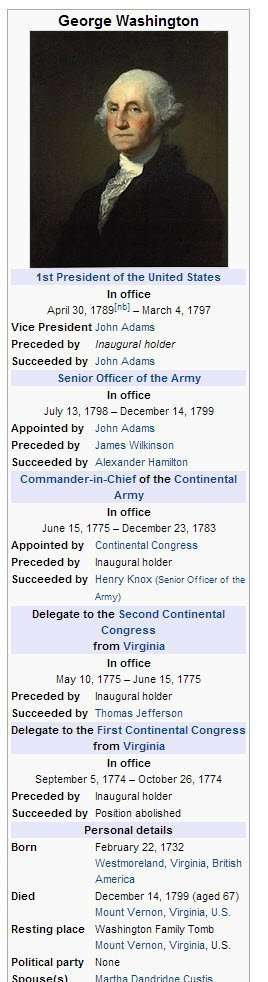

There are several patents from Google, both granted patents and pending patent applications, that describe ways that Google might learn about entities and about facts associated with those by extracting knowledge base facts from the web instead of relying upon people submitting information to knowledge bases such as Freebase.

We saw Google show off how they could replace their Knowledge Base with a Knowledge Vault, and that would bring a whole new set of extraction approaches with it that have high levels of confidence with them as to how accurate they might be.

It’s hard to tell exactly which approaches Google might be relying upon, and which ones that Google might have introduced through something like a patent that is no longer being used. But, it doesn’t hurt to learn some of the history and some of the approaches that might have been used in the past.

I’m blogging about a patent today that describes an approach that many of us have assumed that Google has been using for years to identify objects or entities and attributes about those and the values that fit those attributes.

## Contextual Patterns – Titles and Infoboxes

Many sites follow certain practices that help make it easy to learn about knowledge base facts from them. One example is Wikipedia, which tends to follow a specific pattern in how they title pages. For example, the template that Wikipedia pages are based upon using a pattern for titles such as:

## [SUBJECT]–Wikipedia, the free encyclopedia,

There is a structure to these pages that make it easy to learn what they care about, which happens to fit what their titles say they are about. Wikipedia isn’t the only site like this, and you can see other sites doing something very similar. This kind of pattern makes extracting facts from this site easy to do.

Here is the title for the George Washington page at Wikipedia:

*George Washington – Wikipedia, the free encyclopedia*

On Wikipedia **“Disambiguation”** page, some other people with similar names are linked to and the titles for those pages follow a similar pattern. Having a Wikipedia disambiguation page helps Google tell entities apart when there might be confusion regarding who they are. Here are some titles for the other pages (and entities):

*George Corbin Washington – Wikipedia, the free encyclopedia George Washington Carver – Wikipedia, the free encyclopedia George Washington (inventor) – Wikipedia, the free encyclopedia George Washington (Washington pioneer) – Wikipedia, the free encyclopedia George T. Washington (Liberia) – Wikipedia, the free encyclopedia George Thomas Washington – Wikipedia, the free encyclopedia George Washington (baseball) – Wikipedia, the free encyclopedia*

Wikipedia pages often have tables or info boxes that contain attributes related to the objects they are about, which consist of a specific label and a value. Here’s the one for George Washington:

Here’s the patent

[Learning objects and facts from documents](http://patft.uspto.gov/netacgi/nph-Parser?Sect1=PTO2&Sect2=HITOFF&p=1&u=%2Fnetahtml%2FPTO%2Fsearch-adv.htm&r=1&f=G&l=50&d=PALL&S1=08812435&OS=PN/08812435&RS=PN/08812435)
Invented by Shubin Zhao
Assigned to Google
US Patent 8,812,435
Granted August 19, 2014
Filed November 16, 2007

Abstract

> A system, method, and computer program product for learning objects and facts from documents. A source object and a source document are selected and a title pattern and a contextual pattern are identified based on the source object and the source document. A set of documents matching the title pattern and the contextual pattern are selected.
>
> For each document in the selected set, a name and one or more facts are identified by applying the title pattern and the contextual pattern to the document. Objects are identified or created based on the identified names and associated with the identified facts.

## Components and Terms Used in this Knowledge Base Facts Process

***Importers*** – Information from the Wikipedia (and other pages) are grabbed by an importer for reading the content of pages, and extracting facts from them while determining the subjects (entity or entities) they cover, and extracting facts into “individual items of data.

***Janitors*** – Several different types of janitors may perform a different function, but all act to process facts extracted by the importer, including data cleansing, object merging, and fact induction. Correcting spelling and grammar, translation, normalizing formats, removing duplicate facts, removing unwanted facts, and so on are within the tasks that different janitors perform.

***Build engine*** – Builds and manages the repository.

***Service engine*** – an interface for querying the repository. It processes queries, scores matching objects, and returns them to searchers asking for the information.

***Fact repository*** stores factual information about entities. Each Entity, or Object, real-world or fictional person, place, or thing). associates each fact with exactly one object. Any number of facts may be associated with an individual object by including the object ID for that object in the facts.

***Attributes and Values*** Facts associated with specific entities may include specific fact types of values associated with them. For George Washington, we have a “Date of Birth” attribute, and value of “Feb. 22, 1732.”

***Tuples*** – The data structure of a fact might be represented by a tuple of information that includes a fact ID, an attribute, a value, and an object ID. It may include more information, such as a source of the fact on the Web, a language that it is stored in, and more.

## Knowledge Base Facts Metrics

The patent tells us that a couple of metrics, or indications of the quality of the facts, might also be associated and included with a fact. These include both a confidence level and an importance level. The confidence level indicates how likely it is that a fact is true, and the importance level tells how important the fact is to the object, or “how vital a fact is to an understanding of the entity associated with the object.

A Fact includes a list of sources that include the fact and from which where it was extracted, in URL, or Web address, or any other appropriate form of identification and/or location, such as a unique document identifier.

Also, the information associated with the fact may include the agent type of the importer that was extracting facts. So, this agent might be one that only imports facts from Wikipedia or the IMDB or some other site that may be used as a source of facts:

> The facts illustrated in FIG. 2(d) include an agent field that identifies the importer that extracted the fact. For example, the importer may be a specialized importer that extracts facts from a specific source (e.g., the pages of a particular web site, or family of web sites) or type of source (e.g., web pages that present factual information in tabular form), or an importer that extracts facts from free text in documents throughout the Web, and so forth.

## Knowledge Base Facts Include Name Facts and Propery Facts

These are more specialized facts, with a name fact being one that conveys a name for the entity. For example name facts for the United States Patent and Trademark Office might be “PTO” and “USPTO” as well as the official name, “United States Patent and Trademark Office.” One might be designated as a primary name with the others a secondary name. They may also be called [synonymous names of the object](https://www.seobythesea.com/2014/06/synonyms-for-entities/).

Property facts generally provide summary information about an object, such as “Bill Clinton was the 42nd President of the United States from 1993 to 2001.”

Objects may also have additional special facts aside from name facts and property facts, such as facts conveying a type or category (for example, person, place, movie, actor, organization, etc.) for categorizing the entity associated with the object. In [Identifying Entity Types and the Transfiguration of Search @Google](https://www.seobythesea.com/2014/08/identifying-entity-types-transfiguraton-search-google/), I showed how Google might identify what type of entity and entity might be based upon the range of fact available for it. An actor might have facts about movies acted in, Television shows performed in, Plays appearing within the cast of. An athlete might be of a type that includes facts for statistic records for performing a certain type of sport and other facts that tend to fit that type.

## Knowledge Base Facts Take aways

Google will give priority to documents from reputable websites, such as that of the Encyclopedia Britannica Online when selecting a source document.

Of, if a certain type of fact is wanted for a display in some time like a knowledge panel (this example does not appear in the patent), the search engine might search for the entity and words representing the fact. It may attempt to find information using criteria such as “whether the object name matches document titles and whether the rest of the search terms match document contents.”

I will be writing about some other patents that were called “related” patents by the USPTO, and some of the concepts I cover will be similar.

I’ve written a few posts about named entities. These are some that I wanted to share:

- [Do You Have a Named Entity Strategy for Marketing Your Web Site?](https://www.seobythesea.com/2013/12/named-entity-strategy/)
- [How I Came to Love Entities and Start Doing Entity Optimization](https://www.seobythesea.com/2014/10/came-love-entities/)
- [How Google Uses Named Entity Disambiguation for Entities with the Same Names](https://www.seobythesea.com/2015/09/disambiguate-entities-in-queries-and-pages/)
- [How Named Entities Connected to Trending Topics can be used to Address Real Time Search Results](https://www.seobythesea.com/2015/03/how-named-entities-connected-to-trending-topics-can-be-used-to-address-real-time-search-results/)
- [Not Brands but Entities: The Influence of Named Entities on Google and Yahoo Search Results](https://www.seobythesea.com/2010/08/not-brands-but-entities-the-influence-of-named-entities-on-google-and-yahoo-search-results/)
- [How Knowledge Base Entities can be Used in Searches](https://www.seobythesea.com/2014/07/knowledge-base-entities-used-in-searches/)
- [Finding Entity Names in Google’s Knowledge Graph](https://www.seobythesea.com/2014/06/entity-names-in-google/)
- [Google Gets Smarter with Named Entities: Acquires MetaWeb](https://www.seobythesea.com/2010/07/google-gets-smarter-with-named-entities-acquires-metaweb/)
- [Entity Associations with Websites and Related Entities](https://www.seobythesea.com/2014/01/entity-associations-websites-related-entities/)
- [How Google Might Identify Entity Synonyms Using Anchor Text](https://www.seobythesea.com/2014/06/synonyms-for-entities/)
- [Extracting Facts for Entities from Sources such as Wikipedia Titles and Infoboxes](https://www.seobythesea.com/2014/08/extracting-facts-for-entities-from-sources/)
- [Extracting Semantic Classes and Corresponding Instances from Web Pages and Query Logs](https://www.seobythesea.com/2014/09/extracting-semantic-classes-instances-from-web-pages-query-logs/)
- [How Google May Identify Main Entities](https://www.seobythesea.com/2015/04/how-google-may-identify-central-entities-from-resources/)
- [How Google’s Knowledge Graph Updates Itself by Answering Questions](https://www.seobythesea.com/2018/10/how-googles-knowledge-graph-updates-itself-by-answering-questions/)

Last Updated June 26, 2019.
