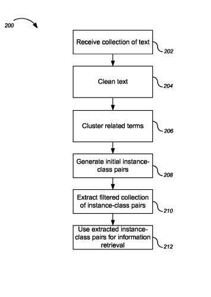
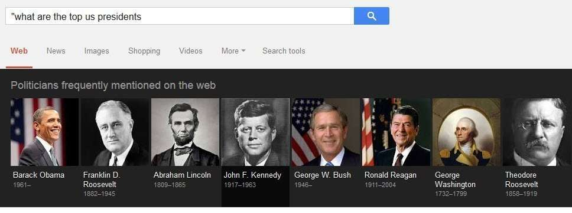

In creating a knowledge base, there seem to be several approaches that can be used to supply entities and facts from sources like web pages and query logs.

In my last post, I wrote about how search queries might be used, along with linguistic patterns, to extract attributes about facts [from those search queries](https://www.seobythesea.com/2014/09/missing-incorrect-data-knowledge-graph/), as described in a patent titled Inferring attributes from search queries.

A Microsoft paper from 2009, [Named Entity Recognition in Query](https://www.cse.iitb.ac.in/~soumen/doc/www2013/QirWoo/GuoXCL2009nerq.pdf), tells of a manual analysis they performed of 1,000 queries, and told us that 70% of those queries contained named entities.

So entities do appear in queries, and Google receives a lot of queries a day (as does Microsoft and Yahoo).

A patent from Google granted last year from the same authors as the patent on extracting entities and data about them in queries, Marius Pasca and Benjamin Van Durme, describes how Google might be mining text for semantic classes and instances of objects (entities) from the text. When the patent says text, they mean (in this instance) of collections of web pages and query logs.

The patent uses the language “classes” and “instances”, and it’s important knowing what it means by those words. A [class](http://www.w3.org/TR/swbp-classes-as-values/) is a type of property value for objects, such as “presidents” or “stamps” or “cities”. An instance is either a one time example of an entity from one of those classes such as “George Washington,” or the “Inverted Jenny” stamp or “Princeton”, or a subclass of class, so lions are a subclass of animals.

This patent describes ways to extract semantic classes and corresponding instances from a collection of text.

It could start finding semantic classes by:

- Receiving a collection of text (web pages and query logs)
- Identifying an initial collection of instance-class pairs for the collection of text (the actual extraction process)
- Clustering a collection of semantically similar phrases using the collection of text (finding “like” pairs, so that they can be counted)
- Generating an extracted collection of instance-class pairs using the initial collection of instance-class pairs and the semantically similar phrase clusters; and
- Storing the extracted collection of instance-class pairs for use in information retrieval

These features described on the patent might be optional steps:

> - Generating the extracted collection of instance-class pairs further includes identifying a class of the initial collection of instance-class pairs that label at least one instance in a cluster of the semantically similar phrase clusters
> - Determining whether a threshold number of instances paired with the class are found within the cluster
> - Determining whether a threshold number of clusters of the semantically similar phrase clusters includes at least one instance of the class
> - When both the threshold number of instances and the threshold number of clusters are satisfied, identifying each instance in the cluster paired with the class as instances of the class

I was happy to see “thresholds” referred to here, and those are the minimum number of “instances paired with the class” to be found within the cluster for it to be considered an instance worth keeping.

So, if “George Washington” isn’t associated with the class “President” enough times and doesn’t meet that threshold, it might not be seen as worth keeping.

The semantic classes patent is:

[Extracting semantic classes and instances from text](http://patft.uspto.gov/netacgi/nph-Parser?Sect1=PTO2&Sect2=HITOFF&p=1&u=%2Fnetahtml%2FPTO%2Fsearch-adv.htm&r=1&f=G&l=50&d=PALL&S1=08510308&OS=PN/08510308&RS=PN/08510308)
Invented by Marius Pasca and Benjamin Van Durme
Assigned to: Google
US Patent 8,510,308
Granted August 13, 2013
Filed: June 16, 2010

Abstract

> Methods, systems, and apparatus, including computer programs encoded on a computer storage medium, for extracting semantic classes and corresponding instances from a collection of text.
>
> One aspect of the subject matter described in this specification can be embodied in methods that include the actions of:
>
> - Receiving a collection of text
> - Identifying an initial collection of instance-class pairs for the collection of text
> - Clustering a collection of semantically similar phrases using the collection of text
> - Generating, using one or more processors, an extracted collection of instance-class pairs using the initial collection of instance-class pairs and the semantically similar phrase clusters
> - Storing the extracted collection of instance-class pairs for use in information retrieval.

Why would Google do this?

Here’s the answer from the patent in short:

> The collection of class-instance pairs can be used, for example, by an information retrieval system. For example, the information retrieval system can use the collection of extracted instance-class pairs to identify particular Web content in response to a received query.

## Semantic Classes and Local Search Example

If Google Maps is an example of a knowledge base that can be used to answer queries related to businesses at different locations, such as [gas stations in Princeton, New Jersey] this system might include identifying from Web pages and query logs, instances of the class of gas stations in Princeton. When it extracts those, it might then cluster them, much like the way it might cluster information found about different businesses as described in Google’s patent [Method and system for clustering data points](http://patft.uspto.gov/netacgi/nph-Parser?Sect1=PTO2&Sect2=HITOFF&p=1&u=%2Fnetahtml%2FPTO%2Fsearch-adv.htm&r=1&f=G&l=50&d=PALL&S1=08583649&OS=PN/08583649&RS=PN/08583649). Here’s a snippet of the abstract from that:

> Systems and methods for clustering a group of data points based on a measure of similarity between each pair of data points in the group are provided. A pairwise similarity function can be estimated for each pair of data points in the group. A clustering algorithm can be executed to create clusters and associate data points with the clusters using the pairwise similarity function.

## The Semantic Classes Extraction Process

The text collection that might be used could number in the millions of English language Web Documents. (I would suspect that other languages could be used as well.)

An example of an extracted instance-class pair from the patent is “‘George Bush’ as an instance corresponding to the class ‘presidents'”.

We are told that a particular instance can belong to more than one class. So, a person like Ronald Reagan might be a President, an actor, a screen guild president, a businessman, a married man, a father, and even others.

Additionally, each class can include multiple instances such that several instance-class pairs are having the same class but different instances. The class “Person” would possibly be filled with many instances in over a million web pages.

This process might start out by cleaning up web pages, by doing things such as:

- Parsing out HTML tags
- Tokenizing the text
- Splitting the text into sentences
- Tagging parts-of-speech

Parts of speech can be tagged using statistical methods trained over a collection of text.

The patent provides a document presenting an example of speech tagging, in “[TnT–A Statistical Part of Speech Tagger](http://www.coli.uni-saarland.de/~thorsten/tnt/).

Part of speech tags are helpful when searching for particular patterns, like SuchAs-style patterns.

Clusters of semantically related phrases can be built from phrases such as the sentences “Clinton vetoed the bill” and “Bush vetoed the bill,” Both of which suggest Clinton and Bush may be semantically related.

This could be done by looking at matches for phrases and the context of those in prefixes and postfixes, or a specified number of words to the left and the right of a phrase in a sentence:

> Each context becomes an entry in a vector associated with the phrase. The vector captures how the phrase appears in text, along with the associated frequencies of the phrases occurring. The system clusters the phrases based on their vectors to generate clusters of distributionally similar phrases.

So our “vetoed the bill” for Bush and Clinton provides a postfix based upon the context, allowing Bush and Clinton to be clustered semantically.

The post I wrote yesterday provides several other linguistic patterns that could involve extracting objects and attributes about them. Those could similarly be clustered to see if there were enough of them.

The patent provides an example query that this process can help answer with, “what are the top US Presidents?”

I’ve written a few posts about named entities. These are some that I wanted to share:

- [Do You Have a Named Entity Strategy for Marketing Your Web Site?](https://www.seobythesea.com/2013/12/named-entity-strategy/)
- [How I Came to Love Entities and Start Doing Entity Optimization](https://www.seobythesea.com/2014/10/came-love-entities/)
- [How Google Uses Named Entity Disambiguation for Entities with the Same Names](https://www.seobythesea.com/2015/09/disambiguate-entities-in-queries-and-pages/)
- [How Named Entities Connected to Trending Topics can be used to Address Real Time Search Results](https://www.seobythesea.com/2015/03/how-named-entities-connected-to-trending-topics-can-be-used-to-address-real-time-search-results/)
- [Not Brands but Entities: The Influence of Named Entities on Google and Yahoo Search Results](https://www.seobythesea.com/2010/08/not-brands-but-entities-the-influence-of-named-entities-on-google-and-yahoo-search-results/)
- [How Knowledge Base Entities can be Used in Searches](https://www.seobythesea.com/2014/07/knowledge-base-entities-used-in-searches/)
- [Finding Entity Names in Google’s Knowledge Graph](https://www.seobythesea.com/2014/06/entity-names-in-google/)
- [Google Gets Smarter with Named Entities: Acquires MetaWeb](https://www.seobythesea.com/2010/07/google-gets-smarter-with-named-entities-acquires-metaweb/)
- [Entity Associations with Websites and Related Entities](https://www.seobythesea.com/2014/01/entity-associations-websites-related-entities/)
- [How Google Might Identify Entity Synonyms Using Anchor Text](https://www.seobythesea.com/2014/06/synonyms-for-entities/)
- [Extracting Facts for Entities from Sources such as Wikipedia Titles and Infoboxes](https://www.seobythesea.com/2014/08/extracting-facts-for-entities-from-sources/)
- [Extracting Semantic Classes and Corresponding Instances from Web Pages and Query Logs](https://www.seobythesea.com/2014/09/extracting-semantic-classes-instances-from-web-pages-query-logs/)
- [How Google May Identify Main Entities](https://www.seobythesea.com/2015/04/how-google-may-identify-central-entities-from-resources/)
- [How Google’s Knowledge Graph Updates Itself by Answering Questions](https://www.seobythesea.com/2018/10/how-googles-knowledge-graph-updates-itself-by-answering-questions/)

Last Updated June 26, 2019.
