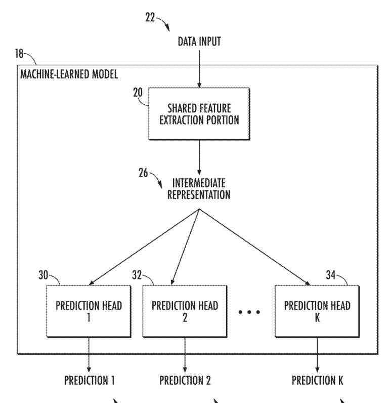
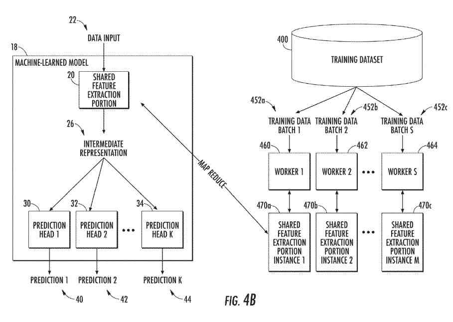

## Machine Learning On Extremely Large Datasets

This Google patent is about a training framework for performing machine learning on Extremely Large Datasets. It is looking like it is focusing on videos on Youtube. LinkedIn Shows Work on vision and video for the inventors of this patent.

The patent relates to the MapReduce-based training framework that exploits data parallelism and model parallelism to enable learning over a vast dataset.

In the last decade, a series of breakthroughs in machine learning and computer vision problems got attributed to the availability of Extremely Large Datasets. As the quality and quantity of datasets increased, so did the sophistication of models and their ability to accomplish more complex, high-level tasks such as:

- Scene understanding
- Pixel-level segmentation
- Depth extraction
- Visual-Question-Answering
- Other image or video understanding tasks

However, for specific data modalities and learning scenarios, the size and number of available training examples can raise significant challenges, including, for example, rendering the use of existing learning techniques computationally infeasible. For instance, a training dataset can contain one hundred million or more training examples in specific scenarios.

If each training example includes a moderate amount of data, it may be infeasible to apply standard learning techniques to learn from such a large volume of data. One example of such a data modality and scenario is attempting to learn from video data at the Internet scale (such as hundreds of millions of example videos).

## In YouTube, The Video Classification Domain

YouTube-8M is currently the most extensive public dataset in the video classification domain, containing over 7 million videos with 4,716 classes. Classifying thousands of high-level video labels across diverse topics, ranging from objects to activities, requires multi-label classification models that can scale both in the number of classes and videos.

With millions of video examples spanning hundreds of thousands of video hours, each training epoch involves billions of frame-by-frame audio-visual features.

Thanks to modern GPUs and custom hardware accelerators, it is becoming less prohibitive to train machine learning models at this scale, including complex models, such as recurrent deep neural networks and frame-by-frame temporal aggregation networks.

Nevertheless, even the most extensive publicly available massive datasets lag far behind the volume of public videos on the Internet. YouTube, for example, reached over 1 billion captioned videos in 2017. In addition, videos are growing unprecedented, with more than 500 hours of video being uploaded to YouTube each minute.

Thus, training massive datasets seeking to approach the Internet-scale are on the order of 100M videos and tens of thousands of classes, or 1000 times larger than most public datasets. Not only is the volume of online videos large, but so is the variety of topics covered by those videos. Annotating videos at that scale and diversity requires the support of a much more extensive vocabulary than those found in public extremely huge.

Thus, the field of video understanding has made great strides in the past several years due to the availability of massive datasets and core advances in image, audio, and video modeling architectures. The state-of-the-art architectures on smaller scale datasets are frequently impractical to deploy at the Internet-scale, both in the ability to train such deep networks on hundreds of millions of videos and deploy them for inference on billions of videos. Therefore, new techniques for handling massive datasets are needed in the art.

## Video Data As A Training Example

Furthermore, while video data is used throughout the present disclosure as an example scenario in which a massive number of training examples are available (and each training example contains a substantial amount of data), other domains of data also fit this profile, These include:

- Audio data
- Image data
- genomic data
- Protein data
- Pharmaceutical data
- Chemical data
- Medical imagery
- Many others

The techniques described herein apply to any scenario in which a training dataset is an enormous dataset due, for example, to the number of training examples contained therein and the amount of data collected in each training example.

## Shared Feature Extraction Point

One example of the present disclosure is directed to a computer-implemented method to perform machine learning. The method includes obtaining, by a computing system includes computing devices, data descriptive of a machine-learned model that consists of a shared feature extraction portion configured to receive and process data input to produce an intermediate feature representation and a plurality of prediction heads that are configured to receive and process the middle feature.

The method includes training iterations by the computing system to train the machine-learned model on a training dataset consisting of a plurality of training examples. Each training iteration consists of the first and second training stages.

The first training stage includes separately training the plurality of prediction heads in parallel on at least a portion of the training dataset.

The second training stage includes individually determining a plurality of updates to the shared feature extraction portion in parallel using a plurality of different batches from the training dataset.

Another example of the present disclosure is directed to a computing system that includes processors and non-transitory computer-readable media.

The non-transitory computer-readable media collectively store a machine-learned video annotation model that includes a feature extraction portion configured to receive and process video frames of an input video to generate an intermediate feature representation and a plurality of classification heads configured to receive and process the intermediate feature representation to create

A plurality of classifications for video frames relative to a majority of classes.

Using MapReduce operations, extraction portions and the plurality of classification heads have been trained.

The non-transitory computer-readable media collectively store instructions that, when executed by processors, cause the computing system to perform operations.

The operations include providing video frames of the input video as an input to the machine-learned video annotation model. The functions include receiving the plurality of classifications for video frames as an output of the machine-learned video annotation model.

Another example aspect of the present disclosure is directed to non-transitory computer-readable media that collectively store instructions that cause processors to perform operations when executed.

The operations include obtaining a set of training data that consists of a plurality of training examples. The functions include getting a machine-learned model that consists of a shared feature extraction portion and a plurality of prediction heads. The operations include performing a plurality of training iterations.

Performing the plurality of training iterations includes alternating between the first and second training stages. The first training stage includes separately training most prediction heads in parallel on the training data set. The second training stage includes individually determining a plurality of updates to the shared feature extraction portion in parallel using a plurality of different batches from the training dataset.

Other aspects of the present disclosure are directed to various systems, apparatuses, non-transitory computer-readable media, user interfaces, and electronic devices.

## The Patent For The Framework For Training Machine-Learned Models On Extremely Large Datasets

[Framework for training machine-learned models on extremely large datasets](https://patft.uspto.gov/netacgi/nph-Parser?Sect1=PTO1&Sect2=HITOFF&d=PALL&p=1&u=%2Fnetahtml%2FPTO%2Fsrchnum.htm&r=1&f=G&l=50&s1=11,295,171.PN.&OS=PN/11,295,171&RS=PN/11,295,171)
Inventors: [Joonseok Balakrishnan Varadarajan](https://research.google/people/105053/), [Ariel Gordon](https://www.linkedin.com/in/arielgordon1/), [Apostol Ivanov Natsev](https://www.linkedin.com/in/ailinkedin/), and [Seong Jae Hwang](https://www.linkedin.com/in/seong-jae-hwang-a7a77292/?originalSubdomain=kr)
Assignee: GOOGLE LLC
US Patent: 11,295,171
Granted: April 5, 2022
Filed: October 18, 2019

Abstract

> A MapReduce-based training framework exploits both data parallelism and model parallelism to scale the training of complex models.
>
> Particular model architectures facilitate and benefit from such a training framework.
>
> A machine-learned model can include a shared feature extraction portion configured to receive and process data input to produce an intermediate feature representation and a plurality of prediction heads configured to receive and process the intermediate feature representation to have a majority of predictions.
>
> For example, the data input can be a video, and the plurality of predictions can be a plurality of classifications for the content of the video (such as relative to a plurality of classes).

## MapReduce-based Training Framework That Exploits Data Parallelism And Model Parallelism To Scale Training Of Complex Models

The present disclosure is also directed to particular model architectures that facilitate and benefit from such a training framework. A machine-learned model can include a shared feature extraction portion configured to receive and process data input to produce an intermediate feature representation and a plurality of prediction heads configured to receive and process the intermediate feature representation to have a majority of predictions. For example, the data input can be a video, and the plurality of projections can be a plurality of classifications for the content of the video (such as relative to a majority of classes).

The proposed training framework can alternate between optimization of the shared feature extraction portion with data parallelism and optimization of the prediction heads with model parallelism. Specifically, a computing system can perform training iterations to train the machine-learned model on a training dataset that comprises a plurality of training examples.

## Training Stages

Each training iteration comprises a first training stage and a second training stage. The first training stage includes separately training the plurality of prediction heads in parallel on the set of training data. The second training stage includes individually determining most updates to the shared feature extraction portion in parallel using a plurality of different batches from the training dataset. Furthermore, the parallel computation aspects of each of the first and the second training stages can be accomplished using MapReduce techniques.

The use of data and model parallelism in this fashion can support large Mixture-of-Experts classifiers with hundreds of thousands of mixtures. The proposed techniques also enable a trade-off between model depth and breadth and shift model capacity between shared (generalization) and per-class (specialization) layers. Example implementations of the proposed framework could reach state-of-the-art performance on massive datasets, YouTube-8M and Sports-1M, and scale to 100 times larger datasets.

The present disclosure provides techniques that enable the training of machine-learned models on massive datasets with a proposed MapReduce-based distributed framework. One example scenario in which the proposed methods have been proven beneficial is the video annotation problem at scale. The proposed techniques enable an example video classification model to scale to millions of videos with hundreds of thousands of classes or classifier mixtures.

## Video Data As A Training Exameple

While video data is used throughout the present disclosure as an example scenario in which a massive number of training examples are available (and each training example contains a substantial amount of data), other domains of data also fit this profile, including audio data, image data, genomic data, protein data, pharmaceutical data, chemical data, medical imagery, and many others.

The techniques described herein apply to any scenario in which a training dataset is an extremely large due, for example, to the number of training examples contained therein and the amount of data collected in each training example. Thus, the architectures and frameworks described herein apply to any problem/domain in which many prediction heads (such as classifiers, annotators, and “experts”) are desired. An extensive training dataset is available.

Aspects of the present disclosure address both prediction quality and scalability simultaneously: building a framework that can support training complex machine-learned models at a web scale. Although it is known that MapReduce is an effective tool for distributed computation at scale, the proposed framework is the first-in-kind application of MapReduce to the problem of large-scale model training, supporting both shared (deep) representation learning and specialized per-class (extensive) mixture modeling.

According to another aspect, the present disclosure provides model architectures that enable the application of the MapReduce-based techniques described herein. For example, a machine-learned model can have a shared feature extraction portion that generates an intermediate feature representation and a plurality of prediction heads that create a majority of predictions based on the intermediate feature representation.

## Data Parallelism

The shared feature extraction portion can be trained while taking advantage of data parallelism. A plurality of workers can determine most updates to the shared feature extraction portion based on a plurality of different batches of the training data. Conversely, the bulk of prediction heads can be trained while taking advantage of model parallelism. Specifically, most workers can separately train most prediction heads in parallel on the same or different portions of the training data set.

One example of the above-described model architecture is a scalable variant of the Deep-Bag-of-Frames (DBoF) model with mixture-of-experts (MoE), one of the top-performing video classification models on YouTube-8M. The model architecture can further apply the Self-Weighted Average Pooling (SWAP) approach for the temporal pooling of frame-level representations.

The present disclosure systems and methods provide several technical effects and benefits. As one example, aspects of the present disclosure enable using many prediction heads (such as a vast number of experts in an MoE scheme). Increasing the number of prediction heads (such as classifiers) that can be used increases the breadth of possible predictions, thereby providing additional opportunities for alternative or insightful predictions.

## Videos Topics On The Web

For example, considering the wide range of video topics on the web, it is essential to train a model capable of classifying multiple labels. When the number of possible classes is large, it is generally desirable to increase the number of experts. However, increasing the number of experts without a scalable training framework becomes impractical due to computational overhead.

For this reason, most previous works have used a small number of (such as <5) experts. However, these few experts can be sub-optimal, depending on the problem and data diversity. To resolve these issues, the proposed framework provides model parallelism to allow training of large MoEs, with hundreds of thousands of mixtures (across all classes), on hundreds of millions of videos.

## Large Scale Optimization

Another benefit of the present disclosure is that it enables large-scale optimization. In general, utilizing a larger mini-batch often equates to superior performance. However, in huge modern datasets, considering even 1% batch size (for example, 80K examples in YouTube-8M) becomes infeasible in ordinary settings. Via data parallelism, the proposed framework allows large-batch optimization such as, for instance, via Resilient Backpropagation (RProp). When the batch size is sufficiently large (such as 50%), this traditional approach becomes worth revisiting for its known robustness involving only a few parameters.

Large-scale learning over a tremendous training dataset results in improved model performance. Example implementations of the techniques described herein have shown state-of-the-art performance in video classification tasks (such as YouTube-8M and Sports-1M datasets). These example experimental results are in Hwang and Lee et al., Large-Scale Training Framework for Video Annotation, KDD ’19 (2019).

## Data Parallelism And Model Parallelism

By leveraging both data parallelism and model parallelism, the proposed framework provides an improved allocation of computing tasks (such as learning operations) among various devices in a distributed computing system, thereby reducing the consumption of computing resources such as processor usage and memory usage, network bandwidth, etc. Stated differently, compared to existing learning techniques for the same large-scale dataset, the proposed framework enables faster training and improved results.

Thus, the present disclosure provides a MapReduce-based training framework designed to train state-of-the-art models (such as video annotation models) on a large scale. The present disclosure also provides algorithmic optimization schemes which were not practical previously. As one example, a large mixture of experts and full-batch fine-tuning (which was not previously practical) can be used to improve a converged model after traditional training to achieve state-of-the-art performance (such as on YouTube-8M and Sports-1M datasets). The proposed framework and model are highly scalable (such as to enable training on 500M videos with over 16K classes).

## A Machine-Learned Model

The machine-learned model includes a shared feature extraction portion and a plurality of prediction heads, illustrated in FIG. 1 as prediction heads. Any number of prediction heads can be included in the model. For example, the number of prediction heads can be 10s of prediction heads, 100s of prediction heads, 1000s of prediction heads, etc. Aspects of the present disclosure enable using a vast number of prediction heads.

The shared feature extraction portion can receive and process data input to produce an intermediate representation. The data input can be any form of data, including audio data, text data, image data, biological data, pharmaceutical data, genomic data, protein data, chemical data, etc. The shared feature extraction portion can be various forms of machine-learned models, including, for example, a multi-layer neural network.

The intermediate representation can be latent, and the medium-term can be an embedding. The medium term can be expressed as a continuous vector.

Each prediction head can receive and process the intermediate representation to produce a respective prediction (such as the head has made a prediction, the director has made a prediction). Each prediction head can be a classifier such that each prediction is a classification of the data input relative to respective classes (es). Each prediction head can be a binary classifier that classifies the data input close to a single category. The individual class(es) among the prediction heads can be overlapping or non-overlapping. In other implementations, each prediction head performs a type other than classification.

## Example Video Annotation Problem

While the systems and methods described herein are broadly applicable to many different data modalities, one example problem demonstrating the proposed approach’s benefits is the video annotation problem. In particular, given a video of T frames with D dimensional preprocessed frame-level features X .di-elect cons. .sup.D.times.T, the goal of the video annotation problem is to predict each of its video-level labels y .di-elect cons. {0,1}.sup.K describing the video content (such as gaming, sports), where K is the number of possible labels.

When a finite number of labels are possible, this problem can get modeled as a multi-label classification such as bag-of-frames) become appropriate for this problem.

## An Example Machine-Learned Video Annotation Model

The model includes the following two components:

1) **Deep-Bag-of-Frames** (DBoF) for aggregating the frame-level features into a video-level feature, and
2) **Mixture-of-Experts** (MoE) for constructing multiple `expert` binary classifiers for each class.

Depict block diagrams of example DBoF architectures according to example embodiments of the present disclosure.

## Example Frame Aggregators

Referring collectively, bag-of-words type models are promising for sequential data such as videos. Analogously treating a set of frame-level features as a “bag-of-frames,” the example model represents a revision of the Deep-Bag-of-Frames (DBoF) models. One example architecture of DBoF can be as follows:

1. **Frame-level Network**: Given a video and its frame-level features (visual and audio) X .di-elect cons. .sup.D.times.T as stated above, a frame-level network transforms each frame-level feature x.sub.j .di-elect cons. .sup.D of frame j into its new representation, typically to a higher dimensional space. The frame-level network can include of the three following networks:

(i) fully-connected layer,
(ii) fully-connected layer with context gating, and
(iii) a fully-connected layer with a residual block.

2. **Frame Pooling**: Then, the embedded representations of the given video are aggregated to a single video-level feature through a frame pooling layer. Specifically, some example implementations of the present disclosure use a Self-Weighted Average Pooling (SWAP) operation for each video which normalizes the pooling frames x.sub.j .di-elect cons. .sup.D for j=1, . . . , T as follows:

In other words, the new video-level pooled feature v is the sum of the frame-level features x.sub. J weighted by their corresponding activations and normalized over time. Other pooling methods (such as average, max, or L.sub.2 pooling) can optionally be used instead.

3. **Video-level Network**: The aggregated pooled feature v goes through another network, embedding the final video-level feature. The video-level network can include context gating.

## Example Mixture-of-Experts Classifier

Once the video-level feature v is derived, K one-vs-all binary classifiers can be trained to estimate the probability p(y.sub.k|v) of each label y.sub.k (for k=1, . . . , K) describing the video v. For each one-vs-all classifier, a Mixture-of-Experts (MoE) model can be used which summarizes the `opinions` p(y.sub.k|v,e) from a set of `experts` e .di-elect cons. .epsilon..sub.y weighted by p(e|v):

As one particular example, a binary logistic regression classifier can be used p(y.sub.k|v,e)=.sigma.(w.sub.e.sup.Tv) (3) for each expert and let p(e|v) be a softmax over |.epsilon..sub.k|+1 experts with a dummy state for the non-existence of the label y.sub.k.

Similar to DBoF, the choice of the classifier is not strictly limited to MoE. MoE has the following benefits: 1) it is a robust classifier among many successful video annotation models, and 2) it can fully take advantage of the proposed framework (such as described in the next section), significantly improving the overall performance scale.

## Example Training Framework

This section first describes the proposed distributed training framework based on MapReduce, enabling parallelism in both model and data. Next, it is shown how the proposed framework applies to example implementations of the DBoF model to perform scalable operations for the large-scale video annotation task.

## Example Alternating Large-Scale Training

A naive implementation of the models is not scalable. As the number of model parameters in the prediction heads or experts grows with the number of prediction heads/experts, backpropagating gradients from the prediction heads/experts to the shared feature extraction portion (such as the video-level network) represents a computational bottleneck.

However, it is desirable to have a large vocabulary set and many experts per classifier in many cases, especially for large-scale data to cover various topics flexibly.

To alleviate this bottleneck, the present disclosure provides an alternating update scheme between the prediction heads (such as the classifier experts) and the shared feature extraction portion (such as the frame aggregator), which updates one while fixing the other. Then, each part can be efficiently updated via model and data parallelism. The training framework contains three stages:

Pre-training stage: Joint Training. The training process can include a pre-training stage. In the pre-training stage, in the shared feature extraction portion (such as frame aggregator), prediction heads (such as MoE classifier) can be jointly trained. A smaller alternative set of prediction heads (such as a small MoE such as .ltoreq.5 experts) can be used instead of the group of prediction heads to speed up the initial pre-training.

The alternative set of prediction heads can be a subset of the complete set of prediction heads or can include different prediction heads than the complete set of prediction heads. The pre-training can include optimization via a mini-batch stochastic method (ADAM) to prevent early overfitting.

This is a “warm-start” stage where the performance is solely based on the model without distributed computation. After the model converges, proceed to Stage 1.

**Stage 1: Prediction Head Training.** The shared feature extraction portion (such as frame aggregator) is fixed and not updated at this step. The pre-training stage’s smaller prediction heads are replaced with a newly initialized set of prediction heads (such as large MoE). Each prediction head is trained in parallel via model parallelism.

## An Example Illustration Of Stage 1 Of The Training Process

The prediction heads are respectively mapped to workers. The number of workers G may equal the number of charges K (such as one worker per head), or the number of workers G may not equal

L the number of heads K (such as at least one worker trains multiple charges). Each worker can train their respective head on training data obtained from the training dataset.

The training data set can be the same for each worker/head (as illustrated), or different batches of training data from the dataset can get used by other workers/heads. The updated prediction heads get reduced back to the model.

**Stage 2: Shared Feature Extraction Portion Fine-tuning.** The prediction heads (such as MoE) are fixed at this stage, and the shared feature extraction portion (such as frame aggregator) is fine-tuned via data parallelism.

One example learning algorithm used at this stage is iRProp.sup.+. Typically, the prediction heads are not fine-tuned, although possible, as the benefit is less substantial.

Provides an example illustration of Stage 2 of the training process. Multiple instances of the shared feature extraction portion are respectively mapped to workers. The number of workers S may equal the number of cases M (such as one worker per instance), or the number of workers S may not equal the number of instances M (such as at least one worker trains multiple instances).

Each worker can train its respective instance of the shared feature extraction portion on a different batch of training data obtained from the training dataset. For example, worker 460 trains instance 470a on training data batch while worker trains instance on training data batch.

Each training data batch can include a unique combination of training examples from the training dataset. The training data batches are overlapping, while in other instances, the training data batches are non-overlapping.

The updates to the shared feature extraction portion instances are reduced back to the model. For example, the updates can be aggregated (such as averaged). Once converged, the process returns to Stage 1.

Stages 1 and 2 can be repeated until convergence. Both the Pre-Training Stage and Stage 2 ensure convergence. Stage 1 also converges quickly despite the retraining of the prediction heads because each prediction head is relatively simple to train (such as each head may be a very simple classifier (essentially a perception)).

In example experiments, small to no performance loss was observed after several epochs. It was observed that retraining the MoE repeatedly after each alternation is more beneficial than continuously training the MoE.

Thus, the proposed training framework leverages MapReduce operations to perform efficient training on a vast dataset. The Map step distributes the pieces to multiple workers who run in parallel. Then, once their jobs are complete, the Reduce step aggregates the results to proceed with the following global operation. This “divide-and-conquer” approach scales well, given many available workers. The proposed framework effectively utilizes MapReduce to perform Steps 1 and 2 efficiently by leveraging the following principles:

1. **Model Parallelism**: As the shared feature extraction portion is fixed in Stage 1, only the prediction heads become trainable. This allows the prediction heads to be trained in parallel, allowing larger sets of prediction heads (such as MoE) to be trainable.

Specifically, the framework Maps the partitioned heads (such as partitioned based on independence/dependence relative to the training data) to the workers and updates their parameters in parallel. It then Reduces them back to a single model thesis scheme that allows prediction heads to scale to the tens of thousands given well-trained feature extraction portions.

2. **Data Parallelism**: In machine learning, samples are often assumed to be independent and identically distributed (i.i.d.), and gradients are computed within a mini-batch of randomly chosen hundreds of models, thinking they can reasonably represent the entire dataset. However, billions of examples make it harder to define the whole dataset unless the mini-batch size can be significantly increased, which is also prohibitive.

The proposed framework allows the gradient computation in parallel (Map) from a larger pool of independent examples and aggregates it (Reduce) with large batch size. Even the full-batch gradient computation with billions of models can be performed.

Given the scalable framework, this section next describes example algorithmic aspects of the example models and training parallelism described above.

## Example Large Mixture-of-Experts

Compared to global classifiers that classify all classes with equally structured classifier models, one key advantage of using a set of local classifiers such as MoE is its ability to train based on the unique characteristics of the class flexibly. Consequently, having more experts becomes especially useful as the number of types gets larger and those classes cover various topics.

However, increasing the number of experts with a large-scale dataset is not trivial. Concerning the DBoF framework, given K possible labels, constructing a DBoF model with MoE of |.epsilon.| binary classifier experts for each tag require K|.epsilon.| experts in total. This quickly becomes problematic with a large-scale dataset having thousands of labels (such as K=4,716 for YouTube-8M) with a moderate intermediate representation size (2,048), resulting in an MoE with approximately 10M.times.|.epsilon.| variables to training.

Fortunately, the weights w.sub.e in Eq. (3) of every expert e .di-elect cons. .epsilon..sub.k for all k=1, . . . , K labels can be trained independently from each other. Thus, as one example, the K classes can be partitioned into M workers to train the experts corresponding to the classes, drastically reducing the training time proportional to the number of available workers in O(|.epsilon.|K/M) in the case where, for example, the classes are evenly distributed to the workers.

## Example Adaptive Mixture-of-Experts

Many experts can serve the classes with a different number of positive examples. That is, labels with a small number of models require fewer experts to avoid overfitting or reduce unnecessary experts. To alleviate this, for each label y.sub.k, the maximum number of experts can be bounded to be |.epsilon..sub.max|. The adjusted number of experts |.epsilon..sub.k| can be determined based on the number of positive examples in the dataset as follows:

## Example Full-Batch Fine-Tuning

Previous works have acknowledged the value of ample batch training for faster convergence but could not further increase the mini-batch size (i.e., 32K) under practical limitations. Given the efficient data parallelism with the proposed scalable framework, however, the extensive batch optimization can be strategically applied as follows.

First, the model can be trained with a standard mini-batch solver (such as the Pre-Training Stage described above) to obtain fast initial training while minimizing early overfitting, which is more detrimental. This is a safe and secure approach, as demonstrated by other DBoF models.

The model becomes sensitive to further updates upon convergence. This means robustness is the key to effective fine-tuning. Thus, the model can be further fine-tuned with a robust full-batch optimization such as, for example, the Improved Resilient Backpropagation (RProp) called iRProp.sup.+.

This traditional full-batch optimization method can be used for its robustness with very few parameters and performance competitive to even second-order methods. Briefly, the full-batch gradient is computed by summing over the angle concerning every training example in the entire training dataset. Then, depending on the gradient direction compared to the previous iteration, the learning rate of each weight changes.
