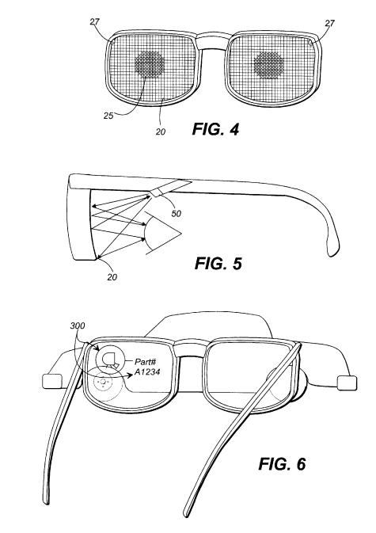

On Friday afternoon, I took a walk to the auto repair shop working on my car, about a mile and a half down the road. A phone alert made me aware of a Google Now card springing up to give me directions to the shop, and telling me that it would take me less than a minute to get there. I guess Google Now wasn’t looking at the accelerometer on my phone, or it would have realized that I was moving too slowly to be driving. I couldn’t help but think though how Google Now could be a feature that would work well in the heads up display that Google’s working on under the name Google Glass.

As we wait to see what kinds of features might be incorporated into Google Glass, it appears that Google acquired an eye scan security patent first filed a dozen years ago, granted in 2006, and recorded at the USPTO on Thursday. The patent was originally filed by Agilent Technologies, transferred to a company in Singapore in 2006, and then to Intellectual Discovery Co., located in South Korean. Google was assigned the patent on November 16, 2012, and the transaction was recorded at the USTPO on January 8, 2013.

There are two different aspects to the device described within the patent. The first is an optical scanning unit that can be used for imaging different aspects of a wearer’s eyes to capture identification information, as an eye scan security featured, The second aspect of these glasses is as a personal viewing device that enables wearers to see overlay images from a connected computer system, augmenting what a viewer sees.

For example, someone looking through these lenses at an automobile or aircraft might see a part number of a part they might be viewing. The patent tells us that it could be used in other fields as well, such as those in surgical or medical environments, as well as in “virtual reality systems.”

The security aspects of this system might be required as security to allow a person to be authorized to use this viewing system, without having to enter a password.

The patent is:

[Personal viewing device with system for providing identification information to a connected system](http://patft.uspto.gov/netacgi/nph-Parser?Sect1=PTO1&Sect2=HITOFF&d=PALL&p=1&u=%2Fnetahtml%2FPTO%2Fsrchnum.htm&r=1&f=G&l=50&s1=6735328.PN.&OS=PN/6735328&RS=PN/6735328)
Invented by Rene P. Helbing, Richard C. Walker, Pierre Mertz, Barry Bronson, and Ken A. Nishimura
Assigned to Agilent Technologies, Inc.
US Patent 6,735,328
Granted May 11, 2004
Filed: March 7, 2000

Abstract

> A personal display system having an ocular scan unit for generating user identification information and an interface for conveying user identification to a connected system.

Developer versions of Google Glass have been announced to be available for developers in 2013.

The ability to look at the world around us, and see related information to things like part numbers for vehicles sounds like something out of the Terminator movies, and was something I was expecting to be a feature of Google’s augmented reality glasses. It shouldn’t be a surprise that Google is looking for older patents that might cover aspects of augmented reality glasses that might be incorporated into the devices.

One [competitor for Google Glass](https://www.technologyreview.com/2013/01/10/180565/hands-on-with-the-vuzix-m100-a-google-glass-competitor/) was unveiled at the recent CES conference this past week. It’s likely there will be a number more.
