*Added 2-26-2010 – Two more pending patent applications assigned to Facebook were published yesterday, and one of Facebook’s pending patent applications was granted earlier this week. I’ve added the patent applications, and moved the granted patent on “Dynamically providing newsfeeds” from the list of pending patent filings to the list of granted patents at the bottom of the post.*

In addition, Facebook was assigned 9 granted patents from Hewlett-Packard Company, recorded at the USPTO on February 15, 2010, and was assigned a previously published patent application on February 11, 2010. Thanks to @TwiterHero for pointing out these additional patent assignments to me.

The last time I wrote about Facebook’s intellectual property was in a post from August of 2007 titled [Facebook Timeline and Patent Application](https://www.seobythesea.com/2007/08/facebook-timeline-and-patent-application/). At that time, Facebook only had one patent filing published at the US Patent and Trademark Office, Systems and methods for social mapping, which focused upon how members of the social network requested and confirmed relationships with others.

I thought it was interesting that the patent filing’s focus was on protecting the private information of others given the history of the development of Facebook, and that of its predecessor, the short-lived Facemash.

The number of patent filings assigned to Facebook at the US patent office has ballooned to 34 36 46 published filings, including the assignment of a granted patent from Applied Materials, Inc. in May of 2009. I thought it would be interesting to see what other topics were covered in those patents, and made the following list, which includes information about the inventors, the abstracts from the patent filings, and some images from many of the patent applications.

It’s not a surprise that one of the topics covered in many of the filings involves the privacy of members, but there are a range of other topics covered including community flyers, sponsored polls, relationship announcements, newsfeeds, tagging selected portions of images, creating social timelines, identifying unusual levels of activities amongst members, downloading media and other files, gift giving, translation of text, handling forged web sites, and other aspects of Facebook that we all may take for granted.

I often write about patents related to search engines, and many of those patent filings describe processes that the search engines may or may not be using, including methods that the search engines might be using to determine the rankings of pages and images and videos and other possible results in response to queries that people perform at those search engines. Sometimes those patents clearly describe things that the search engines have started doing, while other times it isn’t as clear.

If you’ve been using Facebook for a while, you may recognize many of the processes described in the patent filings below.

**Patent Applications:**

**1**
[Systems and methods for dynamically generating a privacy summary](http://appft.uspto.gov/netacgi/nph-Parser?Sect1=PTO2&Sect2=HITOFF&u=%2Fnetahtml%2FPTO%2Fsearch-adv.html&r=1&p=1&f=G&l=50&d=PG01&S1=20080046976.PGNR.&OS=dn/20080046976&RS=DN/20080046976) (20080046976)
Invented by: Mark Zuckerberg, Christopher Kelly
Assigned to: Facebook
Filed: July 25, 2006
Published: February 21, 2008

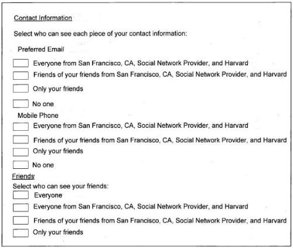

Abstract:

*A system and method for dynamically generating a privacy summary is provided. The present invention provides a system and method for dynamically generating a privacy summary. A profile for a user is generated. One or more privacy setting selections are received from the user associated with the profile.*

The profile associated with the user is updated to incorporate the one or more privacy setting selections. A privacy summary is then generated for the profile based on the one or more privacy setting selections.

**2**
[Systems and methods for dynamically generating segmented community flyers](http://appft.uspto.gov/netacgi/nph-Parser?Sect1=PTO2&Sect2=HITOFF&u=%2Fnetahtml%2FPTO%2Fsearch-adv.html&r=1&p=1&f=G&l=50&d=PG01&S1=20080033739.PGNR.&OS=dn/20080033739&RS=DN/20080033739) (20080033739)
Invented by: Mark Zuckerberg, Aaron Sittig, Wayne Chang
Assigned to: Facebook
Filed: August 02, 2006
Published: February 07, 2008

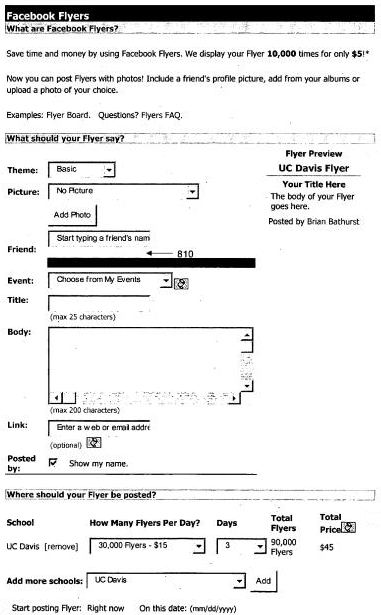

Abstract:

*Segmented community flyers are predicated upon segmented communities. Segmented communities are for those web-based users that appreciate the distinction between their “real life” friends in their local geographic communities and their “cyberspace” contacts, many of whom they have never met in person.*

Further, those web-based users that do appreciate their “real life” friends in their local geographic communities need a way of communicating to many of these “real life” friends at once, without having to spend time preparing and sending multiple emails. Segmented community flyers advantageously accomplish such communication.

**3**
[Systems and methods for generating dynamic relationship-based content personalized for members of a web-based social network](http://appft.uspto.gov/netacgi/nph-Parser?Sect1=PTO2&Sect2=HITOFF&u=%2Fnetahtml%2FPTO%2Fsearch-adv.html&r=1&p=1&f=G&l=50&d=PG01&S1=20080040370.PGNR.&OS=dn/20080040370&RS=DN/20080040370) (20080040370)
Invented by: Andrew Bosworth, Chris Cox, Ruchi Sanghvi, TS Ramakrishnan, Adam D’Angelo
Assigned to: Facebook
Filed: August 11, 2006
Published: February 14, 2008

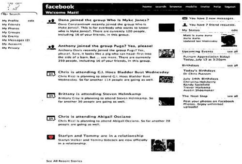

Abstract:

*Systems and methods for generating dynamic relationship-based content personalized for members of a web-based social network are provided. At least one action of one or more members of a web-based social network is associated with relationship data for the one or more members to produce consolidated data.*

One or more elements associated with the consolidated data is identified and used to aggregate the consolidated data. Further exemplary methods comprise weighting by affinity the aggregated consolidated data to generate dynamic relationship-based content personalized for the members of the web-based social network.

**4**
[Systems and methods for providing dynamically selected media content to a user of an electronic device in a social network environment](http://appft.uspto.gov/netacgi/nph-Parser?Sect1=PTO2&Sect2=HITOFF&u=%2Fnetahtml%2FPTO%2Fsearch-adv.html&r=1&p=1&f=G&l=50&d=PG01&S1=20080040474.PGNR.&OS=dn/20080040474&RS=DN/20080040474) (20080040474)
Invented by: Mark Zuckerberg, Andrew Bosworth, Chris Cox, Ruchi Sanghvi, Matt Cahill
Assigned to: Facebook
Filed: August 11, 2006
Published: February 14, 2008

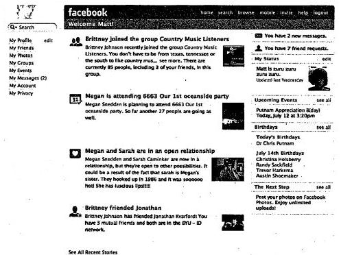

Abstract:

*A system and method provides dynamically selected media content to someone using an electronic device in a social network environment. Items of media content are selected for the user based on his or her relationships with one or more other users. The user’s relationships with other users are reflected in the selected media content and its format.*

An order is assigned to the items of media content, for example, based on their anticipated importance to the user, and the items of media content are displayed to the user in the assigned order. The user may change the order of the items of media content. The user’s interactions with media content available in the social network environment are monitored, and those interactions are used to select additional items of media content for the user.

**5**
[Systems and methods for measuring user affinity in a social network environment](http://appft.uspto.gov/netacgi/nph-Parser?Sect1=PTO2&Sect2=HITOFF&u=%2Fnetahtml%2FPTO%2Fsearch-adv.html&r=1&p=1&f=G&l=50&d=PG01&S1=20080040475.PGNR.&OS=dn/20080040475&RS=DN/20080040475) (20080040475)
Invented by: Andrew Bosworth, Chris Cox
Assigned to: Facebook
Filed: August 11, 2006
Published: February 14, 2008

Abstract:

*A system and method for measuring user affinity in a social network environment is provided. One or more activities performed by a user associated with a social network environment are monitored. A relationship associated with the one or more activities is identified. An affinity for one or more objects associated with the social network environment is then determined based on the one or more activities and the relationship.*

**6**
[System and method for tagging digital media](http://appft.uspto.gov/netacgi/nph-Parser?Sect1=PTO2&Sect2=HITOFF&u=%2Fnetahtml%2FPTO%2Fsearch-adv.html&r=1&p=1&f=G&l=50&d=PG01&S1=20080091723.PGNR.&OS=dn/20080091723&RS=DN/20080091723) (20080091723)
Invented by: Mark Zuckerberg, Aaron Sittig, Scott Marlette
Assigned to: Facebook
Filed: October 11, 2006
Published: April 17, 2008

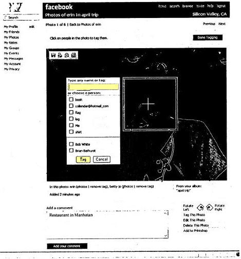

Abstract:

*A method for tagging digital media is described. The method includes selecting a digital media and selecting region within the digital media. The method may further include associating a person or entity with the selected region and sending a notification of the association the person or entity or a different person or entity. The method may further include sending advertising with the notification.*

**7**
[Mapping relationships between members in a social network](http://appft.uspto.gov/netacgi/nph-Parser?Sect1=PTO2&Sect2=HITOFF&u=%2Fnetahtml%2FPTO%2Fsearch-adv.html&r=1&p=1&f=G&l=50&d=PG01&S1=20070192299.PGNR.&OS=dn/20070192299&RS=DN/20070192299) (20070192299)
Invented by: Mark Zuckerberg, Aaron Sittig
Assigned to: Facebook
Filed: December 14, 2006
Published: August 16, 2007

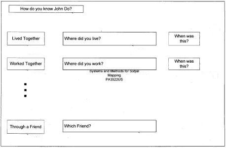

Abstract:

*A system, method, and computer program for social mapping is provided. Data about a plurality of social network members is received. A first member of the plurality of social network members is allowed to identify a second member of the plurality of social network members with whom the first member wishes to establish a relationship.*

The data is then sent to the second member about the first member based on the identification. Input from the second member is received in response to the data. The relationship between the first member and the second member is confirmed based on the input in order to map the first member to the second member.

**8**
[Systems and methods for generating a social timeline](http://appft.uspto.gov/netacgi/nph-Parser?Sect1=PTO2&Sect2=HITOFF&u=%2Fnetahtml%2FPTO%2Fsearch-adv.html&r=1&p=1&f=G&l=50&d=PG01&S1=20070214141.PGNR.&OS=dn/20070214141&RS=DN/20070214141) (20070214141)
Invented by: Aaron Sittig, Mark Zuckerberg
Assigned to: Facebook
Filed: December 26, 2006
Published: September 13, 2007

Abstract:

*A system, method, and computer program for generating a social timeline is provided. A plurality of data items associated with at least one relationship between users associated with a social network is received, each data item having an associated time. The data items are ordered according to the at least one relationship. A social timeline is generated according to the ordered data items.*

**9**
[System and method for automatic population of a contact file with contact content and expression content](http://appft.uspto.gov/netacgi/nph-Parser?Sect1=PTO2&Sect2=HITOFF&u=%2Fnetahtml%2FPTO%2Fsearch-adv.html&r=1&p=1&f=G&l=50&d=PG01&S1=20080189292.PGNR.&OS=dn/20080189292&RS=DN/20080189292) (20080189292)
Invented by: Jed Stremel, TS Ramakrishnan, Mark Slee
Assigned to: Facebook
Filed: February 02, 2007
Published: August 07, 2008

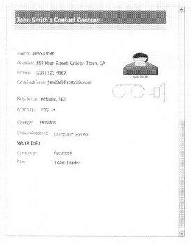

Abstract:

*A system and method for automatically populating a contact file with contact content and expression content are provided. An identifier is received on a device that is used to query a server in communication with a web-based social network database. According to one embodiment, contact content automatically populates a contact file on the device with contact content from the web-based social network database, including expression content. When the contact content on the web-based social network database changes, the contact file on the device is automatically updated with the updated contact content.*

As a result, the need to manually populate contact files by using a keyboard or similar data entry device is avoided. Additionally, typographical errors are reduced or eliminated by automatically populating the contact file. A further exemplary system includes the device receiving an identifier in the form of caller identification or caller ID from a second device, which may be used to trigger the display of contact content from the contact file and/or the requesting of contact content by the contact content request module.

**10**
[System and method for curtailing objectionable behavior in a web-based social network](http://appft.uspto.gov/netacgi/nph-Parser?Sect1=PTO2&Sect2=HITOFF&u=%2Fnetahtml%2FPTO%2Fsearch-adv.html&r=1&p=1&f=G&l=50&d=PG01&S1=20080189380.PGNR.&OS=dn/20080189380&RS=DN/20080189380) (20080189380)
Invented by: Andrew Bosworth, Scott Marlette, Chris Putnam, Akhil Wable
Assigned to: Facebook
Filed: February 02, 2007
Published: August 07, 2008

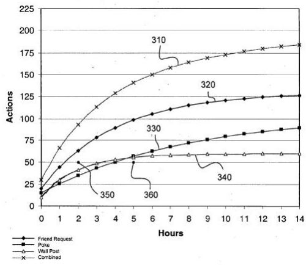

Abstract:

*A system and method for curtailing objectionable behavior in a web-based social network is disclosed. The method includes monitoring various actions of users of a web-based social network for objectionable behavior. The monitored actions are those that affect other users of the social network. A policy is determined based on behaviors of users.*

The policy may be violated by a user if the user exceeds a policy threshold. Some monitored actions include the poking, friend requesting, and wall posting. A policy may be violated by multiple occurrences of a single type of action or by a combination of different types of actions. Upon a policy violation, a warning may be issued to the user or the user’s account may be suspended.

**11**
[Digital file distribution in a social network system](http://appft.uspto.gov/netacgi/nph-Parser?Sect1=PTO2&Sect2=HITOFF&u=%2Fnetahtml%2FPTO%2Fsearch-adv.html&r=1&p=1&f=G&l=50&d=PG01&S1=20080189395.PGNR.&OS=dn/20080189395&RS=DN/20080189395) (20080189395)
Invented by: Jed Stremel, TS Ramakrishnan, Mark Slee
Assigned to: Facebook
Filed: February 02, 2007
Published: August 07, 2008

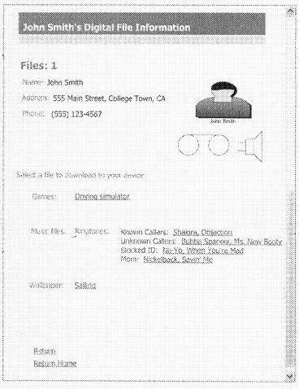
facebook-patents-10.jpg width=”368″ height=”478″

Abstract:

*Systems and methods for obtaining a digital file similar to one used by a device associated with a member of a social network are provided. Digital file information about the digital file is stored on a web-based social network database. The digital file may be located on the same server as the web-based social network database or a third party server such as a mobile phone carrier.*

A user of the web-based social network database requesting the digital file may require a different format of the digital file than that used by the device of the member. If a different format is requested by the user, a server finds or converts the digital file to be compatible for use by a device specified by the user.

**12**
[System and method for determining a trust level in a social network environment](http://appft.uspto.gov/netacgi/nph-Parser?Sect1=PTO2&Sect2=HITOFF&u=%2Fnetahtml%2FPTO%2Fsearch-adv.html&r=1&p=1&f=G&l=50&d=PG01&S1=20080189768.PGNR.&OS=dn/20080189768&RS=DN/20080189768) (20080189768)
Invented by: Ezra Callahan, Aditya Agarwal, Charlie Cheever, Chris Puntnam, Bob Trahan
Assigned to: Facebook
Filed: February 02, 2007
Published: August 07, 2008

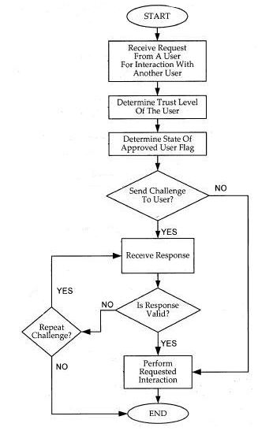

Abstract:

*A system and method for determining a trust level for a non-approved user in a social network is described. The method includes monitoring requests for social network interactions between an approved user and the non-approved user and determining if each interaction requested is of a first type or a second type. The method further includes increasing a first trust value when the interaction requested is of the first type and increasing a second trust value when the interaction requested is of the second type.*

The method further includes determining the trust level based on the first trust value and the second trust value. The method further includes changing the status of the non-approved user to an approved user based on the trust level, the first trust value and/or the second trust value.

**13**
[System and method for confirming an association in a web-based social network](http://appft.uspto.gov/netacgi/nph-Parser?Sect1=PTO2&Sect2=HITOFF&u=%2Fnetahtml%2FPTO%2Fsearch-adv.html&r=1&p=1&f=G&l=50&d=PG01&S1=20080235353.PGNR.&OS=dn/20080235353&RS=DN/20080235353) (20080235353)
Invented by: Charlie Cheever, Chris Putnam, Aditya Agarwal, Ezra Callahan, Bob Trahan
Assigned to: Facebook
Filed: March 23, 2007
Published: September 25, 2008

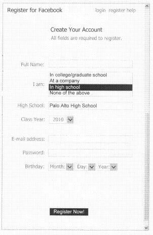

Abstract:

*A method for confirming a request for an association with an organization by a user of a web-based social network is disclosed. In one embodiment, the request includes an e-mail address not controlled by the organization. The request may also be part of an application for membership with the web-based social network.*

A determination is made whether the request is accepted based at least partially on a specified number of prior requests for association with the organization or being identified as a member of the organization by another user already a member of the organization.

The organization may be a high school, a college, a university, a business, a non-profit company, or any other group of people who may desire to associate with each other.

**14**
[System and method for giving gifts and displaying assets in a social network environment](http://appft.uspto.gov/netacgi/nph-Parser?Sect1=PTO2&Sect2=HITOFF&u=%2Fnetahtml%2FPTO%2Fsearch-adv.html&r=1&p=1&f=G&l=50&d=PG01&S1=20080189188.PGNR.&OS=dn/20080189188&RS=DN/20080189188) (20080189188)
Invented by: Jared Morgenstern
Assigned to: Facebook
Filed: April 27, 2007
Published: August 07, 2008

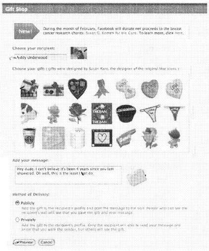

Abstract:

*A system and method is described for giving gifts via a social network and displaying icons representing assets that have been acquired via the social network. In various embodiments, the assets include real assets, digital assets, and virtual assets. Digital assets that have been acquired via the social network environment may also be displayed. In some embodiments, the assets are received as gifts or in trade from another user of the social network environment.*

**15**
[Web-based social network badges](http://appft.uspto.gov/netacgi/nph-Parser?Sect1=PTO2&Sect2=HITOFF&u=%2Fnetahtml%2FPTO%2Fsearch-adv.html&r=1&p=1&f=G&l=50&d=PG01&S1=20090049070.PGNR.&OS=dn/20090049070&RS=DN/20090049070) (20090049070)
Invented by: Arieh Steinberg
Assigned to: Facebook
Filed: August 15, 2007
Published: February 19, 2009

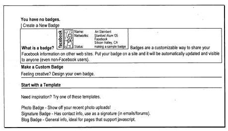

Abstract:

*Web-based social network badges according to various exemplary embodiments are customizable displays which allow computer users who are members of a web-based social network to share personal information on various third-party web sites. A template is used for selecting user information from a profile on the social network to appear on the badge.*

A dynamic script accesses and renders the selected user information on the badge, and a URL is used to embed the badge as an image-based display on the third-party web site. The badge is dynamically updated when a user updates the user information. Additonally, the badge on the third-party web site includes a link to the profile stored on the server for the web-based social network.

**16**
[Platform for providing a social context to software applications](http://appft.uspto.gov/netacgi/nph-Parser?Sect1=PTO2&Sect2=HITOFF&u=%2Fnetahtml%2FPTO%2Fsearch-adv.html&r=1&p=1&f=G&l=50&d=PG01&S1=20090049525.PGNR.&OS=dn/20090049525&RS=DN/20090049525) (20090049525)
Invented by: Adam D’Angelo, Dave Fetterman, Charlie Cheever, Ari Steinberg, Eric Zamore, James Wang, Julie Zhuo, Dave Morin, Mark Slee, Ruchi Sanghvi
Assigned to: Facebook
Filed: August 15, 2007
Published: February 19, 2009

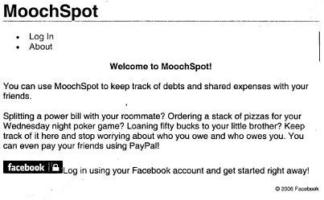

Abstract:

*The present invention provides a system and method for providing a social context to software applications. According to one embodiment of the invention, a user of a social network authorizes access by an external software application to information available in the social network. At some time later, the user of the social network uses an application designed by a third-party software developer.*

The application contacts the social network provider for permission to access the information available in the social network. If access has been authorized, the application incorporates the information from the social network into its interaction with the user, providing a social context to the user’s interaction with the application.

**17**
[Systems and methods for keyword selection in a web-based social network](http://appft.uspto.gov/netacgi/nph-Parser?Sect1=PTO2&Sect2=HITOFF&u=%2Fnetahtml%2FPTO%2Fsearch-adv.html&r=1&p=1&f=G&l=50&d=PG01&S1=20090049036.PGNR.&OS=dn/20090049036&RS=DN/20090049036) (20090049036)
Invented by: Yun-Fang Juan, Kang-Xing Jin
Assigned to: Facebook
Filed: August 16, 2007
Published: February 19, 2009

Abstract:

*A system and method for selecting a subset of keywords from a set of master keywords found in user profiles in a social network is disclosed. The method includes selecting a first and second group of user profiles including one or more keywords and computing the number of occurrences of each of the master keywords in the first and second group of profiles.*

A value may be computed for each of the master keywords based on a comparison of the number of occurrences in the first group of profiles and the number of occurrences in the second group of profiles. The computed value may be used for selecting the subset of keywords from the master keywords and/or ranking the master keywords.

**18**
[System and method for invitation targeting in a web-based social network](http://appft.uspto.gov/netacgi/nph-Parser?Sect1=PTO2&Sect2=HITOFF&u=%2Fnetahtml%2FPTO%2Fsearch-adv.html&r=1&p=1&f=G&l=50&d=PG01&S1=20090049127.PGNR.&OS=dn/20090049127&RS=DN/20090049127) (20090049127)
Invented by: Yun-Fang Juan, Kang-Xing Jin
Assigned to: Facebook
Filed: August 16, 2007
Published: February 19, 2009

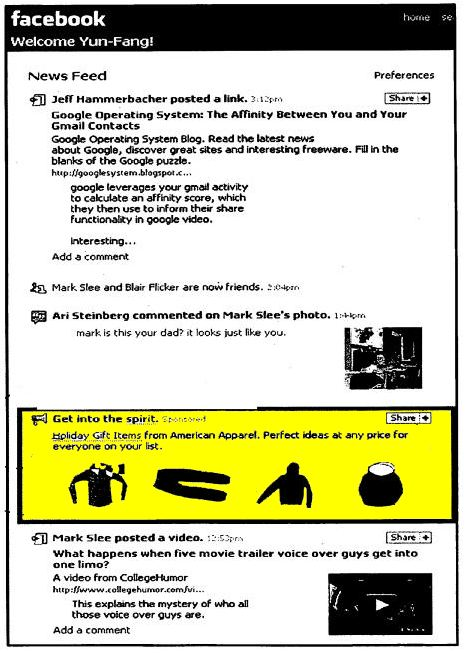

Abstract:

*A system and method for selecting users of a web-based social network who are likely to respond to an invitation, each of the users having associated profile information is disclosed. The method includes selecting pilot users and a reduced set of keywords from the profile information. The method further includes sending the invitation to the pilot users, receiving responses from the pilot users, and classifying the responses as either positive or negative.*

A training set of vector pairs is created each vector pair representing a pilot user and including data representing a classified response and training keywords selected from the reduced set of keywords and associated profile information for the pilot user. A function is determined based on the vectors and used to calculate a likelihood that each of one or more users of the web based social network will respond to the invitation.

**19**
[System and method for collectively giving gifts in a social network environment](http://appft.uspto.gov/netacgi/nph-Parser?Sect1=PTO2&Sect2=HITOFF&u=%2Fnetahtml%2FPTO%2Fsearch-adv.html&r=1&p=1&f=G&l=50&d=PG01&S1=20080189189.PGNR.&OS=dn/20080189189&RS=DN/20080189189) (20080189189)
Invented by: Jared Morgenstern
Assigned to: Facebook
Filed: September 05, 2007
Published: August 07, 2008

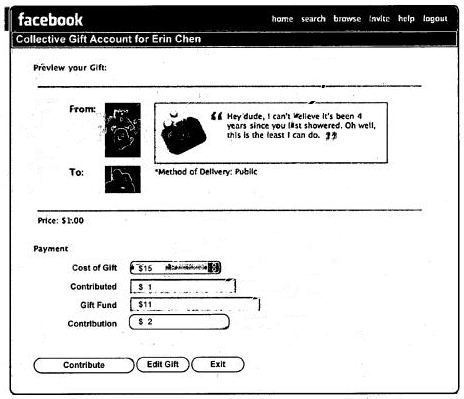

Abstract:

*A method for collectively purchasing a gift in a social network environment is described. A request is received to establish a gift account, a recipient user of the social network environment is designated to receive the gift, and the gift is selected.*

Money is received from a plurality of contributing users for deposit into the gift account, and the selected gift is purchased using the money deposited in the gift account. The purchased gift is then provided to the recipient user.

**20**
[Identification of and Countermeasures Against Forged Websites](http://appft.uspto.gov/netacgi/nph-Parser?Sect1=PTO2&Sect2=HITOFF&u=%2Fnetahtml%2FPTO%2Fsearch-adv.html&r=1&p=1&f=G&l=50&d=PG01&S1=20090228780.PGNR.&OS=dn/20090228780&RS=DN/20090228780) (20090228780)
Invented by: Ryan McGeehan
Assigned to: Facebook
Filed: March 05, 2008
Published: September 10, 2009

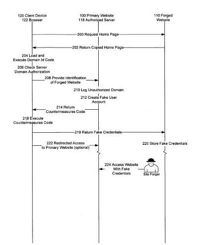

Abstract:

*A system, a method, and computer program product identify a website that is a forgery of a primary website. Client side executable code is included in a page of the primary website, which page is copied in the forged website.*

The client side code, when executed by a client device, determines whether the domain from which the page is served is an authorized domain. Where the serving domain is not authorized, the client device is configured to alter the execute countermeasures against the forged website, such as altering operation of the forged page.

**21**
[Systems and methods for network authentication](http://appft.uspto.gov/netacgi/nph-Parser?Sect1=PTO2&Sect2=HITOFF&u=%2Fnetahtml%2FPTO%2Fsearch-adv.html&r=1&p=1&f=G&l=50&d=PG01&S1=20080313714.PGNR.&OS=dn/20080313714&RS=DN/20080313714) (20080313714)
Invented by: Dave Fetterman, Adam D’Angelo
Assigned to: Facebook
Filed: March 13, 2008
Published: December 18, 2008

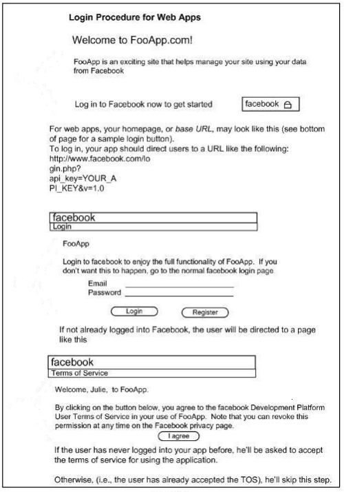

Abstract:

*Exemplary systems and methods for network authentication are provided. Exemplary systems include an application program interface configured for receiving a request for an authentication code, a code generator in communication with the application program interface, the code generator configured to generate the authentication code, and the application program interface further configured to receive the generated authentication code and allow an application to communicate digital data with a web-based social network.*

Further systems include the generated authentication code being received from a network device without an Internet browser and the received generated authentication code allowing an application to communicate digital data with a web-based social network for an extended period of time. Exemplary methods include receiving a request for an authentication code, generating the authentication code, receiving the generated authentication code, and allowing an application to communicate digital data with a web-based social network.

**22**
[Systems and methods for classified advertising in an authenticated web-based social network](http://appft.uspto.gov/netacgi/nph-Parser?Sect1=PTO2&Sect2=HITOFF&u=%2Fnetahtml%2FPTO%2Fsearch-adv.html&r=1&p=1&f=G&l=50&d=PG01&S1=20090048922.PGNR.&OS=dn/20090048922&RS=DN/20090048922) (20090048922)
Invented by: Jared S. Morgenstern, Joshua Pritchard
Assigned to: Facebook
Filed: May 07, 2008
Published: February 19, 2009

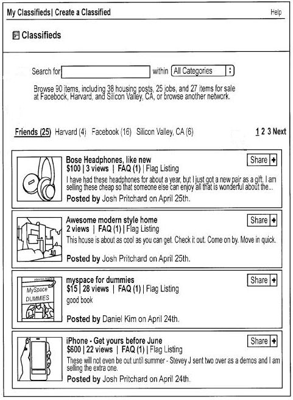

Abstract:

*Exemplary systems and methods are provided for advertising on an authenticated web-based social network. Such methods include providing a screen for creation of a classified advertisement, receiving the classified advertisement from an advertising member, and displaying the classified advertisement on a user network in the authenticated web-based social network with information about a relationship between the advertising member and a member of the authenticated web-based social network viewing the classified advertisement.*

Exemplary systems include an advertising engine configured to generate a screen for creation of a classified advertisement, a communications module configured to receive the classified advertisement from an advertising member, a distributed database configured with a user network and relationship information, and a display module configured to display the classified advertisement on the user network with the relationship information.

**23**
[Personalized platform for accessing internet applications](http://appft.uspto.gov/netacgi/nph-Parser?Sect1=PTO2&Sect2=HITOFF&u=%2Fnetahtml%2FPTO%2Fsearch-adv.html&r=1&p=1&f=G&l=50&d=PG01&S1=20090031301.PGNR.&OS=dn/20090031301&RS=DN/20090031301) (20090031301)
Invented by: Adam D’Angelo, Dave Fetterman, Charlie Cheever, Ari Steinberg, Eric Zamore, James Wang, Julie Zhuo, Dave Morin, Mark Slee, Ruchi Sanghvi
Assigned to: Facebook
Filed: May 23, 2008
Published: January 29, 2009

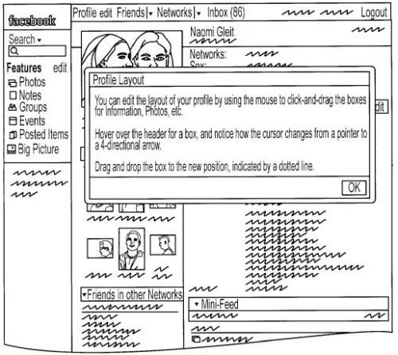

Abstract:

*The present invention provides a system and method for providing a personalized platform for accessing internet applications.*

According to one embodiment of the invention, a social network provider receives a request for installation of an application from a user of the social network, installs the application at multiple points in the user’s social network environment, and personalizes interfaces with the application at these integration points based on information about the user available from the social network. The present invention enables applications to be integrated in the social network environment at multiple integration points and to be personalized for and configured by the user.

**24**
[Systems and methods for providing privacy settings for applications associated with a user profile](http://appft.uspto.gov/netacgi/nph-Parser?Sect1=PTO2&Sect2=HITOFF&u=%2Fnetahtml%2FPTO%2Fsearch-adv.html&r=1&p=1&f=G&l=50&d=PG01&S1=20090013413.PGNR.&OS=dn/20090013413&RS=DN/20090013413) (20090013413)
Invented by: Nico Vera, James Wang, Arieh Steinberg, Chris Kelly, Adam D’Angelo
Assigned to: Facebook
Filed: May 27, 2008
Published: January 08, 2009

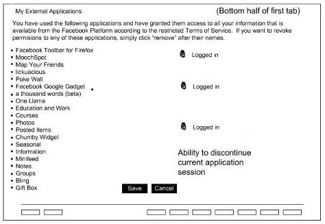

Abstract:

*Systems and methods for providing privacy settings for applications associated with a user profile are provided.*

Exemplary methods include receiving a request from a member of a web-based social network to install an application in association with a member profile, installing the requested application, providing privacy settings selections to control access to data associated with the installed application, receiving a privacy settings selection from the member, and displaying data associated with the application based on the privacy settings selection.

**25**
[System and methods for auction based polling](http://appft.uspto.gov/netacgi/nph-Parser?Sect1=PTO2&Sect2=HITOFF&u=%2Fnetahtml%2FPTO%2Fsearch-adv.html&r=1&p=1&f=G&l=50&d=PG01&S1=20090037277.PGNR.&OS=dn/20090037277&RS=DN/20090037277) (20090037277)
Invented by: Mark Zuckerberg, Adam D’Angelo, Robert Kang-Xing Jin, Timothy Kendall
Assigned to: Facebook
Filed: May 28, 2008
Published: February 05, 2009

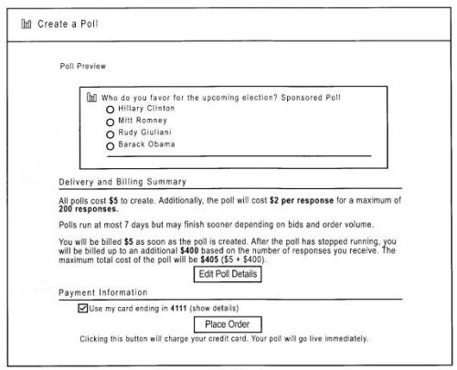

Abstract:

*A system and method for auction based polling is provided. Parameters related to a poll are received from a first user. Parameters related to a poll are received from a first user. A query is associated with the poll. A priority of the poll is determined based on the parameters. The poll is distributed to one or more second users according to the priority. Results to the poll are gathered. The results are reported to the first user.*

**26**
[Providing Personalized Platform Application Content](http://appft.uspto.gov/netacgi/nph-Parser?Sect1=PTO2&Sect2=HITOFF&u=%2Fnetahtml%2FPTO%2Fsearch-adv.html&r=1&p=1&f=G&l=50&d=PG01&S1=20090070412.PGNR.&OS=dn/20090070412&RS=DN/20090070412) (20090070412)
Invented by: Adam D’Angelo, Charlie Cheever, Arieh Steinberg, James Wang, Mark Slee
Assigned to: Facebook
Filed: June 12, 2008
Published: March 12, 2009

Abstract:

*A social networking website maintains a profile for each user of the website. The profile includes data associated with a user, such as a connection to one or more plurality of other users of the social networking website or user preferences. The social networking website communicates with one or more third-party application servers to provide one or more applications to social networking website users.*

When a social networking website user requests an application provided by a third-party application server, the social networking website communicates a subset of the user’s profile to the third-party application server, allowing the third-party application server to use this profile data to personalize the application performed for the user. A privacy settings associated with a user profile allows the social networking website to limit the profile data communicated to the third-party application server.

**27**
[Social Advertisements and Other Informational Messages on a Social Networking Website, and Advertising Model for Same](http://appft.uspto.gov/netacgi/nph-Parser?Sect1=PTO2&Sect2=HITOFF&u=%2Fnetahtml%2FPTO%2Fsearch-adv.html&r=1&p=1&f=G&l=50&d=PG01&S1=20090119167.PGNR.&OS=dn/20090119167&RS=DN/20090119167) (20090119167)
Invented by: Timothy A. Kendall, Matthew R. Cohler, Mark E. Zuckerberg, Yun-Fang Juan, Robert Kang-Xing Jin, Justin M. Rosenstein, Andrew G. Bosworth, Yishan Wong, Adam D’Angleo, Chamath M. Palihapitiya
Assigned to: Facebook
Filed: August 18, 2008
Published: May 07, 2009

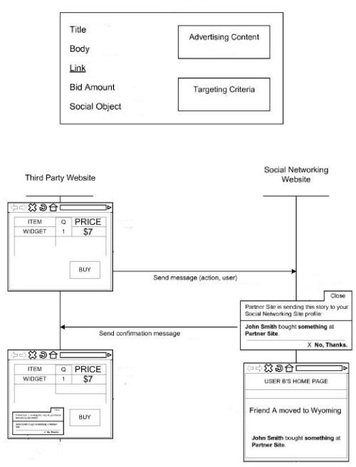

Abstract:

*A social networking website logs information about actions taken by members of the website. For a particular member of the website, the website generates socially relevant ads for the member based on the actions logged for other members on the website to whom the member is connected (i.e., the member’s online friends).*

The advertiser associated with the social ad may compensate the social networking website for publishing the ad on the website. When presenting a member with a social ad, the website may optimize advertising revenue by selecting an ad from the received ads that will maximize the expected value of the social ad. The expected value may be computed according to a function that includes the member’s affinity for the ad content and the bid amount. The technique is also applied for providing socially relevant information off the social networking website.

**28**
[Communicating Information in a Social Networking Website About Activities from Another Domain](http://appft.uspto.gov/netacgi/nph-Parser?Sect1=PTO2&Sect2=HITOFF&u=%2Fnetahtml%2FPTO%2Fsearch-adv.html&r=1&p=1&f=G&l=50&d=PG01&S1=20090182589.PGNR.&OS=dn/20090182589&RS=DN/20090182589) (20090182589)
Invented by: Timothy A. Kendall, Matthew R. Cohler, Mark E. Zuckerberg, Yun-Fang Juan, Robert Kang-Xing Jin, Justin M. Rosenstein, Andrew G. Bosworth, Yishan Wong, Adam D’Angleo, Chamath M. Palihapitiya
Assigned to: Facebook
Filed: August 18, 2008
Published: July 16, 2009

Abstract:

*A social networking website logs information about actions taken by members of the website. For a particular member of the website, the website generates socially relevant ads for the member based on the actions logged for other members on the website to whom the member is connected (i.e., the member’s online friends). The advertiser associated with the social ad may compensate the social networking website for publishing the ad on the website.*

When presenting a member with a social ad, the website may optimize advertising revenue by selecting an ad from the received ads that will maximize the expected value of the social ad. The expected value may be computed according to a function that includes the member’s affinity for the ad content and the bid amount. The technique is also applied for providing socially relevant information off the social networking website.

**29**
[Targeting Advertisements in a Social Network](http://appft.uspto.gov/netacgi/nph-Parser?Sect1=PTO2&Sect2=HITOFF&u=%2Fnetahtml%2FPTO%2Fsearch-adv.html&r=1&p=1&f=G&l=50&d=PG01&S1=20090070219.PGNR.&OS=dn/20090070219&RS=DN/20090070219) (20090070219)
Invented by: Adam D’Angelo, Aditya Agarwal, Kang-Xing Jin, Yun-Fang Juan, Levy Klots, Oleksandr Moskalyuk, Yishan Wong
Assigned to: Facebook
Filed: August 20, 2008
Published: March 12, 2009

Abstract:

*A social networking website logs information about actions taken by members of the website. For a particular member of the website, the website presents targeted ads based on actions by the member and one or more characteristics of the member. The social networking website maintains a profile associated with the member which describes characteristics of the member, such as age, geographic location, employment, educational history and interests.*

The social networking website compares the member profile to targeting criteria for a plurality of advertising requests and determines the advertising requests that match the member profile and generate the most revenue for the social networking website. When presenting a member with an ad, the website may optimize advertising revenue by selecting an ad from the received ads that will maximize the expected value of the ad.

**30**
[Dynamically Updating Privacy Settings in a Social Network](http://appft.uspto.gov/netacgi/nph-Parser?Sect1=PTO2&Sect2=HITOFF&u=%2Fnetahtml%2FPTO%2Fsearch-adv.html&r=1&p=1&f=G&l=50&d=PG01&S1=20090070334.PGNR.&OS=dn/20090070334&RS=DN/20090070334) (20090070334)
Invented by: Ezra Callahan, James Wang, Nicolas Vera
Assigned to: Facebook
Filed: September 08, 2008
Published: March 12, 2009

Abstract:

*A social network allows its members to regulate what data is accessible to other members using one or more privacy settings. A particular member of the social network can modify the one or privacy settings to grant or deny different users access to different data.*

When a member modifies a privacy setting, the social network determines which information pathways communicating data between members are affected. The affected information pathways are then modified responsive to the privacy setting to communicate data identified by the modified privacy setting and enforce the new privacy restrictions.

**31**
[Sharing Digital Content On A Social Network](http://appft.uspto.gov/netacgi/nph-Parser?Sect1=PTO2&Sect2=HITOFF&u=%2Fnetahtml%2FPTO%2Fsearch-adv.html&r=1&p=1&f=G&l=50&d=PG01&S1=20090144392.PGNR.&OS=dn/20090144392&RS=DN/20090144392) (20090144392)
Invented by: James Wang, Akhil Wable, Soleio Cuervo
Assigned to: Facebook
Filed: October 27, 2008
Published: June 04, 2009

Abstract:

*Embodiments of the invention provide techniques for more effectively and easily sharing on a social networking system digital content obtained from an external system. In one embodiment a user selects a control for sharing content from the external system that causes a sharing request to be sent. The sharing request is received by the social networking website, and an interface is presented to the user requesting sharing parameters.*

The user provides sharing parameters through the interface that are received by the social networking website. Content is retrieved from the external system and is transmitted to one or more destinations in the social networking website based at least in part on the sharing parameters. The sharing parameters may include selection parameters for indicating which content to share, formatting parameters for specifying how to format the content, and destination parameters indicating particular destinations in the social networking website for the content.

**32**
[Community Translation On A Social Network](http://appft.uspto.gov/netacgi/nph-Parser?Sect1=PTO2&Sect2=HITOFF&u=%2Fnetahtml%2FPTO%2Fsearch-adv.html&r=1&p=1&f=G&l=50&d=PG01&S1=20090198487.PGNR.&OS=dn/20090198487&RS=DN/20090198487) (20090198487)
Invented by: Yishan Wong, Stephen M. Grimm, Nicolas Vera, Marcel Laverdet, Ting Yin Kwan, Christopher W. Putnam, Javier Olican-Lopez, Katherine P. Losse, Rebekah Cox, Chad Little
Assigned to: Facebook
Filed: December 05, 2008
Published: August 06, 2009

Abstract:

*Embodiments of the invention provide techniques for translating text in a social network. In one embodiment translations of text phrases are received from members of the social network. These text phrases include content displayed in a social networking system, such as content from social networking objects.*

A particular member is provided with content including a text phrase in a first language, and the member requests translation into another language. Responsive to this request, a translation of the text phrase is selected from a set of available translations. The selection is based on actions by friends of the member in the social network, the actions being associated with the set of available translations. These actions can the viewing of or approval of translations by the friends, for example. The selected translation is then presented to the member requesting the translation.

**33**
[Resource Management of Social Network Applications](http://appft.uspto.gov/netacgi/nph-Parser?Sect1=PTO2&Sect2=HITOFF&u=%2Fnetahtml%2FPTO%2Fsearch-adv.html&r=1&p=1&f=G&l=50&d=PG01&S1=20100049852.PGNR.&OS=dn/20100049852&RS=DN/20100049852) (20100049852)
Invented by Thomas Scott Whitnah, Matthew Alexander Rush, Ding Zhou, and Ruchi Sanghvi
Assigned to Facebook
Published February 25, 2010
Filed October 16, 2008

Abstract

*Applications in social networks support interaction between members through various types of channels such as notifications, newsfeed, and so forth. For each channel, applications are ranked based on their user affinity measures. User affinity is based on measuring positive and negative interactions by users as both senders and recipients of messages generated by applications. Metrics are computed for the different types of messages and interactions provided by applications.*

For each channel, an application receives user affinity score based on specific weighted combination of the metrics. Applications use channel resources to send messages to increase their user base. Given the large number of applications that are available, the extent to which applications are allowed to use channels is controlled, limiting their resource consumption. User affinity scores of applications calculated for a channel are used to decide the allocation of channel resources for an application.

**34**
[Determining User Affinity Towards Applications on a Social Networking Website](http://appft.uspto.gov/netacgi/nph-Parser?Sect1=PTO2&Sect2=HITOFF&u=%2Fnetahtml%2FPTO%2Fsearch-adv.html&r=1&p=1&f=G&l=50&d=PG01&S1=20100049534.PGNR.&OS=dn/20100049534&RS=DN/20100049534) (20100049534)
Invented by Thomas Scott Whitnah, Alexander Matthew Rush, Ding Zhou, and Ruchi Sanghvi
Assigned to Facebook
Published February 25, 2010
Filed August 19, 2008

(Same abstract as the patent filing above – *Resource Management of Social Network Applications*)

**35**
[Systems and methods for implementation of a structured query language interface in a distributed database environment](http://appft.uspto.gov/netacgi/nph-Parser?Sect1=PTO2&Sect2=HITOFF&u=%2Fnetahtml%2FPTO%2Fsearch-adv.html&r=1&p=1&f=G&l=50&d=PG01&S1=20090049014.PGNR.&OS=dn/20090049014&RS=DN/20090049014) (20090049014)
Invented by Arieh Steinberg
Published February 19, 2009
Filed February 21, 2008

Abstract

*Systems and methods for implementation of a structured query language interface in a distributed database environment are provided. Exemplary systems include a distributed database configured with items of data, a volatile cache memory configured with a subset of the items of data, a scripting language configured to extract data from the volatile cache memory, and a structured query language interface configured to receive a query over a network, to send the query to the scripting language, and to receive extracted data from the scripting language in response to the query.*

Further systems and methods include the scripting language configured to apply business logic rules to the extracted data before the extracted data is sent to the structured query language interface. The structured query language interface may also be configured to send some or all of the extracted data in a format to accommodate a database maintained by a third-party developer.

**Granted Patents:**

**1**
[System, Method and Medium for Managing Information](http://patft.uspto.gov/netacgi/nph-Parser?Sect1=PTO2&Sect2=HITOFF&u=%2Fnetahtml%2FPTO%2Fsearch-adv.htm&r=1&p=1&f=G&l=50&d=PTXT&S1=6199157.PN.&OS=pn/6199157&RS=PN/6199157) (6199157)
Invented by: Bar Dov, Oded Ben-Haim, Roy Lauer, Amotz Maimon, Michael Palatnik
Originally Assigned to: Applied Materials, Inc.
Filed: March 30, 1998
Granted: March 06, 2001
Assigned to Facebook: May 07, 2009

Abstract:

*A system, method and medium for configuring an item such as a machine having multiple optional components is provided. This is accomplished using “options,” which correspond to the optional components of the machine, and are selected by a user according to those optional components that the user desires to have as part of the machine.*

Each option is envisioned to be created to contain the necessary properties (such as attributes and constraints) to appropriately configure the corresponding optional component within the machine. Embodiments of the present invention envision that the options can be arranged in a hierarchical option tree to help allow a user to better visualize the structure of the machine in making decisions concerning configuration.

**2**
[Dynamically Providing a Newsfeed About a User of a Social Network](http://patft.uspto.gov/netacgi/nph-Parser?Sect1=PTO2&Sect2=HITOFF&u=%2Fnetahtml%2FPTO%2Fsearch-adv.htm&r=1&p=1&f=G&l=50&d=PTXT&S1=7,669,123.PN.&OS=pn/7,669,123&RS=PN/7,669,123) (7,669,123)
Invented by: Mark Zuckerberg, Ruchi Sanghvi, Andrew Bosworth, Chris Cox, Aaron Sittig, Chris Hughes, Katie Geminder, and Dan Corson
Assigned to: Facebook
Filed: August 11, 2006
Granted February 23, 2010

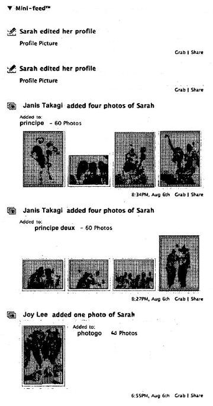

Abstract:

*A method for displaying a news feed in a social network environment is described. The method includes generating news items regarding activities associated with a user of a social network environment and attaching an informational link associated with at least one of the activities, to at least one of the news items, as well as limiting access to the news items to a predetermined set of viewers and assigning an order to the news items.*

The method may further include displaying the news items in the assigned order to at least one viewing user of the predetermined set of viewers and dynamically limiting the number of news items displayed.

**3**
[Apparatus and method for communication between multiple browsers](http://patft.uspto.gov/netacgi/nph-Parser?Sect1=PTO2&Sect2=HITOFF&u=%2Fnetahtml%2FPTO%2Fsearch-adv.htm&r=1&p=1&f=G&l=50&d=PTXT&S1=6065051.PN.&OS=pn/6065051&RS=PN/6065051) (6,065,051)
Invented by Douglas W. Steele, Todd M. Goin, and Craig W. Bryant
Assigned to Hewlett-Packard Company
Granted May 16, 2000
Filed April 15, 1998
Assigned to Facebook: February 15, 2010

Abstract

*An apparatus and method for providing flexible communications of data modification of Web resources between client browsers, where the Web resources are on a server. In particular, the apparatus and method are accomplished by having an application program ascertain if potentially shared database data was updated. If potentially shared database data was updated, then the application program establishes a connection to a security server and transmits a database change notice to the security server.*

The security server receives the database change notice and checks its sign-on list of all the client browsers currently active and sends a database change notice to all client user interface browsers currently connected to the security server. All client user browsers, upon receiving a database change notice, display the database change notice or change data within the client user browser, thereby voiding the utilization of stale database data in the client user browser.

**4**
[Apparatus and method for securing documents posted from a web resource](http://patft.uspto.gov/netacgi/nph-Parser?Sect1=PTO2&Sect2=HITOFF&u=%2Fnetahtml%2FPTO%2Fsearch-adv.htm&r=1&p=1&f=G&l=50&d=PTXT&S1=6253325.PN.&OS=pn/6253325&RS=PN/6253325) (6,253,325)
Invented by Douglas W. Steele, Todd M. Goin, and Craig W. Bryant
Assigned to Hewlett-Packard Company
Granted June 26, 2001
Filed: April 15, 1998
Assigned to Facebook: February 15, 2010

Abstract

*An apparatus and method provide flexible and heightened security for accessing web resources with a client browser, where the web resources are on a server. In particular, the apparatus and method are accomplished by having the client browser generate a token that is provided to a security server to provide third party validation of a client request for service. The client browser then makes a call for service, and includes the token as a argument of the call. A CGI-BIN program that receives the call for service also receives the service identifier and arguments, among which is the client user interface generated token.*

The CGI-BIN program establishes a connection to the security server, and then sends the token received as an argument to the security server for third-party verification. If the token is verified by the security server, then the CGI-BIN program executes the requested service program.

**5**
[E-service to manage contact information and track contact location](http://patft.uspto.gov/netacgi/nph-Parser?Sect1=PTO2&Sect2=HITOFF&u=%2Fnetahtml%2FPTO%2Fsearch-adv.htm&r=1&p=1&f=G&l=50&d=PTXT&S1=6691158.PN.&OS=pn/6691158&RS=PN/6691158) (6,691,158)
Invented by James G. Douvikas, Terry R. Sheehy, and Christopher W. T. McKay
Assigned to Hewlett-Packard Company
Granted February 10, 2004
Filed: February 18, 2000
Assigned to Facebook: February 15, 2010

Abstract

*A method of providing an electronic business card (EBC) access and organization service on the Web. The cardholder database is accessible and searchable from any browser connected to the Internet or the EBC service may be installed behind a conventional firewall and thus accessible only to intranet users. Using integrated access restrictions, the service provides easy privacy assured access to cardholder contact information. The service provides multi-mode access, data delivery interfaces, and an export feature including custom export file format definition.*

Record level and field level access to individual records is controlled, including multiple privacy levels for each field. A location tracking feature allows the cardholder to rapidly designate a pre-defined contact location or a temporary contact location. Automatically formatted electronic mail sent by the cardholder contains a signature hypertext link directing recipients of the email to the EBC service thereby enabling the recipient of the email to rapidly access the EBC system to locate the cardholder and/or obtain additional information.

**6**
[E-service to manage and export contact information](http://patft.uspto.gov/netacgi/nph-Parser?Sect1=PTO2&Sect2=HITOFF&u=%2Fnetahtml%2FPTO%2Fsearch-adv.htm&r=1&p=1&f=G&l=50&d=PTXT&S1=6633311.PN.&OS=pn/6633311&RS=PN/6633311) (6,633,311)
Invented by James G. Douvikas, Terry R. Sheehy, and Christopher W. T. McKay
Assigned to Hewlett-Packard Company
Granted October 14, 2003
Filed: February 18, 2000
Assigned to Facebook: February 15, 2010

Abstract

*A method of providing an electronic business card (EBC) access and organization service on the Web. The cardholder database is accessible and searchable from any browser connected to the Internet or the EBC service may be installed behind a conventional firewall and thus accessible only to internet users. The service thus provides easy access to cardholder contact information with privacy assured by use of integrated access restrictions.*

Access to and delivery of contact information by the service is not limited to a Web browser interface as commonly known today. The service provides multi-mode access and/or data delivery interfaces. The service also provides an export feature that formats search results into a pre-defined file structure readable by conventional contact management programs. Custom export file formats may also be defined to provide even wider connectivity and cross-platform utility. Access to individual records is controlled at both the record level and the field level, with multiple privacy levels for each field, in addition to the well-known “public” and “private” levels.

Users having certain permissions are permitted to read a defined group of records, though not necessarily all fields in each record. A location tracking feature is also provided to allow the cardholder to rapidly designate a pre-defined contact location. Alternately, the cardholder may define a temporary contact location not normally stored in the database system. Electronic mail sent by the cardholder is automatically formatted to contain a signature hypertext link directing recipients of the email to the EBC service. This hyperlink enables the recipient of the email to rapidly access the EBC system to locate the cardholder and/or obtain additional information.

**7**
[E-service to manage contact information with privacy levels](http://patft.uspto.gov/netacgi/nph-Parser?Sect1=PTO2&Sect2=HITOFF&u=%2Fnetahtml%2FPTO%2Fsearch-adv.htm&r=1&p=1&f=G&l=50&d=PTXT&S1=6,889,213.PN.&OS=pn/6,889,213&RS=PN/6,889,213) (6,889,213))
Invented by James G. Douvikas, Terry R. Sheehy, and Christopher W. T. McKay
Assigned to Hewlett-Packard Company
Granted May 3, 2005
Filed: February 18, 2000
Assigned to Facebook: February 15, 2010

Abstract

(Same Abstract as for *E-service to manage and export contact information* above)

**8**
[E-service to manage contact information and signature ECards](http://patft.uspto.gov/netacgi/nph-Parser?Sect1=PTO2&Sect2=HITOFF&u=%2Fnetahtml%2FPTO%2Fsearch-adv.htm&r=1&p=1&f=G&l=50&d=PTXT&S1=7017109.PN.&OS=pn/7017109&RS=PN/7017109) (7,017,109)
Invented by James G. Douvikas, Terry R. Sheehy, Christopher W. T. McKay
Assigned to Hewlett-Packard Company
Granted March 21, 2006
Filed: February 18, 2000
Assigned to Facebook: February 15, 2010

Abstract

(Same Abstract as for *E-service to manage and export contact information* above)

**9**
[Apparatus and method for communication between multiple browsers](http://patft.uspto.gov/netacgi/nph-Parser?Sect1=PTO2&Sect2=HITOFF&u=%2Fnetahtml%2FPTO%2Fsearch-adv.htm&r=1&p=1&f=G&l=50&d=PTXT&S1=6314458.PN.&OS=pn/6314458&RS=PN/6314458) (6,314,458)
Invented by Douglas W. Steele, Todd M. Goin, and Craig W. Bryant
Assigned to Hewlett-Packard Company
Granted November 6, 2001
Filed: March 31, 2000
Assigned to Facebook: February 15, 2010

Abstract

(Same Abstract as for *Apparatus and method for communication between multiple browsers* above)

**10**
[System and method for efficient filtering of data set addresses in a web crawler](http://patft.uspto.gov/netacgi/nph-Parser?Sect1=PTO2&Sect2=HITOFF&u=%2Fnetahtml%2FPTO%2Fsearch-adv.htm&r=1&p=1&f=G&l=50&d=PTXT&S1=6952730.PN.&OS=pn/6952730&RS=PN/6952730) (6,952,730)
Invented by Marc Alexander Najork and Clark Allan Heydon
Assigned to Hewlett-Packard Company
Granted October 4, 2005
Filed: June 30, 2000
Assigned to Facebook: February 15, 2010

Abstract

*A web crawler stores fixed length representations of document addresses in a buffer and a disk file, and optionally in a cache. When the web crawler downloads a document from a host computer, it identifies URL’s (document addresses) in the downloaded document. Each identified URL is converted into a fixed size numerical representation. The numerical representation may optionally be systematically compared to the contents of a cache containing web sites which are likely to be found during the web crawl, for example previously visited web sites.*

The numerical representation is then systematically compared to numerical representations in the buffer, which stores numerical representations of recently-identified URL’s. If the representation is not found in the buffer, it is stored in the buffer. When the buffer is full, it is ordered and then merged with numerical representations stored, in order, in the disk file. In addition, the document corresponding to each representation not found in the disk file during the merge is scheduled for downloading. The disk file may be a sparse file, indexed to correspond to the numerical representations of the URL’s, so that only a relatively small fraction of the disk file must be searched and re-written in order to merge each numerical representation in the buffer.

**11**
[System and method for maintaining consistent independent server-side state among collaborating servers](http://patft.uspto.gov/netacgi/nph-Parser?Sect1=PTO2&Sect2=HITOFF&u=%2Fnetahtml%2FPTO%2Fsearch-adv.htm&r=1&p=1&f=G&l=50&d=PTXT&S1=7024451.PN.&OS=pn/7024451&RS=PN/7024451) (7,024,451)
Invented by Daniel Scott Jorgenson
Assigned to Hewlett-Packard Company
Granted April 4, 2006
Filed: November 5, 2001
Assigned to Facebook: February 15, 2010

Abstract

*A system and method are provided for maintaining consistent server-side state across a pool of collaborating servers with independent state repositories. When a client performs an event on a collaborating server which affects such state on the server, it publishes notification of the event into a queue maintained in client-side state which is shared by all of the collaborating servers in the pool.*

As the client makes requests to servers within the pool, the queue is thus included in each request. When a collaborating server needs to access its server-side state in question, it first discerns events new to it from the queue and replicates their effects into such server-side state. As a result, the effects of events upon server-side state are replicated asynchronously across the servers in the pool, as the client navigates among them.
