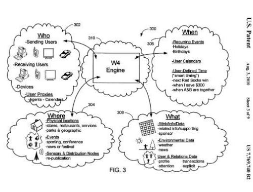
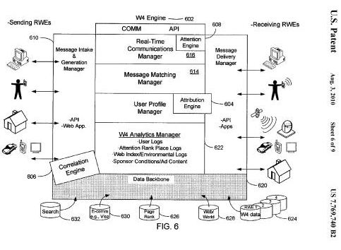

A new location-based service from Facebook is rolling out this week, known as Facebook Places. The announcement on the Facebook blog, [Who, What, When, and Now…Where](https://www.facebook.com/notes/facebook/who-what-when-and-nowwhere/418175202130), describes Places as a way of letting your friends know where you’re at and what you’re doing in realtime when you check in.

The Facebook blog post title caught my attention because of a patent granted earlier this month to Yahoo which collects “Who, What, When, and Where” information about people and the devices they use to connect directly or indirectly to the internet, including mobile phones, TV set top boxes, desktop and laptop computers, fax machines, radio frequency ID (RFID) tags, sensors, and other kinds of devices.

**Real World Entities and the W4 COMN**

Imagine that Yahoo started paying attention to information on the Web that isn’t normally crawled and indexed by search engine spiders, such as emails and TV set top box searches, location and application usage of mobile phones, social network interactions and physical and online locations, and many other kinds of devices and information flows that connect to and use the internet.

The Yahoo patent presents a framework for collecting information from devices connected to the internet, for the search engine to learn about specific people, places, and things, or what Yahoo refers to as “Real World Entities” or RWE. You are one of these real world entities if you connect to the internet in some manner, or if information about you is communicated across the internet. The framework is referred to in the patent as the “W4 Communications Network,” or the “W4 COMN.” The “W4” in the name refers to information collected about “Who, What, When, Where” about any subject, location, or user. A screenshot from the patent illustrates some examples:

As opposed to present location based services like [Foursquare](https://foursquare.com/) or Facebook Places, where people have to explicitly check in to different locations, this system might collect location information for individuals when their mobile phone isn’t being used. It might track the locations of others in your immediate vicinity, note the time and frequency of messages sent to other people online, and pay attention to activities on social networks.

The W4 COMN creates profiles for people, locations, devices, and user defined data. It can map information about Real World Entities, and create a micro graph for each entity, and a global graph that “interrelates all known entities against each other and their attributed relations.”

How’s that for a location-based service?

**Real World Entities (RWE) and Information Objects (IO)**

Each real-world entity would be assigned a unique W4 identification number to absolutely identify that RWE within the W4 communications network.

Real World Entities can include such things as people, states, cities, buildings, roads, animals, cars, airplanes, works of art, smart credit cards, business entities, sports teams, satellites, computers, phones.

The W4 Communications Network allows associations between RWEs to be determined and tracked. So, a person might be associated with other RWEs such as a mobile phone, a smart credit card, an email account, a cable TV set top box.

These associations may be made explicitly by a user, such as the set up of a mobile phone account, or the registration of an email address. The associations may also be made implicitly, like when someone passes near a weather sensor that is connected to the internet.

Information objects (IO) are objects that may store, maintain, generate, or serve as a source of data used by RWEs or the W4 Communications Network.

Information Objects can include:

- Communication signals,
- Email messages,
- Transaction records,
- Virtual cards,
- Event records,
- Sporting events,
- Phone Recordings,
- Calendar entries,
- Web pages,
- Database entries,
- Media files (songs, videos, pictures, images, audio messages, phone calls, etc.),
- Other electronic files with any associated metadata,
- Email applications,
- Calendar applications,
- Word processing applications,
- Image editing applications,
- Media player programs,
- Weather monitoring applications,
- Browsers,
- Web server applications

IOs may also be provided with unique W4 identification numbers to absolutely identify the IO within the W4 Communications network.

Each Information Object has at least three RWEs that can be associated with it:

- An owner or controller, who could be a creator or rights holder
- An RWE that the information object relates to, which could contain information about the RWE or identify the RWE
- Any RWE that access the IO to obtain data for some purpose

Yahoo’s patent appears to cover everything that can be found on the Web as well as anything (any real world entity) that can be connected somehow to the internet that can communicate across the network in some fashion. Another screenshot from the Yahoo patent shows information from Real World Entities being entered into the W4 Communications Network, and being sent out to other Real World entities through the Network:

The patent is:

[Systems and methods of ranking attention](http://patft.uspto.gov/netacgi/nph-Parser?Sect1=PTO2&Sect2=HITOFF&u=%2Fnetahtml%2FPTO%2Fsearch-adv.htm&r=1&p=1&f=G&l=50&d=PTXT&S1=7,769,740.PN.&OS=pn/7,769,740&RS=PN/7,769,740)
Invented by Ronald Martinez, Marc Eliot Davis, Christopher William Higgins, and Joseph James O’Sullivan
Assigned to Yahoo
US Patent 7,769,740
Granted August 3, 2010
Filed: December 21, 2007

Abstract

> The disclosure describes systems and methods of ranking user interest in physical entities based on the attention given to those entities as determined by an analysis of communications from devices over multiple communication channels.
>  The attention ranking systems allow any “Who, What, When, Where” entity to be defined and ranked based, at least in part, on information obtained from communications between users and user proxy devices. An entity rank is generated for entity known to the system in which the entity rank is derived from the information in communications that are indicative of user actions related to the entity.
>
> The entity ranks are then used to modify the display of information or data associated with the entities. The system may also generate a personal rank for each entity based on the relation of the entity to a specified user.

This system would collect an incredible amount of information about online and offline entities and communications, but what exactly would be the purpose?

Here’s a description from the patent itself that cuts to the heart of the reason to create such a communications network:

> In the world every RWE can be considered to have a natural rank based upon popularity and the nature and quality of the attention given by users to the person, place, thing, event, etc. In every city, there is a number one pizza restaurant, a number seven dry cleaners and a number 22 oil change place, and yet this data is neither captured nor modeled effectively to be includable with web data about the same real-world stores online. For example, the pizza shop may have a website, and it may be reviewed well by users on that site or other city guide sites, but it’s ranking in search results through search engines does not take into account that it has the most traffic, the most revenue and/or the most repeat customers of any pizza place in the city.
>
> Combining the actual data that is picked up through the W4 COMN, a model of information objects is created that maps web objects/web pages to RWEs to combine data from both worlds (i.e., the online world and the real world) in order to increase the efficiency, accuracy and dynamic evolution of matching users to other RWEs including other users, businesses, things events, etc.
>
> Everything in the world can be assigned an attention rank by combining and weighting the online data about that RWE with all known data obtained from offline sources about the same RWE. Attention is recorded in the real world by devices, activities, communications, transactions and sensors while attention is recorded online by browsers and devices and carriers and Network operators, activities, communications, transactions and instrumented pages or networks.

This system would provide a ranking system that would not only take into account information found on web pages and the web, but also information collected from the “Who, What, When, Where” communications network about entities that might be mentioned on the Web.

The patent provides a very detailed look at the communications network, how entities might be ranked, how that entity rank might influence web rankings, and how the associations between people and other entities might be tracked.

An overall attention rank might also be used to:

- Select content, either online or offline, to be shown to someone
- Determine which ads to display
- Identifying user interests
- Compare user demographics
- Identify valuable real and intangible property

**Conclusion**

Facebook Places just begins to brush the surface of what the Yahoo patent would provide in terms of a location based service. Yahoo’s W4 COMN sounds very ambitious, and there’s a question about what happens to Yahoo’s search-based patents with Microsoft taking over search from Yahoo.

The W4 Communications Network also sounds like it could be a potential privacy nightmare.

As I mentioned in yesterday’s post, [Not Brands but Entities: The Influence of Named Entities on Google and Yahoo Search Results](https://www.seobythesea.com/2010/08/not-brands-but-entities-the-influence-of-named-entities-on-google-and-yahoo-search-results/), another recently published Yahoo patent application which described how being able to identify entities in search queries can influence search results referred to the possible use of Yahoo’s W4 COMN.

I’m questioning how I feel about being considered a Real World Entity. What about you?
