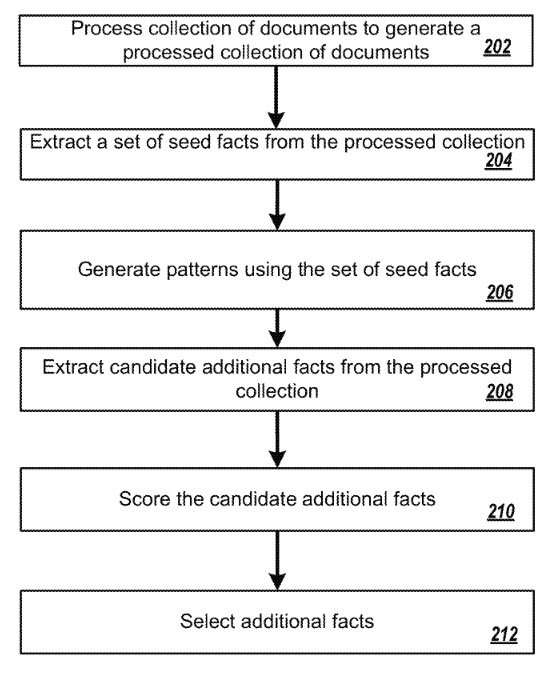

## When Google Crawls the Web, It Extracts Facts From Content on Pages It Finds

When Google crawls the Web, it extracts content on the pages it finds and links on pages. How much information does it extract about facts on the Web? In Providing fact answers? Microsoft showed off an object-based search about 10 years ago, in the paper, [Object-Level Ranking: Bringing Order to Web Objects.](http://www.ra.ethz.ch/CDstore/www2005/docs/p567.pdf).

The team from Microsoft Research Asia tells us in that paper:

> Existing Web search engines generally treat a whole Web page as the unit for retrieval and consuming. However, there are various kinds of objects embedded in static Web pages or Web databases. Typical objects are products, people, papers, organizations, etc. We can imagine that if these objects can get extracted and integrated from the Web, powerful object-level search engines can meet users’ information needs more precisely, especially for some specific domains.

## Extracting Factual Information About Entities on the Web to Provide Fact Answers

This patent from Google focuses upon extracting factual information about entities on the Web to provide fact answers. It’s an approach that goes beyond making the Web index that we know Google for because it collects more information related to each other. The patent tells us:

> Information extraction systems automatically extract structured information from unstructured or semi-structured documents. For example, some information extraction systems extract facts from collections of electronic documents. Each fact identifies a subject entity, an attribute possessed by the entity, and the attribute’s value for the entity.

## Google’s First Semantic Search Invention From 1999

I’m reminded of an early Google Provisional patent that Sergey Brin came up with within the 1990s. My post about that patent I called, [Google’s First Semantic Search Invention was Patented in 1999](https://www.seobythesea.com/2014/09/google-first-semantic-search-invention-patented-1999/). The patent it is about was titled [Extracting Patterns and Relations from Scattered Databases Such as the World Wide Web (pdf)](https://www.seobythesea.com/2014/09/google-first-semantic-search-invention-patented-1999/) (Skip ahead to the third page, where it becomes much more readable).

This was published as a paper on the Stanford website. It describes Sergey Brin taking some facts about some books and searching for those books on the Web; once they are found, patterns about the locations of those books are gathered, and information about other books is collected. That approach sounds much like the one from this patent granted the first week of this month:

> In general, one innovative aspect of the subject matter described in this specification can get embodied in methods that include the actions of obtaining a plurality of seed facts, wherein each seed fact identifies a subject entity, an attribute possessed by the subject entity, and an object, and wherein the object is an attribute value of the attribute possessed by the subject entity; generating a plurality of patterns from the seed facts, wherein each of the plurality of patterns is a dependency pattern generated from a dependency parse, wherein a dependency parse of a text portion corresponds to a directed graph of vertices and edges, wherein each vertex represents a token in the text portion and each edge represents a syntactic relationship between tokens represented by vertices connected by the edge, wherein each vertex is associated with the token represented by the vertex and a part of speech tag, and wherein a dependency pattern corresponds to a sub-graph of a dependency parse with one or more of the vertices in the sub-graph having a token associated with the vertex replaced by a variable; applying the patterns to documents in a collection of documents to extract a plurality of candidate additional facts from the collection of documents; and selecting one or more additional facts from the plurality of candidate additional facts.

## Advantages Of The Fact Extraction Patent

The patent breaks the process it describes into several “Advantages” that are worth keeping in mind because it sounds like how people talking about the Semantic Web describe the Web as a web of data. These are the Advantages that the patent brings us about providing fact answers:

> (1) A fact extraction system can accurately extract facts, i.e., (subject, attribute, object) triples, from a collection of electronic documents to identify values of attributes, i.e., “objects” in the extracted triples, that are not known to the fact extraction system.
>
> (2) In particular, values of long-tail attributes that infrequently appear in the collection of electronic documents relative to other, more frequently occurring attributes can accurately get extracted from the collection. For example, given a set of attributes for which values are extracted from the collection, the attributes in the set can get ordered by the number of occurrences of each of the attributes in the collection. The fact extraction system can accurately extract attribute values for the long-tail attributes in the set, with the long-tail attributes being the attributes that are ranked below N in the order, where N is chosen such that the total number of appearances of attributes ranked N and above in the ranking equals the total number of appearances of attributes ranked below N.
>
> (3) Additionally, the fact extraction system can accurately extract facts to identify values of nominal attributes, i.e., attributes that are expressed as nouns.

The patent is:

[Extracting facts from documents](http://patft.uspto.gov/netacgi/nph-Parser?Sect1=PTO1&Sect2=HITOFF&d=PALL&p=1&u=%2Fnetahtml%2FPTO%2Fsrchnum.htm&r=1&f=G&l=50&s1=9,672,251.PN.&OS=PN/9,672,251&RS=PN/9,672,251)
Inventors: Steven Euijong Whang, Rahul Gupta, Alon Yitzchak Halevy, and Mohamed Yahya
Assignee: Google Inc.
US Patent: 9,672,251
Granted: June 6, 2017
Filed: September 29, 2014

Abstract

> Methods, systems, and apparatus, including computer programs encoded on computer storage media, extract facts from a collection of documents. One of the methods includes obtaining a plurality of seed facts; generating a plurality of patterns from the seed facts, wherein each of the plurality of patterns is a dependency pattern generated from a dependency parse; applying the patterns to documents in a collection of documents to extract a plurality of candidate additional facts from the collection of documents, and selecting one or more additional facts from the plurality of candidate additional facts.

## Other Citations Listed in This Patent About Extracting Facts

The patent contains a list of “other references” that the applicants cited. These are worth spending some time with because they contain many hints about the direction that Google appears to extract facts from the web to provide factual answers for questions.

- Finkel et al., [Incorporating Non-local Information into Information Extraction Systems by Gibbs Sampling](https://nlp.stanford.edu/manning/papers/gibbscrf3.pdf) In Proceedings of the 43rd Annual Meeting of the ACL, Ann Arbor, Michigan, USA, Jun. 2005, pp. 363-370. cited by applicant .
- Gupta et al, [Biperpedia: An Ontology for Search Applications](https://static.googleusercontent.com/media/research.google.com/en//pubs/archive/41894.pdf) In Proceedings of the VLDB Endowment, 2014, pp. 505-516. cited by applicant .
- Haghighi and Klein, [Simple Coreference Resolution with Rich Syntactic and Semantic Features](https://www.aclweb.org/anthology/D09-1120/) In Proceedings of Empirical Methods in Natural Language Processing, Singapore, Aug. 6-7, 2009, pp. 1152-1161. cited by applicant .
- Madnani and Dorr, [Generating Phrasal and Sentential Paraphrases: A Survey of Data-Driven Methods](https://www.mitpressjournals.org/doi/pdf/10.1162/coli_a_00002) In Computational Linguistics, 2010, 36(3):341-387. cited by applicant .
- de Marneffe et al., [Generating Typed Dependency Parses from Phrase Structure Parses](https://nlp.stanford.edu/pubs/LREC06_dependencies.pdf) In Proceedings of Language Resources and Evaluation, 2006, pp. 449-454. cited by applicant .
- Mausam et al., [Open Language Learning for Information Extraction](https://homes.cs.washington.edu/~mausam/papers/emnlp12a.pdf) In Proceedings of Empirical Methods in Natural Language Processing, 2012, 12 pages. cited by applicant .
- Mikolov et al., [Efficient Estimation of Word Representations in Vector Space](https://arxiv.org/pdf/1301.3781.pdf) International Conference on Learning Representations (ICLR), Scottsdale, Arizona, USA, 2013, 12 pages. cited by applicant .
- Mintz et al, [Distant Supervision for Relation Extraction Without Labeled Data](https://www.aclweb.org/anthology/P09-1113/) In Proceedings of the Association for Computational Linguistics, 2009, 9 pages. cited by applicant.

The patent tells us that entities identified by this extraction process may get stored in an entity database. They point at the old freebase site (which was run by Google).

## Information Extracted From The Web

They give us some insights into how Google might use the information extracted from the Web in a [fact repository](https://www.seobythesea.com/2014/09/googles-browseable-fact-repository-early-knowledge-graph/). This is the term they used to refer to an early version of their knowledge graph:

> Once extracted, the fact extraction system may store the extracted facts in a facts repository or provide the facts for use for some other purpose. In some cases, the extracted facts may get used by an Internet search engine may use the extracted facts to provide formatted answers in response to search queries that have been classified as seeking to determine the value of an attribute possessed by a particular entity. For example, a received search query “who is the chief economist of example organization?” may be classified by the search engine as seeking to determine the value of the “Chief Economist” attribute for the entity “Example Organization.” By accessing the fact repository, the search engine may identify that the fact repository includes an (Example Organization, Chief Economist, Example Economist) triple and, in response to the search query, can provide a formatted presentation that identifies “Example Economist” as the “Chief Economist” of the entity “Example Organization.”

The patent tells us about how they use patterns to identify additional facts when providing fact answers:

## Facts From Among Candidate Additional Facts

> The system selects additional facts from the candidate additional facts based on the scores (step 212). For example, the system can select each candidate’s additional fact having a score above a threshold value as an additional fact. As another example, the system can select a predetermined number of highest-scoring candidate additional facts. The system can store the selected additional facts in a fact repository, e.g., the fact repository of FIG. 1, or provide the selected additional facts to an external system for use for some immediate purpose.

The patent also describes the process that might be followed to score candidates additional facts to show fact answers about.

This fact extraction process does appear to build a repository capable of answering many questions. It uses a machine learning approach and the kind of semantic vectors that the Google Brain team may have used to develop Google’s Rank Brain approach.

Some posts I’ve written about patents involving question answering:

- 7/19/2007 – [Search Engines Crawling FAQs to Learn How to Answer Questions?](https://www.seobythesea.com/2007/07/search-engines-crawling-faqs-to-learn-how-to-answer-questions/)
- 9/21/2014 – [Google May Use Question Answering to Populate the Knowledge Graph](https://www.seobythesea.com/2014/09/missing-incorrect-data-knowledge-graph/)
- 10/12/2014 – [How Google May Use Entity References to Answer Questions](https://www.seobythesea.com/2014/10/google-fact-questions-entity-references-unstructured-data/)
- 12/30/2014 – [Featured Snippets – Taken from Authority Websites](https://www.seobythesea.com/2014/12/direct-answers-taken-authority-websites/)
- 12/31/2014 – [Featured Snippets – Using Query Intent Templates to Identify Answers](https://www.seobythesea.com/2014/12/direct-answers-using-query-intent-templates-identify-answers/)
- 2/11/2015 – [How Google was Corroborating Facts for Featured Snippets](https://www.seobythesea.com/2015/02/google-corroborating-facts-direct-answers/)
- 7/12/2015 – [How Google May Answer Questions in Queries with Rich Content Results](https://www.seobythesea.com/2015/07/how-google-may-answer-questions-in-queries-with-rich-content-results/)
- 9/9/2015 – [When Google Started Showing Featured Snippets](https://www.seobythesea.com/2015/09/when-google-started-answering-factual-queries/)
- 11/30/2016 – [Answering Featured Snippets Timely, Using Sentence Compression on News](https://www.seobythesea.com/2016/11/featured-snippets-sentence-compression/)
- 6/19/2017 – [Google Extracts Facts from the Web to Provide Fact Answers](https://www.seobythesea.com/2017/06/fact-answers/)
- 7/10/2019 – [How Google May Handle Question Answering when Facts are Missing](https://www.seobythesea.com/2019/07/how-google-may-handle-question-answering-when-facts-are-missing/)

Last Updated July 11, 2019.
