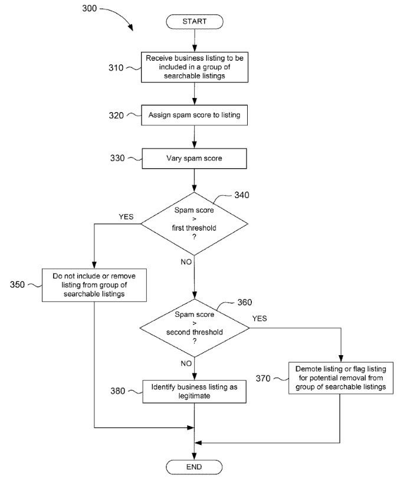

## Fake Business Spam Detection in Local Search at Google

> The ultimate goal of any spam detection system is to penalize “spammy” content.
>
> ~ Reverse engineering circumvention of spam detection algorithms (Linked to below)

Four years ago, I wrote a post about a Google patent titled, [The Google Rank-Modifying Spammers Patent](https://www.seobythesea.com/2012/08/google-rank-modifying-spammers-patent/). It told us that Google might be keeping an eye out for someone attempting to manipulate organic search results by spamming pages, and Google may delay responding to someone’s manipulative actions to make them think that whatever actions they were taking didn’t have an impact upon search results. That patent focused upon organic search results, and Google’s Head of Web Spam Matt Cutts responded to my post with a video in which he insisted that just because Google produced a patent on something doesn’t mean that they were going to use it. The video is titled, “What’s the latest SEO misconception that you would like to put to rest? ”

I’m not sure how effective the process in that patent was, but there is now a similar patent from Google that focuses upon rankings of [local search SEO](https://www.seobythesea.com/services-from-seo-by-the-sea/local-search-seo/) results. The patent describes this fake business spam detection problem in this way:

> The business listing search results, or data identifying a business, its contact information, website address, and other associated content, may be displayed to a user such that the most relevant businesses may be easily identified. In an attempt to generate more customers, some businesses may employ methods to include multiple different listings to identify the same business. For example, a business may contribute a large number of listings for nonexistent business locations to a search engine, and each listing is provided with a contact telephone number that is associated with the actual business location. The customer may be defrauded by contacting or visiting an entity believed to be at a particular location only to learn that the business is operating from a completely different location. Such fraudulent marketing tactics are commonly referred to as “fake business spam”.

This fake business spam detection patent tells us that search engines will sometimes modify how they rank businesses to keep fake businesses from showing, and they want to stop people from spamming local search results. The patent developed in response to fake spam business listings Is:

[Reverse engineering circumvention of spam detection algorithms](http://patft.uspto.gov/netacgi/nph-Parser?Sect1=PTO1&Sect2=HITOFF&d=PALL&p=1&u=%2Fnetahtml%2FPTO%2Fsrchnum.htm&r=1&f=G&l=50&s1=9,372,896.PN.&OS=PN/9,372,896&RS=PN/9,372,896)
Inventors: Douglas Richard Grundman
Assigned to: Google
Patent 9,372,896
Granted June 21, 2016
Filed: November 26, 2013

Abstract

> A spam score is assigned to a business listing when the listing is received at a search entity. A noise function is added to the spam score such that the spam score is varied. If the spam score is greater than a first threshold, the listing is identified as fraudulent and the listing is not included in (or is removed from) the group of searchable business listings. If the spam score is greater than a second threshold that is less than the first threshold, the listing may be flagged for inspection. The addition of the noise to the spam scores prevents potential spammers from reverse engineering the spam detecting algorithm such that more listings that are submitted to the search entity may be identified as fraudulent and not included in the group of searchable listings.

A Webmasterworld thread discussed the older patent I mentioned and provides some interesting commentary on it that is worth reading through Google’s Rank Modifying Patent for Spam Detection

The patent describes how it might not show any positive results in response to fake business spam to throw off people spamming results and to make it more difficult for people to reverse engineer spam detection patterns. I wasn’t convinced that being aware of this patent would help make it easier for people to spam local search results,

It may sometimes not demote a business after fake business spam has been submitted on behalf of a business if a spam score added to a score for the listing doesn’t rise beyond a certain amount, as shown in this flowchart from the patent:

It’s difficult to say whether Google is using the webspam detection process described in this patent or not (or in the post about the patent I wrote about 4 years ago.)
