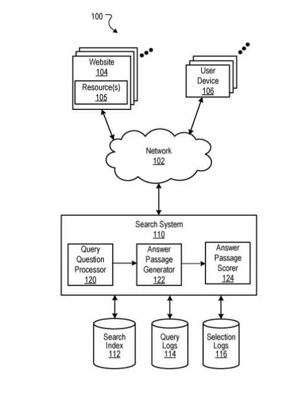
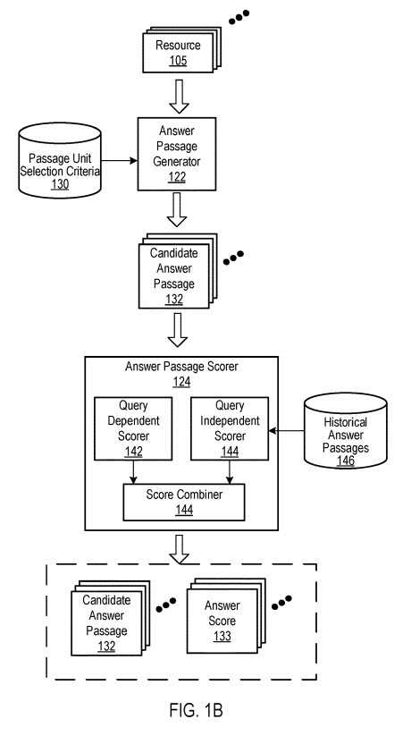

## Calculating Featured Snippet Answer Scores

An update this week to a patent tells us how Google may score featured snippet answers.

When a search engine ranks search results in response to a query, it may combine query dependant and query-independent ranking signals to determine those rankings.

## How Query-Dependent and Query-Independent Signals May Work

A query dependant signal may depend on a term in a query and how relevant a search result may be for that query term. Conversely, a query-independent signal would depend on something other than the terms in a query, such as the quality and quantity of links pointing to a result.

Answers to queries may work based on query-dependent and query-independent signals, determining a featured snippet answer score. An updated patent about textual answer passages tells us how those may generate featured snippet answer scores to choose from answers to questions that appear in queries.

A year and a half ago, I wrote about answers to featured snippets in the post [Does Google Use Schema to Write Answer Passages for Featured Snippets?](https://gofishdigital.com/schema-answer-passages-featured-snippets/). The patent the post was about was [Candidate answer passages](http://patft.uspto.gov/netacgi/nph-Parser?Sect1=PTO1&Sect2=HITOFF&d=PALL&p=1&u=%2Fnetahtml%2FPTO%2Fsrchnum.htm&r=1&f=G&l=50&s1=10,180,964.PN.&OS=PN/10,180,964&RS=PN/10,180,964). It was originally filed on August 12, 2015, as a continuation patent from January 15, 2019.

That patent was a continuation patent to an original one about answer passages that updated it. It told us that Google would look for textual answers to questions with structured data near them that included related facts. This could have been something like a data table or even schema markup. This meant that Google could provide a text-based answer to a question and include many related facts for that answer.

Another continuation version of the first version of the patent was granted this week. It provides more information and a different approach to ranking answers for featured snippets. It is worth comparing the claims in these two versions of the patent to see how those are different.

## A New Version of the Featured Snippet Answer Scores Patent

The new version of the featured snippet answer scores patent is at:

[Scoring candidate answer passages](http://patft.uspto.gov/netacgi/nph-Parser?Sect1=PTO1&Sect2=HITOFF&d=PALL&p=1&u=%2Fnetahtml%2FPTO%2Fsrchnum.htm&r=1&f=G&l=50&s1=10,783,156.PN.&OS=PN/10,783,156&RS=PN/10,783,156)
Inventors: Steven D. Baker, Srinivasan Venkatachary, Robert Andrew Brennan, Per Bjornsson, Yi Liu, Hadar Shemtov, Massimiliano Ciaramita, and Ioannis Tsochantaridis
Assignee: Google LLC
US Patent: 10,783,156
Granted: September 22, 2020
Filed: February 22, 2018

Abstract

> Methods, systems, and apparatus, including computer programs encoded on a computer storage medium, for scoring candidate answer passages. In one aspect, a method includes receiving a query determined to be a question query that seeks an answer response and data identifying resources determined to be responsive to the query; for a subset of the resources: receiving candidate answer passages; determining, for each candidate answer passage, a query term match score that is a measure of similarity of the query terms to the candidate answer passage; determining, for each candidate answer passage, an answer term match score that is a measure of similarity of answer terms to the candidate answer passage; determining, for each candidate answer passage, a query dependent score based on the query term match score and the answer term match score; and generating an answer score that is a based on the query dependent score.

## Candidate Answer Passages Claims Updated

There are changes to the patent that require more analysis of potential answers, based on both query dependant and query independent scores for potential answers to questions. The patent description does provide details about query dependant and query independent scores. The first claim from the first patent covers query dependant scores for answers but not query-independent scores as the newest version does. It provides more details about query dependant scores and query independent scores in the rest of the claims. Still, the newer version seems to make both query dependant and query independent scores more important.

The first claim from the 2015 version of the [Scoring Answer Passages](http://patft.uspto.gov/netacgi/nph-Parser?Sect1=PTO1&Sect2=HITOFF&d=PALL&p=1&u=%2Fnetahtml%2FPTO%2Fsrchnum.htm&r=1&f=G&l=50&s1=9940367.PN.&OS=PN/9940367&RS=PN/9940367) patent tells us:

> 1. A method performed by data processing apparatus, the method comprising: receiving a query determined to be a question query that seeks an answer response and data identifying resources determined to be responsive to the query and ordered according to a ranking, the query having query terms; for each resource in a top-ranked subset of the resources: receiving candidate answer passages, each candidate answer passage selected from passage units from content of the resource and being eligible to be an answer passage with search results that identify the resources determined to be responsive to the query and being separate and distinct from the search results; determining, for each candidate answer passage, a query term match score that is a measure of similarity of the query terms to the candidate answer passage; determining, for each candidate answer passage, an answer term match score that is a measure of similarity of answer terms to the candidate answer passage; determining, for each candidate answer passage, a query dependent score based on the query term match score and the answer term match score; and generating an answer score that is a measure of answer quality for the answer response for the candidate answer passage based on the query dependent score.

The rest of the claims tells us about both query dependant and query independent scores for answers. Still, the claims from the newer version of the patent appear to place as much importance on the query dependant and the query independent scores for answers. That convinced me that I should revisit this patent in a post and describe how Google may calculate answer scores based on query dependant and query independent scores.

The first claims in the new patent tell us:

> 1. A method performed by data processing apparatus, the method comprising: receiving a query determined to be a question query that seeks an answer response and data identifying resources determined to be responsive to the query and ordered according to a ranking, the query having query terms; for each resource in a top-ranked subset of the resources: receiving candidate answer passages, each candidate answer passage selected from passage units from content of the resource and being eligible to be an answer passage with search results that identify the resources determined to be responsive to the query and being separate and distinct from the search results; determining, for each candidate answer passage, a query dependent score that is proportional to many instances of matches of query terms to terms of the candidate answer passage; determining, for each candidate answer passage, a query independent score for the candidate answer passage, wherein the query independent score is independent of the query and query dependent score and based on features of the candidate answer passage; and generating an answer score that is a measure of answer quality for the answer response for the candidate answer passage based on the query dependent score and the query independent score.

## This is Based on Both the Query Dependent Score and the Query Independent Score

As it says in this new claim, the answer score has gone from being “a measure of answer quality for the answer response for the candidate answer passage based on the query dependent score” (from the first patent). I then move to “a measure of answer quality for the answer response for the candidate answer passage based on the query dependent score and the query independent score” (from this newer version of the patent.)

This drawing is from both versions of the patent, but it shows the query dependant and query independent scores both playing an important role in calculating featured snippet answer scores:

## Query Dependant and Query Independent Scores for Featured Snippet Answer Scores

Both versions of the patent tell us how a query-dependent score and a query-independent score for an answer might work together. But, the first version of the patent only told us in its claims that an answer score used the query dependant score. This newer version tells us that both the query dependant and the query independent scores work to calculate an answer score (to decide which answer is the best choice for a query.)

Before the patent discusses how Query Dependant and Query Independent signals might create an answer score, it does tell us this about the answer score:

> The answer passage scorer receives candidate answer passages from the answer passage generator and scores each passage by combining scoring signals that predict how likely the passage is to answer the question.
>
> The answer passage scorer may include a query-dependent scorer and a query-independent scorer that generate a query-dependent score and a query-independent score. The query-dependent scorer generates the query-dependent score based on an answer term match score and a query term match score in some implementations.

## Query Dependant Scoring for Featured Snippet Answer Scores

Query Dependent Scoring of answer passages is from answer term features.

An answer term match score measures the similarity of answer terms to terms in a candidate answer passage.

The answer-seeking queries do not describe what a searcher is looking for since the answer is unknown to the searcher at the time of a search.

The query-dependent scorer begins by finding a set of likely answer terms and compares the set of likely answer terms to a candidate answer passage to generate an answer term match score. The set of likely answer terms is likely taken from the top N ranked results returned for a query.

The process creates a list of terms from terms included in the top-ranked subset of results for a query. The patent tells us that it would look at each result: each term becomes part of a term vector. Stop words may be from the term vector.

For each term in the list of terms, a term weight may be from the term. The term weight for each term may be from many results in the top-ranked subset of results in which the term occurs. They may be multiplied by an inverse document frequency (IDF) value for the term. For example, the IDF value may be from a large corpus of documents and provided to the query-dependent scorer. Or the IDF may be from the top N documents in the returned results. The patent tells us that other appropriate term weighting techniques can also happen.

The scoring process for each term of the candidate answer passage determines several times the term occurs in the candidate answer passage. So, if the term “apogee” occurs two times in a candidate answer passage, the term value for “apogee” for that candidate answer passage is 2. But, if the same term occurs three times in a different candidate answer passage, then the term value for “apogee” for the different candidate answer passage is 3.

For each term of the candidate answer passage, the scoring process multiplies its term weight by the number of times the term occurs in the answer passage. So, assume the term weight for “apogee” is 0.04. For the first candidate answer passage, the value based on “apogee” is 0.08 (0.08.times.2); for the second candidate answer passage, the value based on “apogee” is 0.12 (0.04.times.3).

Other answer term features can also determine an answer term score. For example, the query-dependent scorer may determine an entity type to answer the question query. The entity type may be identified using terms that identify entities, such as persons, places, or things, and selecting the terms with the highest term scores. The entity time may also be from the query (e.g., for the query [who is the fastest man]), the entity type for an answer is “man.” For each candidate answer passage, the query-dependent scorer then identifies entities described in the candidate answer passage. If the entities do not match the identified entity type, ta lessened answer term match score for the candidate answer passage happens.

Assume the following candidate passage answer works for scoring in response to the query [who is the fastest man]:

> Olympic sprinters have often set world records for sprinting events during the Olympics. The most popular sprinting event is the 100-meter dash.

The query-dependent scorer will identify several entities–Olympics, sprinters, etc.–but none of them are of the type “man.” The term “sprinter” is gender-neutral. Accordingly, the answer term score could be less. The score may be a binary score, e.g., 1 for the presence of the term of the entity type, and 0 for an absence of the term of the correct type; alternatively may be a likelihood that is a measure of the likelihood that the correct term is in the candidate answer passage. An appropriate scoring technique can generate the score.

## Query Independant Scoring for Featured Snippet Answer Scores

Scoring answer passages according to query independent features.

Candidate answer passages may be from the top N-ranked resources identified for a search response to a query. N may be the same number as the number of search results returned on the first page of search results.

The scoring process can use a passage unit position score. This passage unit position could be the location of a result that a candidate answer passage comes from. The higher the location results in a higher score.

The scoring process may use a language model score. The language model score generates a score based on candidate answer passages conforming to a language model.

One type of language model works with sentence and grammar structures. This could mean that candidate answer passages with partial sentences may have lower scores than candidate answer passages with complete sentences. But, the patent also tells us that if structured content is in the candidate answer passage, the structured content is not subject to language model scoring. For instance, a row from a table may have a meager language model score but may be very informative.

Another language model considers whether text from a candidate answer passage appears like answer text in general.

A query-independent scorer accesses a language model of historical answer passages. This is where the historical answer passages are answer passages for all queries. Answer passages generally have a similar n-gram structure since answer passages tend to include explanatory and declarative statements. Suppose the score is a query-independent score. It could use a tri-gram model to compares trigrams of the candidate answer passage to the tri-grams of the historical answer passages. A higher-quality candidate answer passage will have more tri-gram matches to the historical answer passages than a lower-quality candidate answer passage.

Another step involves a section boundary score. A candidate answer passage could get a penalty if it includes text that passes formatting boundaries, such as paragraphs and section breaks, for example.

The process behind scoring determines an interrogative score. The query independent scorer searches the candidate answer passage for interrogative terms. A potential answer passage that includes a question or question term, e.g., “How far is away is the moon from the Earth?” is generally not as helpful to a searcher looking for an answer as a candidate answer passage that only includes declarative statements, e.g., “The moon is approximately 238,900 miles from the Earth.”

That scoring process also determines discourse boundary term position scores. A discourse boundary term introduces a statement or idea contrary to or modification of a statement or idea that has just taken place. For example, “conversely,” “however,” “on the other hand,” and so on.

Beginning a candidate answer passage with such a term receives a relatively low discourse boundary term position score, which lowers the answer score.

Including a candidate answer passage that does not begin with such a term receives a higher discourse boundary term position score than if it began with the term.

Using a candidate answer passage that does not use such a term receives a high discourse boundary term position score.

The scoring process determines result scores for results from which the candidate answer passage starts. For example, these could include a ranking score, a reputation score, and a site quality score. The higher these scores are, the higher the answer score will be.

If the ranking score begins with the ranking score of the result from which the candidate answer passage started. For example, the search score of the query and applied to all candidate answer passages from that result.

A reputation score indicates the trustworthiness and/or likelihood that that subject matter of the resource serves the query well.

A site quality score indicates a measure of the quality of a website that hosts the result when the candidate answer passage took place.

Component query independent scores described above may work in several ways to determine the query independent score. For example, they could sum them, multiply them, or combine them.

Added October 15, 2020 – I have written a few other posts about answer passages that are worth reading. If you want to find out more about how Google finds questions on pages and answers those, and scores answer passages to determine which ones to show as featured snippets. Here are those posts:

- January 24, 2019 – [Does Google Use Schema to Write Answer Passages for Featured Snippets?](https://gofishdigital.com/schema-answer-passages-featured-snippets/)
- October 9, 2020 – [Adjusting Featured Snippet Answers by Context](https://www.seobythesea.com/2020/10/adjusting-featured-snippet-answers-by-context/)
- October 14, 2020 – [Weighted Answer Terms for Scoring Answer Passages](https://gofishdigital.com/weighted-answer-terms-for-scoring-answer-passages/)
