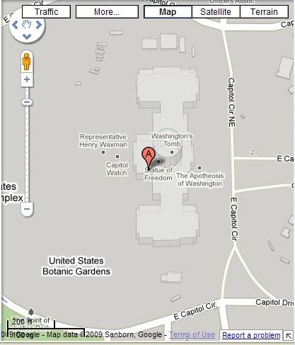

I like old buildings and local history, and learning about how towns and areas have grown and developed, and I put together a little project that might give me a quick glimpse of some of the history of each state in the US.

It seemed like an easy task to start with, creating a Google [My Maps](https://patentscope.wipo.int/search/en/detail.jsf?docId=PCTUS2006061922) display of the location of the Capitol Building for each State in the US. I was wrong. It wasn’t easy. One problem was that the place shown in the image below is known as “The Capitol Building” may not have helped. But there were other problems as well.

I did manage to create a map of the US Capitol Buildings, though I’m considering it to still be a work in progress. But what I learned making the map confirmed some thoughts about the limitations of search and search engines, and some of the problems I’ve seen with Google Maps and with government web sites.

**Knowing the Right Words to Search With Capitol vs. Capital**

Knowing the name of what you are looking for is helpful when trying to find information on the Web, but it’s often a luxury that we don’t have. That’s one of the reasons why we use a search engine in the first place – to discover and learn more about things that we know little about.

The building where State legislatures meet might be called many different things in many different states, and looking for “state capitol buildings” was one of the challenges I faced. Part of that was because every state has its own history and tradition in determining what to name the buildings that house their central government functions. For example, I didn’t know that the Capitol building in New Mexico was referred to as the “Roundhouse.”

Another issue I faced was the spelling of the word “capitol.” When it comes to government, a capital is a geographic region where the main government center might be located. For example, the City of Columbus is the capital of Ohio.

Also, when it comes to government, capital is usually the main headquarters for legislators, and other government officials.

If I search for [Colorado capitol] in Google Web search, the top result I’m shown isn’t a web page, but rather a question and answer (Q&A) result, telling me:

> Colorado — Capital: Denver
>  According to http://en.wikipedia.org/wiki/List_of_United_States_Representatives_from_Colorado

If I then search for the other spelling, [Colorado capitol], I see the same Q&A answer at the top of the search results, except the source page for the answer changes:

> Colorado Capital: Denver
>  According to http://www.wholefoodsmarket.com/stores/colorado/index.php

I’m not sure why Google decided to use that Whole Foods Market page as the source of information on where Colorado’s “capital” is since the only mention on the page of a “capital” is that there’s a Whole Foods Market located on “Capitol Hill” in Denver. I’m also wondering if the assumption behind the algorithm in Google’s Q&A answers considers “capitol” to be a common enough misspelling of “capital” to show the answer for either spelling.

Google also shows Google Maps results for my searches for [Colorado capital] and [Colorado capitol], showing me a map of businesses for “capital near Colorado” and “capitol near Colorado.”

The “capital” results included places such as The Capital Grille Denver, Sequel Venture Partners, Foundry Group, and Meritage Private Equity Funds. I’m assuming that the search engine thinks I either want to find places with “capital” in the name or that I want to raise money (capital) for my business.

Fortunately, for me, the Google Maps results shown in my search for “Colorado Capitol” started with a listing for the “Colorado State Capitol,” and then many other businesses that include the word “capitol” in their name. Unfortunately, many of my searches for other state capitol buildings didn’t provide me with a listing of an actual state capitol building within those local results.

**Capitol Buildings and The Capitol Building**

Unfortunately, Google also seems to identify the term “capitol building” with the [Capitol Building](https://www.google.com/maps/place/United+States+Capitol/@38.8899389,-77.0101448,18z/data=!3m1!4b1!4m2!3m1!1s0x89b7b82921a2cf17:0x482a3f7c10cf8c4?hl=en) in Washington, D.C.

That may be why, when I search for something such as [Illinois capitol building], instead of seeing a result in Springfield, Illinois, I’m presented in Google Maps with a listing for the “State of Illinois Department” which is located near the Washington D.C. Capitol Building on N Capitol Street. I saw that on several Maps results, and it’s also possible that I saw these results because those offices were located on N Capitol Street.

I known there’s an Illinois [State Capitol Building](https://en.wikipedia.org/wiki/Illinois_State_Capitol). There have been six of them in the history of Illinois. So I modified my search in Google Maps to look for [illinois state capitol], and one the listings provided me with a link to the State Capitol. Knowing the right “name” for a building can make a difference.

**Google Maps a Moving Target**

Knowing which City that a capital building is in can sometimes help as well. I had to search for the “capital” of many states so that I could include that city name in my search for the “capitol” building in that city.

If you perform a search that sends you to one geographic location, and then performs another search, your second search results can be influenced by your first search.

For example, if I start out searching for [state of california] in Google Maps, the result I receive is a map of the State of California, with a place pin located in the center of the State. If I then search for [washington D.C.] and then perform another search for [State of California], the result I see is titled “State of California,” and is located at 444 N. Capitol St. NW # 134, Washington, DC.

When you’re searching in Google Maps, your previous queries can influence the results that you see in your present queries. This kind of customization from Google can be a little frustrating.

**Authoritative Web Pages and Missing Addresses**

Unfortunately, as I looked through web pages for State Capitol buildings in the different states, it was really difficult to find actual addresses for those buildings. And the addresses that were associated with some State Capitol buildings were a little odd.

Google will try to determine which web site goes with which business or organization listing that they show in Google Maps. They published a patent filing a few years ago which describes some of the things that they might be looking for when making an association between a web page and a Google Maps listing. I wrote about it in a post titled [Authority Documents for Google’s Local Search](https://www.seobythesea.com/2006/07/authority-documents-for-googles-local-search/).

One web address that I saw listed for a State Capitol building was a link to a private government contractor site, another included the URL to a non-governmental political action group, and a third listed a Secretary of State’s Council on Aging page. Many of the State Capitol Buildings were shown in Google as being “unverified by the business owner.” A good number of others provided links to the museums or tours associated with those Capitol Buildings. One led me to the coffee house at a Capitol building.

I looked around for addresses on many web sites that could be associated with a Capitol Building and had a hard time finding an actual mailing address for those buildings. Google Maps looks for that kind of location information on a web page when trying to decide what the “authoritative” web site is for a listing in Google Maps.

**Why the confusion?**

I would think that Google would want to make sure that information about state governments was as correct as possible, and would have people working within Google Maps to verify this kind of information. But I’m not sure that they do.

I started asking myself who it might be amongst State Governments that would be responsible for providing information to the public about the locations of Capitol buildings, and what kinds of incentives they might have to publish that information.

In some States, the Capitol building is where the main legislative bodies of those states meet to vote. In other states, the legislators are in buildings nearby, and the Capitol building is more of a historic site and the location of tours to the public. In other states, it seems like other agencies maintain information about Capitol Buildings, such as the State Secretary of State Office. A few provided information about their state capitol through their tourism office sites.

What incentive might government sites have for being listed and easy to find in Google Maps?

Many states do want people to visit and tour the historical and government areas of their states, and making Capitol buildings easy to find could increase the number of visitors to their locations.

Increasing public awareness and public access to the places where laws are shaped and voted upon is also an important reason to make it easy for people to find State Capitol buildings.

Other people who might want to find State Capitols could include potential employees, vendors, and students.

Unfortunately, it can be difficult to find that location information prominently displayed on many of the government sites that should be associated with State Capitol Buildings.

An easy way out for Google, and many state governments, would be to list the official web page for each state as the authoritative web site for state capitols.

Which led me to wonder – how likely would it be that someone from a state government would visit Google Maps, and verify the locations and web addresses for state buildings? Or Yahoo Local? Or Bing Maps?

There are plenty of incentives to do so, but I did see a good number of “unverified” listings for state capitol buildings.

**Place Pages as Query Portals**

When you perform a search on Google Maps for a particular place, and you click on the “more information” link for that location, it’s possible to see a fair amount of information for that location. Google has developed “Place Pages” that are mini-portals leading to a potentially large mix of information, such as maps, images and videos, transit information, reviews, snippets from web pages, links to user-generated content, 3D warehouse images, and related maps that the place may also appear within.

A good example is the Place Page for the [New Jersey Statehouse.](https://www.google.com/maps/place/New+Jersey+State+House+Museum/data=!4m2!3m1!1s0x89c159d1c586c895:0x43d75f3bdd2a62de?gl=US&hl=en-US)

**Conclusion**

There’s little consistency from state to state on how well listed one of the most important buildings in each state is listed in Google Maps. I expected to be able to find a location for each of the State’s Capitol Buildings within an hour on Google Maps, and have a nice little map showing them all.

The exercise made me question how much incentive Google has to make sure information like this is easy to find. I would expect that there should be enough incentive in State governments to make their Capitol Buildings as accessible as possible to people searching for them on the Web but found myself beginning to question how much they might know about resources like Google Maps, and whom within those state governments would be responsible for finding out more.
