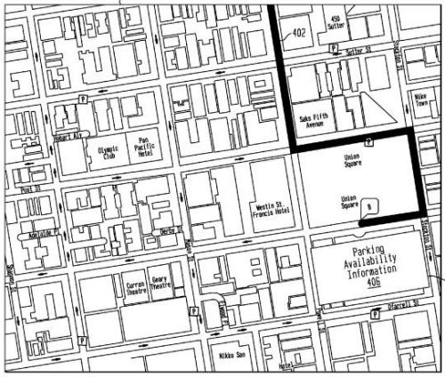

At some point in the not distant future, Yahoo search will be replaced with Microsoft’s search service Bing.

Exactly how that might impact the other services that Yahoo offers isn’t clear at this point, but, likely, Yahoo will still offer many of the portal services that it provides to its visitors now.

Will Yahoo Local and Yahoo Maps be affected? Again, that isn’t clear. I’ve been keeping an eye out for patent filings from search engines for a while now, and I do still see many published by Yahoo that provides some interesting possibilities, even outside of search.

Take one Yahoo patent filing published today, for instance:

[Real Time Detection of Parking Space Availability](http://appft.uspto.gov/netacgi/nph-Parser?Sect1=PTO2&Sect2=HITOFF&u=%2Fnetahtml%2FPTO%2Fsearch-adv.html&r=1&p=1&f=G&l=50&d=PG01&S1=20100007525.PGNR.&OS=dn/20100007525&RS=DN/20100007525)
Invented by Amit Umesh Shanbhag, Glen Ames, and Philip Aaronson
Assigned to Yahoo
US Patent Application 20100007525
Published January 14, 2010
Filed July 9, 2008

The process behind this patent application would help people find parking spaces within parking garages, possibly by monitoring those spaces with sensors. It could share information such as the cost of parking at different garages and could be part of a program such as Yahoo Maps. We’re told about the need for something like this within the patent filing:

> Frequently, an individual that plans on driving from a start location to a finish location will need a parking space at the finish location. The locating of parking in towns/cities having scarce parking resources and/or strict parking regulations is a non-trivial task. Unfamiliarity by the individual with the destination locality can further compound this problem. Thus, the locating of parking in many localities can be time-consuming.
>
> Furthermore, once a parking resource is determined, typically there is no way of determining whether any parking spaces will be available there, or where the parking spaces are located when the individual arrives at the parking resource in the user’s vehicle. This can lead to quite a bit of time wasted by the individual driving around trying to find an open parking space.
>
> Thus, planning a point-to-point trip that accounts for a need to find parking can be quite a complex problem. What is desired are ways of efficiently and easily planning a point-to-point trip that accounts for the need for available parking at the end destination.

An image from the patent application:

The patent is as meticulously detailed as any I’ve seen from Yahoo that describes how they might help searchers find web pages, and it solves a very real problem – but something is missing.

It’s going to be sad to see Yahoo leave search – I like the idea of there being some competition amongst the major search providers. The search engineers who go from Yahoo to work at Bing may help Bing provide a stronger search offering, and at this point, we can only wait and see.

When we think of Yahoo a few years from now, will we think about them as a place on the Web to find information, or as the place that helps us find parking?
