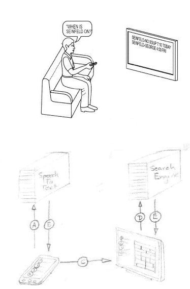

Apple’s latest phone has a slick voice control feature named Siri that lets you tell your phone to do a number of different things, and can even power searches that it will answer for you. There’s been some speculation that type of verbal interaction might harm Google because it would bypass the search advertisements that are Google’s primary way of earning money. Looks like Google isn’t taking that possibility lightly.

Will the future of searching involve speech based searches that we do on our phones, with results shown on our TV? A Google patent application describes the possibility.

Imagine picking up your smartphone, and calling your TV to ask it to search for “all movies with Steve McQueen,” or when “Dr. Who” might be showing next.

The patent application describes how a smartphone app might enable voice searches to show results on internet enabled televisions or televisions that use an internet enabled set-top box or DVD player or similar device connected to a television, so that your phone and TV can interact in a meaningful way.

The remote control request might be made real time while watching television, or from a distance and ahead of time. For example, you could ask for “Bowling for Dollars” to be turned on while you are driving home, and the request might be sent to your TV while you’re about a 1/4 mile away, so that your television turns on and tunes in to the proper channel as you’re walking through your front door. You could also ask your phone, “what time is Wild Kingdom on” and see scheduled times on your phone, and choose one to be later shown on your TV, or set it to record on a personal video recorder.

It’s also possible that you could use a speech to text application on your phone to perform searches on the internet and browse different sites, viewing the searches and the sites on your TV.

The patent application is:

[Television Remote Control Data Transfer](http://appft.uspto.gov/netacgi/nph-Parser?Sect1=PTO2&Sect2=HITOFF&u=%2Fnetahtml%2FPTO%2Fsearch-adv.html&r=1&p=1&f=G&l=50&d=PG01&S1=20110313775.PGNR.&OS=dn/20110313775&RS=DN/20110313775)
Invented by Pierre-Yves Laligand, John H. Grossman, IV, Alok Chandel, Michael J. LeBeau
Assigned to Google
US Patent Application 20110313775
Published December 22, 2011
Filed: May 19, 2011

Abstract

> A computer-implemented method for information sharing between a portable computing device and a television system includes receiving a spoken input from a user of the portable computing device, by the portable computing device, submitting a digital recording of the spoken query from the portable computing device to a remote server system, receiving from the remote server system a textual representation of the spoken query, and automatically transmitting the textual representation from the portable computing device to the television system.
>
> The television system is programmed to submit the textual representation as a search query and to present to the user media-related results that are determined to be responsive to the spoken query.

The patent actually provides a fairly detailed description of how this process might work as a whole, with a speech to text converter on a smart phone or another portable device interacting with computers on some centralized network system, interacting with a computerized system on a TV or an accessory device connected to a television such as a set top box or Blue Ray/DVD player.

This patent is actually an updated version of an earlier patent application named “Computer to Computer Communication” (US serial number 61/346,870) that expired on May 22, 2010. Both filings take advantage of the benefits of the structure and function and form of different types of computing devices to help them work together.

For example, it’s easier to perform speech based searches on a smart phone that you carry around with you then it is to try those searches on a television that you normally don’t sit too close to most of the time. It’s also more optimal to see the results of those searches on the larger display of a desktop computer or a television screen.

This type of setup also brings about the possibility of, for instance, hearing about something on the news that you want to find out more about, and pulling out your phone for a search to show the results on your large screen.

The patent application is silent on whether or not advertising might also be part of this process.
