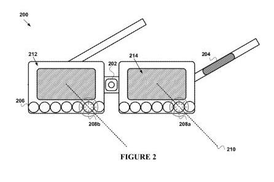
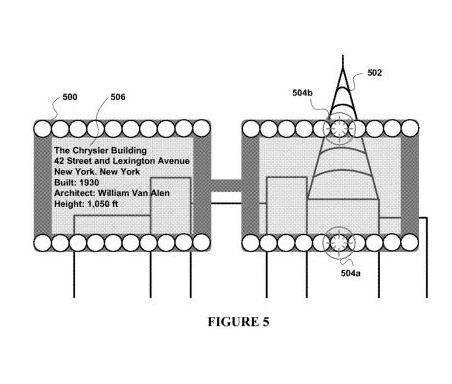

*Google Glasses have the potential to make a growing number of types of visual queries that are possible under [Google Goggles](http://www.google.com/mobile/goggles/#text) into an important aspect of the future of search and SEO. They also may make advertising using location based services much more effective. Are you planning ahead?*

Over the last three weeks, we’ve been seeing a stream of patents granted to Google involving their heads up display device, Project Glass. These include design patents, and utility patents that hint at things like a touchscreen on the side of the glasses, sonar sensors built into them, a visual display of sounds around the wearer of the glasses including direction and intensity. I wrote about the first two batches of patents in [Google Glasses Design Patents and Other Wearables](https://www.seobythesea.com/2012/05/google-glasses-design-patents-other-wearables/) and [More Google Glasses Patents: Beyond the Design](https://www.seobythesea.com/2012/05/more-google-glasses-patents-beyond-the-design/). Google was granted another related patent this past week titled [Methods and devices for augmenting a field of view](http://patft.uspto.gov/netacgi/nph-Parser?Sect1=PTO2&Sect2=HITOFF&p=1&u=%2Fnetahtml%2FPTO%2Fsearch-adv.htm&r=1&f=G&l=50&d=PALL&S1=08188880&OS=PN/08188880&RS=PN/08188880) this week, which “augments” the field of view of human beings by helping things that might be of interest stand out, even if they are beyond the normal view of a person in terms of distance or outside of a 180 degree peripheral viewing field.

In addition, the glasses might provide more detailed information about these “objects of interest” that may be pointed out by the glasses, as seen in the bottom image above, which provides details about the Chrysler building someone might be viewing with the glasses. Where might the information about these objects come from? Might they be powered by something like Google’s [Knowledge Base](https://www.seobythesea.com/2012/05/all-your-knowledge-bases-belong-to-google/) search results? The patent doesn’t make that connection for us, but it does tell us that, “a device for augmenting a field of view of a user may make use of a database that stores a plurality of objects of interest for the user.”

Google also [acquired](https://www.seobythesea.com/2012/04/google-acquires-glasses-patents/) a handful of augmented reality glasses patents in April, and a great number of [indoor/outdoor wireless patents](https://www.seobythesea.com/2012/04/google-acquires-indooroutdoor-wireless-location-patents/) from Terahop earlier this year that could be useful in making it possible that Google glasses can provide indoor location based services in places like airport terminals, train and bus stations, shopping malls, and other large public indoor spaces.

What hasn’t been discussed much publicly on many posts and articles about Google’s Project Glass is how it might be used with Google Goggles, and the many different kinds of visual queries that it may be possible to perform through that initiative. In [The Future of Google’s Visual Phone Search?](https://www.seobythesea.com/2011/02/the-future-of-googles-visual-phone-search/), I wrote about the kinds of queries that could someday be possible under the Google Goggles project. Some of them are already available. Here’s a list:

- Facial recognition search
- Optical Character Recognition (OCR) searches for text in images, signs, etc.
- Image-to-terms searches, which may recognize objects and search about them
- Product recognition searches, recognizing two dimensional images such as book covers and DVDs,and three dimensional images such as furniture
- Bar code recognition searches
- Named entity recognition searches, providing information about specific people, places, and things
- Landmark recognition searches, recognizing actual landmarks and possibly images advertised on billboards
- Place recognition searches, aided by geo-location information provided by something like a GPS receiver
- Color recognition searches, and
- Similar image searches, which look for images similar to the one that you’ve used as a query

Seems like the “objects of interest” database described in the newly granted Google patent could easily be powered by the visual queries from Google Glasses.

## New Google Goggles Patent

Google published a new patent application this week that ties together location information with object recognition to find a “canonical document” in response to a visual query.

Imagine that someone uses a photo feature in their camera built into their phone, or a pair of Google Glasses to use in a search. It could be a landmark, the sign of a business, a poster, or even a product box. Google might use optical character recognition to read text within the image, and find matching documents, or a canonical (or best) document to return in response to that querY. The pending patent is:

[Identifying Matching Canonical Documents in Response to a Visual Query and in Accordance with Geographic Information](http://appft.uspto.gov/netacgi/nph-Parser?Sect1=PTO1&Sect2=HITOFF&d=PG01&p=1&u=%2Fnetahtml%2FPTO%2Fsrchnum.html&r=1&f=G&l=50&s1=%2220120134590%22.PGNR.&OS=DN/20120134590&RS=DN/20120134590)
Invented by David Petrou, Ashok C. Popat, and Matthew R. Casey
US Patent Application 20120134590
Published May 31, 2012
Filed: December 1, 2011

Abstract

> A server system receives a visual query from a client system distinct from the server system. The server system performs optical character recognition (OCR) on the visual query to produce text recognition data representing textual characters, including a plurality of textual characters in a contiguous region of the visual query. The server system scores each textual character in the plurality of textual characters in accordance with the geographic location of the client system.
>
> The server system identifies, in accordance with the scoring, one or more high quality textual strings, each comprising a plurality of high quality textual characters from among the plurality of textual characters in the contiguous region of the visual query. Then the server system retrieves a canonical document having the one or more high quality textual strings and sends at least a portion of the canonical document to the client system.

Some important aspects of this approach:

The geographic location from where the search is performed becomes part of the query, which means that this could be tied into Google Maps very easily.

Both textual and non-textual elements within a picture would have queries performed upon them, so images that are parts of logos for businesses, for example, could be an integral part of this search as well.

Google would try to find a canonical, or “best” document or web page to return in response to a visual query of this type.

It’s possible that algorithms like those used for Google Maps might be used to find that canonical web page result in response to this type of visual query, or that elements of algorithms like those used for navigational searches (like a search for [ESPN] most likely being a request for the ESPN home page) may also play a role.

## Takeaways

How does someone do “SEO” for real world objects and places and signs? That’s one of the future challenges of SEO.

We may see more businesses including different types of bar-codes on their street signs and products and marketing images, and/or their URLs. We might also see more people making sure that their store front signs are cleaned up and easier to read by people and search engines.

Businesses that haven’t claimed their listings in Google Maps, or Google + pages, or [whatever hybrid of the two](http://blumenthals.com/blog/2012/05/30/google-places-pages-are-no-more-but-what-has-changed/) that Google is working upon these days should consider claiming both, and making them as rich and complete as possible.

I’m not sure yet how Google might work these types of queries into Google Analytics yet, but it will be interesting to see something that tells us about visual query referrals.

Google also [acquired technology from Ex Biblio](https://www.seobythesea.com/2011/03/text-is-your-url-google-acquireslicenses-exbiblio-b-v-technology/) last year that allows people to take pictures of articles in print to use to find bookmarkable online versions, take pictures of forms and auto-fill the fields on those forms, and perform similar activities as well. It’s likely that those types of features would work well with Project Glass.

Of course, paid search and display advertising will also undergo a transformation as well, not only in the way that those advertisements are presented, but also through the location-based services aspects of offers and advertisements available. Chances are that you will be able to turn on alerts for coupons and offers with your glasses that would give you the option of seeing those as you approached a store that might offer sales and discounts.

The [Virtual post it notes](https://www.seobythesea.com/2011/03/google-acquires-virtual-post-it-notes-patents/) technology that Google acquired last year might also be a useful addition to Project Glass that could trigger notes from friends, public service messages, and advertisements as you journey to certain places as well.
