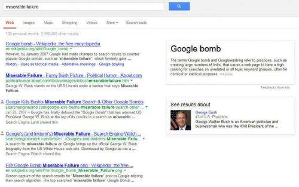

I’ve written about Google Bombs in the past, and how a bio page featuring President George Bush ranked highly on a search for “Miserable Failure” as a result of a Google Bomb, in a post from 2011 titled [How a Search Engine Might Fight Googlebombing](https://www.seobythesea.com/2011/01/how-a-search-engine-might-fight-googlebombing/).

In a post from earlier today, [Nemek Nowaczyk](https://twitter.com/nemekn) wrote [Google Bombing the Knowledge Graph: Whos a Liar?](https://www.mttr.io/blog/google/google-bombing-knowledge-graph/) He noticed that on a search for “liar” (in Polish), Poland’s Prime Minister Donald Tusk appears in the knowledge graph results for the search. Nemek sent me an email with a link to his post. Within seconds, I was typing one of the better known English language Google bomb phrases into a Google search, with a guess as to what I would see there.

Ok, so the top knowledge graph result on a search for “miserable failure” wasn’t George Bush. But a smiling George Bush was close enough to be a “see results about” disambiguation knowledge panel result.

Google probably didn’t intend the Polish Prime Minister to show up on a search in Polish for “liar,” or George Bush in an English language search for “miserable failure.” But it’s easy to understand how knowledge Graph Google Bombs might have slipped into results for the two. Are Knowledge Graph Google Bombs part of our future?

For more about Google knowledge panels, see my recent post on [How Google Decides What to Know in Knowledge Graph Results](https://www.seobythesea.com/2013/05/google-knowledge-graph-results/).
