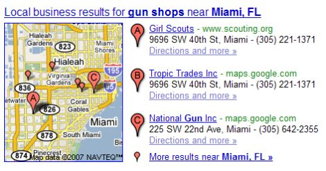

## Geographic Coding in Location Searches

You sometimes see some odd things when you perform searches on Google. For example, when I searched for [gun shops Miami Florida] I got this map amongst the results:

OK, I didn’t expect the Girl Scouts of America as the top result, and I find that part of the result pretty incomprehensible. But beyond that, it was interesting that I used “Florida” as my search term, and “FL” is shown as the query term in the search display that went with the map that shows up at the top of the search result.

Why did my query term change from the full state name to the abbreviation? I’ve been ending up with a lot of questions about location searches and if some geographic coding processes were being followed by Google to index and retrieve pages that involve locations.

## Location Searches

Before Universal Search as part of Google, maps had started showing up in Google’s results. If you searched for a business name or category with some geographic information included in your query, you may have received a map in your search results alongside a business listing or listings that may have been relevant to your search.

The queries that people use to search to cover many different intents and formats. One format for a query could be called a “location search.”

When a search engine attempts to respond to a conventional location search, it may look for the query to follow a fixed format, with a limited number of variations. For example, the search engine may look for certain words or terms in a pre-determined order (street name, state, zip code) and/or a pre-determined spelling.

This may raise some difficulties in responding to searches, when people make spelling errors in those searches, or use alternative names for locations, and alternative address formats (such as those found in different countries).

For location searches, many search engines will only return a single result in a response, so they need to be accurate, even when there might be uncertainty or ambiguity in the location search query used.

## Google Patent Filing on Geographic Coding

A patent application from Google, recently published at the World Intellectual Property Organization (WIPO), addresses some issues with how geographic coding in location searches is used.

Determining which keywords to use for a search in response to a query may include doing such things as removing punctuation marks and non-location terms from the location search query. Synonyms for one or more terms in the location search query may also be used, as well as pre-determined abbreviations corresponding to the one or more terms.

The process described also takes a look at whether to not a map should be shown within the search results and how many business locations should be shown on that map.

[Geographic Coding for Location Search Queries](https://patentscope.wipo.int/search/en/detail.jsf?docId=WO2007087629)
International Publication Date 02 August 2007
International Publication Number WO 2007/087629 A1
International Application Number PCT/US2007/061133
International Filing Date 26 January 2007
Invented by Florian Michel Buron, Ramesh Balakrishnan, James Norris, James Robert Muller, Thai Tran, and Lars Rasmussen

Abstract

> A method for performing a location search includes receiving a location search query, determining keywords corresponding to the location search query, identifying one or more documents that correspond to the keywords in the location search query, and providing to a client system information identifying at least one location corresponding to the one or more documents.

Some other strategies that might be used in finding results in response to a location search might include determining a canonical expression corresponding to the keywords (“FL” instead of “Florida”) and a score for the documents returned. The score used may look at:

- The frequency of the keywords in a number of documents,
- Matches between one or more words in a respective document with one or more of the keywords, and;
- Sizes of geographic features corresponding to the keywords.

## Performing searches for location search queries and providing corresponding results to users

A quick summary of the geographic coding process involved:

1) A location search query, such as a street address in a city, may be received from a searcher.

2) The query is processed to determine a canonical or Boolean expression. For example, “155 Abe Ave. Great Neck NY”, might be rewritten for the search – the street number 155 and the period may be removed, resulting in “Abe Ave Great Neck NY.”

The location search query could then be converted into a Boolean expression, including expanding abbreviations (such as Ave) and synonyms. The resulting Boolean expression is “Abe AND (Ave OR Avenue OR Street OR Lane OR Court OR …) AND (Great Neck) AND (NY OR (NEW YORK)).”

3) This processing may include determining one or more keywords in a respective location search query, removing punctuation marks and non-location terms (such as articles) from the location search query, and deciding upon one or more synonyms for one or more terms in the respective location search query.

4) Those synonyms may include predetermined abbreviations for and/or predetermined misspellings for terms in the query.

5) The canonical expression may be independent of the order of the keywords, so a street address may not have to be in the order that you might ordinarily find one, such as street number, street name, city, state, zip code.

6) The canonical expression could be compared to an index of geographic coding feature documents. Each geographical feature document has a set of tokens that correspond to a geographical feature, which may be a location (e.g., a street, city, country, state, country) or a geographical entity (e.g., lake, river, mountain, continent, ocean, etc.).

7) While a single geographical feature may correspond to a set of locations, such as a set of street addresses, all the locations associated with a geographical feature may be considered to be “a location” in the context of identifying the locations or geographical features that best match a location search query.

8) Location information and supplemental information may be found in the index. Location information may include keywords, synonyms for the keywords, and proximate objects for multiple locations. Supplemental information may include reference coordinates, such as latitude and longitude and/or a range of street numbers, for the locations.

9) Scores for a subset of the geographic feature documents that are a close match to a respective canonical expression may be returned, and the top-N geographic feature document may be ranked.

10) If the best score is more than a predetermined distance from the next best score, the location for the best score result may be presented to the searcher along with a map image of the corresponding location. The map image could be centered on the location and may be sized to include a pre-determined bounding box, region, or window around the corresponding location.

11) Several locations may be shown to the searcher if the best score is less than the predetermined multiple.

12) Such additional information as a location identifier (city, state, zip code, and/or country) and/or links to corresponding map images, may be shown.

## Geographic Coding Conclusion

I’ll be keeping an eye out for girl scouts the next time I’m in Miami. The patent filing doesn’t provide any insights into why they might show up number one for a search for gun shops there.

But it does provide a lot of details about how a query might be rewritten, and when a map might be displayed for a location search query.
