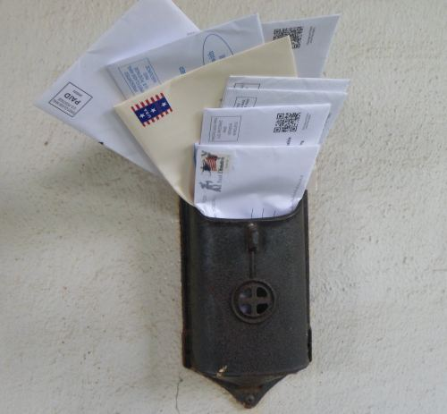

Google is experimenting with including emails in your search results. Of course, the emails you see will be personal to you, and won’t be shared with others. The emails will only be the ones that you received via Gmail, and the service is opt-in only. The announcement was made on August 8th, in the Google Official Blog post, [Building the search engine of the future, one baby step at a time](https://googleblog.blogspot.com/2012/08/building-search-engine-of-future-one.html)

Chances are that the rankings used to decide which emails to show, and the order of those emails is probably very similar to the [importance rankings](https://support.google.com/mail/answer/186543?hl=en) used to display different colored markers on your emails in Gmail. One of the good things about those importance ranking markers is that if you want, you can search and filter your Gmail emails by them if you want, as well as using other [advanced search filters](https://support.google.com/mail/answer/7190?hl=en&ctx=cb&src=cb&cbid=17uctihpugi9x&cbrank=5). But we don’t know exactly if the search from Gmail provides the same kind of ranking and results as the search results you might see when GMails are integrated into Google Web search.

What was really interesting in regards to Google including Gmail in Web search was that Google was assigned the rights to a patent from MailRank, Inc. that describes a way of ranking emails from services like Gmail, Yahoo mail, and email from Microsoft. The assignment was executed on June 18, 2012, but wasn’t recorded at the patent office until August 15, 2012.

There is a company named [Mailrank](https://sendgrid.com/) that announced a move of their engineers to Facebook on their homepage and Facebook page in November, and the move was [reported in Mashable](https://mashable.com/2011/11/15/facebook-mailrank/#Yi6g08iI28qo) as well. The names listed as inventors on the patent are David Cowan, Ethan Kurzweil and James Cham. A look at their LinkedIn profiles shows them to be active as venture partners, and don’t include Mailrank, Inc. in their past employment histories, but they were at the company that registered the [mailrank.com domain name](https://whois.domaintools.com/mailrank.com). According to a bio of Ethan Kurzweil, Mailrank, Inc. was “an internal BVP incubation” and Kurzweil was on the board of directors for Mailrank.

The Mailrank patent moved to Google, and the employees of the company appears to have moved to Facebook.

The patent is:

[Ranking messages in an electronic messaging environment](http://patft.uspto.gov/netacgi/nph-Parser?Sect1=PTO2&Sect2=HITOFF&p=1&u=%2Fnetahtml%2FPTO%2Fsearch-adv.htm&r=1&f=G&l=50&d=PALL&S1=08095612&OS=PN/08095612&RS=PN/08095612)
Invented by David Cowan, Ethan Kurzweil and James Cham
Assigned to MailRank, Inc.
US Patent 8,095,612
Granted January 10, 2012
Filed: September 18, 2009

Abstract

> The present invention provides methods and systems to score messages exchanged over a network. The methods and systems may gather message interactions of a recipient. A message originating from a sender and destined for the recipient may be received at an email client. A sender score of the message may be determined based on one or more of sender information, the gathered message interactions, and one or more attributes associated with the message. The message may be marked with the determined score in a user interface associated with the email client.

**MailRank Technology in GMail?**

So the big question I had when I saw that Google had acquired this patent is whether or not it was related to including Gmail in search results. We know about the importance rankings that GMail has that cause them to have different starred ratings.

Google introduced a Priority Inbox back in August of 2010, in the Official Google Enterprise Blog, with the post [Email overload? Try Priority Inbox](https://cloud.googleblog.com/2010/08/email-overload-try-priority-inbox.html). We’re told in that post that:

> Messages are automatically categorized as they arrive in your inbox. Gmail uses a variety of signals to predict which messages are important, including the people you email most and which messages you open and reply to (these are likely more important than the ones you skip over).

The new patent lays out a lot of signals that might be used to rank emails. Is it related to Google’s Priority Inbox? Many of the signals described in the description of Google’s importance rank sound similar to those in the Mailrank patent.

Here’s are the signals that Google revealed:

- Who you email: If you email Bob a lot, it’s likely that messages from Bob are important.
- Which messages you open: Messages you open are likely to be more important than those you skip over.
- What keywords spark your interest: If you always read messages about soccer, a new message that contains those same soccer words is more likely to be important.
- Which messages you reply to: If you always reply to messages from your mom, messages she sends are likely to be important.
- Your recent use of stars, archive and delete: Messages you star are probably more important than messages you archive without opening.

Here are some of the signals found in the MailRank patent:

- the recipient address (i.e., the recipient marked in the `To` field of the email),
- the addresses of recipients who are copied in the email (i.e., the recipients marked in the `CC` field of the email),
- the addresses of the recipients who have been marked in BCC,
- number of recipients,
- priority attached with the message,
- time of sending/receiving the message,
- content in the subject field of the message,
- sender score (i.e., sender information),
- sender’s ITM (Importance To Me),
- subject ITM,
- etc.

The sender’s score mentioned in the patent might be calculated looking at signals such as:

- an open email rate,
- a reply email rate,
- a delete email rate,
- rate of click-through of the hyperlinks received in an email,
- rate of download of the graphics,
- filing or archiving rate,
- etc.

The passage I found really interesting in the patent was this one about subject lines in emails:

> The ranking server may examine a message subject to distinguish potentially important messages from potentially less important messages. An example of such a distinction includes determining the importance of a first message with “There is a problem with your order” as the subject compared a second message with “Thank you for your order” as the subject.
>
> In the example, the first message may be assigned a higher score than the second message because the second message may be of a more informational nature than the first message.

**Implications of GMail Rankings**

You may be a marketer, and hope that your email gets seen and opened by its recipient. Having your email be ranked highly so that it shows up in GMail search results could be helpful.

You might be a co-worker, and want to make sure that your email gets seen and responded to. A subject line like “Client Name – Important Problem with XXXX” might rank more highly than one with a subject line like “Quick Question.”

I did look through a good number of articles about best practices for emails, and found the following which I thought could be helpful.

- [From Subject Line To Signature: How to Do Work E-Mail Right](https://www.forbes.com/sites/jacquelynsmith/2012/07/11/from-subject-line-to-signature-how-to-do-work-e-mail-right/#f714fe37803d)
- [Writing Effective Email: Top 10 Email Tips](https://jerz.setonhill.edu/writing/e-text/email/)
- [Microcontent: How to Write Headlines, Page Titles, and Subject Lines](https://www.nngroup.com/articles/microcontent-how-to-write-headlines-page-titles-and-subject-lines/)
