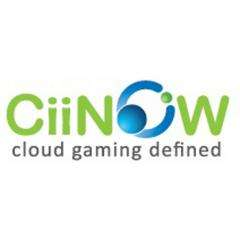
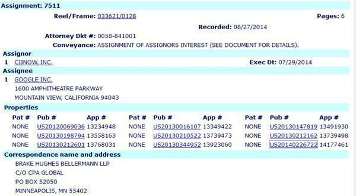

Google was officially assigned the pending patent applications from CiiNow last Wednesday (August 27, 2014) in a transaction that was reported as being executed at the end of July.

From searching through the USPTO, I don’t see any other patents assigned to CiiNow, so that appears to have been all they owned. The USPTO assignments don’t include financial details, so that information is unavailable.

The Ciinow.com website appears to be completely unresponsive to visits. The LinkedIn profile of CiiNow Co-Founder and VP of Engineering Devendra (Deven) Raut left CiiNow in 2014 and joined Google as a Tech Biz Dev. It looks to me that Google acquired CiiNow, Inc.

One of the most recent articles I can find about CiiNow is from March of 2014, CiiNOW, Inc. Announces Participation at CableLabs Winter Conference Innovation Showcase.

The article tells us about Ciinow’s cloud-based gaming experience and platform, and that:

> The company’s patent-pending hardware and server management technology are architected to maximize virtualized data center environments to deliver video games through PCs, Macs, set-top boxes, tablets, smart TVs, and mobile devices.
>
> The CiiNOW platform, Cumulus, moves beyond the world of software upgrades and hardware constraints and enables service providers and game developers to capitalize on the lucrative gaming market as it transitions from physical media to pure digital distribution.

The patents are:

[Method and Mechanism for Delivering Applications over a Wan](http://appft.uspto.gov/netacgi/nph-Parser?Sect1=PTO1&Sect2=HITOFF&d=PG01&p=1&u=%2Fnetahtml%2FPTO%2Fsrchnum.html&r=1&f=G&l=50&s1=%2220120069036%22.PGNR.&OS=DN/20120069036&RS=DN/20120069036)
Invented by Makarand Dharmapurikar
US Patent Application 20120069036
Published March 22, 2012
Filed: September 16, 2011

Abstract

> An improved approach for a remote graphics rendering system that can utilize both server-side processing and client-side processing for the same display frame.
>
> Some techniques for optimizing a set of graphics command data to be sent from the server to the client include: eliminating some or all data, that is not needed by a client GPU to render one or more images, from the set of graphics command data to be transmitted to the client; applying precision changes to the set of graphics command data to be transmitted to the client; and performing one or more data type compression algorithms on the set of graphics command data.

**********

[Method and Mechanism for Efficiently Delivering Visual Data Across a Network](http://appft.uspto.gov/netacgi/nph-Parser?Sect1=PTO1&Sect2=HITOFF&d=PG01&p=1&u=%2Fnetahtml%2FPTO%2Fsrchnum.html&r=1&f=G&l=50&s1=%2220130198794%22.PGNR.&OS=DN/20130198794&RS=DN/20130198794)
Invented by Makarand Dharmapurikar
United States Patent Application 20130198794
Published August 1, 2013
Filed: July 25, 2012

Abstract

> Disclosed is an approach for delivering visual content that improves network bandwidth utilization. The visual data is separated into multiple categories, where the data for different categories are delivered using different bandwidth utilization schemes. A first category of the data is delivered at a higher frame rate than the frame rate for a second category of the data.

**********

[Method and System For Maintaining Game Functionality for a Plurality of Game instances Running On a Computer System](http://appft.uspto.gov/netacgi/nph-Parser?Sect1=PTO1&Sect2=HITOFF&d=PG01&p=1&u=%2Fnetahtml%2FPTO%2Fsrchnum.html&r=1&f=G&l=50&s1=%2220130212601%22.PGNR.&OS=DN/20130212601&RS=DN/20130212601)
Invented by Makarand Dharmapurikar and Gregory Mitchell Stefanek
United States Patent Application 20130212601
Published August 15, 2013
Filed: February 15, 2013

Abstract

> A container layer for allowing a plurality of game instances running on an operating system to maintain full game functionality is configured to intercept communication from a game instance of the plurality of game instances to the operating system and provide an appropriate response to the intercepted communication.

**********

[Method And Mechanism For Performing Both Server-Side And Client-Side Rendering Of Visual Data](http://appft.uspto.gov/netacgi/nph-Parser?Sect1=PTO1&Sect2=HITOFF&d=PG01&p=1&u=%2Fnetahtml%2FPTO%2Fsrchnum.html&r=1&f=G&l=50&s1=%2220130016107%22.PGNR.&OS=DN/20130016107&RS=DN/20130016107)
Invented by Makarand Dharmapurikar
United States Patent Application 20130016107
Published January 17, 2013
Filed: January 12, 2012

Abstract

> Disclosed is an approach for providing an improved approach for rendering graphics that can utilize both server-side rendering and client-side rendering for the same display frame. In this way, the different visual objects within the same frame can be rendered using either approach, either at the server or the client.

**********

[Data Center Architecture For Remote Graphics Rendering](http://appft.uspto.gov/netacgi/nph-Parser?Sect1=PTO1&Sect2=HITOFF&d=PG01&p=1&u=%2Fnetahtml%2FPTO%2Fsrchnum.html&r=1&f=G&l=50&s1=%2220130210522%22.PGNR.&OS=DN/20130210522&RS=DN/20130210522)
Invented by Makarand Dharmapurikar
United States Patent Application 20130210522
Published August 15, 2013
Filed: January 11, 2013

Abstract

> A data center architecture for remote rendering includes a hardware processor, a memory, a storage device, a graphics processor, a virtual machine monitor functionally connected to the hardware processor, memory, and storage device, one or more virtual machine game servers functionally connected to the virtual machine monitor, each virtual machine game server including a virtual processor, a virtual memory, a virtual storage, a virtual operating system, and a game binary executing under the control of the virtual operating system;
>
> a virtual machine rendering server functionally connected to the virtual machine monitor and functionally connected to the graphics processor, the virtual machine rendering server including:
>
> a virtual memory, virtual storage, a virtual operating system, and one or more renderers.

**********

[Method And System For Generating Signatures And Locating/Executing Associations For A Game Program](http://appft.uspto.gov/netacgi/nph-Parser?Sect1=PTO1&Sect2=HITOFF&d=PG01&p=1&u=%2Fnetahtml%2FPTO%2Fsrchnum.html&r=1&f=G&l=50&s1=%2220130344952%22.PGNR.&OS=DN/20130344952&RS=DN/20130344952)
Invented by Makarand Dharmapurikar
United States Patent Application 20130344952
Published December 26, 2013
Filed: June 20, 2013

Abstract

> Disclosed are a method and system for generating signatures and locating/executing associations for a game program. In this way, hints about particular gameplay contexts for the game program may be automatically located for a user without requiring the user to manually locate the hint.

**********

[Method And Mechanism For Performing Both Server-Side And Client-Side Rendering Of Visual Data](http://appft.uspto.gov/netacgi/nph-Parser?Sect1=PTO1&Sect2=HITOFF&d=PG01&p=1&u=%2Fnetahtml%2FPTO%2Fsrchnum.html&r=1&f=G&l=50&s1=%2220130147819%22.PGNR.&OS=DN/20130147819&RS=DN/20130147819)
Invented by Makarand Dharmapurikar
United States Patent Application 20130147819
Published June 13, 2013
Filed: June 8, 2012

Abstract

> Disclosed is an approach for providing an improved approach for rendering graphics that can utilize both server-side rendering and client-side rendering for the same display frame. In this way, the different visual objects within the same frame can be rendered using either approach, either at the server or the client.

**********

[Control Structure For Content Delivery And Management](http://appft.uspto.gov/netacgi/nph-Parser?Sect1=PTO1&Sect2=HITOFF&d=PG01&p=1&u=%2Fnetahtml%2FPTO%2Fsrchnum.html&r=1&f=G&l=50&s1=%2220130212162%22.PGNR.&OS=DN/20130212162&RS=DN/20130212162)
Invented by Gurudas Somadder
United States Patent Application 20130212162
Published August 15, 2013
Filed: January 11, 2013

Abstract

> A method for providing content delivery and management to a client device that includes mapping the client device to a corresponding controller, presenting available content to the client device, determining data centers available to service the client device, and initializing a data center to service content requested by the client.

**********

[Label Based Approach For Video Encoding](http://appft.uspto.gov/netacgi/nph-Parser?Sect1=PTO1&Sect2=HITOFF&d=PG01&p=1&u=%2Fnetahtml%2FPTO%2Fsrchnum.html&r=1&f=G&l=50&s1=%2220140226722%22.PGNR.&OS=DN/20140226722&RS=DN/20140226722)
Invented by Makarand Dharmapurikar, Alexander Izorski, and Justin Bischoff
United States Patent Application 20140226722
Published August 14, 2014
Filed: February 11, 2014

Abstract

> Disclosed is an approach for encoding a current video frame that includes labeling points/regions for the current video frame using graphics information for the current video frame, matching the points/regions of the current video frame with points/regions of a previous video frame using the labels for the points/regions of the current video frame and deriving motion vectors for the points/regions of the current video frame.

**********

I sent an email to Google to ask about whether CiiNow was acquired by them, and if they respond I will share what I find out here.

I have received a response from a Google spokesperson who told me that, “some CiiNow employees have joined Google, and Google purchased some of the assets of CiiNow in connection with that
hiring.”

So we don’t know much of the details, but we do have a confirmation that more than one CiiNow employee has joined Google. There may be more patents involved, or that were acquired, but the ones above are all the ones that were assigned at the USTPO to CiiNow. The last one on my list was filed in February of 2014, so there may be more.

Given Google’s entrance into providing internet access through Google Fiber, and Google’s healthy video presence on the Web, it will be interesting to see where this leads to next.
