In my last couple of posts, I wrote about the [acquisition](https://www.seobythesea.com/2011/07/google-acquires-ibm-patents-in-july/) of over [1,000 patents](https://www.seobythesea.com/2011/07/googles-new-patents-from-ibm/) from IBM by Google. There are a number of reasons why a company might acquire a patent. In the case of the IBM patents, it’s likely that many of those will be used to protect Google from patent infringement litigation. It’s possible that some might be considered as launching points for the development of technology or processes that the company could use internally, or may offer to others outside of Google itself.

Some other recent patent acquisitions by Google include patents from [Exbiblio](https://www.seobythesea.com/2011/03/text-is-your-url-google-acquireslicenses-exbiblio-b-v-technology/), from [Widevine](https://www.seobythesea.com/2010/12/implications-of-googles-acquisition-of-widevine/), the phone patents from [Myriad Group](https://www.seobythesea.com/2010/12/googles-acquisition-of-myriad-group-phone-patents/), more phone related patents from [Verizon](https://www.seobythesea.com/2010/12/is-google-now-a-phone-company/), and a number of memory chip related patents from [Metaram](https://www.seobythesea.com/2009/11/google-to-upgrade-its-memory-assigned-startup-metarams-memory-chip-patents/), amongst others.

While many of those have the flavor of patents acquired to either help protect Google from patent litigation or to help them develop new technologies, a pair of patents recorded in the USPTO assignment database this Thursday, assigning the interests of Successes.com in those patents to Google, have a different taste to them. [Successes.com](http://www.successes.com/) is a company run by veteran broadcaster Jan Ziff (a correspondent for the BBC, the State Department, Voice of America, Associated Press, Mutual Radio, and National Public Radio’s Morning Edition and All Things Considered) and her executive producer on the 20 year CBS international news show Sound*Bytes, Allan Davidson. The testimonials page from successes.com includes many from some fairly large tech companies, including Nextel, America Online, Red Hat, Zonelabs, and this one from Google:

> “… very easy to work with, and … Consistently deliver quality work in a timely manner …”

I don’t know if the patent assignments indicate an acquisition of Successes.com, Inc., by Google, a hiring of the people behind the company, or an acknowledgment and reward to valued business partners. The processes described in the patent appear to describe the business model behind successes.com, but the successes.com site seems to still be up and running at this point. The patents are:

[Content development management system and method](http://patft.uspto.gov/netacgi/nph-Parser?Sect1=PTO2&Sect2=HITOFF&p=1&u=%2Fnetahtml%2FPTO%2Fsearch-adv.htm&r=1&f=G&l=50&d=PALL&S1=06697821&OS=PN/06697821&RS=PN/06697821)
Invented by Susan Janette Ziff and Allan L. Davidson
Assigned to Successes.com, Inc.
US Patent 6,697,821
Granted February 24, 2004
Filed: May 8, 2001

Abstract

> A system and method for content development management is provided which increases the speed, quality control and accuracy of the content generation process and reduces the cost of the content generation process by providing the steps of the content generation process in a single integrated system.
>
> The system also permits the users of the system to work at different times of the day and in different geographic locations. The system also permits the users of the system to rapidly determine the current status of any content in the system.
>
> The system may be used to generate various different types of content including written content, such as success stories, stories, articles, advertisements, auditory content, such as radio spots, radio advertisements, radio presentations, electronic downloaded auditory content, audiovisual content that combines audible content and written content and visual content including television video or video data.

[Story workflow management system and method](http://patft.uspto.gov/netacgi/nph-Parser?Sect1=PTO2&Sect2=HITOFF&u=%2Fnetahtml%2FPTO%2Fsearch-adv.htm&r=6&p=1&f=G&l=50&d=PTXT&S1=ziff.INNM.&OS=in/%28ziff%29&RS=IN/ziff)
Invented by Susan Janette Ziff and Allan L. Davidson
Assigned to Successes.com, Inc.
US Patent 6,557,013
Granted April 29, 2003
Filed: March 15, 2000

Abstract

> A system and method for story creation workflow management is provided which increases the speed, quality control and accuracy and reduces the cost of the story creation process by providing the steps of the story creation process in a single integrated system. The system also permits the users of the system to work at different times of the day and in different geographic locations. The system also permits the users of the system to rapidly determine the current status of any story in the system.

The patents show a richly detailed online process for building case studies, corporate biographies, and other content. These include screens that customers can fill out to provide information, other screens that writers can use to use that information and other sources to create rich articles and other content, forms and checklists that editors can use to verify sources and check facts and provide suggestions for updates and revisions. The following three are some of the introductory forms:

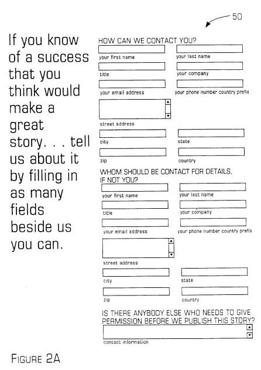
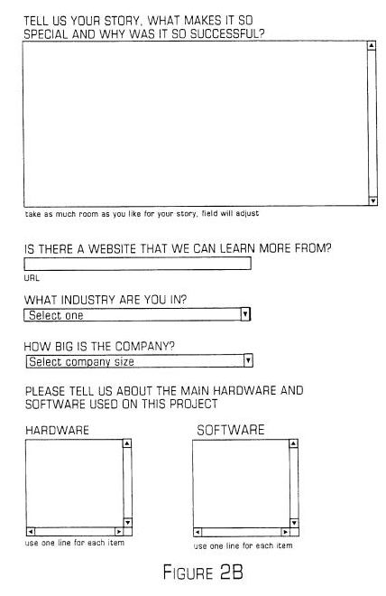
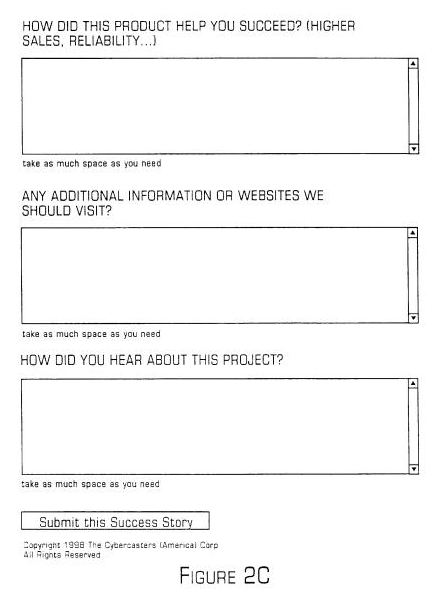

The images from the patent also show a number of screens for an editor, including checklists of steps that need to be taken in the creation of a document. For example:

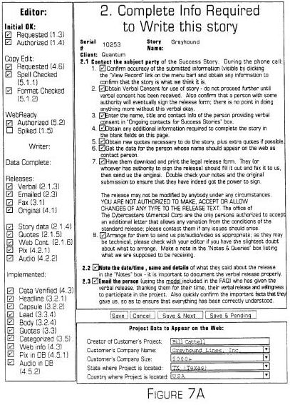

There are also a number of detailed screens showing steps for a writer to take, including verification of releases from contributors of information and images, spell checking, keywords to be used, and more:
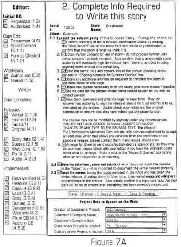

Most of the images above were taken from the *Story Workflow* patent images. The *Content development management* patent describes a content management system that includes this kind of information, and a way to search for stories, to collaborate upon them, to rate them, and to manage the whole process so that a corporation like Google can use the system. That patent shows some examples of how Google might use a system like this, and I’ve included a number of images from that process:
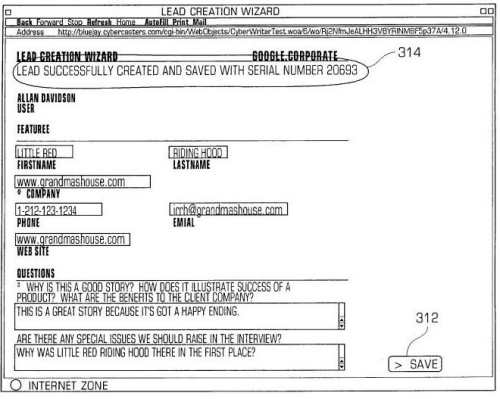

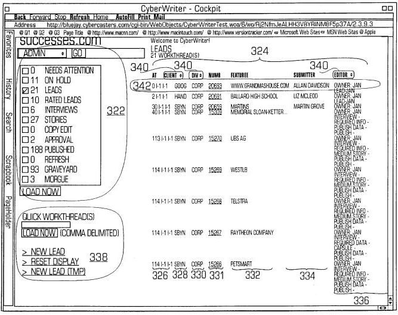
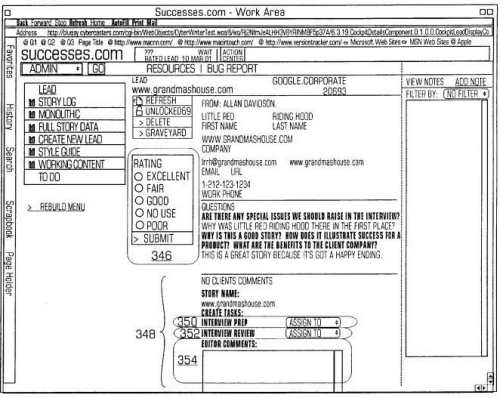
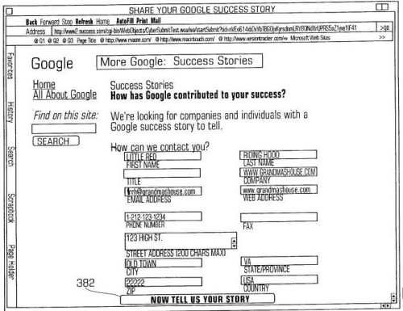
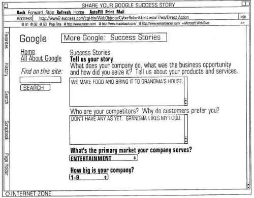
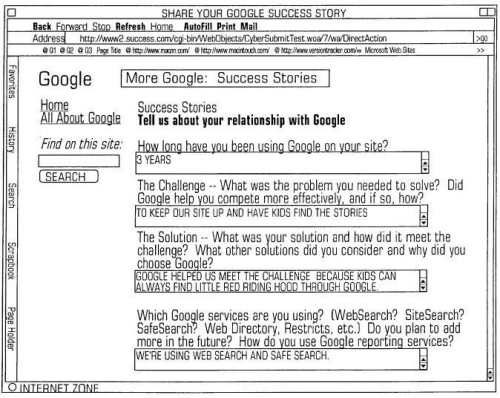
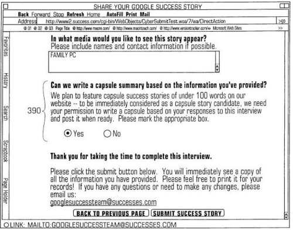

I’ve been involved in the creation of workflow processes in the past while working within Delaware’s court system and as an internet marketer. Creating detailed workflows make it possible not only to develop high-quality content and to make sure that every step necessary is accomplished well, but they also give you a chance to study what you do and improve upon it.

One of the difficulties of creating a detailed and useful workflow like this is that much of it involves [tacit knowledge](https://en.wikipedia.org/wiki/Tacit_knowledge) or illustrating a “know-how” involved in doing something that might make it difficult for one person to step into someone else’s job and perform up to the same level. The storytelling and content development systems described in these patents can make that a lot easier.

I’ve included a good number of the images from these two patents, and there are more than give us some other views involving managing this content creation process as well as some more examples. After reading through the patents and viewing the images, it’s understandable why Google would value working with successes.com, and would find value this kind of knowledge transfer.
