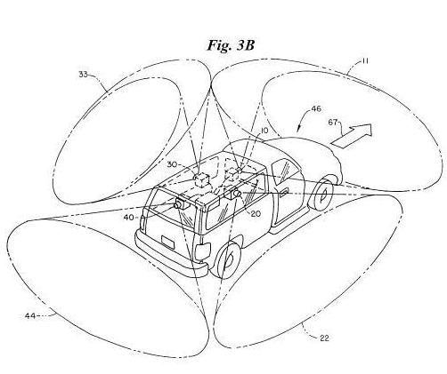
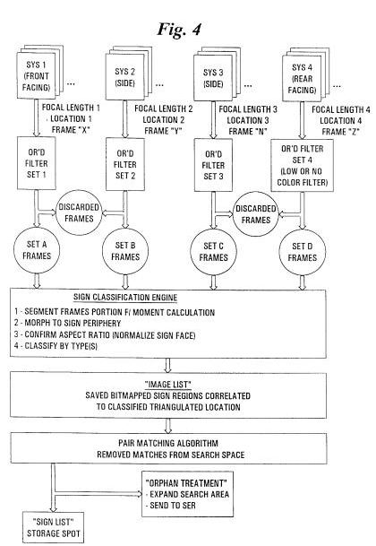

Google’s not the only business that’s been driving around making videos of the streets of the United States. Facet Technology, which lists Bing as one of their [technology partners](https://web.archive.org/web/20080517164746/http://www.facet-tech.com/partners.htm), does [something similar](https://www.directionsmag.com/article/2584) and offers navigation and location-based services data and software. Back in 2009, Facet Technology and TomTom struck up a deal allowing TomTom to [license Facet patented technology](http://web.archive.org/web/20111108234056/http://www.facet-tech.com/News/Facet%20-%20Tom%20TomsSettleLegalDispute.html). It appears from a January/February 2010 report from topographic science Professor Gordon Petrie for [Geoinformatics](https://geoinformatics.com/), that Facet Technology provided street-level images for Microsoft in their initial demos for that service in 2006. (The [Windows Live Local SUV](https://www.engadget.com/2007-06-21-windows-live-local-suv-spotted-in-sacramento.html) pictured in that report looks similar to the image below from a Facet Technology patent.)

From the USPTO assignments database, it appears that Google has acquired Facet Technologies’ interest in the assignment of a number of their patents, which I’ve listed below. The execution data on the assignments is listed as June 21, 2011, and the assignments were recorded with the patent office on August 8, 2010. The USTPO database doesn’t provide any details behind the transaction, such as costs or other considerations involved or licensing agreements that Facet Tech might have in place with other companies, or if Google acquired the company, its maps databases, or just some of its intellectual property.

The technology may potentially help Google with Google Maps, Google Navigation, Google StreetView, and possibly even its efforts towards self-driving cars. In addition, it may help the search engine avoid possible patent infringement lawsuits involving those technologies. It’s also possible that some of the technologies described within the Facet Technology’s patents might be useful in helping Google further develop those projects and others.

An article from Twice Mobile from 2009 quotes co-founder James Tetteranth on some of the features that Facet Technologies maps and database provided back then that other mapping services didn’t:

> Retterath said Facet maps indicate stop signs, speed limits, traffic lights, and 3-D heights of the roads to provide slope data, creating attributes not often found on other maps. He further claimed that his maps are accurate to 7 feet or less, which is more precise than current maps, he stated.

A number of the patents involved are either [continuations](https://en.wikipedia.org/wiki/Continuing_patent_application) of earlier filed patents or are [divisional](https://en.wikipedia.org/wiki/Divisional_patent_application) patents. The first five patents share an abstract and the same set of images.

[Method and apparatus for rapidly determining whether a digitized image frame contains an object of interest](http://patft.uspto.gov/netacgi/nph-Parser?Sect1=PTO2&Sect2=HITOFF&u=%2Fnetahtml%2FPTO%2Fsearch-adv.htm&r=1&p=1&f=G&l=50&d=PTXT&S1=6449384.PN.&OS=pn/6449384&RS=PN/6449384)
Invented by Robert Anthony Laumeyer and James Eugene Retterath
Assigned to Facet Technology Corp
US Patent 6,449,384
Granted September 10, 2002
Filed: January 29, 2001

[Method and apparatus for identifying objects depicted in a videostream](http://patft.uspto.gov/netacgi/nph-Parser?Sect1=PTO2&Sect2=HITOFF&u=%2Fnetahtml%2FPTO%2Fsearch-adv.htm&r=1&p=1&f=G&l=50&d=PTXT&S1=6266442.PN.&OS=pn/6266442&RS=PN/6266442)
Invented by Robert Anthony Laumeyer and James Eugene Retterath
US Patent 6,266,442
Granted July 24, 2001
Filed: October 23, 1998

[Method and apparatus for identifying objects depicted in a videostream](http://patft.uspto.gov/netacgi/nph-Parser?Sect1=PTO2&Sect2=HITOFF&u=%2Fnetahtml%2FPTO%2Fsearch-adv.htm&r=1&p=1&f=G&l=50&d=PTXT&S1=6625315.PN.&OS=pn/6625315&RS=PN/6625315)
Invented by Robert Anthony Laumeyer and James Eugene Retterath
Assigned to Facet Technology Corp
US Patent 6,625,315
Granted September 23, 2003
Filed: September 16, 2002

[Method and apparatus for identifying objects depicted in a videostream](http://patft.uspto.gov/netacgi/nph-Parser?Sect1=PTO2&Sect2=HITOFF&u=%2Fnetahtml%2FPTO%2Fsearch-adv.htm&r=1&p=1&f=G&l=50&d=PTXT&S1=7092548.PN.&OS=pn/7092548&RS=PN/7092548)
Invented by Robert Anthony Laumeyer and James Eugene Retterath
Assigned to Facet Technology Corp
US Patent 7,092,548
Granted August 15, 2006
Filed: August 5, 2003

[Method and apparatus for identifying objects depicted in a videostream](http://patft.uspto.gov/netacgi/nph-Parser?Sect1=PTO2&Sect2=HITOFF&u=%2Fnetahtml%2FPTO%2Fsearch-adv.htm&r=1&p=1&f=G&l=50&d=PTXT&S1=7444003.PN.&OS=pn/7444003&RS=PN/7444003)
Invented by Robert Anthony Laumeyer and James Eugene Retterath
Assigned to Facet Technology Corp
US Patent 7,444,003
Granted October 28, 2008
Filed: July 13, 2006

Abstract

> The present invention relates to an apparatus for rapidly analyzing frame(s) of digitized video data, which may include objects of interest randomly distributed throughout the video data and wherein said objects are susceptible to detection, classification, and ultimately identification by filtering said video data for certain differentiable characteristics of said objects.
>
> The present invention may be practiced on pre-existing sequences of image data or may be integrated into an imaging device for real-time, dynamic, object identification, classification, logging/counting, cataloging, retention (with links to stored bitmaps of the said object), retrieval, and the like. The present invention readily lends itself to the problem of automatic and semi-automatic cataloging of vast numbers of objects such as traffic control signs and utility poles disposed of in myriad settings. When used in conjunction with navigational or positional inputs, such as GPS, an output from the inventive system indicates the identity of each object, calculates object location, classifies each object by type, extracts legible text appearing on a surface of the object (if any), and stores a visual representation of the object in a form dictated by the end-user/operator of the system.
>
> The output lends itself to examination and extraction of scene detail, which cannot practically be successfully accomplished with just human viewers operating video equipment, although a human intervention can still be used to help judge and confirm a variety of classifications of certain instances and for types of identified objects.

The next two patients also share an abstract.

[Methods and apparatus for automated true object-based image analysis and retrieval](http://patft.uspto.gov/netacgi/nph-Parser?Sect1=PTO2&Sect2=HITOFF&u=%2Fnetahtml%2FPTO%2Fsearch-adv.htm&r=1&p=1&f=G&l=50&d=PTXT&S1=7590310.PN.&OS=pn/7590310&RS=PN/7590310)
Invented by Robert Anthony Laumeyer and James Eugene Retterath
Assigned to Facet Technology Corp
US Patent 7,590,310
Granted September 15, 2009
Filed: May 5, 2005

[Methods and apparatus for automated true object-based image analysis and retrieval](http://appft.uspto.gov/netacgi/nph-Parser?Sect1=PTO2&Sect2=HITOFF&u=%2Fnetahtml%2FPTO%2Fsearch-adv.html&r=1&p=1&f=G&l=50&d=PG01&S1=20100082597.PGNR.&OS=dn/20100082597&RS=DN/20100082597)
Invented by Robert Anthony Laumeyer and James Eugene Retterath
Assigned to Facet Technology Corp
US Patent Application 20100082597
Published April 1, 2010
Filed: September 14, 2009

Abstract

> The present invention is an automated and extensible system for the analysis and retrieval of images based on region-of-interest (ROI) analysis of one or more true objects depicted by an image. The system uses a Regions Of Interest (ROI) database that is a relational or analytical database containing searchable vectors that represent the images stored in a repository. Entries in the ROI database are created by an image locator and ROI classifier that work in tandem to locate images within the repository and extract the relevant information that will be stored in the ROI database.
>
> Unlike existing region-of-interest search systems, the ROI classifier analyzes objects in an image to arrive at the actual features of the true object, instead of merely describing the features of the image of that object. Graphical searches are performed by the collaborative workings of an image retrieval module, an image search requestor, and an ROI query module. The image search requestor is an abstraction layer that translates user or agent search requests into the language understood by the ROI query.

[System for automatically generating a database of objects of interest by analysis of images recorded by moving vehicle](http://patft.uspto.gov/netacgi/nph-Parser?Sect1=PTO2&Sect2=HITOFF&u=%2Fnetahtml%2FPTO%2Fsearch-adv.htm&r=1&p=1&f=G&l=50&d=PTXT&S1=6363161.PN.&OS=pn/6363161&RS=PN/6363161)
Invented by Robert Anthony Laumeyer and James Eugene Retterath
Assigned to Facet Technology Corp
US Patent 6,363,161
Granted March 26, 2002
Filed: June 18, 2001

Abstract

> A system for automatically generating a database of images and positions of objects of interest identified from video images depicting roadside scenes that are recorded from a vehicle navigating a road and having a system that stores location metrics for the video images.

[Method and apparatus for generating a database of road sign images and positions](http://patft.uspto.gov/netacgi/nph-Parser?Sect1=PTO2&Sect2=HITOFF&u=%2Fnetahtml%2FPTO%2Fsearch-adv.htm&r=1&p=1&f=G&l=50&d=PTXT&S1=6453056.PN.&OS=pn/6453056&RS=PN/6453056)
Invented by Robert Anthony Laumeyer and James Eugene Retterath
Assigned to Facet Technology Corp
US Patent 6,453,056
Granted September 17, 2002
Filed: March 20, 2001

Abstract

> A method and apparatus for automatically generating a database of road sign images and positions where the road signs are identified from video images depicting roadside scenes that are recorded from a vehicle navigating a road and having a system that stores location information.
