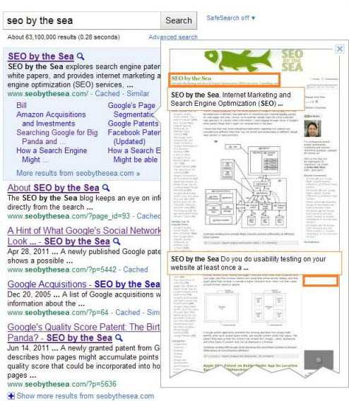

On December 12, 2007, Girafa.com Inc. filed a lawsuit against Amazon Web Services and a number of other parties for patent infringement over a patent titled [Framework for providing visual context to www hyperlinks](http://patft.uspto.gov/netacgi/nph-Parser?Sect1=PTO2&Sect2=HITOFF&u=%2Fnetahtml%2FPTO%2Fsearch-adv.htm&r=1&p=1&f=G&l=50&d=PTXT&S1=6,864,904.PN.&OS=pn/6,864,904&RS=PN/6,864,904) (6,864,904).

The case claimed that defendants Amazon Web Services LLC, Amazon.com, Inc., Alexa Internet, Inc., IAC Search & Media, Inc., Snap Technologies, Inc., Yahoo! Inc., Smartdevil Inc., Exalead, Inc. and Exalead S.A. were infringing upon Girafa.com’s patent by displaying thumbnail images of websites as described in Girafa.com’s patent. The case was closed in The Delaware District Court for the District of Delaware in September of 2009 after claims against the parties involved were either dismissed or settled or both.

Google wasn’t a named party in the suit, but has been displaying Instant Previews of websites [on desktop search results](https://googleblog.blogspot.com/2010/11/beyond-instant-results-instant-previews.html) since last November, and on search results [on mobile devices](https://googleblog.blogspot.com/2011/03/instant-previews-now-available-on.html) since March 8, 2011. Earlier this month, Google was assigned the Girafa.com patent at the heart of the earlier lawsuit, along with an updated continuation patent.

The patents cover the display of a preview thumbnail of a page associated with a hyperlink pointing to that page, like in the image below:

_A screenshot of Google’s search results on a search for [SEO by the Sea] with an Instant Preview of the page being displayed._

The patents were recorded as assigned to Google on June 9th, 2011.

[Framework for providing visual context to WWW hyperlinks](http://patft.uspto.gov/netacgi/nph-Parser?Sect1=PTO2&Sect2=HITOFF&u=%2Fnetahtml%2FPTO%2Fsearch-adv.htm&r=1&p=1&f=G&l=50&d=PTXT&S1=7716569.PN.&OS=pn/7716569&RS=PN/7716569)
Invented by Shirli Ran, Eldad Barnoon, Yuval Yarom
Assigned to Girafa.com Inc.
US Patent 7,716,569
Granted May 11, 2010
Filed: January 5, 2005

Abstract

> A method and a system for presenting Internet information to a user including providing to a user a visual image of a web page containing at least one hyperlink, and at least partially concurrently providing a visual image of another web page of at least one web site which is represented by the at least one hyperlink.

[Framework for providing visual context to www hyperlinks](http://patft.uspto.gov/netacgi/nph-Parser?Sect1=PTO2&Sect2=HITOFF&u=%2Fnetahtml%2FPTO%2Fsearch-adv.htm&r=1&p=1&f=G&l=50&d=PTXT&S1=6,864,904.PN.&OS=pn/6,864,904&RS=PN/6,864,904)
Invented by Shirli Ran, Eldad Barnoon, Yuval Yarom
Assigned to Girafa.com Inc.
US Patent 6,864,904
Granted March 8, 2005
Filed: November 8, 2000

Abstract

> A method and a system for presenting Internet information to a user including providing to a user a visual image of a web page containing at least one hyperlink, and at least partially concurrently providing a visual image of another web page of at least one web site which is represented by the at least one hyperlink.

**Conclusion**

On its face, it seems somewhat obvious to me that people might show thumbnails of webpages associated with links pointing to those pages, but in spite of that, Girafa.com was granted a patent for doing so and launched a pretty significant legal battle against some of the biggest sites on the Web over the patent.

The patents themselves are silent on the possibility that the use of the images from other sites might be considered copyright infringement, and it’s possible that the use of a small enough thumbnail might be considered fair use. The use of thumbnail images in Google’s image search was at the heart of a couple of German legal battles [resolved in Google’s favor](https://europe.googleblog.com/2010/04/german-supreme-court-rules-that-image.html) last year. Google originally [lost](https://arstechnica.com/tech-policy/2008/10/german-court-google-image-thumbnails-infringe-on-copyright/) in Germany until the German Supreme Court overturned the cases.

The acquisition of these two patents from Girafa.com don’t appear to add any new technological abilities to Google, and it’s impossible to tell if Google acquired Girafa.com Inc., or just the patents. The company’s website is still online and offering services. The acquisition of the patents appears to be a defensive move, aimed at protecting Google from potential patent infringement litigation over the use of thumbnails associated with the specific web address in search results.

Google recently [filed the opening bid](https://www.seobythesea.com/2011/04/googles-first-bid-on-nortel-patents-a-transformative-moment/) on over 6,000 patents from Nortel for an auction that will be held towards the end of this month, and told us that one of their primary motivations was to acquire a patent portfolio that could help them against patent infringement cases in the future. It’s quite possible that some of those patents also contain inventions that Google could develop as well, as they continue to move into the wireless and mobile marketplace.
