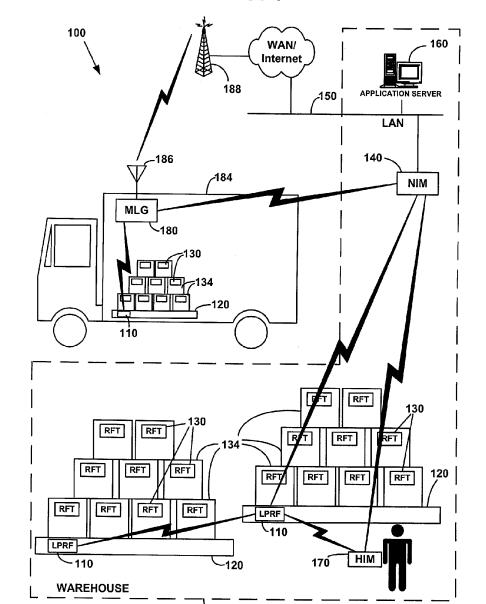

It’s no surprise that Google wants to not only map and provide location-based services in the world outdoors, but also for the insides of shopping malls, airports, museums, transit stations, and other large indoor spaces. A couple of recent tech posts brought to light an effort by Google to use a new chip from broadcom to possibly start supporting indoor positioning location and directions. From extremetech, we learned more about this technology in [Think GPS is cool? IPS will blow your mind](https://www.extremetech.com/extreme/126843-think-gps-is-cool-ips-will-blow-your-mind)

> The Broadcom chip supports IPS through WiFi, Bluetooth, and even NFC. More importantly, though, the chip also ties in with other sensors, such as a phone’s gyroscope, magnetometer, accelerometer, and altimeter. Acting like a glorified pedometer, this Broadcom chip could almost track your movements without wireless network triangulation. It simply has to take note of your entry point (via GPS), and then count your steps (accelerometer), direction (gyroscope), and altitude (altimeter).

In Betabeat’s [Get Ready for IPS: Like GPS, Except the Signal Is Coming FROM INSIDE THE BUILDING](https://observer.com/2012/04/get-ready-for-ips-like-gps-except-the-navigation-is-coming-from-inside-the-building/) we learned about the Google connection to IPS, or Indoor Positioning Systems. It appears that Google has already implemented this technology. I was pretty excited to read about how this kind of technology, and even more surprised to come across a new patent assignment listed at the USPTO earlier today. Google was assigned 85 pending and granted patents from Terahop Networks. The assignment was executed on 3/23/2012, and recorded at the USPTO on 2/23/2012.

TeraHop Networks manufacturers a range of asset monitoring devices for use by companies in fields like construction, transportation, manufacturing, emergency response and mining to monitor the location locations and condition of mobile assets and personnel. From the Terahop page on [Potable Data Collectors](http://web.archive.org/web/20130522071252/http://terahop.net:80/product_pdc.php), we’re told about one of the products they offer:

> Portable Data Collectors (PDCs) are an important part of the TeraHop solution for detecting presence and status of your mission critical assets and people.
>
> Each PDC is a self-contained, battery-operated device that acts as a local sensor and wireless network router. Attach PDCs to assets and people you want to monitor and track.

The [Terahop](https://web.archive.org/web/20081014205607/http://www.terahop.com/) website is still online, and they have a list of [granted patents](http://web.archive.org/web/20130328095100/http://www.terahop.com:80/patents.php) on their site which look like they include most or all of the granted patents in the assignment. I don’t know if Google acquired Terahop, or just acquired the company’s patents, or what the terms of the deal might have been.

Some of the patents involve technologies like GPS, such as [Determining Relative Elevation Using GPS and Ranging](http://patft.uspto.gov/netacgi/nph-Parser?Sect1=PTO2&Sect2=HITOFF&u=%2Fnetahtml%2FPTO%2Fsearch-adv.htm&r=1&p=1&f=G&l=50&d=PTXT&S1=7,742,772.PN.&OS=pn/7,742,772&RS=PN/7,742,772) (Patent Number 7,742,772)

The Wireless ad hoc networks described in a number of the patent filings, including this one look like they might work with the technologies available through the broadcom chip pointed out in the articles above.

[Network Formation in Asset-tracking System Based on Asset Class](http://appft.uspto.gov/netacgi/nph-Parser?Sect1=PTO1&Sect2=HITOFF&d=PG01&p=1&u=%2Fnetahtml%2FPTO%2Fsrchnum.html&r=1&f=G&l=50&s1=%2220110047015%22.PGNR.&OS=DN/20110047015&RS=DN/20110047015) (US Patent Application 20110047015)

This technology can be used outdoors to track moving vehicles, and indoors like in a warehouse, to track pallets and packages and people.

And yes, an “asset” as described in the patent might be items to be shipped, vehicles, construction equipment, and even people:

> As used herein and made apparent from the following detailed description of the present invention, an “asset” is a person or thing that is desired to be tracked. For example, with respect to a person, an asset may be an employee, a team member, a law enforcement officer, or a member of the military.

The patent provides a few different examples of how the technology could be used, including making sure that your luggage arrives with you on plane trips, and that someone else doesn’t grab your baggage:

> The Wireless Reader Tag detects and logs the luggage Wireless Tags in association with the Wireless Tag of the passenger claiming the luggage, whereupon the asset-tracking system assures that the passenger claiming the luggage is authorized to do so. A passenger inadvertently selecting the wrong luggage may then be alerted to the error.

Many of the patents included in the transaction also have specific industrial purposes, like providing security for shipping containers, and things like HAZMAT and pipeline and powerline monitoring.

But if Google is going to help you navigate through a bookstore with your [Google Glasses](https://www.seobythesea.com/2012/04/google-acquires-glasses-patents/), it’s going to need to be able to tell where you’re at and show you a map of where to go.

If Google wants to provide you with [coupons and advertising while shopping indoors](https://www.seobythesea.com/2006/06/googles-holy-grail-of-shopping/), they are going to need to be able to tell when you’re near the bookstore or the food court at the mall, or how long the line might be at the Ruby Tuesdays you’re coming up upon.

The technology also offers the possibility of interactive displays at museums, access to reviews of products you’re walking past at Sears, and differences in prices at other nearby stores for products you might be reaching for.

**tl;dr**

Indoor positioning systems were a big topic at a couple of tech blogs this week, and Google noted at a Q&A in late March that they had already implemented the technology.

Also in late March, Google executed an assignment for 85 patent filings from Terahop on wireless location technology including both indoor and outdoor, and the assignment went live today at the USPTO.

Google’s Project Glass now stands a much better chance of becoming a reality with indoor maps, directions, and other indoor location based services.
