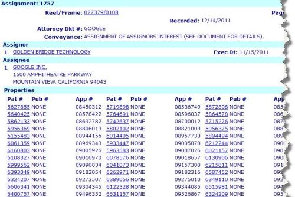

Google acquired a number of patents from a company that’s presently suing a number of major developers of wireless hardware devices for patent infringement. The company is Gold Bridge Technology (GBT), and they tell us on their “Meeting the Challenge” page:

> One of GBT’s most significant group of patents pertains to the UMTS W-CDMA Standard. All equipment manufacturers and service providers providing 3rd Generation (“3G”) wireless service adhere to the technical specifications set by this standard. GBT has a number of patents that are essential to this standard and offers for license its portfolio of UMTS patents.

GBT has at least two pending lawsuits in Federal District Court in the District of Delaware based upon a couple of wireless patents [6,574,267](http://patft.uspto.gov/netacgi/nph-Parser?Sect1=PTO2&Sect2=HITOFF&u=%2Fnetahtml%2FPTO%2Fsearch-adv.htm&r=1&p=1&f=G&l=50&d=PTXT&S1=6,574,267.PN.&OS=pn/6,574,267&RS=PN/6,574,267) and [7,359,427](http://patft.uspto.gov/netacgi/nph-Parser?Sect1=PTO2&Sect2=HITOFF&p=1&u=%2Fnetahtml%2FPTO%2Fsearch-adv.htm&r=1&f=G&l=50&d=PALL&S1=07359427&OS=PN/07359427&RS=PN/07359427). Those patents both have the title,”Rach ramp-up acknowledgement.” The GBT *Meeting* page also tells us that their Random Access Channel technology (“RACH”) Ramp up and Acknowledgment is the most widely used of their technology.

Those *Rach* patents weren’t included in the list of patents assigned to Google.

An “Our Technology” page on the GBT website, points at a different family of patents as their “most significant” intellectual property:

> Common Packet Channel
>  GBT’s most significant Protocol IP is a group of patents relating to the Common Packet Channel (“CPCH”) Radio Access Protocol IP. CPCH is now the only packet access protocol of the 3G W-CDMA standard that is optimized for medium sized packet length, which is the most common length for email and web browsing transactions. GBT is the pioneer of CPCH and has worked with 3G standard bodies in the United States and around the world to incorporate this once-unfeasible packet data communication feature into 3G systems.

The cases are pending in Delaware District Court, and both were each scheduled for mediation hearings in January a few days ago. There were a few counter claims filed as well.

**Golden Bridge Technology Inc. v. Amazon.Com Inc. et al**
CASE #: 1:11-cv-00165-SLR
Date Filed: 02/24/2011

The original defendants named in the case include Acer America Corporation, Acer Inc., Amazon.Com Inc., Barnes & Noble Inc., BarnesandNoble.com Inc., BarnesandNoble.com LLC, Dell Inc., Deutsche Telekom AG, Exedea Inc., Garmin International Inc., Garmin Ltd., Garmin USA Inc., HTC (BVI) Corp., HTC America Inc., HTC Corp., Hewlett-Packard Company, Huawei Device USA Inc., Huawei Technologies Co. Ltd., Huawei Technologies USA, LG Electronics Inc., LG Electronics Mobilecomm USA Inc., LG Electronics USA Inc., Lenovo (United States) Inc., Lenovo Group Ltd., Lenovo Holding Company Inc., Novatel Wireless Inc., Novatel Wireless Solutions Inc., Novatel Wireless Technology Inc., Option NV, Option Wireless USA Inc., Palm Inc., Panasonic Corporation, Panasonic Corporation of North America, Panasonic Electronic Devices Corporation of North America, Panasonic Kabushiki Kaisha, Pantech Corp., Pantech Wireless Inc., Research In Motion Limited, Research in Motion Corporation, Sharp Corporation, Sharp Electronics Corporation, Sharp Electronics Manufacturing Company of America Inc., Sierra Wireless America Inc., Sierra Wireless Inc., Sony Corporation of America, Sony Electronics Inc., Sony Ericsson Mobile Communications (USA) Inc., Sony Ericsson Mobile Communications AB, Sony Kabushiki Kaisha, T-Mobile USA Inc., UTStarcom Inc., UTStarcom Personal Communications LLC, ZTE (USA) Inc., ZTE Corporation, ZTE Solutions Inc.

**Golden Bridge Technology Inc. v. AT & T Inc. et al**
1:10-cv-00428-SLR-MPT
Date filed: 05/21/2010

According to the case docket, defendents in the case include Apple Inc., Motorola Mobility Inc., Research In Motion Corporation, Dell Inc., and Huawei Technologies Co. Ltd.

According to the USPTO assignment database, Google was assigned a total of 65 granted 3G W-CDMA patents from Gold Bridge Technology and 1 pending patent application, which was executed on November 15th, 2011 and recorded by the patent office on December 14th, 2011.

**Granted Patents**

- [A High Processing Gain Spread Spectrum Tdma System And Method](http://patft1.uspto.gov/netacgi/nph-Parser?patentnumber=6160803)
- [A Store And Dump, Spread-Spectrum Handoff](https://patents.google.com/patent/US6215811B1/en)
- [A Store And Forward Handoff](http://patft1.uspto.gov/netacgi/nph-Parser?patentnumber=7020184)
- [Apparatus And Method For Synchronization Of Direct Sequence Cdma Signals](https://patents.google.com/patent/US5872808)
- [Channel Capacity Optimization For Packet Services](http://patft1.uspto.gov/netacgi/nph-Parser?patentnumber=7099346)
- [Closed Loop Power Control For Common Downlink Transport Channels](http://patft1.uspto.gov/netacgi/nph-Parser?patentnumber=6757319)
- [Coherent Detection Using Matched Filter Enhanced Spread Spectrum Demodulation](http://patft1.uspto.gov/netacgi/nph-Parser?patentnumber=6304592)
- [Collision Avoidance](http://patft1.uspto.gov/netacgi/nph-Parser?patentnumber=6507601)
- [Common Packet Channel](http://patft1.uspto.gov/netacgi/nph-Parser?patentnumber=6996155)
- [Common Packet Channel With Firmware Handoff](http://patft1.uspto.gov/netacgi/nph-Parser?patentnumber=6606341)
- [Deferred Access Method For Uplink Packet Channel](http://patft1.uspto.gov/netacgi/nph-Parser?patentnumber=7436801)
- [Deferred Access Method For Uplink Packet Channel](http://patft1.uspto.gov/netacgi/nph-Parser?patentnumber=7869404)
- [Digital Matched Filter Bank For Othogonal Signal Set](http://patft1.uspto.gov/netacgi/nph-Parser?patentnumber=6801569)
- [Enhanced Uplink Packet Transfer](http://patft1.uspto.gov/netacgi/nph-Parser?patentnumber=7301988)
- [Fast Phase Estimation In Digital Communication Systems](http://patft1.uspto.gov/netacgi/nph-Parser?patentnumber=5742637)
- [Fast Phase Estimation In Digital Communication Systems](https://patents.google.com/patent/US6021157)
- [Fast Response Automatic Gain Control](http://patft1.uspto.gov/netacgi/nph-Parser?patentnumber=6212244)
- [Fast-Acting Costas Loop](http://patft1.uspto.gov/netacgi/nph-Parser?patentnumber=5640425)
- [Fast-Acting Costas Loop](http://patft1.uspto.gov/netacgi/nph-Parser?patentnumber=6122328)
- [Fast-Acting Costas Loop](http://patft1.uspto.gov/netacgi/nph-Parser?patentnumber=5956375)
- [Fuzzy-Logic Spread-Spectrum Adaptive Power Control](http://patft1.uspto.gov/netacgi/nph-Parser?patentnumber=5963583)
- [Fuzzy-Logic Spread-Spectrum Adaptive Power Control](http://patft1.uspto.gov/netacgi/nph-Parser?patentnumber=5719898)
- [Handoff With Closed-Loop Power Control](http://patft1.uspto.gov/netacgi/nph-Parser?patentnumber=6324207)
- [High Performance Signal Structure With Multiple Modulation Formats](http://patft1.uspto.gov/netacgi/nph-Parser?patentnumber=6587452)
- [High Processing Gain Cdma/Tdma System And Method](http://patft1.uspto.gov/netacgi/nph-Parser?patentnumber=6078576)
- [Hybrid Dsma/Cdma (Digital Sense Multiple Access/ Code Division Multiple Access) Method With Collision Resolution For Packet Communications](http://patft1.uspto.gov/netacgi/nph-Parser?patentnumber=7075971)
- [Hybrid Dsma/Cdma (Digital Sense Multiple Access/Code Division Multiple Access) Method With Collision Resolution For Packet Communications](http://patft1.uspto.gov/netacgi/nph-Parser?patentnumber=6643318)
- [Implementation Of Digital Filter With Reduced Hardware](http://patft1.uspto.gov/netacgi/nph-Parser?patentnumber=6983012)
- [Increased-Capacity, Packet Speed-Spectrum System And Method](http://patft1.uspto.gov/netacgi/nph-Parser?patentnumber=6061359)
- [Intelligent Power Management For A Programmable Matched Filter](http://patft1.uspto.gov/netacgi/nph-Parser?patentnumber=5764691)
- [Intelligent Power Management For A Programmable Matched Filter](https://patents.google.com/patent/US5999562)
- [Matched Filter-Based Handoff Method And Apparatus](http://patft1.uspto.gov/netacgi/nph-Parser?patentnumber=5864578)
- [Method And Apparatus Of A Fast Two-Loop Automatic Gain Control Circuit](http://patft1.uspto.gov/netacgi/nph-Parser?patentnumber=6843597)
- [Method And Apparatus Of Joint Detection Of A Cdma Receiver](http://patft1.uspto.gov/netacgi/nph-Parser?patentnumber=6741637)
- [Multichannel Spread- Spectrum Packet](http://patft1.uspto.gov/netacgi/nph-Parser?patentnumber=6262971)
- [Multi-Channel Spread Spectrum System](http://patft1.uspto.gov/netacgi/nph-Parser?patentnumber=6993065)
- [Multi-Channel Spread Spectrum System](http://patft1.uspto.gov/netacgi/nph-Parser?patentnumber=6324209)
- [Multi-Clock Matched Filter For Receiving Signals With Multipath](http://patft1.uspto.gov/netacgi/nph-Parser?patentnumber=6631157)
- [Multi-Clock Matched Filter For Receiving Signals With Multipath](http://patft1.uspto.gov/netacgi/nph-Parser?patentnumber=6041073)
- [Orthogonal Spread Spectrum System](http://patft1.uspto.gov/netacgi/nph-Parser?patentnumber=6108327)
- [Packet Spread-Spectrum Receiver](http://patft1.uspto.gov/netacgi/nph-Parser?patentnumber=7012907)
- [Packet Spread-Spectrum Transmitter](http://patft1.uspto.gov/netacgi/nph-Parser?patentnumber=6894997)
- [Packet-Switched Spread-Spectrum System](http://patft1.uspto.gov/netacgi/nph-Parser?patentnumber=6940841)
- [Packet-Switched Spread-Spectrum System](http://patft1.uspto.gov/netacgi/nph-Parser?patentnumber=6515981)
- [Packet-Switched Spread-Spectrum System](http://patft1.uspto.gov/netacgi/nph-Parser?patentnumber=5862133)
- [Parallel Code Matched Filter](http://patft1.uspto.gov/netacgi/nph-Parser?patentnumber=6130906)
- [Parallel Correlator Architecture For Synchronizing Direct Sequence Spread-Spectrum Signals](http://patft1.uspto.gov/netacgi/nph-Parser?patentnumber=5894494)
- [Power-Controlled Random Access](http://patft1.uspto.gov/netacgi/nph-Parser?patentnumber=6937641)
- [Pre-Data Power Control Common Packet Channel](http://patft1.uspto.gov/netacgi/nph-Parser?patentnumber=6639936)
- [Pre-Data Power Control Common Packet Channel](http://patft1.uspto.gov/netacgi/nph-Parser?patentnumber=6389056)
- [Pre-Data Power Control Common Packet Channel](http://patft1.uspto.gov/netacgi/nph-Parser?patentnumber=7046717)
- [Programmable Matched Filter Bank](http://patft1.uspto.gov/netacgi/nph-Parser?patentnumber=6842480)
- [Programmable Two-Part Matched Filter For Spread Spectrum](http://patft1.uspto.gov/netacgi/nph-Parser?patentnumber=5802102)
- [Programmable Two-Part Matched Filter For Spread Spectrum](https://patents.google.com/patent/US5627855)
- [Second Level Collision Resolution For Packet Data Communications](http://patft1.uspto.gov/netacgi/nph-Parser?patentnumber=6480525)
- [Selective Release Micr Mechanism](http://patft1.uspto.gov/netacgi/nph-Parser?patentnumber=6155483)
- [Sliding Matched Filter With Flexible Hardware Complexity](http://patft1.uspto.gov/netacgi/nph-Parser?patentnumber=6324210)
- [Sliding Matched Filter With Flexible Hardware Complexity](http://patft1.uspto.gov/netacgi/nph-Parser?patentnumber=6714586)
- [Spread Spectrum Multipath Combining Subsystem And Method](http://patft1.uspto.gov/netacgi/nph-Parser?patentnumber=5956369)
- [Spread Spectrum Multipath Receiver Without A Tracking Loop](http://patft1.uspto.gov/netacgi/nph-Parser?patentnumber=6014405)
- [Subsystem And Method For Combining Spread-Spectrum Multipath Singnals](http://patft1.uspto.gov/netacgi/nph-Parser?patentnumber=6349110)
- [Symbol-Matched Filter Having A Low Silicon And Power Management](http://patft1.uspto.gov/netacgi/nph-Parser?patentnumber=6400757)
- [Symbol-Matched Filter Having A Low Silicon And Power Requirement](http://patft1.uspto.gov/netacgi/nph-Parser?patentnumber=5933447)
- [Symbol-Matched Filter Having A Low Silicon And Power Requirement](http://patft1.uspto.gov/netacgi/nph-Parser?patentnumber=5715276)
- [Two-Stage Synchronization Of Spread-Spectrum Signals](http://patft1.uspto.gov/netacgi/nph-Parser?patentnumber=6393049)

**Pending Patent Application**

- [Enhanced uplink packet transfer](http://appft.uspto.gov/netacgi/nph-Parser?Sect1=PTO1&Sect2=HITOFF&d=PG01&p=1&u=%2Fnetahtml%2FPTO%2Fsrchnum.html&r=1&f=G&l=50&s1=%2220080063031%22.PGNR.&OS=DN/20080063031&RS=DN/20080063031)

**Conclusion**

The patents assigned appear to include GBT’s Common Packet Channel patents, which they called their most significant IP on their website, because that channel is the one used to access emails and web pages.

While this patent assignment took place halfway through November, it appeared from a look at the legal dockets that the lawsuits are still going on.

There’s no way to tell from the USPTO assignment database any of the terms of the assignment of these patent filings.

Ok, so it’s publicly known far and wide that Google is acquiring Motorola Mobility, which is one of the defendants in the one of the cases. It’s somewhat odd and interesting that Google would be able to acquire these patent filings from GBT.
