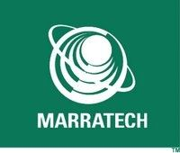
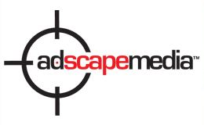
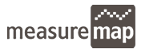
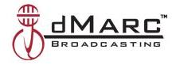
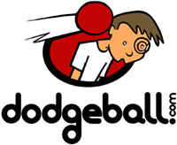

With all of the recent acquisitions by Yahoo! and Google, I decided to take a closer look at some Google Acquisitions. I’m glad I did. I came across a couple of papers I hadn’t seen before and learned a little more about some of Google’s employees that I didn’t know.

Many of the Google acquisitions we have seen appear to be influenced by Google attempting to acquire technology, and some Google acquisitions appear to have been made to hire the employees of companies acquired. I’ve tried to indicate what kinds of technology Google acquired in these transactions. I didn’t include the financial details of these purchases either. I was mostly interested in the technology that was brought through these Google acquisitions.

## 2007 Google Acquisitions

[Zingku](https://www.seobythesea.com/2005/12/google-acquisitions/#Zingku)
[Postini](https://www.seobythesea.com/2005/12/google-acquisitions/#Postini)
[Grand Central Communications](https://www.seobythesea.com/2005/12/google-acquisitions/#Grand)
[Zenter, Inc.](https://www.seobythesea.com/2005/12/google-acquisitions/#Zenter)
[Peakstream Inc.](https://www.seobythesea.com/2005/12/google-acquisitions/#Peakstream)
[Feedburner](https://www.seobythesea.com/2005/12/google-acquisitions/#Feedburner)
[Panoramio](https://www.seobythesea.com/2005/12/google-acquisitions/#Panoramio)
[Green Border Technologies](https://www.seobythesea.com/2005/12/google-acquisitions/#Green)
[Marratech AB’s Video Conferencing Software](https://www.seobythesea.com/2005/12/google-acquisitions/#Marratech)
[Tonic Systems](https://www.seobythesea.com/2005/12/google-acquisitions/#Tonic)
[Doubleclick](https://www.seobythesea.com/2005/12/google-acquisitions/#Doubleclick)
[Gapminder’s Trendalyzer Software](https://www.seobythesea.com/2005/12/google-acquisitions/#Gapminder)
[Adscape Media](https://www.seobythesea.com/2005/12/google-acquisitions/#Adscape)

## 2006 Google Acquisitions

[Jotspot, Inc.](https://www.seobythesea.com/2005/12/google-acquisitions/#Jotspot)
[YouTube, Inc.](https://www.seobythesea.com/2005/12/google-acquisitions/#YouTube)
[Neven Vision](https://www.seobythesea.com/2005/12/google-acquisitions/#Neven)
[@Last Software](https://www.seobythesea.com/2005/12/google-acquisitions/#Last)
[Writely](https://www.seobythesea.com/2005/12/google-acquisitions/#Writely)
[Measure Map](https://www.seobythesea.com/2005/12/google-acquisitions/#Measure)
[dMarc Broadcasting](https://www.seobythesea.com/2005/12/google-acquisitions/#dMarc)
[Reqwireless, Inc.](https://www.seobythesea.com/2005/12/google-acquisitions/#Reqwireless)
[Transformic, Inc.](https://www.seobythesea.com/2005/12/google-acquisitions/#Transformic)

## 2005 Google Acquisitions

[Android](https://www.seobythesea.com/2005/12/google-acquisitions/#Android)
[Akwan Information Technologies](https://www.seobythesea.com/2005/12/google-acquisitions/#Akwan)
[Dodgeball](https://www.seobythesea.com/2005/12/google-acquisitions/#Dodgeball)
[Urchin Software](https://www.seobythesea.com/2005/12/google-acquisitions/#Urchin)

## 2004 Google Acquisitions

[Zipdash](https://www.seobythesea.com/2005/12/google-acquisitions/#Zipdash)
[Where 2 Technologies](https://www.seobythesea.com/2005/12/google-acquisitions/#Where)
[Keyhole](https://www.seobythesea.com/2005/12/google-acquisitions/#Keyhole)
[Picasa](https://www.seobythesea.com/2005/12/google-acquisitions/#Picasa)
[Ignite Logic](https://www.seobythesea.com/2005/12/google-acquisitions/#Ignite)

## 2003 Google Acquisitions

[Genius Labs](https://www.seobythesea.com/2005/12/google-acquisitions/#Genius)
[Sprinks](https://www.seobythesea.com/2005/12/google-acquisitions/#Sprinks)
[Kaltix](https://www.seobythesea.com/2005/12/google-acquisitions/#Kaltix)
[Applied Semantics](https://www.seobythesea.com/2005/12/google-acquisitions/#Applied)
[Neotonic Software](https://www.seobythesea.com/2005/12/google-acquisitions/#Neotonic)
[Pyra Labs](https://www.seobythesea.com/2005/12/google-acquisitions/#Pyra)

## 2001 Google Acquisitions

[Outride](https://www.seobythesea.com/2005/12/google-acquisitions/#Outride)
[Deja](https://www.seobythesea.com/2005/12/google-acquisitions/#Deja)

## 2007 Google Acquisitions

*Zingku*
(Added September 27, 2007)

Today, there was a note on the front page of the [Zingku](http://web.archive.org/web/20100515215345/http://www.zingku.com:80/) web site that, “We’ve agreed to have Google Acquire our Zingku service,” and a report by the Google Operating System blog – [Google Buys Zingku, Mobile Social Network](https://googlesystem.blogspot.com/2007/09/google-buys-zingku-mobile-social.html#gsc.tab=0).

The Zingku site tells us that the service allows people to:

- Store & fetch mobile photos and txt reminders with alarms on your companion mobile website.
- Share mobile photos and posts with friends and friends-of-friends with txt msg’ing, instant messenger, & web.
- Gather a big crowd & their friends with text messaging, IM, and email
- Take an instant poll among friends, all with text messaging. “Hey, what should we do? 1. Movie 2. Dan’s party”
- Send your mobile cards that people fetch by texting a magic code. Make as many as you want & link them together.
- Grab postings from blogs and syndicated feeds (RSS, Atom) via text message to your mobile phone.

Zingku also allows merchants to create “mobile flyers” or interactive electronic brochures and then publish/email a “zing-code” to their customers who opt to pull the flyer to their mobile phone.

At this time, the Zingku service is in private beta.

Zingku started as Bloobird Studio Inc. and received $1 million in funding in June of 2006 from Flagship Ventures. They changed their name to Zingku officially on December 9, 2006.

The leader of Bloobird was Martin Fahey, who was chief executive of Webhire Inc. Martin Fahey was in charge of spreadsheet marketing at Lotus Development Corp. before Webhire.

The founding team also includes two other former IBM/Lotus employees: [Sami Shalabi](http://www.samishalabi.com/), who led the development of collaborative applications at IBM; and Maurice Shore, who developed techniques for storing and displaying graphics at IBM.

It’s difficult to tell if the following was written for Zingku and is part of what is being transferred over to Google. They aren’t publicly available, but here are some of the latest patent applications from Sami Shalabi that he has listed on his website:

- 60/939,734 – Method and System for Social Networking. Filed 2007
- 60/939, 704 – Method and System for Multi-channel Conversation Engine. Filed 2007
- CAM920060171US1 – Private Metadata Integration in an Activity Thread. Filed 2007

*Postini*
(added 7/10/2007)

The announcement of Google’s acquisition of Postini came in a [press release](http://googlepress.blogspot.com/2007/07/google-to-acquire-postini.html) from July 9th. I’ve posted about the pending and granted patents assigned to the company in [Google’s New Acquisition Postini and their Patent Filings](https://www.seobythesea.com/2007/07/googles-new-acquisition-postini-and-their-patent-filings/).

A little more about the background of the company and its path to being acquired by Google.

Postini received its first round of funding in 1999 and developed into a company providing email antivirus and security applications to some huge corporations. In 2001, Postini was offering email to wireless devices, email by phone, translation of foreign emails, virus protection via “Trend Micro,” blocking “junk” emails, faxes by email, and other services.

A [press release](https://web.archive.org/web/20070228054132/http://postini.com/news_events/pr/pr022207.php) from February 2007, announced that the company had joined the Google Enterprise Professional program, offering security and compliance services for the Google Apps Premiere Edition. These are some of the services cited in the press release:

> - Message recovery — providing the ability for administrators to quickly restore accidentally deleted messages.
> - Centralized management of all user accounts — allowing administrators to centrally control policy and content.
> - Threat management — delivering world-class protection from a broad range of threats to critical business communications.
> - Archiving for compliance and e-discovery — helping businesses comply with legal and industry mandates to archive, discover, and produce electronic communications.

*Grand Central Communications*
(added 7/10/2007)

On July 2, 2007, Google [announced on the Official Google Blog](https://googleblog.blogspot.com/2007/07/all-aboard.html) that they had acquired Grand Central Communications. The offering from the company is interesting:

> GrandCentral is an innovative service that lets users integrate all of their existing phone numbers and voice mailboxes into one account, which can be accessed from the web.

The company was started in 2005 and was founded by Craig Walker and Vincent Paquet, who had worked together running internet telephony pioneer Dialpad Communications (acquired by Yahoo in 2005). Looking through the Internet Archives, I uncovered a different Grand Central, which offered a very different range of services, but [ran into some problems](https://venturebeat.com/2005/11/29/minor-twists-again-with-swivel/):

> If GrandCentral sounds familiar, it’s because it has a history. Halsey Minor, the founder of CNET created a company called Grand Central as a way to integrate all kinds of Web services — eBay, PayPal, Intuit — into a single platform. Despite getting $60 million in venture backing, it ran into trouble — as we reported last year.

According to that article, Halsey Minor financed some part of the new Grand Central, and Walker and Paquet purchased the company name. There are 16 patent applications in the USPTO patent assignment database assigned to Grand Central Communications, but those appear to have been developed under the earlier incarnation of Grand Central Communications. It’s hard to tell if that intellectual property was transferred over with the name and website.

*Zenter, Inc.*
(Added 6/19/2007)

This company developed some front-end online presentation tools quickly but very productive while funded by Y Combinator. I’ve written about the acquisition in more detail at [Google Acquires Webfonts Presentation Developers, Zenter, Inc.](https://www.seobythesea.com/2007/06/google-aquires-webfonts-presentation-developers-zenter-inc/)

Google purchased Tonic Systems (see below) in April 2007, which makes back-end software for presentation systems. Zenter created front-end editing tools for presentations, including one referred to as “WebFonts,” which appears that they have applied for a provisional patent for – unpublished as of this date. (Another provisional patent is hinted at in an interview with one of the cofounders of Zenter.) Google provides a few details at the Official Google Blog in [More Sharing](https://googleblog.blogspot.com/2007/06/more-sharing.html).

*Peakstream Inc.*
(Added 6/5/2007)

The UK Register announced earlier today that Google had acquired Peakstream, Inc. – [Google shivs server crowd with PeakStream buy](https://www.theregister.co.uk/2007/06/05/google_buys_peakstream/)

Peakstream was founded in January 2005 by Matt Papakipos, Asher Waldfogel, and Stanford University Professor Pat Hanrahan. The website, which is now nonresponsive, notes that Peakstream has 35 employees and is headquartered in Redwood Shores, California. The company creates software that utilizes the processing power in off-the-shelf 3-D accelerator cards in ways that the manufacturers of those cards may not have anticipated.

Matt Papakipos and Pat Hanrahan have their names on several patent and patent applications, including a number that involving graphics processing and processors. However, the USPTO doesn’t indicate any publicly published patent filings assigned to Peakstream.

The software works with new high-performance processors such as multi-core CPUs, graphics processor units (GPUs), and Cell processors, using a stream processing approach.

The company was inspired by Stanford University’s [Brook Project](http://web.archive.org/web/20070610212547/http://cs.stanford.edu/research/project.php?id=304) on stream programming.

From one of the press releases previously on the Peakstream site:

> ATI GPUs in concert with the PeakStream software platform are giving companies the ability to process data at speeds they’ve only dreamt of until now,” said Dave Orton, CEO, and president of ATI Technologies Inc. “Today’s graphics processors are capable of processing far more than just graphics applications – they are competent parallel processors ideally suited for a wide range of scientific, business, and consumer applications. Using the full-featured PeakStream Platform, companies can now easily program ATI graphics processors for accelerated processing of non-graphics tasks to drive faster and better-informed business decisions resulting in real competitive advantages.”

*Feedburner*
(added 6/1/2007)

Rumors about the acquisition of this Chicago-based feed management and advertising company had been swirling around for weeks, and official announcements were made today on the Feedburner blog ([It’s True-gle!](http://web.archive.org/web/20070603082150/http://blogs.feedburner.com/feedburner/archives/2007/06/feedburner_google.php)) and on a Feedburner FAQ page (no longer available). The Official Google Blog also makes a note of the acquisition in a post titled [Adding more flare](https://googleblog.blogspot.com/2007/06/adding-more-flare.html).

Feedburner was started in 2003 by Dick Costolo, Eric Lunt, Steve Olechowski, and Matt Shobe.

The four founders of Feedburner started working together in 1993, and this was the fourth company that they started together. I checked for patent filings for the company but didn’t come across any published documents.

A lot of articles about the Feedburner acquisition running today. A tongue-in-cheek view can be found at 6 Reasons Google Did Not Need To Acquire Feedburner.

*Panoramio*
(added 6/1/2007)

A Spanish photo tagging and photo-sharing site started in October of 2005 by Joaquín Cuenca Abela and Eduardo Manchón Aguilar, Google announced the acquisition of [Panoramio](http://www.panoramio.com/) on May 30th, 2007, on the Official Google Blog in [A picture’s worth a thousand clicks](https://googleblog.blogspot.com/2007/05/pictures-worth-thousand-clicks.html). The Panoramio blog tells us about the acquisition from their perspective – [Google agrees to acquire Panoramio](https://web.archive.org/web/20190407215201/http://blog.panoramio.com/2007/05/google-agrees-to-acquire-panoramio.html)

The Google post notes that the Google Earth team has been working with the folks at Panoramio for a while and that there is a default Google Earth Layer that has been featured there since the beginning of the year. While Panoramio’s site is located in Spain, the more than a million images on the site are worldwide. Panoramio’s service allows people to geo-tag the exact location where images were taken.

*Green Border Technologies*
(added 5/29/2007)

On May 11th, Google purchased Green Border Technologies, Inc., which makes a sandbox for internet applications to run within, protecting a computer’s operating system from potentially malicious software.

The company has many pending patent applications and a granted patent which I describe in more detail in [Google’s Green Border Technologies Patent Filings](https://www.seobythesea.com/2007/05/googles-green-border-technologies-patent-filings/).

*Marratech AB’s Video Conferencing Software*
(Added 4/22/2007)

On April 19, 2007, the Official Google Blog [announced](https://googleblog.blogspot.com/2007/04/collaborating-with-marratech.html)that Google had acquired the video conferencing software of [Marratech AB](http://www.marratech.com/). Marratach is located in Stockholm, Sweden, but conducts business globally.

It’s unknown if Google will only use this software internally or make it available to their users for a price or for free. I’ve written about some of the patent applications from Marrakech that may be involved in this transaction at: [Google’s Marratech Software Acquisition and Patent Filings](https://www.seobythesea.com/2007/04/googles-marratech-software-acquistion-and-patent-filings/)

*Tonic Systems*
(Added 4/17/2007)

Google announced today that they have [acquired Tonic Systems](https://googleblog.blogspot.com/2007/04/were-expecting.html). Tonic Systems makes software that can extract information from presentation software such as Microsoft’s PowerPoint. The information can then be saved on an HTML page or PDF.

More details in [Google’s Presentation Patent Application (via Tonic Systems)](https://www.seobythesea.com/2007/04/googles-presentation-patent-application-via-tonic-solutions/).

*Doubleclick*
(Added 4/14/2007)

One of the costliest Google Acquisitions and one of Google’s largest at this point in terms of cost (for $3.1 billion in cash) was [announced at the Official Google Blog](https://googleblog.blogspot.com/2007/04/next-step-in-google-advertising.html).

I’ve posted about some of the patent filings that Doubleclick has made over the past few years in (No longer available) Doubleclick + Google: Looking at Some of the Doubleclick Patent Filings. It’s going to be interesting to see how Google moves forward with this purchase.

*Gapminder’s Trendalyzer Software*
(Added 3/17/2007)

An announcement from Google’s Marissa Mayer on the official Google Blog titled [A World in Motion](https://googleblog.blogspot.com/2007/03/world-in-motion.html) tells us of the acquisition of some new software by Google, as well as the hiring of team members who worked for the foundation that developed the software.

The software adds a [visualization element](https://www.gapminder.org/tools/#$state$time$value=2007&delay:180;&entities$filter$;;&marker$axis_x$domainMin:null&domainMax:null&zoomedMin=194&zoomedMax=96846;&axis_y$domainMin:null&domainMax:null&zoomedMin=23&zoomedMax=86;&size$domainMin:null&domainMax:null&extent@:0.022083333333333333&:0.4083333333333333;;&color$which=world_6region;;;&ui$chart$trails:false;;&chart-type=bubbles) to the presentation of data, ” in the display of facts, figures, and statistics in presentations.” According to the [Gapminder](https://www.gapminder.org/) pages:

> Trendalyzer’s developers have left Gapminder to join Google in Mountain View, where Google intends to improve and scale up Trendalyzer, and make it freely available to those who seek access

*Adscape Media*
(Added 2/17/2007)

This company has been around under the name BiDamic since 2002 and as Adscape Media since 2006. Details are supposedly still being worked out, but it sounds like Google has purchased this in-game advertising company. One of the news reports included a quote from an Adscape employee who stated that they owned 15 patents.

I found 30 published patent applications and a granted patent. Links to those and more details about the company at [Google Acquires Adscape Media: Interactive Online Gaming Advertisement and Gaming System Developers](https://www.seobythesea.com/2007/02/google-acquires-adscape-media-interactive-online-gaming-advertisement-and-gaming-system/)

A couple of those patent filings are for full-blown, interactive, online gaming systems.

update – 3/17/2007 -Google publishes a press release on the [Adscape Media acquisition](http://googlepress.blogspot.com/2007/03/google-has-acquired-adscape-media.html)

## 2006 Google Acquisitions

*Jotspot, Inc.*
(Added 10/31/2006)

Founded by Joe Kraus and Graham Spencer, who had worked together at Excite.com, Jotspot is a wiki with some collaborative tools for business users. It includes applications such as spreadsheets, calendars, and forms, unlike most wiki software. I’ve written a longer post on the acquisition at [Google Acquires Jotspot, Inc. & Wiki Patent Application](https://www.seobythesea.com/2006/10/google-acquires-jotspot-inc-wiki-patent-application/)

Financial terms of the purchase were not disclosed, but Jotspot had just had a patent application published at the US Patent and Trademark Office:

[Collaborative web page authoring](http://appft1.uspto.gov/netacgi/nph-Parser?Sect1=PTO2&Sect2=HITOFF&u=%2Fnetahtml%2FPTO%2Fsearch-adv.html&r=1&p=1&f=G&l=50&d=PG01&S1=20060235984.PGNR.&OS=dn/20060235984&RS=DN/20060235984)Abstract

> Collaborative web pages are enabled, which allow every page on a website to be editable by an author, and by others, the author lets access the site. Web pages can send and receive email messages. Users can attach files to pages. Structure queries and page-building are enabled by the use of various forms and form elements.

*YouTube, Inc.*
(added 10/9/2006)

YouTube was founded in February 2005 and quickly grew to one of the busiest online destinations on the web. The site is community-driven and allows people to post and share videos. In addition, viewers can tag videos, comment upon them, and display them on their websites.

The [Google Press Release](https://abc.xyz/investor/index.html) issued on October 9, 2006, tells us that the sale price was $1.65 Billion in a stock for stock transaction. There are no planned changes to the YouTube brand identity. The company will continue to be based in San Bruno, CA, and all of the YouTube employees will remain with the company.

As of this update, there isn’t a press release on the YouTube site about the Google acquisition, but there are three releases dated today about content and distribution deals with CBS (Strategic Content and Advertising Partnership), [Sony BMG Music Entertainment](https://www.youtube.com/about/press/) (Content License Agreement ), and Universal Music Group (Strategic Partnership).

*Neven Vision*
(added 8/15/2006)

Neven Vision, or Nevenengineering, Inc., has a strong background in facial and object recognition technologies and has been broadening its offerings by focusing upon mobile technology, including two patent applications filed over the past couple of years image-based search on a mobile device equipped with a camera. I’ve written a little about the acquisition and the company and its technology (including patents) in this post: [Google Acquires Neven Vision: Adding Object and Facial Recognition Mobile Technology](https://www.seobythesea.com/2006/08/google-acquires-neven-vision-adding-object-and-facial-recognition-mobile-technology/).

*@Last Software*
(added 3/14/2006)

[@Last Software](http://web.archive.org/web/20060101075301/http://www.sketchup.com/) ([March, 2006](https://googleblog.blogspot.com/2006/03/new-home-for-last-software.html)) – 3D design software, with a plugin for Google Earth. Rumors of the purchase started circulating as early as October of last year. A [Frequently Asked Questions](http://web.archive.org/web/20060319061557/http://www.sketchup.com/index.php?id=1440) section on the purchase describes changes resulting from the purchase.

The company does hold a US Patent:

[System and method for three-dimensional modeling](https://patents.google.com/patent/US6628279B1/en)Abstract:

> A three-dimensional design and modeling environment allows users to draw the outlines, or perimeters, of objects in a two-dimensional manner, similar to pencil and paper, already familiar to them.
>
> The two-dimensional, planar faces created by a user can then be pushed and pulled by editing tools within the environment to easily and intuitively model three-dimensional volumes and geometries.

*Writely*
(added 3/10/2006)

Writely ([March 2006](http://writely.blogspot.com/2006/03/google-yep-google.html)) Web-based word processing that allows online collaboration on documents.

The buzz is on with this acquisition that Google will take on Microsoft and that company’s hold on desktop publishing applications. Except that this isn’t just a desktop publishing application. The program allows you to organize documents by tags, making it a web 2.0 styled application, and it provides offline storage and backups. It can also create blog posts for a blog and allow for rollbacks to previous versions.

*Measure Map*
(added 3/10/2006)

[Measuremap](http://web.archive.org/web/20060128001212/http://measuremap.com/)([February 2006](https://googleblog.blogspot.com/2006/02/here-comes-measure-map.html)) A statistics and analytics package geared more towards blogs than other web sites, the acquisition of this company by Google was something of a surprise, especially since Google purchased Urchin, which makes a pretty good analytics program. But the beauty or Measuremap is supposedly in the User Interface and design. Unfortunately, hard to tell at the time of the purchase since it was the invitation-only pre-release mode, and I never received the invitation I signed up for.

*dMarc Broadcasting*
(added 3/10/2006)

[dMarc Broadcasting](http://web.archive.org/web/20051231174156/http://www.dmarc.net/)([January, 2006](http://googlepress.blogspot.com/2006/01/google-to-acquire-dmarc-broadcasting_17.html)) Radio advertising company, allowing for highly automated advertising campaigns. This acquisition brought Google a whole new way to reach out to consumers with advertisements.

*Reqwireless, Inc.*
(added 3/10/2006)

Reqwireless (July 2006) Maker of popular mobile applications for email and the web on wireless devices. The presumption is that the technology developed by the ReqWireless folks and the chance to gain a foothold in the Waterloo, Ont. area is what led to this acquisition. Unfortunately, the purchase wasn’t uncovered until January 6, 2006.

*Transformic, Inc.*
(added 9/20, 2006)

I’ve written a full blog post about this acquisition – [Google’s Quiet Acquisition of Transformic, Inc.](https://www.seobythesea.com/2006/09/googles-quiet-acquisition-of-transformic-inc/)

Tranformic was a small company, focusing upon building search engines for the deep web, where major commercial search engines had difficulties crawling, and had developed a site that showed off their technology in Everyclassified.com, which collected information from hundreds of classifieds sites on the web. The main reason for this purchase appears to have been to get Dr. Alon Halevy, the man behind Transformic, to work at Google.

## 2005 Google Acquisitions

*Android*

Among the Google Acquisitions, I’m writing about, who would have seen how [Android](https://www.engadget.com/2005-08-17-google-buys-cellphone-software-company.html) would grow (August 2005), software for mobile telephones
Founded by Andy Rubin, accompanied by Andy McFadden, Richard Miner, and Chris White.

*Akwan Information Technologies*

Akwan Information Technologies (July 2005)
Google Press Release: [Google Continues International Expansion, Opens Offices in Latin America](http://googlepress.blogspot.com/2005/11/google-continues-international_17.html)

> The office in Sao Paulo, Brazil, follows Brazil’s Akwan Information Technologies Inc. in July of this year. Akwan has become Google’s R&D center in Brazil.

An example of the type of research being conducted by the people at Akwan: [Distributed Processing of Conjunctive Queries](https://www.semanticscholar.org/paper/Distributed-Processing-of-Conjunctive-Queries-Badue/12e15387d969599932d8150bc8f015a23fd71212) (pdf)

*Dodgeball*

[Dodgeball](http://web.archive.org/web/20050513224311/http://www.dodgeball.com/aboutus_dball_google.php) (May 2005), social-networking software for mobile devices

Founders Dennis Crowley and Alex Rainert, see: Google Buys Social Networking Firm and The Future of Wireless.

*Urchin Software*

[Urchin Software](https://battellemedia.com/archives/2005/03/google_acquires_urchin) (March 2005), Web Analytics software
Google Press Release: [Google Agrees To Acquire Urchin](http://googlepress.blogspot.com/2005/03/google-agrees-to-acquire-urchin_28.html)

> Urchin is a web site analytics solution used by web site owners and marketers to better understand their users’ experiences, optimize content and track marketing performance.

Patent Applications:

[System and method for tracking unique visitors to a website](http://appft1.uspto.gov/netacgi/nph-Parser?Sect1=PTO1&Sect2=HITOFF&d=PG01&p=1&u=%2Fnetahtml%2FPTO%2Fsrchnum.html&r=1&f=G&l=50&s1=%2220030208594%22.PGNR.&OS=DN/20030208594&RS=DN/20030208594)Abstract:

> A system and method for analyzing traffic to a website is provided that is based on log files and that uses both server-side and client-side information channeled through one source to create a more complete picture of activity to a website. In one preferred embodiment, a sensor code is embedded in a requested web page and sends information back to the webserver where the website resides. This additional information is logged along with normal requests.

[System and method for monitoring and analyzing internet traffic](http://appft1.uspto.gov/netacgi/nph-Parser?Sect1=PTO1&Sect2=HITOFF&d=PG01&p=1&u=%2Fnetahtml%2FPTO%2Fsrchnum.html&r=1&f=G&l=50&s1=%2220050165889%22.PGNR.&OS=DN/20050165889&RS=DN/20050165889)

Abstract:

> A system and method for monitoring and analyzing Internet traffic is provided that is efficient, completely automated, and fast enough to handle the busiest websites on the Internet, processing data many times faster than existing systems.
>
> The system and method of the present invention processes data by reading log files produced by web servers or interfacing with the web server in real-time, processing the data as it occurs. The system and method of the present invention can be applied to one website or thousands of websites, whether they reside on one server or multiple servers.
>
> The multi-site and sub-reporting capabilities of the system and method of the present invention make it applicable to servers containing thousands of websites and entire online communities. In one embodiment, the system and method of the present invention include e-commerce analysis and reporting functionality. Data from standard traffic logs is received and merged with data from e-commerce systems.
>
> The system and method of the present invention can produce reports showing detailed “return on investment” information, including identifying which banner ads, referrals, domains, etc. are producing specific dollars.

## 2004 Google Acquisitions

*Zipdash*

[Zipdash](http://web.archive.org/web/20060219070529/http://www.zipdash.com/) (December 2004) Provides navigation assistance for road traffic on mobile in real time by GPS.
See: [Navigating by phone](https://www.paloaltoonline.com/weekly/morgue/2004/2004_04_28.zipdash28ja.shtml) and Google acquires traffic info start-up Zipdash

*Where 2 Technologies*

Where 2 Technologies (October 2004), Internet mapping

Brothers Lars Eilstrup Rasmussen and Jens Eilstrup Rasmussen are from Google’s Sydney office and have been actively involved in the patent applications behind Google Maps and using Geographic location information. Before then, they were with Where 2 technologies. See: [Take browsers to the limit: Google](https://www.zdnet.com/article/take-browsers-to-the-limit-google/), and Google Maps and AJAX vs WithStyle – the Australian Legacy.

*Keyhole*

[Keyhole](http://www.google.com/earth/index.html) (October 2004), imagery by satellite
Google Press Release: [Google Acquires Keyhole Corp](http://googlepress.blogspot.com/2004/10/google-acquires-keyhole-corp.html)

> Keyhole’s technology combines a multi-terabyte database of mapping information and images collected from satellites and airplanes with easy-to-use software.

*Picassa*

[Picasa](http://picasa.google.com/index.html) (July 2004), software of management of photographs on line
Google Press Release: [Google Acquires Picasa](http://googlepress.blogspot.com/2004/07/google-acquires-picasa.html)

> Google Inc. today announced it acquired Picasa, Inc., a Pasadena, Calif.-based digital photo management company

*Ignite Logic*

[Ignite Logic](https://battellemedia.com/archives/2004/05/more_s-1_grokking_google_purchases_ignite_logic_inc) (May 2004), design of turn-key legal sites. Puzzling acquisition, though founder David Ferguson has an interesting past.

## 2003 Google Acquisitions

*Genius Labs*

Genius Labs (October 2003), Biz Stone was Genius Labs. Unfortunately, he is no longer with Google.

*Sprinks*

[Sprinks](https://www.clickz.com/google-gobbles-up-sprinks/58285/) (October 2003), paid advertising

*Kaltix*

Kaltix (September 2003), Research on personalized search, from Taher Haveliwala, Glen Jeh, and Sepandar Kamvar.
Google Press Release: [Google Acquires Kaltix Corp.](http://googlepress.blogspot.com/2003/09/google-acquires-kaltix-corp.html)

> Kaltix Corp. was formed in June 2003 and focuses on developing personalized and context-sensitive search technologies that make it faster and easier for people to find information on the web.

Patent application:

[System and method for presenting multiple sets of search results for a single query](http://appft1.uspto.gov/netacgi/nph-Parser?Sect1=PTO1&Sect2=HITOFF&d=PG01&p=1&u=%2Fnetahtml%2FPTO%2Fsrchnum.html&r=1&f=G&l=50&s1=%2220050038775%22.PGNR.&OS=DN/20050038775&RS=DN/20050038775)Abstract:

> A system and a method that manages a user query by a single interaction between a server and a client.
>
> A plurality of clients sends queries for search results to a server. The server receives these queries and performs multiple searches to generate multiple sets of search results.
>
> These sets of search results are ranked, consolidated, and passed to the requesting client. The client stores these multiple sets of search results. The client then displays these search results following the boundary defined by the user.
>
> This boundary defines the portions of the search results that the user desires to view. The user may re-define the boundary. The client identifies the search results corresponding to the boundary and displays them.

*Applied Semantics*

Applied Semantics (April 2003), contextual advertising
Google Press Release: [Google Acquires Applied Semantics](http://googlepress.blogspot.com/2004/04/google-acquires-applied-semantics.html)

> Applied Semantics’ products are based on its patented CIRCA technology, which understands, organizes, and extracts knowledge from websites and information repositories in a way that mimics human thought and enables more effective information retrieval.

Patents:

[Meaning-based advertising and document relevance determination](https://patents.google.com/patent/US6816857B1/en)Abstract:

> The present invention is directed to a system in which a semantic space is searched to determine the semantic distance between two locations. A further aspect of the present invention provides a system in which a portion of semantic space is purchased and associated with a target data set element, returned in response to the search input. The semantic space is created by a lexicon of concepts and relations between concepts. An input is associated with a location in the semantic space. Similarly, each data element in the target data set being searched is associated with a location in the semantic space. Searching is accomplished by determining a semantic distance between the first and second location in semantic space, wherein this distance represents their closeness in meaning. The cost for retrieval of target data elements is based on this distance.

[Meaning-based information organization and retrieval](http://patft.uspto.gov/netacgi/nph-Parser?Sect1=PTO1&Sect2=HITOFF&d=PALL&p=1&u=/netahtml/srchnum.htm&r=1&f=G&l=50&s1=6,453,315.WKU.&OS=PN/6,453,315&RS=PN/6,453,315)

Abstract:

> The present invention relies on the idea of a meaning-based search, allowing users to locate information that is close in meaning to the concepts they are searching for. A semantic space is created by a lexicon of concepts and relations between concepts. A query is mapped to a first meaning differentiator, representing the location of the query in the semantic space. Similarly, each data element in the target data set being searched is mapped to a second meaning differentiator, representing the location of the data element in the semantic space. Searching is accomplished by determining a semantic distance between the first and second meaning differentiator, wherein this distance represents their closeness in meaning. Search results on the input query are presented where the target data elements closest in meaning, based on their determined semantic distance, are ranked higher.

*Neotonic Software*

[Neotonic Software](http://web.archive.org/web/20030323020140/http://neotonic.com/) (April 2003), email customer support [Case Study](http://web.archive.org/web/20060712022241/http://www.neotonic.com/trakken/customers/case-google.cst) from neotonic, about how they helped Google in the days before the purchase. Google also hired David Jeske, the co-founder of Neotonic and the former director of engineering for eGroups.

*Pyra Labs*

[Pyra Labs](https://www.blogger.com/about/) (February 2003), editor of Blogger, blogging platform

## 2001 Google Acquisitions

*Outride*

Outride (September 2001), a Xerox PARC spinoff, data-mining, and semantic analysis. See: Personalized Search: A contextual computing approach may prove a breakthrough in personalized search efficiency (pdf) and [Personalized Search](http://www.beyondvc.com/2004/03/personalized_se.html)

Google Press Release: [Google Acquires Technology Assets of Outride Inc.](http://googlepress.blogspot.com/2001/09/google-acquires-technology-assets-of.html)

> Outride, a spin-off from Xerox Palo Alto Research Center (PARC), was created to apply state-of-the-art model-based relevance technology to the challenge of online information retrieval.

*Deja*

One of the first Google acquisitions that we are aware of, Deja.com (February 2001), Purchase their Usenet archive and other assets, which become Google Groups.
Google Press Release: [Google Acquires Usenet Discussion Service and Significant Assets from Deja.com](http://googlepress.blogspot.com/2001/02/google-acquires-usenet-discussion.html)

I have written about some other Google Acquisitions since this post. They are in the [Acquisitions](https://www.seobythesea.com/category/acquisitions/) Category of this site.
