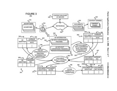

Advertising through a search engine is a little more complicated than just “highest bidder wins.” A recent Google patent application, a video from one of its inventors, and a couple of older patent applications that he co-authored show some of the complexities that an advertiser may face when wanting to advertise through a system like Adwords.

Back in October, 2005, Dr. [Hal Varian](http://people.ischool.berkeley.edu/~hal/) gave a presentation on the advertising model at Google to a class at UC Berkeley. At the time, he had been working with Google’s Adstats team for approximately 3 1/2 years, as a consultant. It’s a nice introduction to contextual based ads at Google.

Dr. Varian is also listed as one of the inventors on number of patent applications from Google describing some of the decision-making processes that may be involved in determining which types and configurations of ads show up on content pages, and the cost of showing ads on content pages based upon ad and document scores. I’ve included links to those, and short introductions to them below.

**Ad Configurations**

The most recent patent application, published last week, describes decisions on which ads to show on pages. Sometimes auctioned placement alone isn’t the only decision involved. The patent filing describes some of the other considerations.

[Using the utility of configurations in ad serving decisions](http://appft1.uspto.gov/netacgi/nph-Parser?Sect1=PTO1&Sect2=HITOFF&d=PG01&p=1&u=%2Fnetahtml%2FPTO%2Fsrchnum.html&r=1&f=G&l=50&s1=%2220060293951%22.PGNR.&OS=DN/20060293951&RS=DN/20060293951)
Invented by Amit Patel and Hal Varian
US Patent Application 20060293951
Published December 28, 2006
Filed: June 28, 2005

Abstract

> Instead of accepting competing ads and using an arbitration function (e.g., an auction) to choose winning ads to be served with a document, sets of ads (perhaps having different characteristics) can be generated, and an arbitration function can be used to select the winning set of ads.
>
> Such arbitrations on sets of ads can consider how ads, search results, colors, positions, fonts, etc., all interact with each other and affect the usefulness of the sets of ads to advertisers, end users, document publishers, and/or an ad serving entity.

**Quality Scores**

Google does have a detailed description of how [quality scores](https://support.google.com/google-ads/answer/2454010?hl=en&from=10215&rd=1) work in relation to the bidding for ads. If you’ve read through that information, and would like to get a little more insight into the philosophies behind the keyword and documents scores that may be used, or some additional details about this process, you may find some answers in this document:

[Adjusting ad costs using document performance or document collection performance](http://appft1.uspto.gov/netacgi/nph-Parser?Sect1=PTO1&Sect2=HITOFF&d=PG01&p=1&u=%2Fnetahtml%2FPTO%2Fsrchnum.html&r=1&f=G&l=50&s1=%2220060004628%22.PGNR.&OS=DN/20060004628&RS=DN/20060004628)
Invented by Brian Axe, Doug Beeferman, Amit Patel, Nathan Stoll, and Hal Varian
US Patent Application 20060004628
Published January 5, 2006
Filed June 30, 2004

Abstract

> Documents or document sets may be scored to reflect a value of an action, such as a selection for example, when an ad is served with the document (or a document belonging to a document set). A cost associated with the action with respect to an ad that was served with a document may then be adjusted using the score.
>
> For example, ad scores may be accepted or determined, and a document may be scored using the ad scores when served with the document and ad scores across a collection of documents to generate a document score. Each of the ad scores may indicate a value of an action with respect to an ad, such as a conversion rate, or a return on investment for an ad selection for example.
>
> Document scores used in this way may help advertisers get a more consistent cost per conversion, or return on investment, without requiring them to enter and manage various offers for various documents and/or various ad serving systems having various conversion rates or returns on investment.

**Ad Types**

Another older patent application, this one also talks about ad and document scores in relation to decisions of what types of ads to show on content pages.

[Facilitating the serving of ads having different treatments and/or characteristics, such as text ads and image ads](http://appft1.uspto.gov/netacgi/nph-Parser?Sect1=PTO1&Sect2=HITOFF&d=PG01&p=1&u=%2Fnetahtml%2FPTO%2Fsrchnum.html&r=1&f=G&l=50&s1=%2220050251444%22.PGNR.&OS=DN/20050251444&RS=DN/20050251444)
Invented by Hal Varian, Wesley Chan, Deepak Jindal, Rama Ranganath, Amit Patel
US Patent Application 20050251444
Published November 10, 2005
Filed May 10, 2004

Abstract

> The serving of ads of different ad types, such as text ads and image ads, competing to be rendered on an ad area of a document may be arbitrated by
>
> (a) determining candidate ads to serve in response to an ad request, wherein the candidate ads include at least one ad of a first ad type and at least one ad of a second ad type,
>
> (b) determining a score of each of at least some of the candidate ads,
>
> (c) comparing alternative sets of the at least some of the candidate ads to select a set that best meets at least one policy goal, and
>
> (d) serving the selected set of candidate ads. Performance parameter values of ads of one type, such as image ads for example, may be estimated from performance parameter values of ads of a second type, such as text ads for example.
