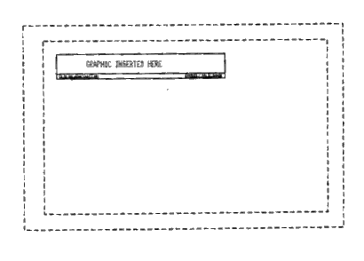

Published today, a design patent granted to Google, [Graphical user interface for a display screen](https://patents.google.com/patent/USD537834S1/en), presents a look and feel that seems somewhat on the simple side.

According to the United States Patent and Trademark Office, in [A Guide to Filing a Design Patent Application](https://www.uspto.gov/patents-getting-started/patent-basics/types-patent-applications/design-patent-application-guide):

> The patent law provides for the granting of design patents to any person who has invented any new, original and ornamental design for an article of manufacture.

There are seven inventors listed for this design, and the patent examiner has included seventy-seven US Patent Documents and three Foreign Patent Documents as references for this design.

Non patent references include:

- A Google press release telling us about the Adwords Select program on February 20, 2002 – [Google Introduces New Pricing For Popular Self-Service Online Advertising Program](http://googlepress.blogspot.com/2002/02/google-introduces-new-pricing-for.html),
- An article from Chris Sherman – Google Launches AdWords Select, and;
- Mentions of the pages of overture.com, findwhat.com, Sprinks.com, Kandoodle.com, and Google.
