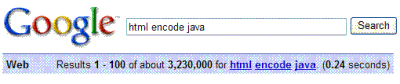
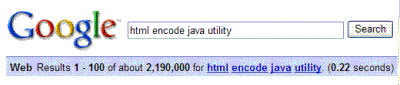

When Google introduced [Web History](https://accounts.google.com/Login?continue=https://www.google.com/history/&hl=en&service=hist&authuser=0) back in [April](https://googleblog.blogspot.com/2007/04/your-slice-of-web.html), they gave us a glimpse of some of the information that they could collect about our travels around the Web.

Last Wednesday, I wrote about a patent application which described a way for Google to take your user history, and provide [recommended query results](https://www.seobythesea.com/2007/07/recommended-alerts-from-google/) based upon that history. Thursday, Google published another patent application dealing with recommended query results, but with a twist.

These recommendations would be on searches that you performed in the past.

If you perform a number of searches related to something you looked for in the past, Google might try to provide better results as those appear in its index, if it believes that you are still interested in that topic and weren’t satisfied with the answers that you received.

[Method, system, and graphical user interface for alerting a computer user to new results for a prior search](http://appft1.uspto.gov/netacgi/nph-Parser?Sect1=PTO2&Sect2=HITOFF&u=%2Fnetahtml%2FPTO%2Fsearch-adv.html&r=1&p=1&f=G&l=50&d=PG01&S1=20070162424.PGNR.&OS=dn/20070162424&RS=DN/20070162424)
Invented by Glen Jeh and Beverly Yang
US Patent Application 20070162424
Published July 12, 2007
Filed: December 30, 2005

Abstract

> A method, system, and graphical user interface for alerting a computer user to new results for a prior search are disclosed. One aspect of the invention involves a graphical user interface on a computer that includes a plurality of links recommended by a search engine for a computer user.
>
> The plurality of links are determined by the search engine by: producing search results by rerunning a plurality of search queries that have been performed previously for the computer user; and evaluating the produced search results to select search results that meet predefined search result selection criteria. At least one of the criteria is based on Internet usage data for the user.

**Service Based Upon an Internal Google Study**

If you’ve used Google’s Web Alerts, you know that they allow someone to specify keyword terms they are interested in, and and receive alerts when a new web page appears. Yet, how often do people use alerts for topics they are interested in? The authors of the patent application point out these shortcomings of present day alerts:

> For example, in an internal study of 18 Google Search History users, out of 154 past queries that the users expressed a medium to strong interest in seeing further results, none of these queries was actually registered as a web alert. In addition, alerting the user to all changes to the search results for the query may cause too many uninteresting results to be shown to the user, due to minor changes in the web or spurious changes in the ranking algorithm.

This patent application aims at automatically identifying queries in a user’s search history that concern continuing interests of the user to provide them alerts for, without requiring them to sign up for those alerts.

**A method of automatically identifying continuing interests of a computer user**

If Google provided alert updates for every search that someone conducted, it would mean that they would be providing a lot of alerts for things that someone really isn’t interested in.

What would Google look at to determine whether or not someone had a “standing interest” in the results of a past search?

Here’s an example of web usage data that may be collected after a login, or through the toolbar:

1) A user submits the query “html encode java”–presumably to find out how to encode html in a java program.

2) After 8 seconds of browsing the search results, she clicks on the second result presented, and remains viewing that page for 91 seconds.

3) She then returns to the results page and views the first result for 247 seconds.

4) Finally, she views the 8th result for 12 seconds.

5) She then performs a next page navigation, meaning that she views the next page of results, starting at position 11.

6) She views the 12th result for a long time–1019 seconds.

7) However, perhaps because she is still unable to find a satisfactory result, she submits the query refinement “html encode java utility”–she is explicitly looking for an existing java utility that will allow her to encode html.

8) After a single result click for 32 seconds, the user looks at the next page of results ranked 11-20, and immediately looks at the following page of results ranked 21-30.

9) She then ends the query session.

**Breakdown of the Example**

This is an automated process, but it relies upon assumptions that are programmed into a query server. How does the query server determine whether the user found what she was looking for, and how interested she might be in seeing new results?

1) It’s clear that the user has an interest in finding an answer; she spent a considerable amount of time in the session, viewed a number of pages, and performed a number of refinements (for this process, typing in query refinements and looking at next pages, etc.).

2) An assumption that she didn’t find what she was looking for is made because the session ended with her looking at a number of search results pages, but not actually clicking on anything.

3) The amount of time an answer might need to be found within isn’t clear, but since the query topic seems to address a work-related need, the query server might guess that the user needs to find a solution immediately, or in the near future.

4) The query server might determine, like here, that this is a search query corresponding to a continuing interest based upon signals such as duration of the session, number of actions, ordering of actions, and so on.

**Query Selection Criteria from Internet Usage Data**

These are some of the user data that a query server might use to identify queries that correspond to continuing interests of the user:

1) *Number of query terms*–More terms searched for may tend to indicate a more specific need, which may correlate with shorter interest duration and lower likelihood of prior fulfillment.

2) *Number of clicks and number of refinements*–The more actions a user takes on behalf of a query (e.g., clicks on query results), the more interested she is likely to be in the query. In addition, a high number of refinements probably implies low likelihood of prior fulfillment.

3) *History match score*–If a query matches the interests displayed by a user through past queries and clicks, then interest level is probably high.

4) *Navigational queries*–A navigational query is one in which the user is looking for a specific web site, rather than information from a web page. If a user clicks on only a single result and makes no subsequent refinements, the query is either navigational, or answerable by a single good website. This would mean a high likelihood of prior fulfillment and low interest level in seeing recommendations.

5) *Repeated non-navigational queries*–If a user repeats a query over time, she is likely to be interested in seeing further results.

6) *Session duration*–Longer sessions might imply higher interest.

7) *Query topic*–Leisure-related topics such as sports and travel might be more interesting than work-related topics.

8) *Number of “long clicks”* –A user might quickly click through many results on a query she is not interested in, so the number of long clicks–where the user views a page for many seconds–may be a better indicator than the number of any kind of click.

9) *Whether the session ended with a refinement* –Sessions that end with a refinement may be indicative of queries for which the user would want to see further results.

**Conclusion**

The patent application goes into more detail about the structure of collected data, describing the use of things like event data (with user actions considered events), and timestamps associated with those events. It talks about “derived” data, which means information calculated from looking at things like times between different types of actions in the same query session.

It also describes how these alerts might be presented to someone, the selection criteria that might be used in deciding whether to show results, and when those results might be shown.

What I found most interesting, and focused upon in this post, was how standing interests in past searches might be identified based upon the way someone interacts with the search engine.
