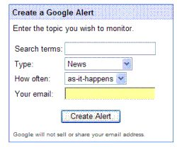

I really enjoy using alerts from [Google](https://www.google.com/alerts) and [Yahoo](http://web.archive.org/web/20170108085403/https://us.toolbar.yahoo.com/) that send me information about topics that are interesting to me.

For example, I have one alert set up for my town and state name, so I can see what’s being written about it in the news and the web. It sometimes captures information that doesn’t show up in one of the local papers.

Alerts for company names and people’s names can be useful too. It doesn’t hurt to know when someone is writing about you or your company, or one of your competitors.

If you’re interested in sports, or movies, or certain people, and perform a search on them, you may look through a lot of sites on the web. It’s nice to be informed when something new appears, and using alerts can help you with that, too.

What benefits might there be to the search engines to offer alerts?

For one thing, they might tell Google or Yahoo what people are interested in. A new Google patent application discusses how Google might use information about alerts to find out what topics are timely and how they might be able to use that information.

[Generation of topical subjects from alert search terms](http://appft1.uspto.gov/netacgi/nph-Parser?Sect1=PTO2&Sect2=HITOFF&u=%2Fnetahtml%2FPTO%2Fsearch-adv.html&r=1&p=1&f=G&l=50&d=PG01&S1=20070073708.PGNR.&OS=dn/20070073708&RS=DN/20070073708)
Invented by Adam D. Smith, Brian Singerman, and Naga Sridhar Kataru
US Patent Application 20070073708
Published March 29, 2007
Filed: September 28, 2005

Abstract

> Topical subjects are identified from search terms that are submitted by users registering for alerts. In one implementation, registration requests to transmit email alerts to a user are received and stored. Topical subjects are identified based on an analysis of the email alerts that were registered in a predetermined time frame.

One of the things that are helpful to search engines is that they know who the people are who are signing up to receive alerts by collecting registration information from them.

Another is that this alert information can be aggregated, and used in a few different ways. For instance, Google notes:

> For example, the topical alerts may be displayed to users on a web page as topics that are currently popular, presented to users as possible alerts that they may be interested in receiving, or used to assist in ranking search results of search engine 120.

Presently, Google allows you to set Google alerts that include receiving information from news, blogs, Web, groups, or all four of those. You can also set a frequency of how often you would like to receive alerts – Once a day, as it happens, or once a week.

The topical subject aggregator may be paying attention to the frequency of people signing up to receive alerts on new topics, and that may be one indicator to them of whether the topic is a popular one.

There are some details on how this information might be used. For example, a display of the “most popular alerts of the week” might be shown to people.

The patent application mentions but doesn’t go into detail on how this popularity might be used to influence the rankings of search results.
