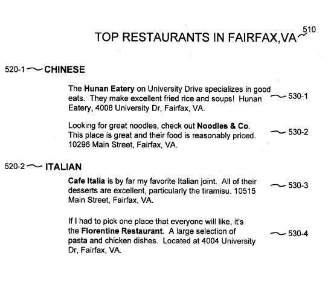

Imagine a regional magazine writes up a number of reviews of restaurants from a certain city neighborhood, on a web page, and those reviews provide information for each restaurant about their hours, specialties, locations, wine lists, menu choices – but all of the reviews are on one page.

This kind of information would be great for a local search site to collect and show to users looking for places to eat in that area. Except that all of those reviews are on the same page – how does the search engine identify which information goes with which restaurant?

And if they can make that kind of distinction, can they use the process developed for more than just local search?

**Introducing Visual Segmentation**

A newly published wisual segmentation patent application from Google describes an approach to collecting and indexing information for local search, that may reflect Google’s ability to understand different parts of pages.

When Google collects information to serve in its local results, it targets business listings like the type you might find in the Yellow Pages. But, there’s also an interest in providing more information, such as restaurant reviews, or discussions about businesses

Often, this type of information about a business will appear on pages where it is mixed in with other information about other businesses, as noted in the opening of this post. That example, which was provided in the patent filing, is of a web page that includes a list of restaurants in a certain neighborhood, with a short statement or review of each of the restaurants.

If a local search engine can associate the correct text with the correct restaurant in that example, and provide it to a searcher, the local search results for that search are richer, and provide a better user experience.

Here’s the visual segmentation patent application.

[Document segmentation based on visual gaps](http://appft1.uspto.gov/netacgi/nph-Parser?Sect1=PTO2&Sect2=HITOFF&u=%2Fnetahtml%2FPTO%2Fsearch-adv.html&r=1&f=G&l=50&d=PG01&p=1&S1=20060149775&OS=20060149775&RS=20060149775)
Invented by Daniel Egnor
US Patent Application 20060149775
Published July 6, 2006
Filed: December 30, 2004

Abstract

> A document may be segmented based on a visual model of the document. The visual model is determined according to an amount of visual white space or gaps that are in the document. In one implementation, the visual model is used to identify a hierarchical structure of the document, which may then be used to segment the document.

**Visual Segmentation Summary**

This patent doesn’t just analyze the HTML and the [Document Object Model](https://en.wikipedia.org/wiki/Document_Object_Model) (DOM) of a page, to determine a hierarchical structure of a document. While those approaches can often be useful, they don’t always help to distinquish the appropriate text that belongs to distinquishable information on a page. A segmentation component that can use the actual visual layout of a document can be more helpful.

Since this patent describes local search and segmentation, it also looks for geographical location information as it segments pages, so that it knows whether the segments it is indentifying are related to a specific business at a specific location.

There are three parts to the process described in this patent filing.

1. *Segmenting a Document*– The method focuses upon creating a visual model of the document, identifying the hierarchical structure of the document based on that visual model, and then segmenting the document based on the hierarchical structure and on the visual model of the document.

2. *Indexing a Document*– Part of this involves looking at geographic signals in a document and segmenting the document into sections that correspond to different identified geographic signals based on a visual layout of the document. It also includes indexing text in the sections of the document as corresponding to business listings associated with those geographic signals.

3. *Serving the document* – Obtaining a document that includes those geographic signals, segmenting the document into sections that correspond to appropriate identified geographic signals based on a visual layout of the document, and index text in the sections of the document as corresponding to business listings associated with the geographic signals.

**Use of Visual Gaps, or White Space**

The use of horizontal rules, headings, and how parts of pages are chunked together gains weight in trying to understand what information on a page belongs together. Here’s a snippet from the patent application that stresses the use of Visual Gaps:

> The visual model may be particularly based on visual gaps or separators, such as white space, in the document. In the context of HTML, for instance, different HTML elements may be assigned various weights (numerical values) that attempt to quantify the magnitude of the visual gap introduced into the rendered document. In one implementation, larger weights may indicate larger visual gaps. The weights may be determined in a number of ways. The weights may, for instance, be determined by subjective analysis of a number of HTML documents for HTML elements that tend to visually separate the documents. Based on this subjective analysis weights may be initially assigned and then modified (“tweaked”) until documents are acceptably segmented. Other techniques for generating appropriate weights may also be used, such as based on examination of the behavior or source code of Web browser software or using a labeled corpus of hand-segmented web pages to automatically set weights through a machine learning process.

**Use of Visual Segmentation Outside of Local Search**

Local search places an importance on geographical location information, and the visual segmentation process described here won’t even begin to happen if no location information is found on a page. The idea behind this process is to collect information about specific organizations that are tied to locations.

But, this process might be used in other ways, and the patent specifically points that possibility out:

> Although the segmentation process described with reference to FIGS. 4-7 was described as segmenting a document based on geographic signals that correspond to business listings, the general hierarchical segmentation technique could more generally be applied to any type of signal in a document.

A couple of examples that they describe:

1. *Images* – This process could be used to recognize and identify text that is associated with specific images.

2. *Visual Segmentation without signals* – Instead of looking for specific types of information within different segments, segmentation could happen to try to understand what the different parts of a page are, and how much value they hold. As the patent filing notes:

> navigational boilerplate is usually less relevant than the central content of a page

**Visual Segmentation Conclusion**

This is an interesting peek at how a search engine might attempt to understand different parts of web pages, and how important they are. It has specific applications that it can be used for, such as identifying more relevant information to be used in local search results, or getting a better grasp of what an image might be about.

Though not stated in the visual segmentation patent application, it may also be used to identify advertisement areas on pages, and lists of links off site.

Chances are that you may have heard of an approach like this from Microsoft. They’ve been writing about something called [VIPS: a VIsion based Page Segmentation Algorithm](https://www.microsoft.com/en-us/research/publication/vips-a-vision-based-page-segmentation-algorithm/) for a while.

Added June 5, 2011 – Google was also granted a much broader patent on document segmentation in 2011 on a patent that was originally filed within a couple of months of this one. See: [Google’s Page Segmentation Patent Granted](https://www.seobythesea.com/2011/03/googles-page-segmentation-patent-granted/).
