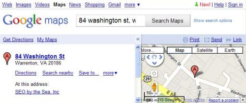
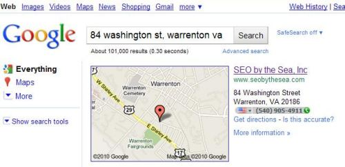
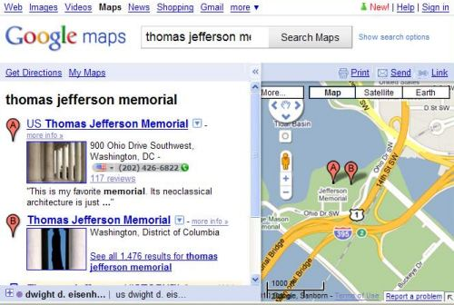

## What are Location Searches?

Ever go to a search engine to find out more about a specific place, such as a street or park or business?

Want to see what the area around a historic monument is like?

These types of searches are often referred to as location searches because the intent behind them is to find information about specific locations.

You can perform location searches in map-oriented search engines such as Google Maps or Yahoo Local or Bing Maps, but the search engines may also provide map type results in their Web search results as well. Before Universal Search was part of Google, maps had started showing up in Google’s web search results. If you searched for a business name or category with some geographic information included in your query, you may have been shown a map in your web search results alongside a listing relevant to your search.

A Google patent granted this week explores some of the challenges that a search engine may face when performing location searches. The way that search engines respond to those challenges shows off some of the technical abilities of search engines, and the methods that they use.

For instance, in location searches, some of the issues that search engines may have to resolve can include:

- Spelling errors in place names (for example, US Capital instead of US Capitol)
- Use of alternative names for a location (Franklin Delano Roosevelt Memorial vs. FDR Memorial)
- Use of alternative address formats (such as those found in different countries)

Ideally, for location searches, a search engine might try to show a single map result as a response, if the address is unambiguous. In Google Maps, you may only see one result when you search using an address for a place.

If you switch over to Google’s web search, you might see a map for the location along with other information about that address. Web search results may also be included.

But things can get a little confusing sometimes when a search engine isn’t sure which addresses might be correct during location searches. For example, a search for the Thomas Jefferson Memorial shows both the “US Thomas Jefferson Memorial” and the “Thomas Jefferson Memorial.” Fortunately for people who might want to visit, the two places are shown (most likely the same place) don’t appear to be too far apart:

When a search engine receives a location search query, it might take many steps to try to pin down the right address. For instance, it might look at keywords in the query and:

- Possibly remove punctuation marks, street numbers, and non-location terms
- Attempt to identify terms that might be synonyms in the query (for instance, N in a street name could be north)
- Understand abbreviations for one or more terms
- Determine a canonical expression involving the keywords
- Identify one or more places corresponding to the keywords in the location search query

There may be more than one location associated with a specific location query, such as “Washington Monument,” which could refer to:

- The George Washington Monument on the National Mall in Washington, DC
- Any monuments in Washington, DC
- Any monuments in Washington State
- The Washington Monument in Mount Vernon Place, Baltimore
- The Booker T. Washington National Monument
- The Mary Washington Monument in Fredericksburg, Va
- The Washington Monument fountain at Eakins Oval in Philadelphia

The analysis that the search engine performs attempts to come up with confidence scores for different locations, and if the highest-ranking location is a certain threshold above others, it may only show one location.

How that analysis works can be influenced largely even by small changes in a query. For example, if you type “Washington Monuments” instead of “Washington Monument,” into Google, you see a map with a very different set of results. And you should – making the word “monument” plural significantly changes the meaning of the query.

Each record of a location listed in a database of locations might include metadata, not HTML elements such as meta description elements or meta keywords, but rather additional information about that location such as keywords or synonyms for those keywords, as well as regions surrounding a location. For example, the Washington Monument Fountain is located in the City of Philadelphia as well as the State of Pennsylvania, and the record of that place might include those regions as metadata about the Fountain.

If you are performing a location search in Google Maps after searching for a specific place, your search may focus upon the boundaries of the map shown for your previous search. For instance, search for “Philadelphia,” in Google Maps and then follow that up with a search for “fountains,” and Google will show you places within the Philadelphia map boundary with “fountain” in their names, places in a “fountain” category, and places that might have the word “fountain” in reviews and descriptions of the location.

## The Google Location Searches Patent

The patent can be found at:

[Geographic coding for location search queries](http://patft.uspto.gov/netacgi/nph-Parser?Sect1=PTO2&Sect2=HITOFF&u=%2Fnetahtml%2FPTO%2Fsearch-adv.htm&r=1&p=1&f=G&l=50&d=PTXT&S1=7,747,598.PN.&OS=pn/7,747,598&RS=PN/7,747,598)
Invented by Florian Michel Buron, Ramesh Balakrishnan, James Norris, James Robert Muller, Thai Tran, and Lars Rasmussen
Assigned to Google
US Patent 7,747,598
Granted June 29, 2010
Filed: January 25, 2007

Abstract

> A method for performing a location search includes receiving a location search query, determining keywords corresponding to the location search query, identifying one or more documents that correspond to the keywords in the location search query, and providing to a client system information identifying at least one location corresponding to the one or more documents.

When the search engine attempts to analyze an address, it might take a query and expand it to find several possible matches. For example, when a search engine attempts to find the location “155 Abe Ave. Great Neck N.Y.” it might take many steps.

It might first remove the number and the period after the “Ave.” resulting in “Abe Ave Great Neck N.Y.”

Abbreviations such as the “AVE” may then be expanded upon, and synonyms might be added, such as “street” or “lane” or court.”

It may then create a boolean express using that information, which might look something like:

> Abe AND (Ave OR Avenue OR Street OR Lane OR Court OR . . . ) AND (Great Neck) AND (NY OR (NEW YORK))

Geographic locations in a database like the one Google may have for Google Maps may have features associated with them, and they may be searched using boolean expressions like the one above.

Those geographic features can include:

- Feature types (such as a street, road, route, city, country, intersection, etc.)
- Feature name (i.e., the name of a location)
- Primary terms or tokens (such as specific key words associated with the feature)
- Nearby feature terms or tokens (such as adjacent or proximate landmarks or locations of interest), and;
- Supplemental information (such as latitude and longitude of the feature).

## Scoring Locations in Location Searches

In searching that database of features, the search engine may come up with some results and score them. That feature rank score may determine which location you are shown in Google Maps or Google’s web search results, in response to a location search. The patent provides a fair amount of detail on how they might score locations in response to a location search, though Google may be looking at other factors to score how well a query matches up with a location.

**Conclusion**
It’s worth spending some time going through that scoring process if you’re interested in things like why a map showing the Washington Monument in Washington, DC, might be displayed instead of the Mary Washington Monument in Fredericksburg, Va, in response to a search for “Washington monument.”

One of the most interesting aspects of the ranking process involves many “penalty factors.” One of those penalty factors might explain why, for example, I might see a map of my present location when I search for “SEO by the Sea” in Google’s Web search and you may not see that same map when you are located outside of Warrenton, or Virginia, or the United States.
