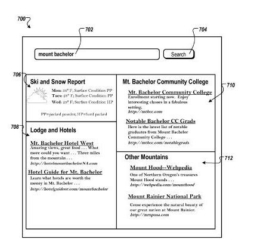

Google’s recent [purchase](https://www.seobythesea.com/2010/07/google-gets-smarter-with-named-entities-acquires-metaweb/) of Metaweb, who run the Freebase directory, left many wondering at the motivations behind the acquisition. Did Google buy the company for its technology, for its Freebase directory, for the expertise of its employees?

A Google patent application published hints today at one reason behind the deal, with a mention of Metaweb’s Freebase, and how Google could use it in a process that may expand the amount of information that the search giant shows us about specific people, places, and things (including ideas and concepts such as democracy) in search results.

It might also result in search results that are mashups of different information relating to queries involving named entities, such as seen in the image below:

Google’s new patent application identifies references to specific people or places or things, referred to in the document as “named entities,” when they appear in queries, expands the amount of information that it might lookup to include concepts, or aspects related to those named entities. It might do this by looking at what a knowledge base such as Wikipedia or Freebase might contain about those entities. It would also look at previous queries that searchers submitted to Google, including the named entities, to broaden the information returned to a searcher.

**Why Broaden Results for Named Entities?**

When someone searches for information, they often just want to answer a specific informational need, such as the date a specific event happened, or a transactional need such as downloading some software or making a purchase. But a searcher may want more information than just a single search result, and maybe trying to explore a topic that they don’t know much about.

Microsoft recently published a patent filing about how they might present the first page of search results in [categories related to a query](https://www.seobythesea.com/2010/07/bings-categorized-search-results/), based upon a similar notion of helping searchers see a range of concepts and categories related to their query. Google has also described in the past how they might look at Wikipedia [to find concepts related to queries](https://www.seobythesea.com/2007/10/google-on-using-a-knowledge-base-of-articles-to-make-searches-smarter/) and group search results based upon those concepts.

For example, if I search for “Hawaii,” or “Gandalf,” or “bicameralism,” or some other entity, whether real or fictional, place or person or idea, I may be interested in learning more about that person, place, or thing. My query may include an entity as well as some additional terms. So, if I search for Hawaii travel, I may want to find a range of information related to “Hawaii,” as well as the property “travel” that is included in my query. The search engine may look at previous searchers’ queries involving Hawaii in the log files it uses to keep track of queries, and it might look up Hawaii on Wikipedia or Freebase as well.

While looking at those query log files and knowledge bases, it might identify related aspects of entities found in a query, or as the patent filing defines them, “different axes of information along which additional information about an entity can be obtained.” For an entity such as “Hawaii,” some possible aspects might include “beaches,” “hotels,” and “weather.”

Search results shown by the search engine might not be presented in a single list of web pages, news, videos, etc., but could instead be shown as a set of categorized lists. My “Hawaii travel” search, it might show multiple sets of search results that combine my query with its aspects. These might include a set of results for “Hawaii beaches,” another for “Hawaii Hotels,” and yet another for “Hawaii weather.”

Those results might also include a summary of information about each of the different sets of results before listing links to other pages and resources on the Web.

The patent filing tells us that it might decide which aspects to display information about based upon both the popularity of those aspects and a diversity score that would help provide a range of aspects that might be missed if popularity was the only thing considered.

The patent filing is:

[Identifying Query Aspects](http://appft.uspto.gov/netacgi/nph-Parser?Sect1=PTO2&Sect2=HITOFF&u=%2Fnetahtml%2FPTO%2Fsearch-adv.html&r=1&p=1&f=G&l=50&d=PG01&S1=20100198837.PGNR.&OS=dn/20100198837&RS=DN/20100198837)
Invented by Fei Wu, Jayant Madhavan, and Alon Halevy
Assigned to Google
US Patent Application 20100198837
Published August 5, 2010
Filed: July 30, 2009

Abstract

> Methods, systems, and apparatus, including computer program products, generate aspects associated with entities. In some implementations, a method includes:
>
> - Receiving data identifying an entity;
> - Generating a group of candidate aspects for the entity;
> - Modifying the group of candidate aspects to generate a group of modified candidate aspects comprising combining similar candidate aspects and grouping candidate aspects using one or more aspect classes each associated with one or more candidate aspects;
> - Ranking one or more modified candidate aspects in the group of modified candidate aspects based on a diversity score and a popularity score; and
> - Storing an association between one or more highest-ranked modified candidate aspects and the entity.
>
> The aspects can be used to organize and present search results in response to queries for the entity.

**About the Inventors**

It’s not surprising that one of the inventors listed on the patent is Alon Halevy, who came to Google with the acquisition of [Transformic](https://www.seobythesea.com/2006/09/googles-quiet-acquisition-of-transformic-inc/), and has worked on projects involving Google’s efforts to extract and organize data about different named entities as described in [Uncovering the Relational Web](http://www.cs.columbia.edu/~ewu/files/papers/relweb-webdb08.pdf) and [WebTables: Exploring the Power of Tables on the Web](http://sirrice.github.io/files/papers/webtables-vldb08.pdf). He seems to be one of the forces at Google behind extracting facts and information from unstructured data on the Web.

Co-inventor Jayant Madhavan also joined Alon Halevy in co-authoring an Official Google Blog post a couple of years ago on how Google has begun experimenting with [Crawling through HTML forms](https://webmasters.googleblog.com/2008/04/crawling-through-html-forms.html), which could provide access to other knowledge bases other than just Wikipedia or Freebase. The two have also collaborated on papers on [Google Fusion Tables](https://ai.googleblog.com/2009/06/google-fusion-tables.html) and other ways to extract information from web pages.

Fei Wu was an intern with Alon Halevy and Jayant Madhavan at Google. His resume (no longer available), he developed the process that finds aspects related to named entities described in this patent filing. Before joining Google, some of his previous work before joining Google included a paper on Open Information Extraction using Wikipedia (pdf) and significant work on The Intelligence in Wikipedia Project at the University of Washington.

**Extracting Information about Entities**

Entities can have properties associated with them. For example, “travel” can be a property associated with “Vietnam” because people travel to Vietnam. A property can be used to limit or refine a search for information about an entity.

Aspects that might be identified about entities might be based upon the entity itself, or upon a class that the entity belongs to. For example, “Daffodil” may be associated with the class “flower,” because a daffodil is a type of flower. Looking at aspects associated with classes that entities may belong to can be helpful, especially when there isn’t much information about a specific named entity. Expanding the gathering of aspects to classes that an entity belongs to may provide additional candidate aspects that might be included in search results.

Aspects can be located in several places. For example, search histories might be viewed in search query log files to see how people have refined queries in the past. If I search for popcorn, and then follow that up with a search for “microwave popcorn,” I’ve refined my query. Microwave popcorn would be considered a query refinement. A query refinement doesn’t have to include the original query term – for example, if I search for “computer,” and then “laptop,” I’ve also refined my query.

Query refinements can be used to identify potential aspects of named entities. In my search for “Hawaii” above, I may then go on to search for “Hawaii Beaches,” “Hawaii hotels,” and “Hawaii weather.” Each of those searches identifies possible aspects of the named entity Hawaii – beaches, hotels, and weather.

Query superstrings may also be found in a search engine’s query logs. Unlike query refinements, they don’t have to appear during a query session where one person modifies their searches to find more information.

So, if someone searches for “Vietnam travel packages,” they’ve included a named entity (Vietnam), a property of the entity (travel), and a possible aspect of that entity and property (packages).

A query superstring can include just an entity and an aspect rather than an entity, property, and an aspect. So, if many people search for “Hawaii beaches” as standalone searches instead of as refinements during a query session, “Hawaii beaches” could be considered a query superstring.

Aspects can also be located by analyzing knowledge bases such as Wikipedia and Freebase.

The patent provides a fair amount of details on how aspects could be identified, and how very similar aspects might be combined.

**Conclusion**

My description of the patent filing is from a fairly high level. The document goes into much more detail on how different aspects involving named entities might be identified, and used to capture much more information than might be presented in a single list of links and documents that might be relevant to a query that includes one of those named entities.

I cited the following quote from a [recent Microsoft paper](http://wwwconference.org/proceedings/www2010/www/p1001.pdf) in my post on Google’s acquisition of Metaweb, and it bears repeating here:

> According to an internal study of Microsoft, at least 20-30% of queries submitted to Bing search simply names entities, and it is reported 71% of queries contain name entities.

If Google decides to start using the processes described in this patent filing, we might start seeing search results broken down by categories, or aspects, related to named entities on Google’s search results pages in the future. At least when those queries include named entities – which seems to happen frequently.

Google’s acquisition of Metaweb seems to point us in that direction.

Added: 8/9/2010 – if you haven’t seen this video about Metaweb, and what they do, it’s a nice way of learning more about them:
