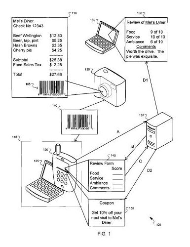

## Google Makes Online Ratings Easier for People Who Visit Businesses

Imagine going to a restaurant, and having a great experience. Or going to a great movie and wanting to tell others about it. Or trying out a new gadget and having problems with it.

You might tweet about it, and that seems to be something a lot of people are doing, especially with new movies. Imagine that you could take a picture of a barcode on your receipt or upon a box or package, and have a form come up which allows you to rate your experience or a product from 1 to 5 (bad to good), or assign a letter grade, or write comments. You might also upload pictures or audio or even video to include with your review. Your audio message might be one that you call in with your mobile phone.

Google published a patent application this week that describes a convenient way of providing online ratings like this. The patent filing is pretty long, but one of the images accompanying the filing captures one aspect of the process pretty well:

The patent filing is:

[Ratings Using Machine-Readable Representations](http://appft.uspto.gov/netacgi/nph-Parser?Sect1=PTO2&Sect2=HITOFF&u=%2Fnetahtml%2FPTO%2Fsearch-adv.html&r=1&p=1&f=G&l=50&d=PG01&S1=20090242620.PGNR.&OS=dn/20090242620&RS=DN/20090242620)
Invented by Arnaud Sahuguet
Assigned to Google
US Patent Application 20090242620
Published October 1, 2009
Filed March 31, 2008

Abstract

> In a computer-implemented review method, a machine-readable representation that encodes an identification code associated with a ratable entity is decoded to obtain the identification code.
>
> The identification code is submitted to a central computer system, and the form of a rating that can be used for providing a review of the ratable entity is received from the central computer system.
>
> A review of the ratable entity is provided to the central computer system using the review form.

After someone submits a review, the patent filing tells us that they might receive a response, which might include such things as a coupon or a thank you message or a link to a page where they can see other ratings, or advertisements, or some other response.

If a rating service like this became available, and it was as convenient as the image above suggests, I could envision a lot of people submitting reviews like this. What kind of impact might that have upon Google’s local search or reviews if providing ratings became so easy?

How likely would it be that merchants would put barcodes on receipts that could be used in a manner like this? The patent tells us that this method of rating could apply to products, stores, and services but doesn’t provide an example of someone taking a picture of a barcode on something like a package or book. That is likely covered under this patent filing though.

Would you use an online ratings system like this?

*Added November 16, 2010,* – See Google’s Announcement of Hotpot ([Discover Yours: Local recommendations powered by you and your friends](https://maps.googleblog.com/2010/11/discover-yours-local-recommendations.html)), an online review system that allows you to share your reviews with friends. The online ratings form used in the system looks very similar to the one from the screenshot from the patent above.
