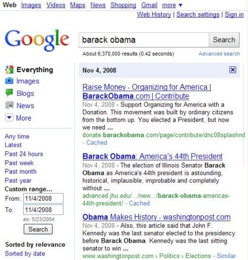

Interested in what people were saying the day after Barack Obama was elected president in 2008? Or how people reacted on the Web to the Chicago Whitesox winning the World Series in 2005? Or the early news on the Gulf oil spill on April 20, 2010?

When you search at Google, you can click on “more search tools” in the left column, and enter a “from” and “to” date in the custom range section. If you want to see what pages were showing up on Google on a search for Barack Obama on the day after the election, you can enter 11/4/2008 in the form and to fields. To see what pages were ranking on Google on the day after the Whitesox series ended, entering 10/28/2005 into the date range text boxes.

If you click on any of the results that appear, you see versions of pages listed in the results as they appear today. If you click on the Google cache links for those entries, you see the most recent cached versions of those pages. But, what if you saw a copy of the page as it appeared within the date range selected? What if Google decided that it would create an archive of the Web, where it showed older copies of web pages and used the custom date range to help you find those pages?

A Google patent granted on April 20th gives us a glimpse at the possibility of Google being able to show us an archive of the Web.

As part of a series of patent filings from former Google employee Anna Lynn Patterson on phrase-based indexing, it probably shouldn’t come as a surprise (I wrote about the possibility a few years ago in ([Google Archives to Appear Soon?](https://www.seobythesea.com/2006/09/google-archives-to-appear-soon/)). Before joining Google, Anna Patterson developed a search engine for the [Internet Archive](https://archive.org/), so that searchers could view older versions of pages listed in the Archive’s index. That search tool, known as “Recall,” was [removed](https://www.searchenginewatch.com/2004/10/11/no-more-recall/) from the Internet Archive around the time that Google was reported to have licensed some technology from Dr. Patterson, and then subsequently hire her.

The patent is:

[Information retrieval system for archiving multiple document versions](http://patft.uspto.gov/netacgi/nph-Parser?Sect1=PTO2&Sect2=HITOFF&u=%2Fnetahtml%2FPTO%2Fsearch-adv.htm&r=1&p=1&f=G&l=50&d=PTXT&S1=7,702,618.PN.&OS=pn/7,702,618&RS=PN/7,702,618)
Invented by Anna Lynn Patterson
Assigned to Google
US Patent 7,702,618
Granted April 20, 2010
Filed: January 25, 2005

Abstract

> An information retrieval system uses phrases to index, retrieve, organize, and describe documents. Phrases are identified that predict the presence of other phrases in documents. Documents are indexed according to their included phrases. Index data for multiple versions or instances of documents are also maintained. Each document instance is associated with a date range and relevance data derived from the document for the date range.

The patent’s description is mostly dedicated to details about phrase-based indexing, but it also jumps into how archived versions of documents might be stored and ranked.

Presently, Google collects the latest copies of pages it finds to display in a cached copy, and it includes links to the latest cached copy of documents along with search result listings for pages. Google has justified the use of a cached copy of pages as a way of giving people access to a page when there might be a problem with directly accessing the page, such as the server it is hosted upon being down. Google won’t cache copies of pages that use a meta noarchive tag, like the following:

<meta name=”googlebot” content=”noarchive”>

Will Google start showing archived copies of documents?

Many web pages change over time for a wide number of reasons, including news sites that may update many times a day, and require subscriptions to see older articles. Other pages change because of new ownership, new designs, new business models, updated content, corrections of older content.

Many site owners may not want people to access older versions of their pages, for many reasons as well.

How would you feel about Google providing a historic archive of the Web, with the ability to search and view older versions of pages online?
